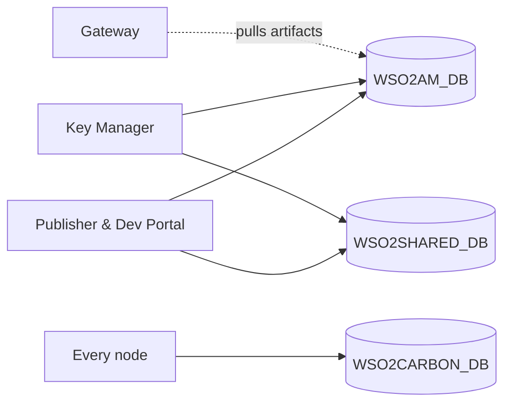
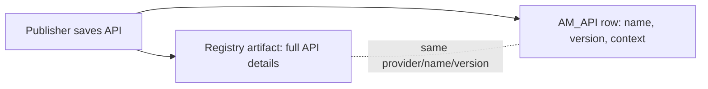

# The databases (3.x)

!!! abstract "In one sentence"
    APIM 3.x uses one database for API Manager data and a second, shared one for users and the registry. An API's details are split between relational tables and registry "artifacts".

## The physical databases

The file `repository/conf/deployment.toml` defines where each logical database lives. Out of the box, each one is an embedded H2 file under `repository/database/`.

| Logical name | Default H2 file | Created by | What's inside |
|---|---|---|---|
| `apim_db` | `WSO2AM_DB` | `dbscripts/apimgt/<vendor>.sql` | All `AM_*` tables, plus the Identity Server tables APIM embeds (`IDN_*`, `IDP_*`, `SP_*`, `CM_*`, `WF_*`, `FIDO*`). **This is the main one.** |
| `shared_db` | `WSO2SHARED_DB` | `dbscripts/<vendor>.sql` | The **registry** (`REG_*`) and the **user store** (`UM_*`). It's called "shared" because every APIM node, and sometimes other WSO2 products, points at the same one. |
| `local` | `WSO2CARBON_DB` | same script as shared | A per-node *local* registry for node-specific data. It's never shared between nodes. |
| message broker | `WSO2MB_DB` | `dbscripts/mb-store/` | Queue storage for the embedded message broker used for internal notifications. |
| metrics | `WSO2METRICS_DB` | `dbscripts/metrics/` | JVM and server metrics. Not related to APIs. |

The diagram below shows which component uses which database.

- The Publisher, Dev Portal and Key Manager all read and write both main databases.
- The gateway only pulls published API artifacts from `WSO2AM_DB` (see [Gateway publishing](domains/gateway-publishing.md)).
- Every node keeps its own local registry.

!!! tip "Using another database vendor"
    Oracle, PostgreSQL, MSSQL, DB2, MySQL Cluster and Oracle RAC scripts sit next to `mysql.sql`. They create the same logical tables. Only data types and key or sequence syntax differ.

## Registry vs relational tables: the 3.x split

This is the most important thing to understand about 3.x.

When a publisher saves an API, APIM writes it to **two places**:

- The **registry artifact** holds everything about the API: description, tags, endpoint configuration, visibility, business owner, lifecycle state, Swagger/GraphQL definition, documents and thumbnails. It's stored in `REG_RESOURCE`, `REG_CONTENT` and related tables in the shared DB. See [Registry](domains/registry.md).
- The **`AM_API` row** holds just enough for fast relational joins (provider, name, version, context, type) so subscriptions, resources and lifecycle events can point to an integer `API_ID`.
- The two are matched on **provider + name + version**. There's no foreign key, because they're in different databases.

!!! warning "The API's UUID is only in the registry"
    In 3.x `AM_API` has **no UUID column**. The UUID you see in REST APIs and URLs (e.g. `/apis/4c5f...`) is the registry artifact's id (`REG_RESOURCE.REG_UUID`). Tables such as `AM_GW_PUBLISHED_API_DETAILS` store this string UUID, not the integer `API_ID`.

!!! note "Different in 4.x"
    4.x adds `AM_API.API_UUID`, moves more metadata into `AM_*` tables, and adds revisions. See [4.x databases](../apim-4/databases.md).

## The inherited Identity Server tables

APIM 3.x embeds WSO2 Identity Server's key-management code, and with it IS's tables: OAuth clients and tokens, service providers, identity providers, consent, SAML/OpenID stores and more.

APIM uses a handful of these heavily: the OAuth client, token and scope tables. They're explained in [Keys & tokens](domains/keys-tokens.md) and [Scopes](domains/scopes.md). The rest exist so the embedded key manager works, and are listed one per line in [Identity Server tables](identity-tables.md).

## Tenant scoping in 3.x

Most tables carry a `TENANT_ID` (an integer that matches `UM_TENANT.UM_ID`) or a `TENANT_DOMAIN` (a string such as `carbon.super`). The super tenant is ID `-1234`. Some tables have no tenant column at all. For those, the tenant comes from the parent row, e.g. `AM_API` gets it from the provider name, which contains `@tenant.com` for non-super tenants.

!!! note "Different in 4.x"
    4.x adds `ORGANIZATION` columns to most `AM_*` tables. 3.x has none.
