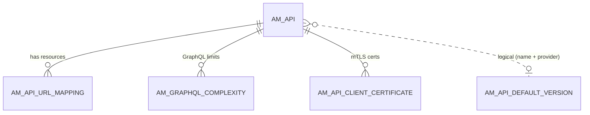
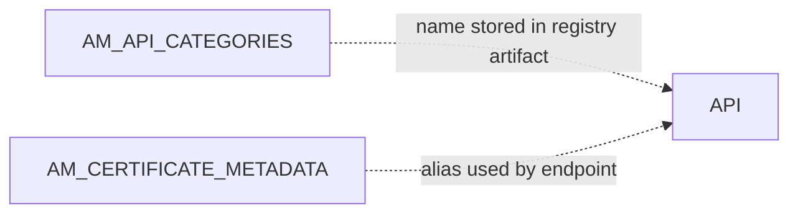

# API definition

!!! abstract "In one sentence"
    These tables hold the relational core of every API: its identity (provider, name, version, context) and its resources (HTTP verb + path, auth scheme, rate limit). They also cover default versions, categories, GraphQL complexity and certificates.

## The idea

When a publisher creates **PizzaShackAPI 1.0.0** at context `/pizzashack/1.0.0` with resources such as `GET /menu` and `POST /order`, APIM does two things:

- It stores the **full definition** (Swagger, description, endpoints and so on) in the [registry](registry.md).
- It writes **one row to `AM_API`** and **one row per verb + path to `AM_API_URL_MAPPING`**. These rows give the rest of the system something small and fast to join against. Subscriptions, scopes, API products and lifecycle events all point to `AM_API.API_ID` or `AM_API_URL_MAPPING.URL_MAPPING_ID`.

Each **version** of an API is its own `AM_API` row. `AM_API_DEFAULT_VERSION` remembers which version answers when a caller leaves the version out of the URL.

## How the tables connect

This diagram shows the API row, its resources, and the tables that describe the API as a whole.



- The `AM_API` → `AM_API_URL_MAPPING` link is **logical**: `API_ID` has no FK in 3.2.
- GraphQL complexity rows and client certificates cascade away when the API is deleted.
- The default version is matched by **name + provider**, not by `API_ID`.

A second, smaller picture shows the tenant-level lookups that are not attached to any one API:



- Categories and backend certificates are defined **per tenant**. APIs refer to them from their registry artifact, not through an `AM_*` column.

## The tables

### AM_API

**One row =** one version of one API (or API product) in one tenant.

| Column | What it means |
|---|---|
| `API_ID` | Integer primary key. Nearly every `API_ID` column in `AM_*` points here. |
| `API_PROVIDER` | The owner's user name, e.g. `admin`, or `bob@acme.com` for a tenant user. |
| `API_NAME`, `API_VERSION` | Name and version. Together with the provider, unique. |
| `CONTEXT` | The URL base including version, e.g. `/pizzashack/1.0.0`. |
| `CONTEXT_TEMPLATE` | The context as entered, before the version is added. A live 3.2.0 server stored `/pizzashack` for context `/pizzashack/1.0.0`. It only contains a `{version}` placeholder if the creator put one in the context. |
| `API_TIER` | Optional API-level throttling policy **name** (*logical* link to [`AM_API_THROTTLE_POLICY`](throttling.md#am_api_throttle_policy)). |
| `API_TYPE` | `HTTP`, `WS`, `SOAPTOREST`, `GRAPHQL`, `WEBSUB`, `SSE` or `APIProduct`, among others. |
| `CREATED_BY`, `CREATED_TIME`, `UPDATED_*` | Audit columns. |

**Connects to:**

- `AM_API_URL_MAPPING`: one to many (*logical*, no FK).
- `AM_SUBSCRIPTION`: one to many (FK, **delete restricted**).
- `AM_API_LC_EVENT`: one to many (FK, restricted).
- `AM_API_PRODUCT_MAPPING`, `AM_GRAPHQL_COMPLEXITY`, `AM_API_CLIENT_CERTIFICATE`: FK, cascade.
- `AM_API_COMMENTS`, `AM_API_RATINGS`, `AM_EXTERNAL_STORES`, `AM_SECURITY_AUDIT_UUID_MAPPING`: FK, restricted.
- The registry artifact: *logical*, by provider + name + version.

**Watch out:** 3.x has **no `API_UUID`** column (the UUID is in the registry) and **no `STATUS`** column (the lifecycle state is in the registry).

[Full column list](../reference/am.md#am_api)

### AM_API_URL_MAPPING

**One row =** one resource of an API: an HTTP verb + URL pattern.

| Column | What it means |
|---|---|
| `URL_MAPPING_ID` | Primary key. Scopes and API products point here. |
| `API_ID` | Owning API (*logical* link to `AM_API.API_ID`, **no FK**). |
| `HTTP_METHOD` | `GET`, `POST` and so on. For GraphQL: `QUERY`/`MUTATION`/`SUBSCRIPTION`. |
| `URL_PATTERN` | e.g. `/menu` or `/order/{orderId}`. |
| `AUTH_SCHEME` | `Any` (secured) or `None` (open resource). A live 3.2.0 server also stored the literal `Application & Application User` after an API update. |
| `THROTTLING_TIER` | Resource-level policy **name** (*logical* link to [`AM_API_THROTTLE_POLICY`](throttling.md#am_api_throttle_policy)). |
| `MEDIATION_SCRIPT` | Optional script, used for prototyped (mock) implementations. |

**Connects to:**

- [`AM_API_RESOURCE_SCOPE_MAPPING`](scopes.md#am_api_resource_scope_mapping): one to many, FK, cascade.
- [`AM_API_PRODUCT_MAPPING`](api-products.md#am_api_product_mapping): one to many, FK, cascade.

**Watch out:** when an API is updated, APIM deletes and re-inserts its URL mappings, so `URL_MAPPING_ID` values change. This was confirmed on a live 3.2.0 server, where IDs 1–2 became 5–6 and the scope and product mappings were re-pointed.

[Full column list](../reference/am.md#am_api_url_mapping)

### AM_API_DEFAULT_VERSION

**One row =** "for API *name* by *provider*, this is the default version".

| Column | What it means |
|---|---|
| `DEFAULT_VERSION_ID` | Primary key. |
| `API_NAME`, `API_PROVIDER` | Which API family (*logical* match to `AM_API`). |
| `DEFAULT_API_VERSION` | The version marked as default in the Publisher. |
| `PUBLISHED_DEFAULT_API_VERSION` | The default version that is actually published, and so routable without a version. |

**Connects to:** `AM_API` by name + provider (*logical*, no FK).

[Full column list](../reference/am.md#am_api_default_version)

### AM_API_CATEGORIES

**One row =** one API category defined by an admin, e.g. `Finance`, used to group APIs in the Dev Portal.

| Column | What it means |
|---|---|
| `UUID` | Primary key. |
| `NAME` | Category name, unique per tenant. |
| `DESCRIPTION` | Free text. |
| `TENANT_ID` | Tenant. |

**Connects to:** APIs through their **registry artifact**, which lists category names. There's no mapping table in 3.x (*logical*).

[Full column list](../reference/am.md#am_api_categories)

### AM_GRAPHQL_COMPLEXITY

**One row =** the complexity value for one field of one GraphQL type, used to reject overly expensive queries.

| Column | What it means |
|---|---|
| `UUID` | Primary key. |
| `API_ID` | → `AM_API` (FK, **cascade**). |
| `TYPE`, `FIELD` | GraphQL type and field, e.g. `Query.orders`. Unique per API. |
| `COMPLEXITY_VALUE` | Cost of resolving this field. |

**Connects to:** `AM_API`, many to one. Works together with `MAX_COMPLEXITY` and `MAX_DEPTH` in [`AM_POLICY_SUBSCRIPTION`](throttling.md#am_policy_subscription).

[Full column list](../reference/am.md#am_graphql_complexity)

### AM_API_CLIENT_CERTIFICATE

**One row =** a client certificate uploaded for an API that uses **mutual TLS**. Callers presenting this certificate are allowed in.

| Column | What it means |
|---|---|
| `ALIAS` + `TENANT_ID` + `REMOVED` | Primary key. |
| `API_ID` | → `AM_API` (FK, **cascade**). |
| `CERTIFICATE` | The certificate content. |
| `TIER_NAME` | The subscription policy applied to calls authenticated with this certificate (*logical* link to [`AM_POLICY_SUBSCRIPTION`](throttling.md#am_policy_subscription)). |
| `REMOVED` | Soft-delete flag. Removed certificates stay as history. |

[Full column list](../reference/am.md#am_api_client_certificate)

### AM_CERTIFICATE_METADATA

**One row =** a **backend (endpoint) certificate** the gateway should trust when calling a backend over HTTPS.

| Column | What it means |
|---|---|
| `ALIAS` | Primary key: the certificate alias in the gateway trust store. |
| `END_POINT` | The backend URL this certificate is for. |
| `TENANT_ID` | Tenant. |

**Connects to:** nothing by FK. APIs use it through their endpoint URL (*logical*).

[Full column list](../reference/am.md#am_certificate_metadata)

## Example

| `AM_API` | | | |
|---|---|---|---|
| `API_ID` = 5 | `API_PROVIDER` = `admin` | `API_NAME` = `PizzaShackAPI` | `CONTEXT` = `/pizzashack/1.0.0` |

| `AM_API_URL_MAPPING` | | | |
|---|---|---|---|
| `URL_MAPPING_ID` = 21 | `API_ID` = 5 | `GET` | `/menu` |
| `URL_MAPPING_ID` = 22 | `API_ID` = 5 | `POST` | `/order` |

## Try it

```sql
-- List every API with its resources
SELECT a.API_PROVIDER, a.API_NAME, a.API_VERSION, u.HTTP_METHOD, u.URL_PATTERN, u.THROTTLING_TIER
FROM AM_API a
JOIN AM_API_URL_MAPPING u ON u.API_ID = a.API_ID
WHERE a.API_TYPE <> 'APIProduct'
ORDER BY a.API_NAME, a.API_VERSION, u.URL_PATTERN;
```

!!! note "Different in 4.x"
    4.x adds `API_UUID`, `STATUS`, `ORGANIZATION` and more columns to `AM_API`. It adds `REVISION_UUID` to `AM_API_URL_MAPPING`, and brings in endpoint, service catalog and metadata tables. See [4.x API definition](../../apim-4/domains/api-definition.md).

## Related flows

- [Create an API](../flows/02-create-api.md)
- [Create a new version](../flows/03-new-version.md)
