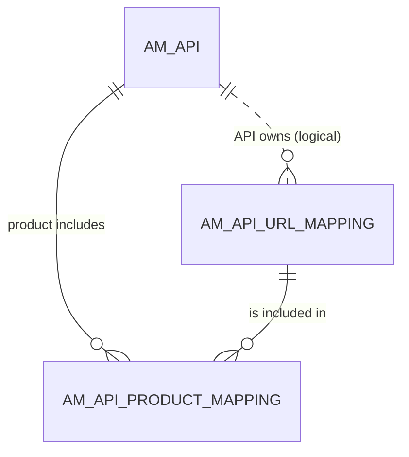

# API products

!!! abstract "In one sentence"
    An API product bundles resources picked from one or more APIs into a single product that developers subscribe to. It's stored as an ordinary `AM_API` row plus one mapping row per included resource.

## The idea

Say you have a *Menu API* and an *Order API*. You can create a **Pizza Product** that exposes `GET /menu` from the first and `POST /order` from the second. Developers subscribe to the product once and get both.

In the database, a product is **not** a separate table. It's an [`AM_API`](api-definition.md#am_api) row whose `API_TYPE` is `'APIProduct'`. It has its own name, version, context and lifecycle, and subscriptions point to it just like to an API. The only extra table, `AM_API_PRODUCT_MAPPING`, lists which existing resources belong to it.

## How the tables connect

This diagram shows how a product reuses resources that belong to other APIs.



- The mapping's `API_ID` is the **product's** row in `AM_API`.
- The mapping's `URL_MAPPING_ID` is a resource that belongs to an **underlying API**.
- Deleting either the product or the underlying resource removes the mapping row (cascade).

## The tables

### AM_API_PRODUCT_MAPPING

**One row =** "product P includes resource R".

| Column | What it means |
|---|---|
| `API_PRODUCT_MAPPING_ID` | Primary key. |
| `API_ID` | → `AM_API.API_ID` of the **product** (FK, cascade). |
| `URL_MAPPING_ID` | → [`AM_API_URL_MAPPING`](api-definition.md#am_api_url_mapping) of the underlying API's resource (FK, cascade). |

**Connects to:** `AM_API` (many to one) and `AM_API_URL_MAPPING` (many to one). To find which APIs a product is built from, follow `URL_MAPPING_ID` → `AM_API_URL_MAPPING.API_ID`.

**Watch out:**

- Because the underlying API's URL mappings are re-created when that API is updated, APIM re-points product mappings after an API update. On a live 3.2.0 server, the mapping row was replaced (ID 1 → 2) and now pointed at the new `URL_MAPPING_ID` (1 → 6).
- 3.2 **doesn't copy** the resource. The mapping points straight at the underlying API's own row. Creating a product also wrote no lifecycle event and no default-version row.
- A product row in `AM_API` has `API_TYPE = 'APIProduct'`. Remember to filter it out when you count APIs.

[Full column list](../reference/am.md#am_api_product_mapping)

## Example

| `AM_API` | | |
|---|---|---|
| `API_ID` = 5 | `PizzaShackAPI` | `API_TYPE` = `HTTP` |
| `API_ID` = 9 | `PizzaProduct` | `API_TYPE` = `APIProduct` |

| `AM_API_PRODUCT_MAPPING` | | |
|---|---|---|
| `API_PRODUCT_MAPPING_ID` = 1 | `API_ID` = 9 | `URL_MAPPING_ID` = 21 (`GET /menu` of API 5) |

## Try it

```sql
-- What is inside each API product?
SELECT p.API_NAME AS PRODUCT, a.API_NAME AS FROM_API, u.HTTP_METHOD, u.URL_PATTERN
FROM AM_API p
JOIN AM_API_PRODUCT_MAPPING m ON m.API_ID = p.API_ID
JOIN AM_API_URL_MAPPING u     ON u.URL_MAPPING_ID = m.URL_MAPPING_ID
JOIN AM_API a                 ON a.API_ID = u.API_ID
WHERE p.API_TYPE = 'APIProduct';
```

!!! note "Different in 4.x"
    In 4.x the mapping also carries a `REVISION_UUID`, so products work with revisions. See [4.x API products](../../apim-4/domains/api-products.md).

## Related flows

- [Create an API product](../flows/06-api-product.md)
