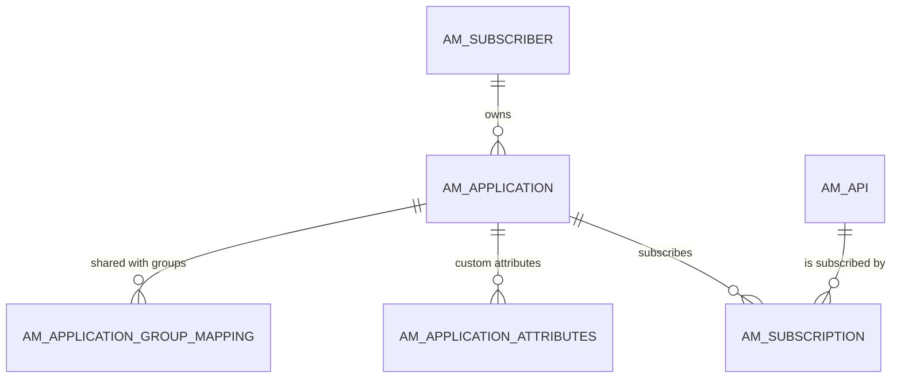

# Applications & subscriptions

!!! abstract "In one sentence"
    These tables record the consumer side of APIM: who the developers are (subscribers), the applications they create, and which APIs each application is allowed to call, under which tier (subscriptions).

## The idea

Think of a gym:

- The **subscriber** is the member.
- An **application** is a membership card the member owns. One member can hold several cards, e.g. one for a mobile app and one for a web app.
- A **subscription** is an entry on the card saying "this card may use the swimming pool (API) on the Gold plan (tier)".

When the gateway receives a call, it identifies the application from the token, then checks that there's an active subscription from that application to the API being called.

## How the tables connect

This diagram shows the main chain from a developer to the APIs their app can call.



- A subscription joins **one application** to **one API**. Both FKs are **delete restricted**, so APIM removes subscriptions first.
- Attributes and group mappings **cascade** away with their application.
- An application's tier and a subscription's tier are policy **names** (*logical*). See [Throttling policies](throttling.md).

## The tables

### AM_SUBSCRIBER

**One row =** one Developer Portal user, as APIM sees them.

| Column | What it means |
|---|---|
| `SUBSCRIBER_ID` | Primary key. |
| `USER_ID` | User name, e.g. `alice` (*logical* link to `UM_USER.UM_USER_NAME` or an LDAP user). |
| `TENANT_ID` | Tenant. `USER_ID` + `TENANT_ID` is unique. |
| `EMAIL_ADDRESS` | Optional email address. |
| `DATE_SUBSCRIBED` | When the subscriber row was created. |

**Connects to:**

- `AM_APPLICATION`: one to many, FK, restricted.
- `AM_APPLICATION_REGISTRATION`: one to many, FK, restricted.
- `AM_API_RATINGS`: one to many, FK, restricted.

**Watch out:** the row is created **lazily**, on the user's first Dev Portal action. This is also when APIM creates their `DefaultApplication`.

[Full column list](../reference/am.md#am_subscriber)

### AM_APPLICATION

**One row =** one application owned by a subscriber.

| Column | What it means |
|---|---|
| `APPLICATION_ID` | Integer primary key. |
| `UUID` | Public id used by the REST APIs. Unique. |
| `NAME` | Application name, unique per subscriber. |
| `SUBSCRIBER_ID` | Owner → `AM_SUBSCRIBER` (FK, restricted). |
| `APPLICATION_TIER` | Application-level throttling policy **name**, e.g. `Unlimited` (*logical* link to [`AM_POLICY_APPLICATION`](throttling.md#am_policy_application)). |
| `APPLICATION_STATUS` | `CREATED` (waiting for approval), `APPROVED` or `REJECTED`. |
| `TOKEN_TYPE` | `JWT` or `OAUTH` (opaque tokens). |
| `GROUP_ID` | Legacy single group id for app sharing. See `AM_APPLICATION_GROUP_MAPPING`. |
| `CALLBACK_URL`, `DESCRIPTION` | Settings shown in the Dev Portal. |

**Connects to:**

- `AM_SUBSCRIPTION`, `AM_APPLICATION_KEY_MAPPING`, `AM_APPLICATION_REGISTRATION`: one to many, FK, **restricted**.
- `AM_APPLICATION_ATTRIBUTES`, `AM_APPLICATION_GROUP_MAPPING`: one to many, FK, **cascade**.
- `AM_WORKFLOWS`: by `WF_REFERENCE` when the workflow type is application creation or deletion (*logical*).

[Full column list](../reference/am.md#am_application)

### AM_APPLICATION_ATTRIBUTES

**One row =** one custom attribute value on an application, e.g. `Cost center = 1234`. Admins define the available attributes in configuration.

| Column | What it means |
|---|---|
| `APPLICATION_ID` + `NAME` | Primary key. `APPLICATION_ID` → `AM_APPLICATION` (FK, cascade). |
| `VALUE` | Attribute value. |
| `TENANT_ID` | Tenant. |

[Full column list](../reference/am.md#am_application_attributes)

### AM_APPLICATION_GROUP_MAPPING

**One row =** "application A is shared with group G", so other members of that group can see and use it.

| Column | What it means |
|---|---|
| `APPLICATION_ID` | → `AM_APPLICATION` (FK, cascade). |
| `GROUP_ID` | Group id, typically taken from a user claim such as organization. |
| `TENANT` | Tenant domain. |

[Full column list](../reference/am.md#am_application_group_mapping)

### AM_SUBSCRIPTION

**One row =** "application A may call API B under tier T".

| Column | What it means |
|---|---|
| `SUBSCRIPTION_ID` | Integer primary key. |
| `UUID` | Public id. Unique. |
| `APPLICATION_ID` | → `AM_APPLICATION` (FK, **restricted**). |
| `API_ID` | → [`AM_API`](api-definition.md#am_api) (FK, **restricted**). This can be an API or an API product. |
| `TIER_ID` | Subscription policy **name**, e.g. `Gold` (*logical* link to [`AM_POLICY_SUBSCRIPTION`](throttling.md#am_policy_subscription)). |
| `TIER_ID_PENDING` | New tier requested but waiting for approval. A plain new subscription also has this set to the same value as `TIER_ID` (for example `Gold`), not `NULL`. |
| `SUB_STATUS` | `UNBLOCKED` (active), `BLOCKED`, `PROD_ONLY_BLOCKED`, `ON_HOLD` (waiting for approval), `REJECTED` or `TIER_UPDATE_PENDING`. |
| `SUBS_CREATE_STATE` | `SUBSCRIBE`, or `UN_SUBSCRIBE` while a deletion workflow is pending. |
| `LAST_ACCESSED` | Last time the subscription was used. |

**Connects to:**

- [`AM_SUBSCRIPTION_KEY_MAPPING`](keys-tokens.md#am_subscription_key_mapping): FK, restricted.
- `AM_WORKFLOWS`: by `WF_REFERENCE` for subscription workflows (*logical*).

**Watch out:** the database doesn't enforce "one subscription per application + API". APIM checks for duplicates in code.

[Full column list](../reference/am.md#am_subscription)

## Example

| Table | Row |
|---|---|
| `AM_SUBSCRIBER` | `SUBSCRIBER_ID` = 1, `USER_ID` = `alice`, `TENANT_ID` = -1234 |
| `AM_APPLICATION` | `APPLICATION_ID` = 100, `NAME` = `PizzaApp`, `SUBSCRIBER_ID` = 1, `APPLICATION_TIER` = `Unlimited`, `TOKEN_TYPE` = `JWT` |
| `AM_SUBSCRIPTION` | `SUBSCRIPTION_ID` = 1000, `APPLICATION_ID` = 100, `API_ID` = 5, `TIER_ID` = `Gold`, `SUB_STATUS` = `UNBLOCKED` |

## Try it

```sql
-- Which applications are subscribed to which APIs, and who owns them?
SELECT s.USER_ID AS DEVELOPER, app.NAME AS APPLICATION, a.API_NAME, a.API_VERSION,
       sub.TIER_ID, sub.SUB_STATUS
FROM AM_SUBSCRIPTION sub
JOIN AM_APPLICATION app ON app.APPLICATION_ID = sub.APPLICATION_ID
JOIN AM_SUBSCRIBER s    ON s.SUBSCRIBER_ID = app.SUBSCRIBER_ID
JOIN AM_API a           ON a.API_ID = sub.API_ID
ORDER BY a.API_NAME, app.NAME;
```

!!! note "Different in 4.x"
    4.x adds `ORGANIZATION` and `SHARED_ORGANIZATION` to applications and changes the subscription FKs to cascade on delete. See [4.x Applications & subscriptions](../../apim-4/domains/applications-subscriptions.md).

## Related flows

- [Create an application](../flows/07-create-application.md)
- [Subscribe to an API](../flows/08-subscribe.md)
- [Revoke & delete](../flows/12-revocation-and-delete.md)
