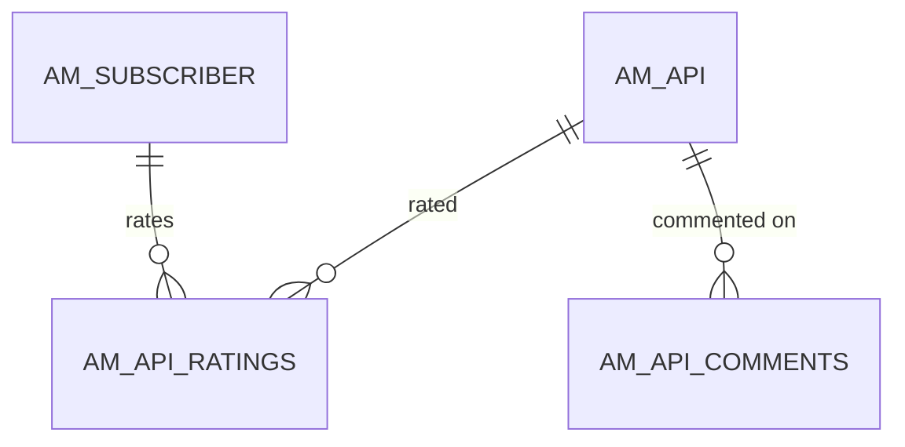

# Developer Portal extras

!!! abstract "In one sentence"
    These are the social and look-and-feel features of the Developer Portal: comments and ratings on APIs, and each tenant's custom portal theme.

## The idea

The Dev Portal lets developers **rate** an API (1–5 stars) and **comment** on it. Tenant admins can upload a **theme** (logos, colours, CSS) so their portal looks like their brand. None of this affects how APIs are called, but it's all stored in `AM_*` tables.

## How the tables connect

This diagram shows how ratings and comments attach to APIs and developers.



- All three links are FKs with **delete restricted**, so APIM deletes ratings and comments before deleting the API or subscriber.
- Comments store the commenter's **name** rather than a subscriber id.

## The tables

### AM_API_RATINGS

**One row =** one developer's rating of one API.

| Column | What it means |
|---|---|
| `RATING_ID` | Primary key (a UUID). |
| `API_ID` | → [`AM_API`](api-definition.md#am_api) (FK, restricted). |
| `SUBSCRIBER_ID` | → [`AM_SUBSCRIBER`](applications-subscriptions.md#am_subscriber) (FK, restricted). |
| `RATING` | 1–5. |

**Watch out:** the average rating shown in the portal is calculated from these rows. It isn't stored anywhere.

[Full column list](../reference/am.md#am_api_ratings)

### AM_API_COMMENTS

**One row =** one comment on one API.

| Column | What it means |
|---|---|
| `COMMENT_ID` | Primary key (a UUID). |
| `API_ID` | → `AM_API` (FK, restricted). |
| `COMMENT_TEXT` | The comment (up to 512 characters). |
| `COMMENTED_USER` | User name of the commenter (*logical*, not an FK). |
| `DATE_COMMENTED` | When it was posted. |

**Watch out:** 3.2 comments are flat. There are no replies or threads.

[Full column list](../reference/am.md#am_api_comments)

### AM_TENANT_THEMES

**One row =** the uploaded Dev Portal theme of one tenant.

| Column | What it means |
|---|---|
| `TENANT_ID` | Primary key (*logical* link to `UM_TENANT.UM_ID`). |
| `THEME` | The theme archive (a zip with CSS and images), stored as a blob. |

[Full column list](../reference/am.md#am_tenant_themes)

## Example

| Table | Row |
|---|---|
| `AM_API_RATINGS` | `API_ID` = 5, `SUBSCRIBER_ID` = 1, `RATING` = 4 |
| `AM_API_COMMENTS` | `API_ID` = 5, `COMMENTED_USER` = `alice`, `COMMENT_TEXT` = `Great docs!` |

## Try it

```sql
-- Average rating and number of comments per API
SELECT a.API_NAME, a.API_VERSION,
       (SELECT AVG(r.RATING) FROM AM_API_RATINGS r WHERE r.API_ID = a.API_ID) AS AVG_RATING,
       (SELECT COUNT(*) FROM AM_API_COMMENTS c WHERE c.API_ID = a.API_ID) AS COMMENTS
FROM AM_API a;
```

!!! note "Different in 4.x"
    4.x supports threaded comments with more columns, and adds Dev Portal content tables and webhooks. See [4.x Developer Portal extras](../../apim-4/domains/devportal-extras.md).

## Related flows

- [Revoke & delete](../flows/12-revocation-and-delete.md)
