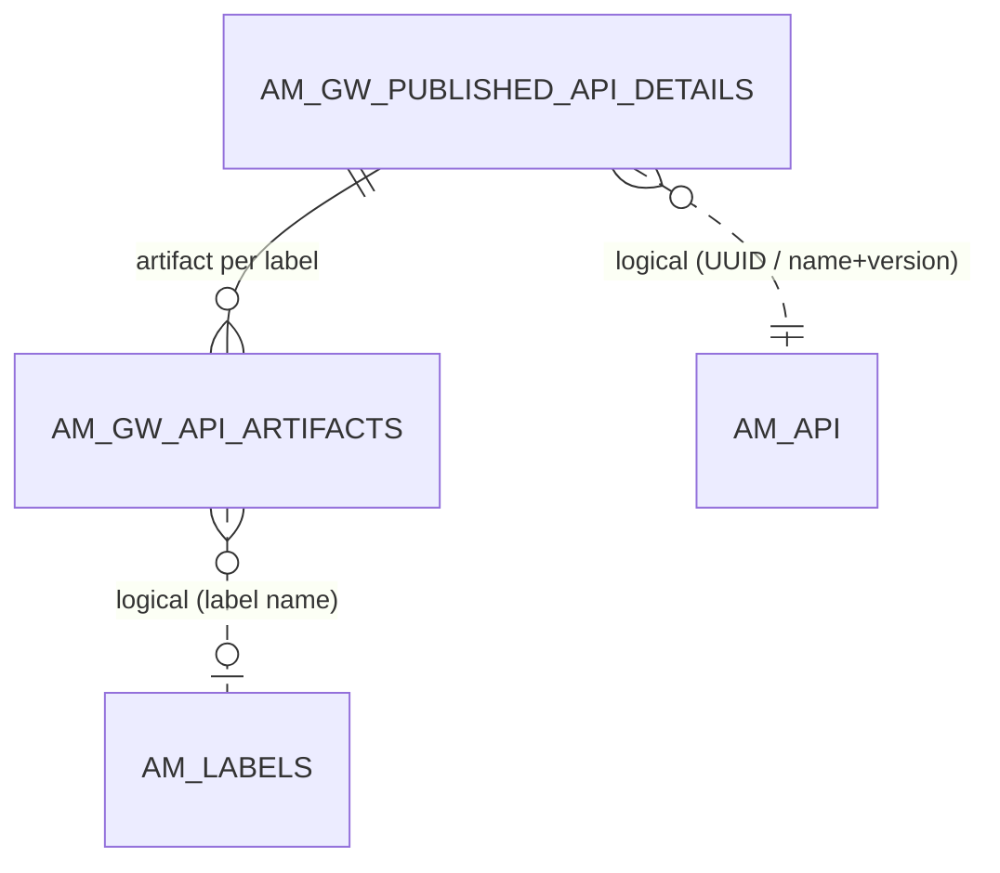
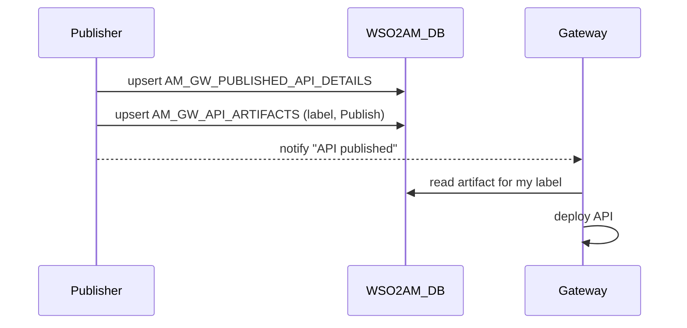

# Gateway publishing

!!! abstract "In one sentence"
    When the optional *gateway artifact synchronizer* is on, publishing an API in 3.x stores the gateway configuration (the "artifact") in the database under each gateway label, and gateways pull what's meant for them. It's **off by default**, and then these two tables stay empty.

## The idea

A gateway needs a runtime configuration for each API: a Synapse XML file for the classic gateway, or a project for the microgateway. In 3.x, APIM builds that artifact at publish time.

- **By default**, the Publisher pushes the artifact straight to each selected gateway environment, and nothing is written to these tables. On a stock 3.2.0 server, publishing an API left both tables empty.
- **With the synchronizer on** (`[apim.sync_runtime_artifacts.*]`), APIM **saves the artifact in the database**. It then notifies the gateways, which fetch the artifact for their **label** and deploy it.

Two tables do this:

- `AM_GW_PUBLISHED_API_DETAILS` says **which API** the artifacts are for: one row per published API.
- `AM_GW_API_ARTIFACTS` holds **the artifact itself**: one row per (API, gateway label), plus an instruction saying *publish* or *remove*.

A **gateway label** is a name such as `Production and Sandbox` or a microgateway label like `store-gw`. A gateway only pulls artifacts tagged with its own label(s).

## How the tables connect

This diagram shows one published API and its per-label artifacts.



- `API_ID` in both tables is the API's **UUID string**, not the integer `AM_API.API_ID`.
- The artifact → details link is a real FK.
- Labels are matched by **name** (*logical*).

The publish sequence looks like this:



## The tables

### AM_GW_PUBLISHED_API_DETAILS

**One row =** one API that has gateway artifacts stored.

| Column | What it means |
|---|---|
| `API_ID` | Primary key. The API's **UUID** (the registry id, *logical* link to `REG_RESOURCE.REG_UUID`). |
| `TENANT_DOMAIN` | Tenant, e.g. `carbon.super`. |
| `API_PROVIDER`, `API_NAME`, `API_VERSION` | Identify the API (*logical* match to [`AM_API`](api-definition.md#am_api)). |

**Connects to:** `AM_GW_API_ARTIFACTS`, one to many (FK).

[Full column list](../reference/am.md#am_gw_published_api_details)

### AM_GW_API_ARTIFACTS

**One row =** the deployable artifact of one API for one gateway label.

| Column | What it means |
|---|---|
| `API_ID` + `GATEWAY_LABEL` | Primary key. `API_ID` → `AM_GW_PUBLISHED_API_DETAILS.API_ID` (FK). |
| `GATEWAY_LABEL` | Label of the gateways that should get it (*logical* link to [`AM_LABELS.NAME`](lifecycle-labels.md#am_labels) or a gateway environment name). |
| `ARTIFACT` | The artifact blob: the API's gateway runtime configuration. |
| `GATEWAY_INSTRUCTION` | `Publish` or `Remove`. This tells gateways whether to deploy or undeploy. |
| `TIME_STAMP` | Last update time. |

**Watch out:**

- Unpublishing doesn't delete the row. It changes `GATEWAY_INSTRUCTION` so gateways know to remove the API.
- The FK has no cascade, so the details row can't be deleted while artifacts exist.

[Full column list](../reference/am.md#am_gw_api_artifacts)

## Example

| `AM_GW_PUBLISHED_API_DETAILS` | | |
|---|---|---|
| `API_ID` = `4c5f2e1a-…` | `PizzaShackAPI` | `1.0.0` |

| `AM_GW_API_ARTIFACTS` | | |
|---|---|---|
| `API_ID` = `4c5f2e1a-…` | `GATEWAY_LABEL` = `Production and Sandbox` | `GATEWAY_INSTRUCTION` = `Publish` |

## Try it

```sql
-- What is each gateway label supposed to have deployed?
SELECT d.API_NAME, d.API_VERSION, d.TENANT_DOMAIN, a.GATEWAY_LABEL, a.GATEWAY_INSTRUCTION, a.TIME_STAMP
FROM AM_GW_API_ARTIFACTS a
JOIN AM_GW_PUBLISHED_API_DETAILS d ON d.API_ID = a.API_ID
ORDER BY a.GATEWAY_LABEL, d.API_NAME;
```

!!! note "Different in 4.x"
    4.x replaces labels with **revisions** deployed to **gateway environments**. `AM_GW_API_ARTIFACTS` is keyed by `REVISION_ID`, and new tables track deployments. See [4.x Revisions & deployment](../../apim-4/domains/revisions-deployment.md).

## Related flows

- [Publish to the gateway](../flows/04-publish-to-gateway.md)
- [Change lifecycle state](../flows/05-lifecycle.md)
