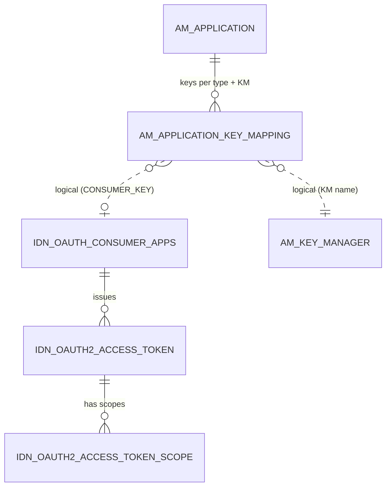
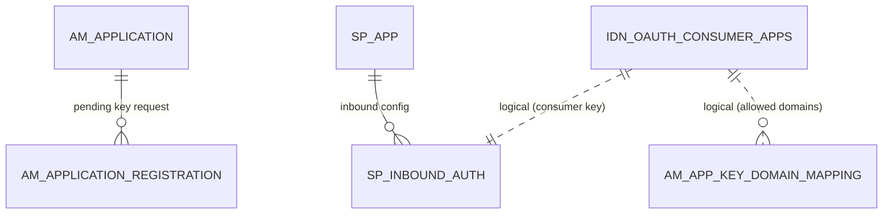

# Keys & tokens

!!! abstract "In one sentence"
    These tables connect an APIM application to an OAuth client (consumer key and secret) in a key manager. With the built-in key manager, they also store that client and the access tokens it gets.

## The idea

To call an API, an application needs an **access token**. To get tokens, it first needs **keys**: an OAuth *consumer key* (client ID) and *consumer secret*. Each application can have one set of keys per **key type** (`PRODUCTION` or `SANDBOX`) **per key manager**.

The **key manager (KM)** is the component that issues and validates tokens. APIM 3.2 ships the **Resident Key Manager**, which is embedded and uses the Identity Server tables in the same database. You can also register third-party key managers such as Keycloak or Okta. In that case the OAuth client and tokens live **outside** APIM's database, and only the mapping row is stored here.

With the Resident Key Manager, generating keys writes three layers:

1. **APIM layer:** `AM_APPLICATION_KEY_MAPPING` says "application 100's PRODUCTION keys from *Resident Key Manager* are consumer key `abc…`".
2. **OAuth layer:** `IDN_OAUTH_CONSUMER_APPS` holds the OAuth client with that consumer key.
3. **Service provider layer:** an `SP_APP` row, plus `SP_INBOUND_AUTH` pointing at the consumer key, because Identity Server models every OAuth client as a service provider.

Tokens issued to that client go to `IDN_OAUTH2_ACCESS_TOKEN`, with their scopes in `IDN_OAUTH2_ACCESS_TOKEN_SCOPE`.

## How the tables connect

This first diagram shows the path from an application to its tokens.



- The bridge from APIM to OAuth is the **consumer key value**. There's no FK.
- From the consumer app downwards, the links are real FKs that **cascade**: deleting the OAuth client removes its tokens.
- The key manager is identified by **name** in 3.2.

The second diagram shows the supporting tables around key generation.



- `AM_APPLICATION_REGISTRATION` exists only while a key-generation **approval workflow** is pending.
- `SP_INBOUND_AUTH.INBOUND_AUTH_KEY` holds the consumer key (*logical*).

## The tables

### AM_KEY_MANAGER

**One row =** one key manager configured in a tenant, e.g. the built-in `Resident Key Manager` or a Keycloak.

| Column | What it means |
|---|---|
| `UUID` | Primary key. |
| `NAME` | Name, unique per tenant. **This is what the key mapping tables store.** |
| `DISPLAY_NAME`, `DESCRIPTION` | Shown in the Admin Portal and Dev Portal. |
| `TYPE` | Connector type, e.g. `default` (Resident), `KeyCloak`, `Okta`. |
| `CONFIGURATION` | Blob with the endpoints, credentials, grant types and claim mappings. |
| `ENABLED` | Whether developers can use it. |
| `TENANT_DOMAIN` | Tenant. |

**Connects to:** `AM_APPLICATION_KEY_MAPPING.KEY_MANAGER` and `AM_APPLICATION_REGISTRATION.KEY_MANAGER` by **name** + tenant (*logical*).

**Watch out:** the Resident Key Manager row is created automatically for each tenant.

[Full column list](../reference/am.md#am_key_manager)

### AM_APPLICATION_KEY_MAPPING

**One row =** one set of keys for one application, one key type and one key manager.

| Column | What it means |
|---|---|
| `APPLICATION_ID` + `KEY_TYPE` + `KEY_MANAGER` | Primary key. `APPLICATION_ID` → `AM_APPLICATION` (FK, **restricted**). |
| `KEY_TYPE` | `PRODUCTION` or `SANDBOX`. |
| `KEY_MANAGER` | Key manager **name** (*logical* link to `AM_KEY_MANAGER.NAME`). |
| `CONSUMER_KEY` | The OAuth client ID (*logical* link to `IDN_OAUTH_CONSUMER_APPS.CONSUMER_KEY` when the Resident KM is used). |
| `STATE` | `CREATED` (requested, waiting), `APPROVED`, `COMPLETED` (keys ready) or `REJECTED`. |
| `CREATE_MODE` | `CREATED` (APIM generated the client) or `MAPPED` (an existing external client was mapped in). |
| `UUID` | Public id of this key mapping. |
| `APP_INFO` | Extra OAuth app info returned by the key manager, stored as a blob. |

**Watch out:** during an approval workflow the row exists with `STATE = CREATED` and **no consumer key yet**.

[Full column list](../reference/am.md#am_application_key_mapping)

### AM_APPLICATION_REGISTRATION

**One row =** a key-generation request that's waiting for approval.

| Column | What it means |
|---|---|
| `REG_ID` | Primary key. |
| `SUBSCRIBER_ID` | → `AM_SUBSCRIBER` (FK, restricted). |
| `APP_ID` | → `AM_APPLICATION` (FK, restricted). |
| `TOKEN_TYPE` | Key type being requested, `PRODUCTION` or `SANDBOX`. |
| `KEY_MANAGER` | Key manager **name**. |
| `WF_REF` | Workflow reference (*logical* link to `AM_WORKFLOWS.WF_REFERENCE`). |
| `INPUTS` | The requested OAuth settings: grant types, callback and so on. |
| `TOKEN_SCOPE`, `VALIDITY_PERIOD`, `ALLOWED_DOMAINS` | Requested token settings. |

**Connects to:** unique per (subscriber, app, token type, key manager). The row is removed once the request is approved and the keys are generated.

[Full column list](../reference/am.md#am_application_registration)

### AM_APP_KEY_DOMAIN_MAPPING

**One row =** "consumer key K may be used from domain D". This is used for browser-based apps.

| Column | What it means |
|---|---|
| `CONSUMER_KEY` + `AUTHZ_DOMAIN` | Primary key. `CONSUMER_KEY` is a *logical* link to the key mapping and consumer app. |
| `AUTHZ_DOMAIN` | Allowed domain, or `ALL`. |

[Full column list](../reference/am.md#am_app_key_domain_mapping)

### AM_SUBSCRIPTION_KEY_MAPPING

**One row =** an access token tied directly to a subscription. This is a legacy model from older APIM versions.

| Column | What it means |
|---|---|
| `SUBSCRIPTION_ID` + `ACCESS_TOKEN` | Primary key. `SUBSCRIPTION_ID` → [`AM_SUBSCRIPTION`](applications-subscriptions.md#am_subscription) (FK, restricted). |
| `KEY_TYPE` | `PRODUCTION` or `SANDBOX`. |

**Watch out:** 3.2 still reads this table in some lookups, but normal key generation doesn't populate it. It's **removed in 4.x**.

[Full column list](../reference/am.md#am_subscription_key_mapping)

### AM_SYSTEM_APPS

**One row =** an internal OAuth client that APIM creates for its own portals, e.g. the Publisher and Dev Portal single-page apps, so they can call APIM's REST APIs.

| Column | What it means |
|---|---|
| `ID` | Primary key. |
| `NAME` | App name, e.g. `apim_devportal`. |
| `CONSUMER_KEY`, `CONSUMER_SECRET` | The client credentials. `CONSUMER_KEY` is unique (*logical* link to `IDN_OAUTH_CONSUMER_APPS`). |
| `TENANT_DOMAIN`, `CREATED_TIME` | Tenant, and when it was created. |

**Watch out:** these aren't developer applications and never appear in `AM_APPLICATION`.

[Full column list](../reference/am.md#am_system_apps)

### IDN_OAUTH_CONSUMER_APPS

**One row =** one OAuth client in the Resident Key Manager.

| Column | What it means |
|---|---|
| `ID` | Primary key. Tokens point here via `CONSUMER_KEY_ID`. |
| `CONSUMER_KEY` | Client ID, unique. **This is the value `AM_APPLICATION_KEY_MAPPING` stores.** |
| `CONSUMER_SECRET` | Client secret. It may be stored encrypted or hashed, depending on configuration. |
| `APP_NAME` | Generated name, typically `<owner>_<application>_<KEY_TYPE>`. |
| `USERNAME`, `USER_DOMAIN`, `TENANT_ID` | Owner of the client. |
| `GRANT_TYPES` | Allowed grants, e.g. `client_credentials password refresh_token`. |
| `CALLBACK_URL` | Redirect URL, for the code and implicit grants. |
| `APP_STATE` | `ACTIVE` or `REVOKED`. |
| `USER_ACCESS_TOKEN_EXPIRE_TIME`, `APP_ACCESS_TOKEN_EXPIRE_TIME`, `REFRESH_TOKEN_EXPIRE_TIME`, `ID_TOKEN_EXPIRE_TIME` | Token lifetimes, in seconds. |

**Connects to:**

- `IDN_OAUTH2_ACCESS_TOKEN` and `IDN_OAUTH2_AUTHORIZATION_CODE`: one to many, FK, **cascade**.
- `AM_APPLICATION_KEY_MAPPING` and `SP_INBOUND_AUTH`: by consumer key (*logical*).

[Full column list](../reference/idn.md#idn_oauth_consumer_apps)

### IDN_OAUTH2_ACCESS_TOKEN

**One row =** one issued access token (and its refresh token).

| Column | What it means |
|---|---|
| `TOKEN_ID` | Primary key. |
| `ACCESS_TOKEN`, `REFRESH_TOKEN` | The tokens, or their hashes if token hashing is enabled (see `ACCESS_TOKEN_HASH`). |
| `CONSUMER_KEY_ID` | → `IDN_OAUTH_CONSUMER_APPS.ID` (FK, cascade). |
| `AUTHZ_USER`, `USER_DOMAIN`, `TENANT_ID` | The user the token represents. For `client_credentials`, this is the app owner. |
| `USER_TYPE` | `APPLICATION` or `APPLICATION_USER`. |
| `GRANT_TYPE` | How it was obtained. |
| `TOKEN_STATE` | `ACTIVE`, `EXPIRED`, `REVOKED` or `INACTIVE`. |
| `TIME_CREATED`, `VALIDITY_PERIOD` | Issue time and lifetime, in milliseconds. |
| `TOKEN_SCOPE_HASH` | Hash of the scope set, used to reuse an existing token for the same scopes. |

**Connects to:** `IDN_OAUTH2_ACCESS_TOKEN_SCOPE` (one to many, cascade) and `IDN_OAUTH2_TOKEN_BINDING` (one to one, cascade).

**Watch out:** for JWT applications, the gateway validates the token's signature **without** reading this table.

[Full column list](../reference/idn.md#idn_oauth2_access_token)

### IDN_OAUTH2_ACCESS_TOKEN_SCOPE

**One row =** one scope granted in one token.

| Column | What it means |
|---|---|
| `TOKEN_ID` + `TOKEN_SCOPE` | Primary key. `TOKEN_ID` → `IDN_OAUTH2_ACCESS_TOKEN` (FK, cascade). |
| `TOKEN_SCOPE` | Scope name, e.g. `order:write` or `default` (*logical* link to [`IDN_OAUTH2_SCOPE.NAME`](scopes.md#idn_oauth2_scope)). |
| `TENANT_ID` | Tenant. |

[Full column list](../reference/idn.md#idn_oauth2_access_token_scope)

### IDN_OAUTH2_ACCESS_TOKEN_AUDIT

**One row =** a copy of a token that was revoked or replaced, kept for auditing. It has the same columns as `IDN_OAUTH2_ACCESS_TOKEN`, plus `INVALIDATED_TIME`.

**Connects to:** no FKs, and it has no primary key. `TOKEN_ID` and `CONSUMER_KEY_ID` keep the original values (*logical*).

**Watch out:** this table only fills up if token auditing (clean-up with retention) is enabled.

[Full column list](../reference/idn.md#idn_oauth2_access_token_audit)

### IDN_OAUTH2_AUTHORIZATION_CODE

**One row =** one authorization code issued in the OAuth *authorization code* grant, before it's exchanged for a token.

| Column | What it means |
|---|---|
| `CODE_ID` | Primary key. |
| `AUTHORIZATION_CODE` | The code, or its hash in `AUTHORIZATION_CODE_HASH`. |
| `CONSUMER_KEY_ID` | → `IDN_OAUTH_CONSUMER_APPS.ID` (FK, cascade). |
| `AUTHZ_USER`, `TENANT_ID` | The user who authorized. |
| `STATE` | `ACTIVE`, `INACTIVE` (used) or `EXPIRED`. |
| `TOKEN_ID` | The token it was exchanged for (*logical* link to `IDN_OAUTH2_ACCESS_TOKEN`). |
| `PKCE_CODE_CHALLENGE`, `PKCE_CODE_CHALLENGE_METHOD` | PKCE values. |

[Full column list](../reference/idn.md#idn_oauth2_authorization_code)

### IDN_OAUTH2_AUTHZ_CODE_SCOPE

**One row =** one scope requested with an authorization code.

| Column | What it means |
|---|---|
| `CODE_ID` + `SCOPE` | Primary key. `CODE_ID` → `IDN_OAUTH2_AUTHORIZATION_CODE` (FK, cascade). |
| `TENANT_ID` | Tenant. |

[Full column list](../reference/idn.md#idn_oauth2_authz_code_scope)

### IDN_OAUTH2_TOKEN_BINDING

**One row =** a binding that ties a token to something the client holds, such as a cookie or certificate, so a stolen token can't be reused elsewhere.

| Column | What it means |
|---|---|
| `TOKEN_ID` | Primary key → `IDN_OAUTH2_ACCESS_TOKEN` (FK, cascade). |
| `TOKEN_BINDING_TYPE`, `TOKEN_BINDING_REF`, `TOKEN_BINDING_VALUE` | Binding kind, reference and value. |
| `TENANT_ID` | Tenant. |

[Full column list](../reference/idn.md#idn_oauth2_token_binding)

### SP_APP

**One row =** one Identity Server *service provider*. APIM creates one for every OAuth client it generates through the Resident Key Manager.

| Column | What it means |
|---|---|
| `ID` | Primary key. |
| `APP_NAME` | Same generated name as the OAuth client, e.g. `alice_PizzaApp_PRODUCTION`. |
| `TENANT_ID`, `USERNAME`, `USER_STORE` | Owner. |
| `UUID` | Service provider id. |
| `DESCRIPTION`, `AUTH_TYPE`, and many `IS_*` flags | Identity Server login settings. APIM mostly leaves them at their defaults. |

**Connects to:** `SP_INBOUND_AUTH` and the other `SP_*` configuration tables (FK, cascade). See [Identity Server tables](../identity-tables.md).

[Full column list](../reference/sp.md#sp_app)

### SP_INBOUND_AUTH

**One row =** one inbound protocol setting of a service provider. For APIM this is the `oauth2` entry that links the service provider to its consumer key.

| Column | What it means |
|---|---|
| `ID` | Primary key. |
| `APP_ID` | → `SP_APP.ID` (FK, cascade). |
| `INBOUND_AUTH_KEY` | For `oauth2`, the **consumer key** (*logical* link to `IDN_OAUTH_CONSUMER_APPS.CONSUMER_KEY`). |
| `INBOUND_AUTH_TYPE` | e.g. `oauth2`. |
| `PROP_NAME`, `PROP_VALUE` | Extra properties. |

[Full column list](../reference/sp.md#sp_inbound_auth)

## Example

| Table | Row |
|---|---|
| `AM_APPLICATION_KEY_MAPPING` | `APPLICATION_ID` = 100, `KEY_TYPE` = `PRODUCTION`, `KEY_MANAGER` = `Resident Key Manager`, `CONSUMER_KEY` = `k9Xa…`, `STATE` = `COMPLETED` |
| `IDN_OAUTH_CONSUMER_APPS` | `ID` = 12, `CONSUMER_KEY` = `k9Xa…`, `APP_NAME` = `alice_PizzaApp_PRODUCTION` |
| `IDN_OAUTH2_ACCESS_TOKEN` | `TOKEN_ID` = `7d1…`, `CONSUMER_KEY_ID` = 12, `GRANT_TYPE` = `client_credentials`, `TOKEN_STATE` = `ACTIVE` |

## Try it

```sql
-- From an application to its OAuth client and active tokens (Resident Key Manager)
SELECT app.NAME, km.KEY_TYPE, km.KEY_MANAGER, km.CONSUMER_KEY,
       t.GRANT_TYPE, t.TOKEN_STATE, t.TIME_CREATED
FROM AM_APPLICATION app
JOIN AM_APPLICATION_KEY_MAPPING km ON km.APPLICATION_ID = app.APPLICATION_ID
LEFT JOIN IDN_OAUTH_CONSUMER_APPS c ON c.CONSUMER_KEY = km.CONSUMER_KEY
LEFT JOIN IDN_OAUTH2_ACCESS_TOKEN t ON t.CONSUMER_KEY_ID = c.ID AND t.TOKEN_STATE = 'ACTIVE'
ORDER BY app.NAME, km.KEY_TYPE;
```

!!! note "Different in 4.x"
    4.x stores the key manager's **UUID** in the key mapping tables, adds `IDN_OAUTH_CONSUMER_SECRETS` (multiple secrets) and API keys (`AM_API_KEY*`), and drops `AM_SUBSCRIPTION_KEY_MAPPING`. See [4.x Keys & tokens](../../apim-4/domains/keys-tokens.md).

## Related flows

- [Generate keys](../flows/09-generate-keys.md)
- [Get a token & call the API](../flows/10-token-and-invoke.md)
- [Revoke & delete](../flows/12-revocation-and-delete.md)
