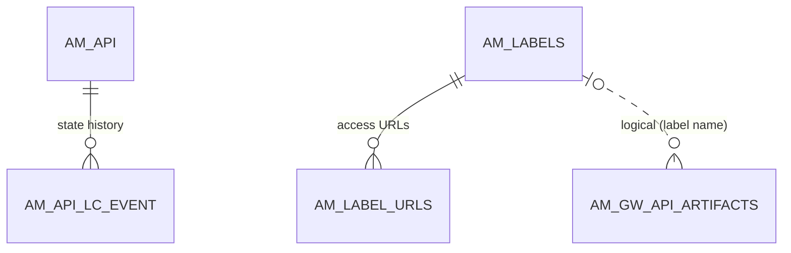

# Lifecycle & labels

!!! abstract "In one sentence"
    The lifecycle tables keep a history of every state change of an API (Created → Published → Deprecated …). The label tables define the microgateway labels that decide which gateways an API goes to.

## The idea

**Lifecycle.** Every API moves through states: *Created*, *Prototyped*, *Published*, *Blocked*, *Deprecated*, *Retired*. The **current** state is kept on the API's registry artifact (see [Registry](registry.md)). What `AM_*` stores is the **history**: one row per change, with who made it and when. The Publisher shows this history as the lifecycle timeline.

**Labels.** In 3.x you can run lightweight **microgateways** next to your services. A *label* is a named group of these gateways, e.g. `store-gw`, with the URLs where they can be reached. When a publisher attaches a label to an API, the API's artifact is stored for that label (see [Gateway publishing](gateway-publishing.md)), and the Dev Portal shows the label's URLs as the API's endpoints.

## How the tables connect

This diagram shows the history rows under an API, and the URLs under a label.



- Lifecycle events have a real FK to `AM_API`, and **deleting an API is blocked** while events exist (restrict).
- Label URLs cascade away with their label.
- Which APIs use a label is stored on the API's registry artifact and in `AM_GW_API_ARTIFACTS.GATEWAY_LABEL` (*logical*).

## The tables

### AM_API_LC_EVENT

**One row =** one lifecycle state change of one API.

| Column | What it means |
|---|---|
| `EVENT_ID` | Primary key. |
| `API_ID` | → [`AM_API`](api-definition.md#am_api) (FK, **delete restricted**). |
| `PREVIOUS_STATE` | State before the change, e.g. `CREATED`. It's empty for the very first event. |
| `NEW_STATE` | State after the change, e.g. `PUBLISHED`. |
| `USER_ID` | Who changed it. |
| `TENANT_ID` | Tenant. |
| `EVENT_DATE` | When it happened. |

**Watch out:**

- This table is **history only**. The *current* state is the newest row here, and it's also stored in the registry artifact.
- APIM deletes these rows before deleting the API.

[Full column list](../reference/am.md#am_api_lc_event)

### AM_API_LC_PUBLISH_EVENTS

**One row =** a record that an API was published in a tenant at a certain time.

| Column | What it means |
|---|---|
| `ID` | Primary key. |
| `TENANT_DOMAIN` | Tenant. |
| `API_ID` | API identifier as a **string** (*logical*, not the integer `AM_API.API_ID`). |
| `EVENT_TIME` | When it was published. |

**Watch out:** no component shipped in 3.2.0 reads or writes this table. Expect it to be empty.

[Full column list](../reference/am.md#am_api_lc_publish_events)

### AM_LABELS

**One row =** one microgateway label in a tenant.

| Column | What it means |
|---|---|
| `LABEL_ID` | Primary key (a UUID). |
| `NAME` | Label name, unique per tenant. This name is what APIs and artifacts refer to. |
| `DESCRIPTION` | Free text. |
| `TENANT_DOMAIN` | Tenant. |

**Connects to:** `AM_LABEL_URLS` (one to many, FK, cascade), and to APIs by name through the registry and `AM_GW_API_ARTIFACTS` (*logical*).

[Full column list](../reference/am.md#am_labels)

### AM_LABEL_URLS

**One row =** one access URL of a label, e.g. `https://mgw.example.com:9095`.

| Column | What it means |
|---|---|
| `LABEL_ID` | → `AM_LABELS` (FK, cascade). |
| `ACCESS_URL` | URL shown in the Dev Portal for APIs with this label. |

[Full column list](../reference/am.md#am_label_urls)

## Example

| `AM_API_LC_EVENT` | | | |
|---|---|---|---|
| `API_ID` = 5 | `PREVIOUS_STATE` = *(empty)* | `NEW_STATE` = `CREATED` | `USER_ID` = `admin` |
| `API_ID` = 5 | `PREVIOUS_STATE` = `CREATED` | `NEW_STATE` = `PUBLISHED` | `USER_ID` = `admin` |

## Try it

```sql
-- Lifecycle history of each API, newest first
SELECT a.API_NAME, a.API_VERSION, e.PREVIOUS_STATE, e.NEW_STATE, e.USER_ID, e.EVENT_DATE
FROM AM_API_LC_EVENT e
JOIN AM_API a ON a.API_ID = e.API_ID
ORDER BY a.API_NAME, e.EVENT_DATE DESC;
```

!!! note "Different in 4.x"
    In 4.x `AM_API.STATUS` holds the current state, and "labels" become a general **API labels** feature (`AM_LABEL`, `AM_API_LABEL_MAPPING`) rather than microgateway labels. See [4.x Lifecycle & labels](../../apim-4/domains/lifecycle-labels.md).

## Related flows

- [Change lifecycle state](../flows/05-lifecycle.md)
- [Publish to the gateway](../flows/04-publish-to-gateway.md)
