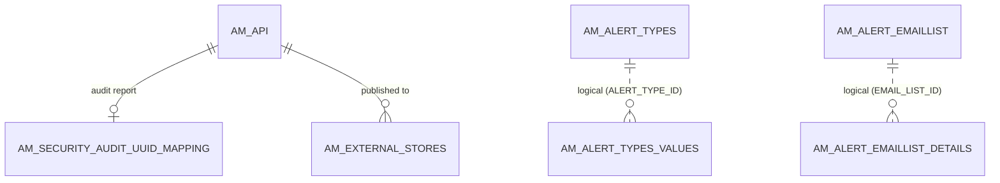

# Everything else

!!! abstract "In one sentence"
    This page covers the smaller features that don't belong to a core flow: monetization usage publishing, analytics alerts, bot-detection notifications, API security audit links, external stores and uploaded usage files.

## The idea

These tables each support one optional feature. Most are empty unless that feature is switched on. None of them are needed to create, subscribe to or call an API.

| Feature | Tables |
|---|---|
| Monetization (charging for API usage) | `AM_MONETIZATION_USAGE` |
| Analytics alerts (e.g. "abnormal response time") | `AM_ALERT_TYPES`, `AM_ALERT_TYPES_VALUES`, `AM_ALERT_EMAILLIST`, `AM_ALERT_EMAILLIST_DETAILS` |
| Bot-detection email notifications | `AM_NOTIFICATION_SUBSCRIBER` |
| API security audit (42Crunch) | `AM_SECURITY_AUDIT_UUID_MAPPING` |
| Publishing APIs to other Dev Portals | `AM_EXTERNAL_STORES` |
| Offline usage file upload | `AM_USAGE_UPLOADED_FILES` |

## How the tables connect

This diagram shows the only real foreign keys among these tables: two point at the API.



- Both API links are FKs with **delete restricted**.
- The alert tables join on ids, but no FK is declared.

## The tables

### AM_MONETIZATION_USAGE

**One row =** one run of the job that publishes usage data to the billing engine, e.g. Stripe.

| Column | What it means |
|---|---|
| `ID` | Primary key. |
| `STATE` | Job state, e.g. `RUNNING` or `COMPLETED`. |
| `STATUS` | Outcome, e.g. `SUCCESSFULL` or `UNSUCCESSFUL`. |
| `STARTED_TIME`, `PUBLISHED_TIME` | Timestamps, stored as strings. |

**Connects to:** nothing by FK. Prices live on [`AM_POLICY_SUBSCRIPTION`](throttling.md#am_policy_subscription).

[Full column list](../reference/am.md#am_monetization_usage)

### AM_ALERT_TYPES

**One row =** one kind of analytics alert. The script seeds seven: `AbnormalResponseTime`, `AbnormalBackendTime`, `AbnormalRequestsPerMin`, `AbnormalRequestPattern`, `UnusualIPAccess`, `FrequentTierLimitHitting` and `ApiHealthMonitor`.

| Column | What it means |
|---|---|
| `ALERT_TYPE_ID` | Primary key. |
| `ALERT_TYPE_NAME` | Alert name. |
| `STAKE_HOLDER` | Who it's for: `publisher` or `subscriber`. |

[Full column list](../reference/am.md#am_alert_types)

### AM_ALERT_TYPES_VALUES

**One row =** "user U has subscribed to alert type T".

| Column | What it means |
|---|---|
| `ALERT_TYPE_ID` + `USER_NAME` + `STAKE_HOLDER` | Primary key. `ALERT_TYPE_ID` is a *logical* link to `AM_ALERT_TYPES`. |

[Full column list](../reference/am.md#am_alert_types_values)

### AM_ALERT_EMAILLIST

**One row =** a user's email list for alerts, as a publisher or subscriber.

| Column | What it means |
|---|---|
| `EMAIL_LIST_ID` + `USER_NAME` + `STAKE_HOLDER` | Primary key. |

[Full column list](../reference/am.md#am_alert_emaillist)

### AM_ALERT_EMAILLIST_DETAILS

**One row =** one email address in an alert email list.

| Column | What it means |
|---|---|
| `EMAIL_LIST_ID` | *Logical* link to `AM_ALERT_EMAILLIST.EMAIL_LIST_ID`. |
| `EMAIL` | Email address. |

[Full column list](../reference/am.md#am_alert_emaillist_details)

### AM_NOTIFICATION_SUBSCRIBER

**One row =** an address that gets **bot-detection** notifications, sent when a call hits a honeypot API.

| Column | What it means |
|---|---|
| `UUID` + `SUBSCRIBER_ADDRESS` | Primary key. |
| `CATEGORY` | Notification category. |
| `NOTIFICATION_METHOD` | e.g. `email`. |
| `SUBSCRIBER_ADDRESS` | The email address. |

**Watch out:** this has nothing to do with `AM_SUBSCRIBER`.

[Full column list](../reference/am.md#am_notification_subscriber)

### AM_SECURITY_AUDIT_UUID_MAPPING

**One row =** the link between an API and its security audit report in the external 42Crunch platform.

| Column | What it means |
|---|---|
| `API_ID` | Primary key → [`AM_API`](api-definition.md#am_api) (FK, restricted). One report per API. |
| `AUDIT_UUID` | The report's id in the audit service. |

[Full column list](../reference/am.md#am_security_audit_uuid_mapping)

### AM_EXTERNAL_STORES

**One row =** "API A has been published to external Dev Portal S", i.e. another APIM's store.

| Column | What it means |
|---|---|
| `APISTORE_ID` | Primary key. |
| `API_ID` | → `AM_API` (FK, restricted). |
| `STORE_ID`, `STORE_DISPLAY_NAME` | Which external store, as configured in the tenant settings. |
| `STORE_ENDPOINT`, `STORE_TYPE` | Where it is and its type. |
| `LAST_UPDATED_TIME` | When the API was last pushed there. |

[Full column list](../reference/am.md#am_external_stores)

### AM_USAGE_UPLOADED_FILES

**One row =** one usage-data file uploaded to be processed, from gateways that couldn't send analytics directly.

| Column | What it means |
|---|---|
| `TENANT_DOMAIN` + `FILE_NAME` + `FILE_TIMESTAMP` | Primary key. |
| `FILE_PROCESSED` | Whether it has been processed. |
| `FILE_CONTENT` | The file, stored as a blob. |

**Watch out:** no component shipped in 3.2.0 uses this table.

[Full column list](../reference/am.md#am_usage_uploaded_files)

## Example

| Table | Row |
|---|---|
| `AM_EXTERNAL_STORES` | `API_ID` = 5, `STORE_ID` = `partner-store`, `STORE_TYPE` = `wso2` |
| `AM_SECURITY_AUDIT_UUID_MAPPING` | `API_ID` = 5, `AUDIT_UUID` = `a9c3…` |

## Try it

```sql
-- APIs that are pushed to external stores
SELECT a.API_NAME, a.API_VERSION, e.STORE_DISPLAY_NAME, e.STORE_ENDPOINT, e.LAST_UPDATED_TIME
FROM AM_EXTERNAL_STORES e
JOIN AM_API a ON a.API_ID = e.API_ID;
```

!!! note "Different in 4.x"
    4.x adds more tables here, such as correlation configs, system configs, task locks and transaction records. See [4.x Everything else](../../apim-4/domains/other.md).

## Related flows

- [All flows](../flows/index.md)
