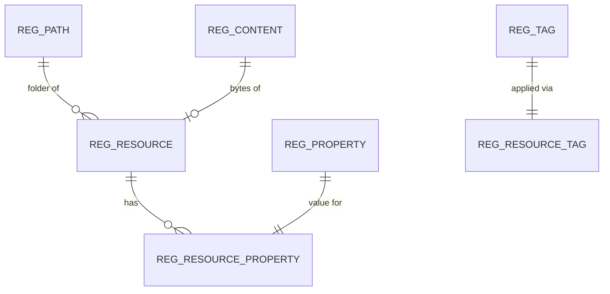

# Registry

!!! abstract "In one sentence"
    The registry is a general-purpose, versioned store of "resources" (files plus properties) in the shared database. In 3.x it holds each API's full definition, documents, lifecycle state and tags.

## The idea

Think of the registry as a **file system inside the database**. Every resource has a **path**, such as `/_system/governance/apimgt/applicationdata/provider/admin/PizzaShackAPI/1.0.0/api`, some **content** (the file's bytes) and a set of **properties** (name–value pairs).

In APIM 3.x, each API is saved there as a *governance artifact*: an XML document that holds all of the following:

- the description, tags, visibility and business owner,
- endpoint configuration and the gateway environments and labels it goes to,
- the lifecycle state (Created, Published and so on),
- links to its Swagger/OpenAPI or GraphQL definition, documents and thumbnail.

APIM mirrors only a few fields into [`AM_API`](api-definition.md#am_api) for fast joins. The **artifact's UUID is the API's UUID**. See [The databases](../databases.md#registry-vs-relational-tables-the-3x-split).

## How the tables connect

This diagram shows how a resource is put together from path, content and properties.



- A resource lives in a folder (`REG_PATH`) and points to its bytes (`REG_CONTENT`).
- Properties and tags are stored once and attached through bridge tables.
- The bridge tables reference the resource by **path id + resource name**, not by the resource's own key.

## The tables

### REG_RESOURCE

**One row =** one version of one registry resource, e.g. an API artifact, a Swagger file or a document.

| Column | What it means |
|---|---|
| `REG_VERSION` + `REG_TENANT_ID` | Primary key. `REG_VERSION` is a global version number. |
| `REG_PATH_ID` | → `REG_PATH`: the folder (FK, with the tenant). |
| `REG_NAME` | File name inside the folder, e.g. `api`. |
| `REG_MEDIA_TYPE` | Type, e.g. `application/vnd.wso2-api+xml` for an API artifact. |
| `REG_CONTENT_ID` | → `REG_CONTENT`: the bytes (FK, with the tenant). |
| `REG_UUID` | The resource's UUID. **For an API artifact, this is the API's UUID.** |
| `REG_CREATOR`, `REG_LAST_UPDATOR`, timestamps | Audit info. |

**Connects to:** `REG_PATH` (many to one, FK), `REG_CONTENT` (one to one, FK), properties, tags and so on through the bridge tables. Linked to [`AM_API`](api-definition.md#am_api) by provider + name + version, which is encoded in the path (*logical*, cross-database).

**Watch out:** the table has **no FK from `AM_API`** and sits in a different database. Old versions go to `REG_RESOURCE_HISTORY`.

[Full column list](../reference/reg.md#reg_resource)

### REG_PATH

**One row =** one folder path.

| Column | What it means |
|---|---|
| `REG_PATH_ID` + `REG_TENANT_ID` | Primary key. |
| `REG_PATH_VALUE` | Full path, unique per tenant. |
| `REG_PATH_PARENT_ID` | Parent folder id, which forms a tree (*logical*). |

**Connects to:** `REG_RESOURCE` and all the `REG_RESOURCE_*` bridge tables (FK).

[Full column list](../reference/reg.md#reg_path)

### REG_CONTENT

**One row =** the bytes of one resource version: an XML artifact, a Swagger JSON, a document file or an image.

| Column | What it means |
|---|---|
| `REG_CONTENT_ID` + `REG_TENANT_ID` | Primary key. |
| `REG_CONTENT_DATA` | The content blob. For an API, this is the artifact XML with every API attribute. |

**Connects to:** `REG_RESOURCE.REG_CONTENT_ID` (FK).

[Full column list](../reference/reg.md#reg_content)

### REG_PROPERTY

**One row =** one name–value property.

| Column | What it means |
|---|---|
| `REG_ID` + `REG_TENANT_ID` | Primary key. |
| `REG_NAME`, `REG_VALUE` | Property name and value. APIM uses these for lifecycle state and flags such as `registry.lifecycle.APILifeCycle.state`. |

**Connects to:** `REG_RESOURCE_PROPERTY` (FK from the bridge).

[Full column list](../reference/reg.md#reg_property)

### REG_RESOURCE_PROPERTY

**One row =** "property P belongs to resource R".

| Column | What it means |
|---|---|
| `REG_PROPERTY_ID` | → `REG_PROPERTY.REG_ID` (FK, with the tenant). |
| `REG_PATH_ID`, `REG_RESOURCE_NAME` | Identify the resource: its folder + name (FK to `REG_PATH`). |
| `REG_VERSION` | Resource version, when the property is attached to a specific version. |

**Connects to:** `REG_PROPERTY` (one to one) and `REG_PATH` (many to one).

[Full column list](../reference/reg.md#reg_resource_property)

### REG_ASSOCIATION

**One row =** a typed link between two registry paths, e.g. an API → its document, or an API → its Swagger definition.

| Column | What it means |
|---|---|
| `REG_ASSOCIATION_ID` + `REG_TENANT_ID` | Primary key. |
| `REG_SOURCEPATH`, `REG_TARGETPATH` | The two resource paths (*logical* — plain strings, no FK). |
| `REG_ASSOCIATION_TYPE` | Kind of link, e.g. `document`. |

[Full column list](../reference/reg.md#reg_association)

### REG_TAG

**One row =** one tag applied by a user, e.g. `pizza`.

| Column | What it means |
|---|---|
| `REG_ID` + `REG_TENANT_ID` | Primary key. |
| `REG_TAG_NAME` | Tag text. **This is where API tags live in 3.x.** |
| `REG_USER_ID`, `REG_TAGGED_TIME` | Who tagged it, and when. |

**Connects to:** `REG_RESOURCE_TAG` (FK from the bridge).

[Full column list](../reference/reg.md#reg_tag)

### REG_RESOURCE_TAG

**One row =** "tag T is on resource R".

| Column | What it means |
|---|---|
| `REG_TAG_ID` | → `REG_TAG.REG_ID` (FK). |
| `REG_PATH_ID`, `REG_RESOURCE_NAME` | The tagged resource (FK to `REG_PATH`). |

[Full column list](../reference/reg.md#reg_resource_tag)

The other registry tables (history, comments, ratings, snapshots, log, cluster lock) are listed in [Identity Server tables](../identity-tables.md).

## Example

| Table | Example row |
|---|---|
| `REG_PATH` | `REG_PATH_ID` = 42, `REG_PATH_VALUE` = `/_system/governance/apimgt/applicationdata/provider/admin/PizzaShackAPI/1.0.0` |
| `REG_RESOURCE` | `REG_PATH_ID` = 42, `REG_NAME` = `api`, `REG_MEDIA_TYPE` = `application/vnd.wso2-api+xml`, `REG_UUID` = `4c5f2e1a-…` |
| `AM_API` | `API_PROVIDER` = `admin`, `API_NAME` = `PizzaShackAPI`, `API_VERSION` = `1.0.0` |

The REST API reports the API's id as `4c5f2e1a-…`, which is the registry UUID.

## Try it

```sql
-- Find the registry artifact (and UUID) for every API (run on the SHARED DB)
SELECT p.REG_PATH_VALUE, r.REG_NAME, r.REG_UUID
FROM REG_RESOURCE r
JOIN REG_PATH p ON p.REG_PATH_ID = r.REG_PATH_ID AND p.REG_TENANT_ID = r.REG_TENANT_ID
WHERE r.REG_MEDIA_TYPE = 'application/vnd.wso2-api+xml';
```

!!! note "Different in 4.x"
    4.x still uses the registry for API metadata, but `AM_API` gains `API_UUID`, and revisions snapshot API details into `AM_*` tables. See [4.x Registry](../../apim-4/domains/registry.md).

## Related flows

- [Create an API](../flows/02-create-api.md)
- [Change lifecycle state](../flows/05-lifecycle.md)
