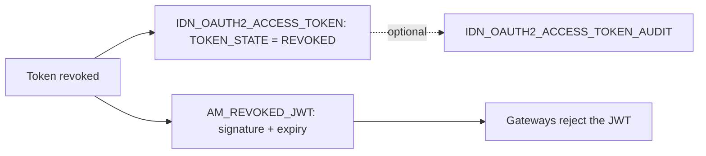

# Revocation

!!! abstract "In one sentence"
    When a token is revoked, APIM has to make sure gateways stop accepting it. Opaque tokens are simply marked as revoked. JWTs, which gateways check without a database lookup, are added to a revoked-JWT list.

## The idea

There are two kinds of access token, and they're revoked differently:

- **Opaque (OAuth) tokens** are random strings. The key manager looks them up in [`IDN_OAUTH2_ACCESS_TOKEN`](keys-tokens.md#idn_oauth2_access_token) on every validation. Revoking one just sets its `TOKEN_STATE` to `REVOKED`, and gateways clear their cache.
- **JWT tokens** are self-contained. A gateway can validate one on its own by checking the signature and expiry, so changing a database row isn't enough. APIM therefore keeps a **revoked-JWT list** (`AM_REVOKED_JWT`). It broadcasts each revocation to all gateways, and gateways that restart reload the list.

Rows in the revoked list only need to be kept until the token would have expired anyway. After that, APIM deletes them.

## How the tables connect

This diagram shows what a revocation writes.



- The token row's state changes. If token cleanup is enabled, the row can be moved to the audit table.
- For JWTs, the signature is stored in `AM_REVOKED_JWT`. It has **no FK** to the token row.

## The tables

### AM_REVOKED_JWT

**One row =** one revoked JWT that gateways must refuse until it expires.

| Column | What it means |
|---|---|
| `UUID` | Primary key: the token's unique id (its `jti`). |
| `SIGNATURE` | The JWT signature. Gateways compare incoming tokens against it. |
| `EXPIRY_TIMESTAMP` | When the token would expire anyway, in epoch milliseconds. Rows past this time are deleted. |
| `TENANT_ID` | Tenant. |
| `TOKEN_TYPE` | Kind of token, e.g. `JWT`. |
| `TIME_CREATED` | When it was revoked. |

**Connects to:** nothing by FK. It's matched to tokens by `jti` or signature (*logical*).

**Watch out:** `DELETE FROM AM_REVOKED_JWT WHERE EXPIRY_TIMESTAMP < ?` runs periodically, so the table only ever holds unexpired revocations.

[Full column list](../reference/am.md#am_revoked_jwt)

Related tables explained elsewhere:

- [`IDN_OAUTH2_ACCESS_TOKEN`](keys-tokens.md#idn_oauth2_access_token): `TOKEN_STATE` becomes `REVOKED`.
- [`IDN_OAUTH2_ACCESS_TOKEN_AUDIT`](keys-tokens.md#idn_oauth2_access_token_audit): the history of invalidated tokens.
- [`AM_BLOCK_CONDITIONS`](throttling.md#am_block_conditions): blocking a whole application, user, IP or API, rather than a single token.

## Example

| `AM_REVOKED_JWT` | | |
|---|---|---|
| `UUID` = `b4f2…` (jti) | `EXPIRY_TIMESTAMP` = `1735689600000` | `TENANT_ID` = -1234 |

## Try it

```sql
-- JWTs currently on the revoked list, and when they can be forgotten
SELECT UUID, TOKEN_TYPE, TENANT_ID, TIME_CREATED, EXPIRY_TIMESTAMP
FROM AM_REVOKED_JWT
ORDER BY TIME_CREATED DESC;
```

!!! note "Different in 4.x"
    4.x adds event tables for revoking **all** tokens of an app or user at once (`AM_APP_REVOKED_EVENT`, `AM_SUBJECT_ENTITY_REVOKED_EVENT` and their `IDN_*` twins) and `IDN_INVALID_TOKENS`. See [4.x Revocation](../../apim-4/domains/revocation.md).

## Related flows

- [Revoke & delete](../flows/12-revocation-and-delete.md)
- [Get a token & call the API](../flows/10-token-and-invoke.md)
