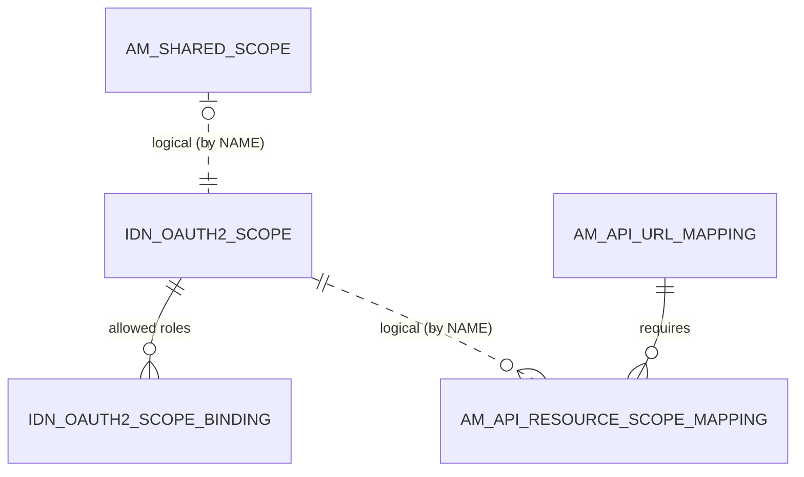

# Scopes

!!! abstract "In one sentence"
    A scope is a named permission, such as `order:write`, that you attach to API resources. A token must carry that scope to call those resources. These tables define scopes, bind them to roles and attach them to resources.

## The idea

Imagine a building where some doors need a special badge. A **scope** is the badge's name. A **scope binding** says which *roles* are allowed to get that badge. A **resource scope mapping** says which *doors*, meaning API resources, need it.

When an application asks for a token with `scope=order:write`, the key manager checks the user's roles against the scope's bindings. It only puts the scope into the token if the user is allowed. The gateway then checks that the token has the scope the resource requires.

In 3.2 the scopes that are actually enforced live in the **Identity Server OAuth tables** (`IDN_OAUTH2_SCOPE` and friends), because the embedded key manager owns them. `AM_API_RESOURCE_SCOPE_MAPPING` links them to API resources by **scope name**.

A **shared scope** is defined once per tenant and reused by many APIs.

## How the tables connect

This diagram shows how a scope ends up on an API resource.



- A scope's allowed roles are real FKs (cascade).
- Resources point at scopes **by name + tenant**. There's no FK.
- A shared scope is just a name and UUID in APIM. Its definition is an `IDN_OAUTH2_SCOPE` row with the same name.

## The tables

### IDN_OAUTH2_SCOPE

**One row =** one OAuth scope known to the key manager, in one tenant.

| Column | What it means |
|---|---|
| `SCOPE_ID` | Primary key. |
| `NAME` | Scope name, e.g. `order:write`. This is what resources and tokens use. |
| `DISPLAY_NAME`, `DESCRIPTION` | Shown in the Publisher. |
| `TENANT_ID` | Tenant. |
| `SCOPE_TYPE` | Kind of scope, e.g. `OAUTH2`. |

**Connects to:**

- `IDN_OAUTH2_SCOPE_BINDING`: one to many, FK, cascade.
- `IDN_OAUTH2_RESOURCE_SCOPE`: one to many, FK, cascade.
- `AM_API_RESOURCE_SCOPE_MAPPING`: by `NAME` + `TENANT_ID` (*logical*).

**Watch out:** this table isn't empty on a new installation. At startup, APIM 3.2.0 writes **175 rows**: the OIDC scopes plus every `apim:*` scope of APIM's own REST APIs, with 170 role bindings in `IDN_OAUTH2_SCOPE_BINDING`. API scopes you create are added after these (`SCOPE_ID` 176 onwards), and are recreated with a new `SCOPE_ID` whenever the API is updated.

[Full column list](../reference/idn.md#idn_oauth2_scope)

### IDN_OAUTH2_SCOPE_BINDING

**One row =** "scope S may be granted to users with role R".

| Column | What it means |
|---|---|
| `SCOPE_ID` | → `IDN_OAUTH2_SCOPE` (FK, cascade). |
| `SCOPE_BINDING` | Role name, e.g. `Internal/subscriber` (*logical* link to `UM_ROLE` / `UM_HYBRID_ROLE` by name). |
| `BINDING_TYPE` | Kind of binding, e.g. `DEFAULT` for role-based. |

[Full column list](../reference/idn.md#idn_oauth2_scope_binding)

### IDN_OAUTH2_RESOURCE_SCOPE

**One row =** a scope required for a key-manager-side resource path. Identity Server uses these for its own REST APIs.

| Column | What it means |
|---|---|
| `RESOURCE_PATH` | Path pattern. |
| `SCOPE_ID` | → `IDN_OAUTH2_SCOPE` (FK, cascade). |
| `TENANT_ID` | Tenant. |

**Watch out:** API Manager's **API resources don't use this table**. They use `AM_API_RESOURCE_SCOPE_MAPPING`.

[Full column list](../reference/idn.md#idn_oauth2_resource_scope)

### AM_API_RESOURCE_SCOPE_MAPPING

**One row =** "resource R (verb + path) requires scope S".

| Column | What it means |
|---|---|
| `SCOPE_NAME` | Scope name (*logical* link to `IDN_OAUTH2_SCOPE.NAME`). |
| `URL_MAPPING_ID` | → [`AM_API_URL_MAPPING`](api-definition.md#am_api_url_mapping) (FK, **cascade**). |
| `TENANT_ID` | Tenant, needed to resolve the scope name. |

**Connects to:** `AM_API_URL_MAPPING`, many to one (FK). The primary key is (scope name, resource), so a resource can require several scopes.

[Full column list](../reference/am.md#am_api_resource_scope_mapping)

### AM_SHARED_SCOPE

**One row =** a tenant-wide scope that many APIs can reuse.

| Column | What it means |
|---|---|
| `UUID` | Primary key, used by the Publisher REST API. |
| `NAME` | Scope name (*logical* link to `IDN_OAUTH2_SCOPE.NAME`). |
| `TENANT_ID` | Tenant. |

**Watch out:** deleting a shared scope that APIs still use is blocked by the application, not by the database.

[Full column list](../reference/am.md#am_shared_scope)

### AM_SCOPE

**One row =** an APIM-side copy of a scope definition. It has the same columns as `IDN_OAUTH2_SCOPE`: `SCOPE_ID`, `NAME`, `DISPLAY_NAME`, `DESCRIPTION`, `TENANT_ID`, `SCOPE_TYPE`.

**Watch out:** the 3.2.0 script creates this table, but **no component shipped in 3.2.0 reads or writes it**. Expect it to be empty. The live scopes are in `IDN_OAUTH2_SCOPE`.

[Full column list](../reference/am.md#am_scope)

### AM_SCOPE_BINDING

**One row =** a role binding for an `AM_SCOPE` row.

| Column | What it means |
|---|---|
| `SCOPE_ID` | → `AM_SCOPE` (FK, cascade). |
| `SCOPE_BINDING`, `BINDING_TYPE` | Role and binding kind, as in `IDN_OAUTH2_SCOPE_BINDING`. |

**Watch out:** like `AM_SCOPE`, this table is unused in 3.2.0.

[Full column list](../reference/am.md#am_scope_binding)

## Example

| Table | Row |
|---|---|
| `IDN_OAUTH2_SCOPE` | `SCOPE_ID` = 7, `NAME` = `order:write`, `TENANT_ID` = -1234 |
| `IDN_OAUTH2_SCOPE_BINDING` | `SCOPE_ID` = 7, `SCOPE_BINDING` = `Internal/subscriber` |
| `AM_API_RESOURCE_SCOPE_MAPPING` | `SCOPE_NAME` = `order:write`, `URL_MAPPING_ID` = 22 (`POST /order`) |

## Try it

```sql
-- Which scopes protect which resources, and which roles can get them?
SELECT a.API_NAME, u.HTTP_METHOD, u.URL_PATTERN, m.SCOPE_NAME, b.SCOPE_BINDING AS ROLE
FROM AM_API_RESOURCE_SCOPE_MAPPING m
JOIN AM_API_URL_MAPPING u ON u.URL_MAPPING_ID = m.URL_MAPPING_ID
JOIN AM_API a            ON a.API_ID = u.API_ID
LEFT JOIN IDN_OAUTH2_SCOPE s ON s.NAME = m.SCOPE_NAME AND s.TENANT_ID = m.TENANT_ID
LEFT JOIN IDN_OAUTH2_SCOPE_BINDING b ON b.SCOPE_ID = s.SCOPE_ID;
```

!!! note "Different in 4.x"
    In 4.x, `AM_SCOPE` / `AM_SCOPE_BINDING` hold APIM's scope definitions, so they work with any key manager, and resource scope mappings are tied to revisions. See [4.x Scopes](../../apim-4/domains/scopes.md).

## Related flows

- [Create an API](../flows/02-create-api.md)
- [Get a token & call the API](../flows/10-token-and-invoke.md)
