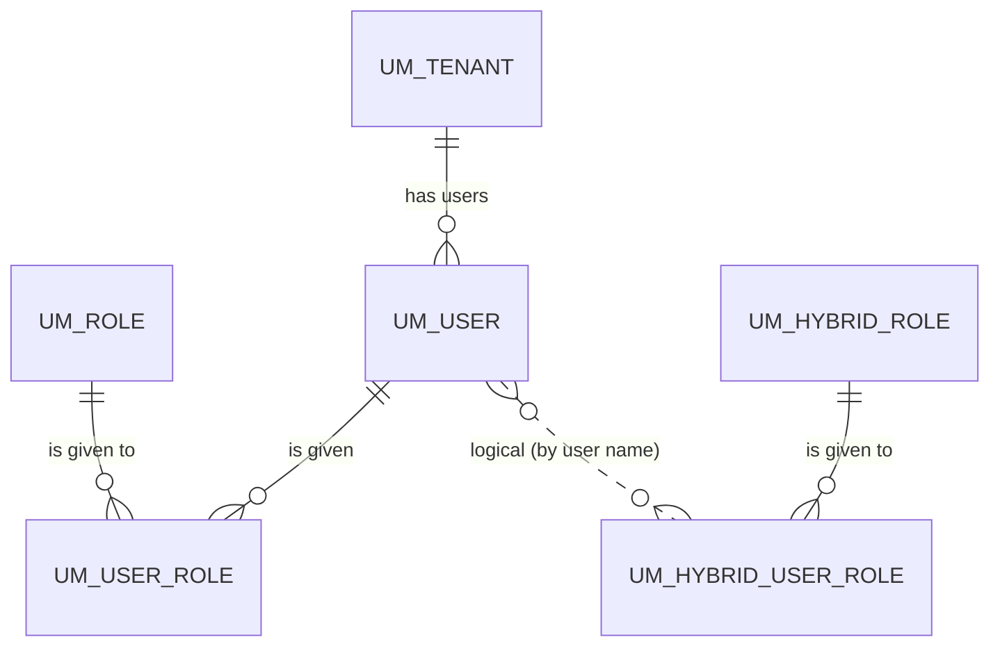

# Tenants & users

!!! abstract "In one sentence"
    These tables record which tenants exist, which users belong to each tenant, and which roles those users hold. Almost every other APIM table is scoped to one of these tenants.

## The idea

A **tenant** is an isolated slice of one APIM installation. Each tenant has its own users, APIs and applications, and can't see another tenant's data. Every installation starts with the **super tenant**, `carbon.super` (ID `-1234`). More tenants, such as `acme.com`, can be added later.

**Users** log in to the Publisher, Dev Portal and Admin Portal. By default they're stored in the JDBC user store in the shared database (`UM_*` tables). Many real deployments point to LDAP or Active Directory instead. In that case the `UM_USER` table stays mostly empty, and the users live outside the database.

**Roles** decide what a user can do. For example, `Internal/creator` can create APIs and `Internal/subscriber` can use the Dev Portal. Roles whose names start with `Internal/` are *hybrid roles*. They're stored in the database even when users come from LDAP.

APIM itself only keeps one small table here, `AM_USER`. Everything else comes from the Carbon user-management layer.

## How the tables connect

This diagram shows how users get their roles inside a tenant.



- A user gets normal (user-store) roles through `UM_USER_ROLE`, which is a real FK.
- Internal (hybrid) roles are linked by **user name**, not by ID, so they also work for LDAP users.
- Every `UM_*` table carries `UM_TENANT_ID`. Most keys are *(id, tenant)* pairs.

## The tables

### UM_TENANT

**One row =** one tenant, other than the super tenant (which is implicit, with ID `-1234`).

| Column | What it means |
|---|---|
| `UM_ID` | Tenant ID. Every `TENANT_ID` / `UM_TENANT_ID` column in the system refers to this. |
| `UM_DOMAIN_NAME` | Tenant domain, e.g. `acme.com`. Unique. `TENANT_DOMAIN` columns hold this value. |
| `UM_EMAIL` | Admin email address given at tenant creation. |
| `UM_ACTIVE` | Whether the tenant is active. Deactivated tenants can't log in. |
| `UM_USER_CONFIG` | The tenant's user-realm configuration, stored as a blob. |

**Connects to:** every tenant-scoped table, via `TENANT_ID` (integer) or `TENANT_DOMAIN` (string). These are **logical links**. Only `UM_ACCOUNT_MAPPING` has a real FK to this table.

**Watch out:** the super tenant `carbon.super` / `-1234` has **no row** here.

[Full column list](../reference/um.md#um_tenant)

### UM_USER

**One row =** one user in the default JDBC user store.

| Column | What it means |
|---|---|
| `UM_ID` + `UM_TENANT_ID` | Composite primary key. |
| `UM_USER_ID` | The user's unique id (a UUID string). |
| `UM_USER_NAME` | The login name, e.g. `admin`. `AM_SUBSCRIBER.USER_ID` and many `CREATED_BY` columns hold this value. |
| `UM_USER_PASSWORD`, `UM_SALT_VALUE` | Hashed password and its salt. |
| `UM_REQUIRE_CHANGE`, `UM_CHANGED_TIME` | Password-change bookkeeping. |

**Connects to:** `UM_USER_ROLE` and `UM_USER_ATTRIBUTE` (FK on id + tenant). Linked to [`AM_SUBSCRIBER`](applications-subscriptions.md#am_subscriber) by user name (*logical*).

**Watch out:** with an LDAP or AD user store, this table is empty or nearly empty.

[Full column list](../reference/um.md#um_user)

### UM_ROLE

**One row =** one user-store role (a group in the JDBC user store).

| Column | What it means |
|---|---|
| `UM_ID` + `UM_TENANT_ID` | Primary key. |
| `UM_ROLE_NAME` | Role name, unique per tenant. |
| `UM_SHARED_ROLE` | Whether the role is shared across tenants. |

**Connects to:** `UM_USER_ROLE` (one role → many assignments). It's also referenced by name in `UM_ROLE_PERMISSION`, and by name in APIM's tier permissions and API visibility settings (*logical*).

[Full column list](../reference/um.md#um_role)

### UM_USER_ROLE

**One row =** "user X has role Y" in the JDBC user store.

| Column | What it means |
|---|---|
| `UM_USER_ID` | → `UM_USER.UM_ID` (FK, together with the tenant). |
| `UM_ROLE_ID` | → `UM_ROLE.UM_ID` (FK, together with the tenant). |
| `UM_TENANT_ID` | Tenant. |

**Connects to:** many-to-many bridge between `UM_USER` and `UM_ROLE`. It's unique per (user, role, tenant).

[Full column list](../reference/um.md#um_user_role)

### UM_HYBRID_ROLE

**One row =** one *internal* role, such as `Internal/creator`, `Internal/publisher`, `Internal/subscriber` or `Internal/everyone`, or an application role.

| Column | What it means |
|---|---|
| `UM_ID` + `UM_TENANT_ID` | Primary key. |
| `UM_ROLE_NAME` | Role name without the `Internal/` prefix, e.g. `creator`. |

**Connects to:** `UM_HYBRID_USER_ROLE` (FK, on delete cascade).

**Watch out:** these roles are what APIM checks for Publisher and Dev Portal access out of the box.

[Full column list](../reference/um.md#um_hybrid_role)

### UM_HYBRID_USER_ROLE

**One row =** "user (by name) has internal role Y".

| Column | What it means |
|---|---|
| `UM_USER_NAME` | User name. Can be a user from any user store, including LDAP. |
| `UM_ROLE_ID` | → `UM_HYBRID_ROLE` (FK, cascade). |
| `UM_DOMAIN_ID` | → `UM_DOMAIN`: which user store the user comes from (FK, cascade). |

**Connects to:** `UM_HYBRID_ROLE` (many to one) and `UM_DOMAIN` (many to one). It refers to users by **name** only (*logical*).

[Full column list](../reference/um.md#um_hybrid_user_role)

### AM_USER

**One row =** a mapping from a user's id to their user name that APIM keeps for its own lookups.

| Column | What it means |
|---|---|
| `USER_ID` | User id (primary key). |
| `USER_NAME` | User name. |

**Connects to:** nothing by FK. APIM uses it to resolve a user name from an id (`SELECT USER_ID FROM AM_USER WHERE USER_NAME=?`).

[Full column list](../reference/am.md#am_user)

## Example

| `UM_HYBRID_ROLE` | | `UM_HYBRID_USER_ROLE` | |
|---|---|---|---|
| `UM_ID` = 3 | `UM_ROLE_NAME` = `subscriber` | `UM_USER_NAME` = `alice` | `UM_ROLE_ID` = 3 |

So `alice` is an `Internal/subscriber` and can sign in to the Dev Portal. The first time she creates an application, APIM creates her `AM_SUBSCRIBER` row.

## Try it

```sql
-- Which internal roles does each user have?
SELECT hur.UM_USER_NAME, hr.UM_ROLE_NAME, hur.UM_TENANT_ID
FROM UM_HYBRID_USER_ROLE hur
JOIN UM_HYBRID_ROLE hr
  ON hr.UM_ID = hur.UM_ROLE_ID AND hr.UM_TENANT_ID = hur.UM_TENANT_ID
ORDER BY hur.UM_USER_NAME;
```

!!! note "Different in 4.x"
    4.x adds organization tables (`UM_ORG*`) and `ORGANIZATION` columns across `AM_*`. See [4.x Tenants & users](../../apim-4/domains/tenancy-users.md).

## Related flows

- [Setup & first user](../flows/01-bootstrap.md)
