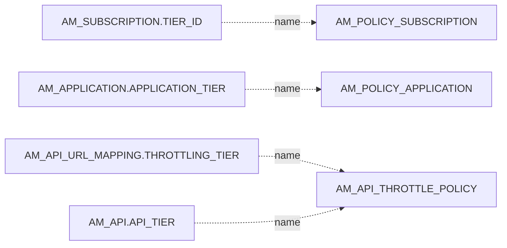
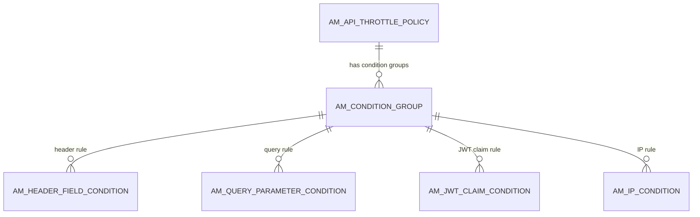

# Throttling policies

!!! abstract "In one sentence"
    These tables define the rate limits, or "tiers", that APIM enforces: per subscription, per application, per API or resource, and globally. They also define who may use each tier, and which callers are blocked outright.

## The idea

A **throttling policy** is a rule such as "5000 requests per minute". APIM applies policies at several levels, and a call has to pass **all** of them:

| Level | Set by | Stored in | Referenced from (by **name**) |
|---|---|---|---|
| **Subscription** | Admin defines, developer picks when subscribing | `AM_POLICY_SUBSCRIPTION` | `AM_SUBSCRIPTION.TIER_ID` |
| **Application** | Admin defines, developer picks for the app | `AM_POLICY_APPLICATION` | `AM_APPLICATION.APPLICATION_TIER` |
| **API / resource** ("advanced") | Admin defines, publisher attaches | `AM_API_THROTTLE_POLICY` + conditions | `AM_API.API_TIER`, `AM_API_URL_MAPPING.THROTTLING_TIER` |
| **Custom (global)** | Admin writes a Siddhi query | `AM_POLICY_GLOBAL` | applies to all traffic that matches its key template |
| **Blocking** | Admin | `AM_BLOCK_CONDITIONS` | applies to the matching app, user, IP or API |

Every policy table has an `IS_DEPLOYED` flag. APIM turns each policy into a rule for the traffic manager, the component that counts requests.

## How the tables connect

This diagram shows where each policy is referenced from. Every link is a **name match**, not a foreign key.



- Always join on the name **and** the tenant, because names are unique per tenant (`UNIQUE (NAME, TENANT_ID)`).
- Renaming or deleting a policy doesn't update the rows that use it.

An advanced (API) policy can have different limits for different kinds of requests. This diagram shows its structure.



- The policy has a **default limit**. Each **condition group** has its own limit, which applies when all of that group's conditions match.
- Everything cascades: deleting the policy removes its groups and conditions.

## The tables

### AM_POLICY_SUBSCRIPTION

**One row =** one subscription tier, e.g. `Gold`, `Silver`, `Bronze` or `Unlimited`.

| Column | What it means |
|---|---|
| `POLICY_ID` | Primary key. `UUID` is also unique. |
| `NAME` | Tier name, unique per tenant. **`AM_SUBSCRIPTION.TIER_ID` stores this.** |
| `DISPLAY_NAME`, `DESCRIPTION` | Shown in the portals. |
| `QUOTA_TYPE` | `requestCount` or `bandwidthVolume`. |
| `QUOTA`, `QUOTA_UNIT`, `UNIT_TIME`, `TIME_UNIT` | The limit, e.g. 5000 requests per 1 minute. |
| `RATE_LIMIT_COUNT`, `RATE_LIMIT_TIME_UNIT` | Optional burst-control limit, e.g. 100 per second. |
| `STOP_ON_QUOTA_REACH` | Reject calls when the quota is used up (`true`), or just record them. |
| `BILLING_PLAN` | `FREE`, `COMMERCIAL` and so on. |
| `MONETIZATION_PLAN`, `FIXED_RATE`, `BILLING_CYCLE`, `PRICE_PER_REQUEST`, `CURRENCY` | Monetization settings. |
| `MAX_COMPLEXITY`, `MAX_DEPTH` | GraphQL query limits for this tier. |
| `CUSTOM_ATTRIBUTES`, `TENANT_ID`, `IS_DEPLOYED` | Extra attributes, tenant, and deployment flag. |

**Connects to:** `AM_SUBSCRIPTION.TIER_ID` and `TIER_ID_PENDING`, and `AM_API_CLIENT_CERTIFICATE.TIER_NAME` (*logical*, by name). Access is controlled by [`AM_TIER_PERMISSIONS`](#am_tier_permissions).

[Full column list](../reference/am.md#am_policy_subscription)

### AM_POLICY_APPLICATION

**One row =** one application-level tier. This limit is shared by **all** calls an application makes, across all its subscriptions.

| Column | What it means |
|---|---|
| `POLICY_ID` | Primary key. `UUID` is also unique. |
| `NAME` | Tier name, unique per tenant. **`AM_APPLICATION.APPLICATION_TIER` stores this.** |
| `QUOTA_TYPE`, `QUOTA`, `QUOTA_UNIT`, `UNIT_TIME`, `TIME_UNIT` | The limit. |
| `DISPLAY_NAME`, `DESCRIPTION`, `CUSTOM_ATTRIBUTES`, `TENANT_ID`, `IS_DEPLOYED` | As above. |

[Full column list](../reference/am.md#am_policy_application)

### AM_API_THROTTLE_POLICY

**One row =** one advanced (API- or resource-level) policy.

| Column | What it means |
|---|---|
| `POLICY_ID` | Primary key. `UUID` is also unique. |
| `NAME` | Policy name, unique per tenant. **This is what `AM_API.API_TIER` and `AM_API_URL_MAPPING.THROTTLING_TIER` store.** |
| `DEFAULT_QUOTA_TYPE`, `DEFAULT_QUOTA`, `DEFAULT_QUOTA_UNIT`, `DEFAULT_UNIT_TIME`, `DEFAULT_TIME_UNIT` | The limit used when no condition group matches. |
| `APPLICABLE_LEVEL` | `apiLevel` (whole API) or `resourceLevel` (per resource). |
| `DISPLAY_NAME`, `DESCRIPTION`, `TENANT_ID`, `IS_DEPLOYED` | As above. |

**Connects to:** `AM_CONDITION_GROUP` (one to many, FK, cascade).

[Full column list](../reference/am.md#am_api_throttle_policy)

### AM_CONDITION_GROUP

**One row =** one alternative limit inside an advanced policy, e.g. "requests from IP range X get 100 per minute".

| Column | What it means |
|---|---|
| `CONDITION_GROUP_ID` | Primary key. |
| `POLICY_ID` | → `AM_API_THROTTLE_POLICY` (FK, cascade). |
| `QUOTA_TYPE`, `QUOTA`, `QUOTA_UNIT`, `UNIT_TIME`, `TIME_UNIT` | The limit for this group. |
| `DESCRIPTION` | Free text. |

**Connects to:** the four condition tables below (one to many, cascade).

[Full column list](../reference/am.md#am_condition_group)

### AM_HEADER_FIELD_CONDITION

**One row =** a rule that matches on a request header.

| Column | What it means |
|---|---|
| `HEADER_FIELD_ID` | Primary key. |
| `CONDITION_GROUP_ID` | → `AM_CONDITION_GROUP` (FK, cascade). |
| `HEADER_FIELD_NAME`, `HEADER_FIELD_VALUE` | Header name and value to match. |
| `IS_HEADER_FIELD_MAPPING` | `true` = must match, `false` = must **not** match (inverted). |

[Full column list](../reference/am.md#am_header_field_condition)

### AM_QUERY_PARAMETER_CONDITION

**One row =** a rule that matches on a query parameter.

| Column | What it means |
|---|---|
| `QUERY_PARAMETER_ID` | Primary key. |
| `CONDITION_GROUP_ID` | → `AM_CONDITION_GROUP` (FK, cascade). |
| `PARAMETER_NAME`, `PARAMETER_VALUE` | Parameter to match. |
| `IS_PARAM_MAPPING` | Match or inverted match. |

[Full column list](../reference/am.md#am_query_parameter_condition)

### AM_JWT_CLAIM_CONDITION

**One row =** a rule that matches on a claim inside the caller's JWT.

| Column | What it means |
|---|---|
| `JWT_CLAIM_ID` | Primary key. |
| `CONDITION_GROUP_ID` | → `AM_CONDITION_GROUP` (FK, cascade). |
| `CLAIM_URI`, `CLAIM_ATTRIB` | Claim name and the value (regex) to match. |
| `IS_CLAIM_MAPPING` | Match or inverted match. |

[Full column list](../reference/am.md#am_jwt_claim_condition)

### AM_IP_CONDITION

**One row =** a rule that matches on the caller's IP address.

| Column | What it means |
|---|---|
| `AM_IP_CONDITION_ID` | Primary key. |
| `CONDITION_GROUP_ID` | → `AM_CONDITION_GROUP` (FK, cascade). |
| `SPECIFIC_IP` | A single IP, **or**… |
| `STARTING_IP`, `ENDING_IP` | …an IP range. |
| `WITHIN_IP_RANGE` | Match inside the range (`true`) or outside it. |

[Full column list](../reference/am.md#am_ip_condition)

### AM_POLICY_GLOBAL

**One row =** one custom (global) policy, written as a Siddhi streaming query, e.g. "no user may make more than 1000 calls per minute across all APIs".

| Column | What it means |
|---|---|
| `POLICY_ID` | Primary key. `UUID` is also unique. |
| `NAME` | Policy name. |
| `KEY_TEMPLATE` | Which request attributes form the counter key, e.g. `$userId:$apiContext`. |
| `SIDDHI_QUERY` | The query itself. |
| `DESCRIPTION`, `TENANT_ID`, `IS_DEPLOYED` | As above. |

[Full column list](../reference/am.md#am_policy_global)

### AM_POLICY_HARD_THROTTLING

**One row =** a hard limit policy. It has the same quota columns as the others: `NAME`, `QUOTA_TYPE`, `QUOTA`, `QUOTA_UNIT`, `UNIT_TIME`, `TIME_UNIT`, `TENANT_ID` and `IS_DEPLOYED`.

**Watch out:** the 3.2.0 script creates this table, but **no bundled component uses it**. Backend hard limits are configured on the API's endpoint in the registry artifact instead.

[Full column list](../reference/am.md#am_policy_hard_throttling)

### AM_BLOCK_CONDITIONS

**One row =** one "deny" rule. Matching calls are rejected outright.

| Column | What it means |
|---|---|
| `CONDITION_ID` | Primary key. `UUID` is also unique. |
| `TYPE` | What to block: `API` (context), `APPLICATION`, `USER`, `IP` or `IPRANGE`. |
| `VALUE` | What to match, e.g. `alice:PizzaApp` for an application, or an IP address. |
| `ENABLED` | Whether the rule is active. |
| `DOMAIN` | Tenant domain. |

**Connects to:** the blocked entity by **value** (*logical*). APIM's application listing checks it to show blocked apps.

[Full column list](../reference/am.md#am_block_conditions)

### AM_TIER_PERMISSIONS

**One row =** a visibility rule for a **subscription tier**: which roles may, or may not, see and use it.

| Column | What it means |
|---|---|
| `TIER_PERMISSIONS_ID` | Primary key. |
| `TIER` | Tier name (*logical* link to `AM_POLICY_SUBSCRIPTION.NAME`). |
| `PERMISSIONS_TYPE` | `allow` or `deny`. |
| `ROLES` | Comma-separated role names. |
| `TENANT_ID` | Tenant. |

[Full column list](../reference/am.md#am_tier_permissions)

### AM_THROTTLE_TIER_PERMISSIONS

**One row =** the same kind of role-based visibility rule, managed through the throttling (Admin) APIs. It has the same columns as `AM_TIER_PERMISSIONS`: `TIER`, `PERMISSIONS_TYPE`, `ROLES` and `TENANT_ID`.

**Watch out:** both permission tables are read by 3.2. When you debug "why can't this user see the Gold tier?", check both.

[Full column list](../reference/am.md#am_throttle_tier_permissions)

## Example

| Table | Row |
|---|---|
| `AM_POLICY_SUBSCRIPTION` | `NAME` = `Gold`, `QUOTA_TYPE` = `requestCount`, `QUOTA` = 5000, `UNIT_TIME` = 1, `TIME_UNIT` = `min` |
| `AM_SUBSCRIPTION` | `TIER_ID` = `Gold` |
| `AM_API_THROTTLE_POLICY` | `NAME` = `10KPerMin`, `APPLICABLE_LEVEL` = `apiLevel` |
| `AM_CONDITION_GROUP` | `POLICY_ID` → `10KPerMin`, `QUOTA` = 100 (applies when…) |
| `AM_IP_CONDITION` | …`SPECIFIC_IP` = `203.0.113.7` |

## Try it

```sql
-- Which tier does each subscription use, and what is its limit?
SELECT a.API_NAME, app.NAME AS APPLICATION, sub.TIER_ID,
       p.QUOTA, p.QUOTA_TYPE, p.UNIT_TIME, p.TIME_UNIT
FROM AM_SUBSCRIPTION sub
JOIN AM_API a           ON a.API_ID = sub.API_ID
JOIN AM_APPLICATION app ON app.APPLICATION_ID = sub.APPLICATION_ID
JOIN AM_SUBSCRIBER s    ON s.SUBSCRIBER_ID = app.SUBSCRIBER_ID
LEFT JOIN AM_POLICY_SUBSCRIPTION p
       ON p.NAME = sub.TIER_ID AND p.TENANT_ID = s.TENANT_ID;
```

!!! note "Different in 4.x"
    4.x keeps the same structure (policy → condition groups → conditions), with some extra columns. See [4.x Throttling policies](../../apim-4/domains/throttling.md).

## Related flows

- [Manage throttling policies](../flows/11-throttling-policies.md)
- [Subscribe to an API](../flows/08-subscribe.md)
- [Get a token & call the API](../flows/10-token-and-invoke.md)
