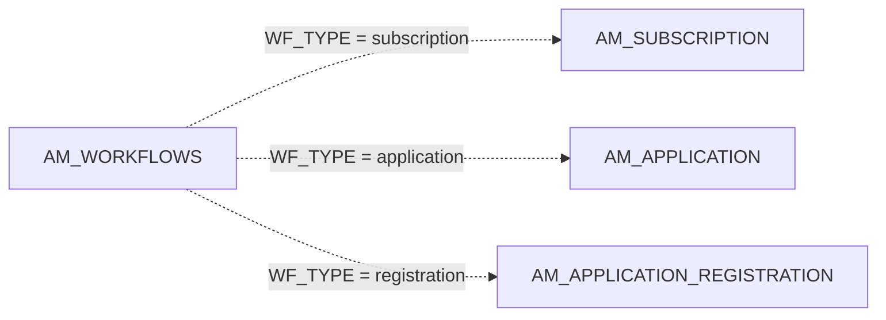
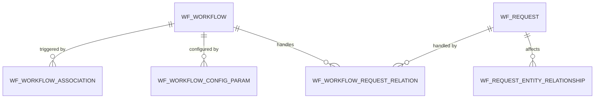

# Workflows

!!! abstract "In one sentence"
    Workflows put an approval step in front of actions such as creating an application, subscribing or generating keys. `AM_WORKFLOWS` tracks each pending or finished approval, and the `WF_*` tables hold the Identity Server workflow engine's own configuration and requests.

## The idea

By default, APIM actions complete immediately. An admin can switch on **approval workflows**, for example "subscriptions to Gold need manager approval". When a developer then subscribes:

1. APIM creates the subscription with `SUB_STATUS = ON_HOLD`.
2. It writes a row to `AM_WORKFLOWS` with `WF_STATUS = CREATED`. `WF_REFERENCE` points at the subscription.
3. An approver approves or rejects the request in the Admin Portal, or in an external BPS engine.
4. APIM updates `AM_WORKFLOWS` to `APPROVED` or `REJECTED`, and updates the subscription to `UNBLOCKED` or `REJECTED`.

The **workflow type** (`WF_TYPE`) decides what `WF_REFERENCE` points to:

| `WF_TYPE` | `WF_REFERENCE` points to |
|---|---|
| `AM_APPLICATION_CREATION` | `AM_APPLICATION.APPLICATION_ID` |
| `AM_APPLICATION_DELETION` | `AM_APPLICATION.APPLICATION_ID` |
| `AM_SUBSCRIPTION_CREATION` | `AM_SUBSCRIPTION.SUBSCRIPTION_ID` |
| `AM_SUBSCRIPTION_UPDATE` | `AM_SUBSCRIPTION.SUBSCRIPTION_ID` (tier change) |
| `AM_SUBSCRIPTION_DELETION` | `AM_SUBSCRIPTION.SUBSCRIPTION_ID` |
| `AM_APPLICATION_REGISTRATION_PRODUCTION` / `_SANDBOX` | `AM_APPLICATION_REGISTRATION.REG_ID` |
| `AM_USER_SIGNUP` | the new user's name |
| `AM_API_STATE` | the API (lifecycle change) |

*These `WF_TYPE` values match the workflow constants in the 3.2.0 code. The code also defines `AM_COMMENTS_ADD`, but no workflow executor ships for it. 3.2.0 has no approval executor for application deletion either: that step only has a "simple" (auto-approve) executor.*

The `WF_*` tables belong to the embedded Identity Server workflow engine, which handles user and role operations. They're used when APIM is connected to a WSO2 Business Process Server (BPS). Out of the box they're mostly empty.

## How the tables connect

This diagram shows how an approval row points at the thing it gates.



- `WF_TYPE` is the **type discriminator**. `WF_REFERENCE` is a *logical* link, and its meaning depends on the type.

The Identity Server engine tables are structured like this:



- All of these links are FKs that cascade.

## The tables

### AM_WORKFLOWS

**One row =** one approval request raised by APIM.

| Column | What it means |
|---|---|
| `WF_ID` | Primary key. |
| `WF_TYPE` | What kind of action is being approved (see the table above). |
| `WF_REFERENCE` | Id of the thing being approved (*logical*, depends on `WF_TYPE`). |
| `WF_STATUS` | `CREATED` (pending), `APPROVED` or `REJECTED`. |
| `WF_EXTERNAL_REFERENCE` | Unique id shared with the approval engine. Callbacks use it. |
| `WF_STATUS_DESC` | Approver's comment. |
| `WF_CREATED_TIME`, `WF_UPDATED_TIME` | When the request was raised and decided. |
| `TENANT_ID`, `TENANT_DOMAIN` | Tenant. |
| `WF_METADATA`, `WF_PROPERTIES` | Blobs with the request details shown to the approver. |

[Full column list](../reference/am.md#am_workflows)

### WF_WORKFLOW

**One row =** one workflow definition in the Identity Server engine.

| Column | What it means |
|---|---|
| `ID` | Primary key. |
| `WF_NAME`, `DESCRIPTION` | Name and description. |
| `TEMPLATE_ID`, `IMPL_ID` | Which template and implementation (e.g. BPS) it uses. |
| `TENANT_ID` | Tenant. |

[Full column list](../reference/wf.md#wf_workflow)

### WF_WORKFLOW_ASSOCIATION

**One row =** "run workflow W when event E happens and condition C holds", e.g. when a user is added to a role.

| Column | What it means |
|---|---|
| `ID` | Primary key. |
| `WORKFLOW_ID` | → `WF_WORKFLOW` (FK, cascade). |
| `ASSOC_NAME` | Association name. |
| `EVENT_ID` | Identity Server event name, e.g. `ADD_USER`. This isn't related to `AM_API_LC_EVENT`. |
| `ASSOC_CONDITION` | XPath condition. |
| `IS_ENABLED`, `TENANT_ID` | Enabled flag and tenant. |

[Full column list](../reference/wf.md#wf_workflow_association)

### WF_WORKFLOW_CONFIG_PARAM

**One row =** one configuration parameter of a workflow, e.g. the approver role.

| Column | What it means |
|---|---|
| `WORKFLOW_ID` | → `WF_WORKFLOW` (FK, cascade). |
| `PARAM_NAME`, `PARAM_VALUE`, `PARAM_QNAME`, `PARAM_HOLDER` | Parameter identity and value. |
| `TENANT_ID` | Tenant. |

[Full column list](../reference/wf.md#wf_workflow_config_param)

### WF_REQUEST

**One row =** one request that went through the Identity Server engine.

| Column | What it means |
|---|---|
| `UUID` | Primary key. |
| `OPERATION_TYPE` | The operation, e.g. add user. |
| `CREATED_BY`, `CREATED_AT`, `UPDATED_AT` | Who raised it, and when. |
| `STATUS` | Request status. |
| `REQUEST` | Serialized request, stored as a blob. |
| `TENANT_ID` | Tenant. |

[Full column list](../reference/wf.md#wf_request)

### WF_WORKFLOW_REQUEST_RELATION

**One row =** "request R is being handled by workflow W".

| Column | What it means |
|---|---|
| `RELATIONSHIP_ID` | Primary key. |
| `WORKFLOW_ID` | → `WF_WORKFLOW` (FK, cascade). |
| `REQUEST_ID` | → `WF_REQUEST` (FK, cascade). |
| `STATUS`, `UPDATED_AT`, `TENANT_ID` | Status, last update and tenant. |

[Full column list](../reference/wf.md#wf_workflow_request_relation)

### WF_REQUEST_ENTITY_RELATIONSHIP

**One row =** an entity (user, role and so on) affected by a pending request. The engine uses it to stop conflicting changes.

| Column | What it means |
|---|---|
| `REQUEST_ID` | → `WF_REQUEST` (FK, cascade). |
| `ENTITY_NAME`, `ENTITY_TYPE` | The entity, e.g. `alice` / `USER`. |
| `TENANT_ID` | Tenant. |

[Full column list](../reference/wf.md#wf_request_entity_relationship)

### WF_BPS_PROFILE

**One row =** connection details for an external WSO2 Business Process Server.

| Column | What it means |
|---|---|
| `PROFILE_NAME` + `TENANT_ID` | Primary key. |
| `HOST_URL_MANAGER`, `HOST_URL_WORKER` | BPS URLs. |
| `USERNAME`, `PASSWORD` | Credentials for calling BPS. |
| `CALLBACK_HOST`, `CALLBACK_USERNAME`, `CALLBACK_PASSWORD` | How BPS calls back. |

[Full column list](../reference/wf.md#wf_bps_profile)

## Example

| Table | Row |
|---|---|
| `AM_SUBSCRIPTION` | `SUBSCRIPTION_ID` = 1001, `SUB_STATUS` = `ON_HOLD` |
| `AM_WORKFLOWS` | `WF_TYPE` = `AM_SUBSCRIPTION_CREATION`, `WF_REFERENCE` = `1001`, `WF_STATUS` = `CREATED`, `WF_EXTERNAL_REFERENCE` = `e3a1…` |

## Try it

```sql
-- Pending subscription approvals, with the app and API involved
SELECT w.WF_EXTERNAL_REFERENCE, w.WF_CREATED_TIME, app.NAME AS APPLICATION, a.API_NAME, s.TIER_ID
FROM AM_WORKFLOWS w
JOIN AM_SUBSCRIPTION s  ON CAST(s.SUBSCRIPTION_ID AS CHAR(20)) = w.WF_REFERENCE
JOIN AM_APPLICATION app ON app.APPLICATION_ID = s.APPLICATION_ID
JOIN AM_API a           ON a.API_ID = s.API_ID
WHERE w.WF_TYPE = 'AM_SUBSCRIPTION_CREATION' AND w.WF_STATUS = 'CREATED';
```

!!! note "Different in 4.x"
    4.x keeps `AM_WORKFLOWS` and adds new workflow types, e.g. for API revision deployment and API product state changes. See [4.x Workflows](../../apim-4/domains/workflows.md).

## Related flows

- [Approval workflows](../flows/13-approval-workflows.md)
- [Subscribe to an API](../flows/08-subscribe.md)
