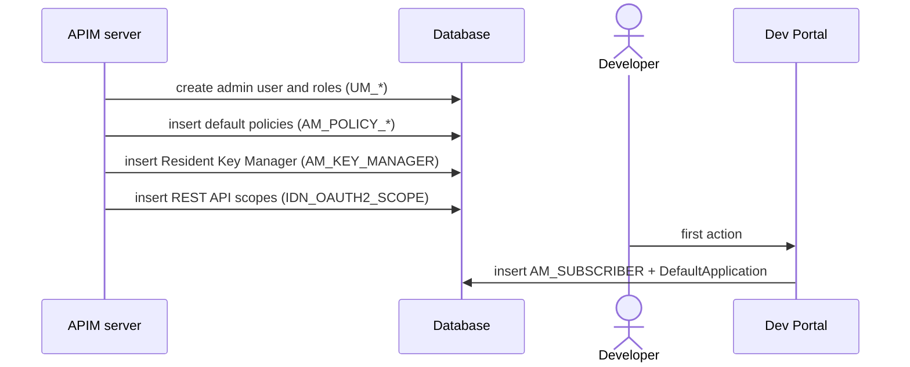

# Setup & first user

!!! abstract "What happens"
    When APIM starts for the first time, it creates the admin user and the built-in data it needs: default throttling policies, the Resident Key Manager, and OAuth scopes for its own REST APIs. Later, the first time a user does something in the Developer Portal, APIM creates a *subscriber* row and a *DefaultApplication* for them.

**Who:** Server startup and first Dev Portal action · **Tables written:** `UM_USER`, `UM_ROLE`, `UM_USER_ROLE`, `UM_HYBRID_ROLE`, `UM_HYBRID_USER_ROLE`, `AM_POLICY_SUBSCRIPTION`, `AM_POLICY_APPLICATION`, `AM_API_THROTTLE_POLICY`, `AM_KEY_MANAGER`, `IDN_OAUTH2_SCOPE`, `IDN_OAUTH2_SCOPE_BINDING`, registry `REG_*`, then later `AM_SUBSCRIBER` and `AM_APPLICATION` · **Tables read:** `UM_*`

!!! success "Verified on a running server"
    Checked on WSO2 APIM 3.2.0 (H2, default config) by comparing the database before and after the first startup, and after the first Dev Portal action.

    - Startup seeded 4 API-level, 4 application and 5 subscription policies, one `AM_KEY_MANAGER` row, the `admin` user, 7 hybrid roles, and the claim, identity-provider and registry data.
    - **Surprise:** startup also wrote **175 `IDN_OAUTH2_SCOPE` rows and 170 `IDN_OAUTH2_SCOPE_BINDING` rows**. These are the `apim:*` scopes of APIM's own REST APIs, bound to roles.
    - **No `UM_TENANT` row** for the super tenant, as expected.
    - **`AM_SYSTEM_APPS` stayed empty.** Using only the REST APIs never created it. It's filled when someone signs in to the web portals.
    - The first Dev Portal call created `AM_SUBSCRIBER` **and** a `DefaultApplication` row together.

## The flow at a glance

This diagram shows the two moments that create starting data: server startup, and a user's first visit to the Developer Portal.



- The database scripts create empty tables. Apart from a few lookup rows, the server inserts the default data on first startup, **not** the SQL scripts.
- `AM_SUBSCRIBER` is created *lazily*: a user who never uses the Developer Portal never gets a row.

## Step by step

1. **Super tenant and admin user** → the shared DB's user-management tables, [`UM_TENANT`](../reference/um.md#um_tenant) and [`UM_USER`](../reference/um.md#um_user).
    - The default "super tenant" `carbon.super` has tenant ID **`-1234`**. It is *not* stored as a row in `UM_TENANT`. Only tenants you create later (IDs 1, 2, 3 …) appear there.
    - The `admin` user goes to `UM_USER` (with `UM_TENANT_ID = -1234`), provided the user store is the default JDBC store. If you use LDAP or Active Directory, users live there instead.
    - The `admin` role is a row in [`UM_ROLE`](../reference/um.md#um_role). The *internal* roles (`everyone`, `publisher`, `creator`, `devops`, `analytics`, `subscriber`, `system`) are rows in [`UM_HYBRID_ROLE`](../reference/um.md#um_hybrid_role), shown in the UI as `Internal/subscriber` and so on. Users are linked to them via [`UM_USER_ROLE`](../reference/um.md#um_user_role) and [`UM_HYBRID_USER_ROLE`](../reference/um.md#um_hybrid_user_role).

2. **Default throttling policies** → [`AM_POLICY_SUBSCRIPTION`](../reference/am.md#am_policy_subscription), [`AM_POLICY_APPLICATION`](../reference/am.md#am_policy_application) and [`AM_API_THROTTLE_POLICY`](../reference/am.md#am_api_throttle_policy), one set per tenant.

    | Table | Example `NAME` values |
    |---|---|
    | `AM_POLICY_SUBSCRIPTION` | `Gold` (5000/min), `Silver` (2000/min), `Bronze` (1000/min), `Unauthenticated` (500/min), `Unlimited` |
    | `AM_POLICY_APPLICATION` | `50PerMin`, `20PerMin`, `10PerMin`, `Unlimited` |
    | `AM_API_THROTTLE_POLICY` | `50KPerMin`, `20KPerMin`, `10KPerMin`, `Unlimited` |

    Other tables refer to these policies **by name plus `TENANT_ID`**, not by `POLICY_ID`.

3. **Resident Key Manager** → [`AM_KEY_MANAGER`](../reference/am.md#am_key_manager). One row per tenant, with `NAME = 'Resident Key Manager'`, `TYPE = 'default'` and `TENANT_DOMAIN = 'carbon.super'`. This is APIM's built-in OAuth server.

4. **REST API scopes** → [`IDN_OAUTH2_SCOPE`](../reference/idn.md#idn_oauth2_scope) and [`IDN_OAUTH2_SCOPE_BINDING`](../reference/idn.md#idn_oauth2_scope_binding). On a fresh server, startup registered 175 scopes: the OIDC scopes (`openid`, `email`, `profile` …) plus every `apim:*` scope used by the Publisher, Developer Portal and Admin REST APIs. It also wrote 170 bindings from scopes to roles. That's how 3.2 decides which roles may call which REST API.

5. **Internal OAuth apps** → [`AM_SYSTEM_APPS`](../reference/am.md#am_system_apps). The Publisher, Developer Portal and Admin Portal web apps are OAuth clients themselves. Their client IDs and secrets are stored here per tenant, and the matching OAuth clients in [`IDN_OAUTH_CONSUMER_APPS`](../reference/idn.md#idn_oauth_consumer_apps). These rows are created when the web portals are first used, **not** at startup. On a server driven only through REST calls, the table stayed empty.

    | `NAME` | `CONSUMER_KEY` | `TENANT_DOMAIN` |
    |---|---|---|
    | `apim_devportal` | `aB3x…` | `carbon.super` |
    | `apim_publisher` | `Qz7k…` | `carbon.super` |
    | `apim_admin` | `Lp0w…` | `carbon.super` |

    !!! warning "Logical link (no foreign key)"
        `AM_SYSTEM_APPS.CONSUMER_KEY` matches `IDN_OAUTH_CONSUMER_APPS.CONSUMER_KEY` by value only.

6. **First Developer Portal action** → [`AM_SUBSCRIBER`](../reference/am.md#am_subscriber). The first time a user creates an application (or opens something that needs one), APIM adds a subscriber row. In the same step it creates that user's **DefaultApplication** in [`AM_APPLICATION`](../reference/am.md#am_application) (tier `Unlimited`, status `APPROVED`, token type `JWT`). See [Create an application](07-create-application.md).

    | `SUBSCRIBER_ID` | `USER_ID` | `TENANT_ID` | `EMAIL_ADDRESS` |
    |---|---|---|---|
    | 1 | `admin` | -1234 | *(empty string)* |

    `(TENANT_ID, USER_ID)` is unique, so each user in a tenant has exactly one subscriber row.

    !!! warning "Logical link (no foreign key)"
        `AM_SUBSCRIBER.USER_ID` is a user name in the user store (`UM_USER.UM_USER_NAME` or LDAP). `TENANT_ID` matches `UM_TENANT.UM_ID`, or `-1234` for the super tenant. Neither is enforced.

## What gets cleaned up

Nothing here is deleted in normal use. Deleting a user does **not** remove their `AM_SUBSCRIBER` row. Rows in `AM_APPLICATION`, `AM_APPLICATION_REGISTRATION` and `AM_API_RATINGS` point at the subscriber with `ON DELETE RESTRICT`, which blocks deleting a subscriber that still owns anything.

## Try it

This query lists the seeded subscription tiers and the Developer Portal users that exist so far.

```sql
SELECT NAME, QUOTA_TYPE, QUOTA, UNIT_TIME, TIME_UNIT
FROM   AM_POLICY_SUBSCRIPTION
WHERE  TENANT_ID = -1234;

SELECT SUBSCRIBER_ID, USER_ID, TENANT_ID, DATE_SUBSCRIBED
FROM   AM_SUBSCRIBER;
```

Related domains: [Tenants & users](../domains/tenancy-users.md) · [Throttling policies](../domains/throttling.md) · [Keys & tokens](../domains/keys-tokens.md)

!!! note "Different in 4.x"
    In 4.x, most rows also carry an `ORGANIZATION` column. The key manager has an `ORGANIZATION` instead of a `TENANT_DOMAIN`, and 4.x adds system-level settings in `AM_SYSTEM_CONFIGS`. See [Setup & first user (4.x)](../../apim-4/flows/01-bootstrap.md).
