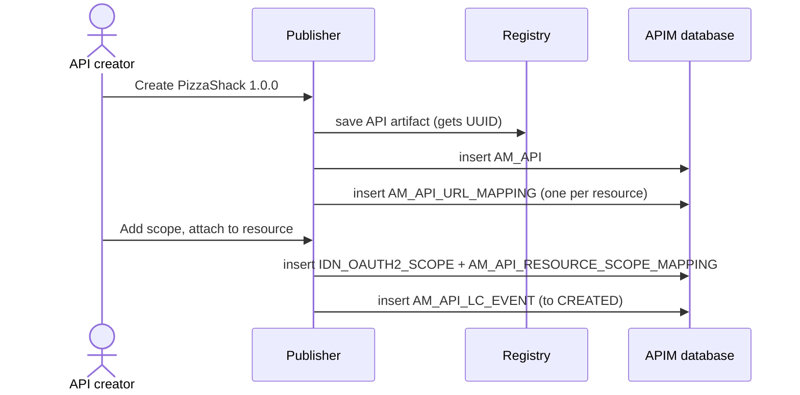

# Create an API

!!! abstract "What happens"
    An API creator designs a new API in the Publisher: name, version, context, resources and scopes. APIM stores the core facts in `AM_API` and one row per resource in `AM_API_URL_MAPPING`, and writes the full API description to the registry.

**Who:** Publisher (API creator) · **Tables written:** `AM_API`, `AM_API_URL_MAPPING`, `IDN_OAUTH2_SCOPE`, `IDN_OAUTH2_SCOPE_BINDING`, `AM_API_RESOURCE_SCOPE_MAPPING`, `AM_API_LC_EVENT`, registry `REG_*`, `UM_PERMISSION`, `UM_ROLE_PERMISSION` · **Tables read:** `AM_API_THROTTLE_POLICY`, `AM_SHARED_SCOPE`

## The flow at a glance

This diagram shows what the Publisher saves when you click **Create** and then add resources and scopes.



- The API is split across two stores: the **registry** (shared DB) holds the full description, and the **APIM database** holds what the runtime needs.
- The exact order of writes inside one save is an internal detail and may differ slightly. The set of tables written is what matters.

## Step by step

1. **Registry artifact** → the shared DB's registry tables ([`REG_RESOURCE`](../reference/reg.md#reg_resource), [`REG_CONTENT`](../reference/reg.md#reg_content), [`REG_PATH`](../reference/reg.md#reg_path) and properties).
    - The API is saved as a governance artifact at a path like `/_system/governance/apimgt/applicationdata/provider/admin/PizzaShackAPI/1.0.0/api`.
    - The artifact holds the description, tags, visibility, endpoint configuration, business owner, the Swagger/OpenAPI definition (as a separate resource) and the lifecycle state.
    - The registry resource's `REG_UUID` becomes **the API's UUID**. It's what the REST APIs and the gateway tables use.

    !!! warning "Logical link (no foreign key)"
        In 3.x, [`AM_API`](../reference/am.md#am_api) has **no UUID column**. To go from an `AM_API` row to its registry artifact, match on provider, name and version (they're part of the registry path).

2. **Core API row** → [`AM_API`](../reference/am.md#am_api).

    | `API_ID` | `API_PROVIDER` | `API_NAME` | `API_VERSION` | `CONTEXT` | `CONTEXT_TEMPLATE` | `API_TYPE` | `API_TIER` |
    |---|---|---|---|---|---|---|---|
    | 1 | `admin` | `PizzaShackAPI` | `1.0.0` | `/pizzashack/1.0.0` | `/pizzashack` | `HTTP` | `Unlimited` |

    The 3.2 `AM_API` table has only 12 columns: there is no UUID and no status column. Its last four columns are `CREATED_BY`, `CREATED_TIME`, `UPDATED_BY` and `UPDATED_TIME`, and `UPDATED_*` stay `NULL` until the first edit.

    - `(API_PROVIDER, API_NAME, API_VERSION)` is unique.
    - `API_TYPE` is `HTTP`, `WS`, `SOAP`, `SOAPTOREST`, `GRAPHQL`, `SSE`, `WEBSUB`, or `APIProduct` for products.
    - `API_TIER` holds the optional API-level throttling policy name, which links to `AM_API_THROTTLE_POLICY.NAME` *(logical link, no FK)*.

3. **Resources (operations)** → [`AM_API_URL_MAPPING`](../reference/am.md#am_api_url_mapping). One row per HTTP verb + path.

    | `URL_MAPPING_ID` | `API_ID` | `HTTP_METHOD` | `URL_PATTERN` | `AUTH_SCHEME` | `THROTTLING_TIER` |
    |---|---|---|---|---|---|
    | 1 | 1 | `GET` | `/menu` | `Any` | `Unlimited` |
    | 2 | 1 | `POST` | `/order` | `Any` | `Unlimited` |

    - `AUTH_SCHEME` is `Any` (security on) or `None` (open resource). Rows created together with the API store `Any`. When the API is updated, the recreated rows store the value sent in the request, such as `Application & Application User`.
    - `THROTTLING_TIER` is a resource-level policy name, linking to `AM_API_THROTTLE_POLICY.NAME` *(logical)*.
    - `MEDIATION_SCRIPT` holds per-resource mediation (for example, generated mock-API scripts).

    !!! warning "Logical link (no foreign key)"
        `AM_API_URL_MAPPING.API_ID` points to `AM_API.API_ID`, but the database does not enforce it. Deleting an API relies on APIM's code to remove these rows.

    !!! warning "URL mapping IDs are not stable"
        Every time the API is **updated**, APIM deletes all of its `AM_API_URL_MAPPING` rows and inserts new ones with **new IDs**. It then re-points `AM_API_RESOURCE_SCOPE_MAPPING` and `AM_API_PRODUCT_MAPPING` to the new rows. The same happens to the API's `IDN_OAUTH2_SCOPE` row, which gets a new `SCOPE_ID`. For example, IDs 1–2 become 5–6. Never store a `URL_MAPPING_ID` outside APIM.

4. **Scopes** → [`IDN_OAUTH2_SCOPE`](../reference/idn.md#idn_oauth2_scope) + [`IDN_OAUTH2_SCOPE_BINDING`](../reference/idn.md#idn_oauth2_scope_binding) (role bindings).

    | `SCOPE_ID` | `NAME` | `DISPLAY_NAME` | `DESCRIPTION` | `TENANT_ID` | `SCOPE_TYPE` |
    |---|---|---|---|---|---|
    | 176 | `order:write` | `order:write` | `Place orders` | -1234 | `OAUTH2` |

    - The binding row is `(176, 'admin', 'DEFAULT')`: scope 176 is granted to role `admin`.
    - The ID is 176 because startup already stored 175 scopes (see [Setup & first user](01-bootstrap.md)).
    - A *shared* scope (reusable across APIs) also has a row in [`AM_SHARED_SCOPE`](../reference/am.md#am_shared_scope) (`NAME`, `UUID`, `TENANT_ID`).
    - [`AM_SCOPE`](../reference/am.md#am_scope) and [`AM_SCOPE_BINDING`](../reference/am.md#am_scope_binding) exist in the 3.2 schema but were **not written**. Look in `IDN_OAUTH2_SCOPE`.

5. **Resource ↔ scope link** → [`AM_API_RESOURCE_SCOPE_MAPPING`](../reference/am.md#am_api_resource_scope_mapping).

    | `SCOPE_NAME` | `URL_MAPPING_ID` | `TENANT_ID` |
    |---|---|---|
    | `order:write` | 2 | -1234 |

    - `URL_MAPPING_ID` is a real FK to `AM_API_URL_MAPPING` with `ON DELETE CASCADE`.
    - `SCOPE_NAME` links to the scope **by name** *(logical)*.

6. **First lifecycle event** → [`AM_API_LC_EVENT`](../reference/am.md#am_api_lc_event). A row with `PREVIOUS_STATE = NULL` and `NEW_STATE = 'CREATED'` records the birth of the API. See [Change lifecycle state](05-lifecycle.md).

7. **Optional extras**, written if you use them:
    - GraphQL APIs: [`AM_GRAPHQL_COMPLEXITY`](../reference/am.md#am_graphql_complexity), with per-field complexity values (FK to `AM_API`, cascade).
    - Mutual TLS: [`AM_API_CLIENT_CERTIFICATE`](../reference/am.md#am_api_client_certificate), with client certificates per API (FK to `AM_API`, cascade).
    - Backend certificates: [`AM_CERTIFICATE_METADATA`](../reference/am.md#am_certificate_metadata).
    - Categories: [`AM_API_CATEGORIES`](../reference/am.md#am_api_categories) defines the category names. Which API is in which category is stored in the registry artifact.

## What gets cleaned up

Deleting the API (see [Revoke & delete](12-revocation-and-delete.md)):

- **cascades** to `AM_API_PRODUCT_MAPPING`, `AM_GRAPHQL_COMPLEXITY` and `AM_API_CLIENT_CERTIFICATE`. Via the URL mappings, it also cascades to `AM_API_RESOURCE_SCOPE_MAPPING`.
- is **blocked** (`ON DELETE RESTRICT`) while `AM_SUBSCRIPTION`, `AM_API_LC_EVENT`, `AM_API_COMMENTS`, `AM_API_RATINGS`, `AM_EXTERNAL_STORES` or `AM_SECURITY_AUDIT_UUID_MAPPING` rows still point at it. APIM deletes those first.

## Try it

This query lists every resource of an API with the scopes that protect it.

```sql
SELECT a.API_NAME, a.API_VERSION, u.HTTP_METHOD, u.URL_PATTERN,
       u.AUTH_SCHEME, u.THROTTLING_TIER, r.SCOPE_NAME
FROM   AM_API a
JOIN   AM_API_URL_MAPPING u ON u.API_ID = a.API_ID
LEFT JOIN AM_API_RESOURCE_SCOPE_MAPPING r ON r.URL_MAPPING_ID = u.URL_MAPPING_ID
WHERE  a.API_NAME = 'PizzaShackAPI' AND a.API_VERSION = '1.0.0';
```

Related domains: [API definition](../domains/api-definition.md) · [Scopes](../domains/scopes.md) · [Registry](../domains/registry.md)

!!! note "Different in 4.x"
    In 4.x, `AM_API` has its own `API_UUID`, `STATUS` and `ORGANIZATION` columns. Resources, endpoints and operation policies are stored per revision, and several new tables hold data that 3.x kept only in the registry. See [Create an API (4.x)](../../apim-4/flows/02-create-api.md).
