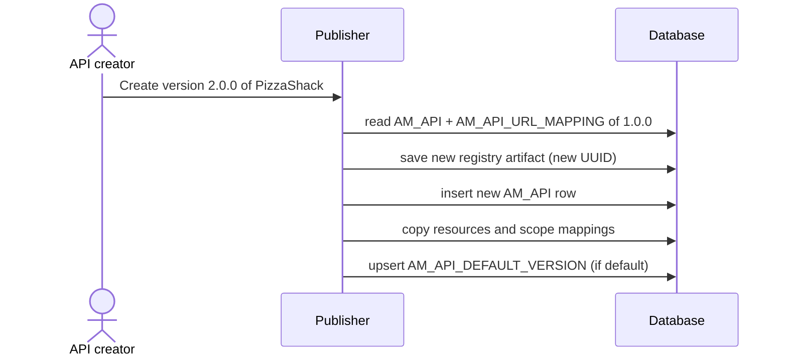

# Create a new version

!!! abstract "What happens"
    An API creator copies an existing API to a new version, such as PizzaShack `1.0.0` → `2.0.0`. APIM creates a brand-new API with its own rows. If the new version is marked as the *default version*, APIM also records that in `AM_API_DEFAULT_VERSION`.

**Who:** Publisher · **Tables written:** `AM_API`, `AM_API_URL_MAPPING`, `AM_API_RESOURCE_SCOPE_MAPPING`, `AM_API_LC_EVENT`, `AM_API_DEFAULT_VERSION`, registry `REG_*`, `UM_PERMISSION`, `UM_ROLE_PERMISSION` · **Tables read:** the old version's rows

## The flow at a glance

This diagram shows that a new version is a full copy, not a link to the old version.



- The database has no "parent version" column. Versions of the same API are only related by sharing `API_PROVIDER` + `API_NAME`.

## Step by step

1. **New API row** → [`AM_API`](../reference/am.md#am_api). A new `API_ID`, with the same provider and name and a new version and context.

    | `API_ID` | `API_PROVIDER` | `API_NAME` | `API_VERSION` | `CONTEXT` |
    |---|---|---|---|---|
    | 1 | `admin` | `PizzaShackAPI` | `1.0.0` | `/pizzashack/1.0.0` |
    | 2 | `admin` | `PizzaShackAPI` | `2.0.0` | `/pizzashack/2.0.0` |

2. **Copied resources and scopes** → [`AM_API_URL_MAPPING`](../reference/am.md#am_api_url_mapping) and [`AM_API_RESOURCE_SCOPE_MAPPING`](../reference/am.md#am_api_resource_scope_mapping). New rows with new `URL_MAPPING_ID`s (3 and 4 in the test run), pointing at `API_ID = 2`. No new `IDN_OAUTH2_SCOPE` row is written: the scopes themselves are reused, because they're referenced by name.

3. **New registry artifact.** A copy of the old artifact at the new version's path, with a **new** `REG_UUID`, so the new version has its own API UUID. Documents and the definition file are copied too. See [Registry](../domains/registry.md).

4. **Lifecycle** → [`AM_API_LC_EVENT`](../reference/am.md#am_api_lc_event). The new version starts at `CREATED` (a new event row for `API_ID = 2`, with `PREVIOUS_STATE = NULL`).

5. **Default version (optional)** → [`AM_API_DEFAULT_VERSION`](../reference/am.md#am_api_default_version). This table has one row per API *name*, and it lets clients call `/pizzashack` with no version in the path.

    | `DEFAULT_VERSION_ID` | `API_NAME` | `API_PROVIDER` | `DEFAULT_API_VERSION` | `PUBLISHED_DEFAULT_API_VERSION` |
    |---|---|---|---|---|
    | 1 | `PizzaShackAPI` | `admin` | `2.0.0` | `NULL` |

    - `DEFAULT_API_VERSION` is the version marked as default in the Publisher.
    - `PUBLISHED_DEFAULT_API_VERSION` is the default version that is actually *published*. It stays `NULL` until a version is published, and moves to `2.0.0` when 2.0.0 is published.

    !!! warning "Logical link (no foreign key)"
        `AM_API_DEFAULT_VERSION` links to `AM_API` by `API_NAME` + `API_PROVIDER` (and the version strings), not by `API_ID`.

6. **Subscriptions are not copied automatically.** Existing subscriptions stay on 1.0.0. The Publisher can let subscribers move to the new version when publishing ("Require re-subscription" unchecked). In that case APIM **inserts new `AM_SUBSCRIPTION` rows** for 2.0.0, copying each application and tier. See [Change lifecycle state](05-lifecycle.md).

## What gets cleaned up

Deleting one version only removes that version's rows. The other versions and their subscriptions are untouched. If the deleted version was the default, the `AM_API_DEFAULT_VERSION` row is updated or removed by APIM's code.

## Try it

This query lists all versions of an API, showing which one is the default.

```sql
SELECT a.API_ID, a.API_VERSION, a.CONTEXT,
       d.DEFAULT_API_VERSION, d.PUBLISHED_DEFAULT_API_VERSION
FROM   AM_API a
LEFT JOIN AM_API_DEFAULT_VERSION d
       ON d.API_NAME = a.API_NAME AND d.API_PROVIDER = a.API_PROVIDER
WHERE  a.API_NAME = 'PizzaShackAPI'
ORDER  BY a.API_VERSION;
```

Related domains: [API definition](../domains/api-definition.md) · [Lifecycle & labels](../domains/lifecycle-labels.md)

!!! note "Different in 4.x"
    In 4.x, `AM_API_DEFAULT_VERSION` gains an `ORGANIZATION` column. `AM_API` gets a `VERSION_COMPARABLE` column to help sort versions, and the new version starts with no revisions. See [Create a new version (4.x)](../../apim-4/flows/03-new-version.md).
