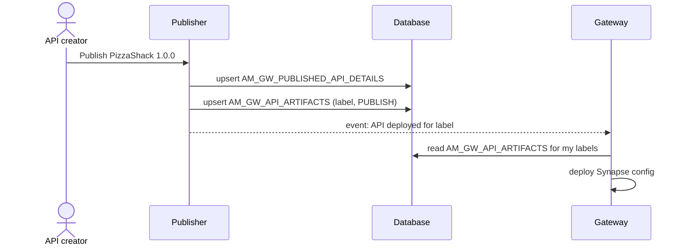

# Publish to the gateway

!!! abstract "What happens"
    When an API is published, the Publisher builds a gateway configuration (a Synapse XML "artifact") and gets it onto the gateways. By default in 3.2, it pushes the artifact straight to each gateway environment. If the **gateway artifact synchronizer** is turned on, it saves the artifact in the database instead, keyed by *gateway label*, and the gateways pull it from there.

**Who:** Publisher → Gateway · **Tables written:** `AM_GW_PUBLISHED_API_DETAILS`, `AM_GW_API_ARTIFACTS` (only with the synchronizer on), `AM_API_LC_EVENT` · **Tables read:** `AM_API`, `AM_API_URL_MAPPING`, `AM_LABELS`

## The flow at a glance

This diagram shows the database-backed path, used when the synchronizer is enabled.



- With the synchronizer **off** (the 3.2 default), the two `AM_GW_*` tables stay empty. The Publisher calls the gateways' admin services directly for every environment in `deployment.toml` (`[[apim.gateway.environment]]`).
- Turning it on needs `[apim.sync_runtime_artifacts.publisher]` on the Publisher and `[apim.sync_runtime_artifacts.gateway]` (with `gateway_labels`) on each gateway.

## Step by step

1. **Choose where to deploy.** In 3.x, a published API is deployed to:
    - the **gateway environments** defined in `deployment.toml`. These are *not* stored in the database in 3.x.
    - any **gateway labels** the API is tagged with. The label definitions live in [`AM_LABELS`](../reference/am.md#am_labels) (`LABEL_ID`, `NAME`, `TENANT_DOMAIN`), with their access URLs in [`AM_LABEL_URLS`](../reference/am.md#am_label_urls). Which labels an API has is stored in the API's **registry artifact**, not in a mapping table. Labels were originally designed for the Microgateway.

2. **Record the published API** → [`AM_GW_PUBLISHED_API_DETAILS`](../reference/am.md#am_gw_published_api_details). One row per API.

    | `API_ID` | `TENANT_DOMAIN` | `API_PROVIDER` | `API_NAME` | `API_VERSION` |
    |---|---|---|---|---|
    | `8b2c…-uuid` | `carbon.super` | `admin` | `PizzaShackAPI` | `1.0.0` |

    !!! warning "Logical link (no foreign key)"
        Here `API_ID` is the **API UUID string** (the registry artifact ID), *not* the integer `AM_API.API_ID`. To join it to `AM_API`, use provider, name and version.

3. **Store the artifact per label** → [`AM_GW_API_ARTIFACTS`](../reference/am.md#am_gw_api_artifacts). One row per API per gateway label.

    | `API_ID` | `GATEWAY_LABEL` | `GATEWAY_INSTRUCTION` | `ARTIFACT` | `TIME_STAMP` |
    |---|---|---|---|---|
    | `8b2c…-uuid` | `Production and Sandbox` | `PUBLISH` | *(binary blob)* | 2020-09-01 10:15 |

    - The primary key is `(GATEWAY_LABEL, API_ID)`, so re-publishing **overwrites** the row. There's no history.
    - `GATEWAY_INSTRUCTION` is `PUBLISH` (deploy it) or `REMOVE` (undeploy it). Undeploying keeps the row but flips the instruction.
    - `API_ID` is a real FK to `AM_GW_PUBLISHED_API_DETAILS.API_ID`.
    - `ARTIFACT` is a serialized bundle: the API's Synapse XML plus any local entries, sequences, endpoints and certificates it needs.

4. **Gateway pulls the artifact.** A gateway started with `gateway_labels = ["Production and Sandbox"]` receives an event through the event hub. It then reads the rows for its labels where the instruction is `PUBLISH`, and deploys them. A gateway that restarts reloads everything for its labels from this table.

5. **Lifecycle** → [`AM_API_LC_EVENT`](../reference/am.md#am_api_lc_event). Publishing is a lifecycle change (`CREATED` → `PUBLISHED`), so an event row is written too. See [Change lifecycle state](05-lifecycle.md).

## What gets cleaned up

- **Unpublishing, blocking or retiring** the API sets `GATEWAY_INSTRUCTION = 'REMOVE'`, or APIM's code removes the rows.
- **Deleting** the API removes its `AM_GW_API_ARTIFACTS` rows, then the `AM_GW_PUBLISHED_API_DETAILS` row. The FK between them is `ON DELETE NO ACTION`, so the artifacts must go first.

## Try it

This query shows what each gateway label is told to do for each API.

```sql
SELECT d.API_PROVIDER, d.API_NAME, d.API_VERSION, d.TENANT_DOMAIN,
       a.GATEWAY_LABEL, a.GATEWAY_INSTRUCTION, a.TIME_STAMP
FROM   AM_GW_PUBLISHED_API_DETAILS d
JOIN   AM_GW_API_ARTIFACTS a ON a.API_ID = d.API_ID
ORDER  BY d.API_NAME, a.GATEWAY_LABEL;
```

Related domains: [Gateway publishing](../domains/gateway-publishing.md) · [Lifecycle & labels](../domains/lifecycle-labels.md)

!!! note "Different in 4.x"
    4.x replaces labels with **revisions and gateway environments**. You snapshot the API as a revision (`AM_REVISION`) and deploy it to an environment and VHost (`AM_DEPLOYMENT_REVISION_MAPPING`). Environments live in the database (`AM_GATEWAY_ENVIRONMENT`), and `AM_GW_API_ARTIFACTS` is keyed by `REVISION_ID` instead of `GATEWAY_LABEL`. The database-backed sync is also the default. See [Deploy a revision (4.x)](../../apim-4/flows/04-deploy-revision.md).
