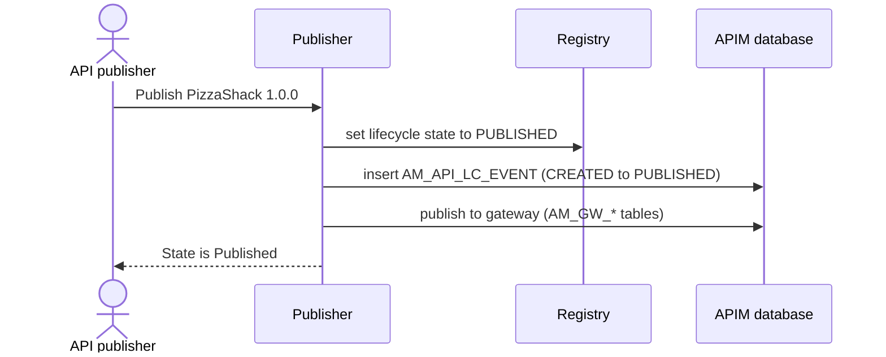

# Change lifecycle state

!!! abstract "What happens"
    An API moves through lifecycle states: *Created → Published → Deprecated → Retired*, with *Prototyped* and *Blocked* as side states. The **current** state is kept in the registry. Every **change** is logged as a row in `AM_API_LC_EVENT`. Publishing also triggers the gateway deployment and can go through an approval workflow.

**Who:** Publisher (API publisher role) · **Tables written:** `AM_API_LC_EVENT`, registry lifecycle properties, `AM_WORKFLOWS` (if approval is on), `AM_GW_*` (on publish), `AM_API_LC_PUBLISH_EVENTS`, `AM_SUBSCRIPTION` (optional copy to a new version) · **Tables read:** `AM_API`

## The flow at a glance

This diagram shows a publish action with the approval workflow turned off.



- **Where is the current state?** In 3.x it's a lifecycle property on the registry artifact, *not* a column in `AM_API`. `AM_API_LC_EVENT` is the history, and its newest row matches the current state.

## Step by step

1. **Optional approval.** If the *API State Change* workflow is enabled, APIM first writes an [`AM_WORKFLOWS`](../reference/am.md#am_workflows) row (`WF_TYPE = 'AM_API_STATE'`, `WF_STATUS = 'CREATED'`, `WF_REFERENCE` = the API's ID) and waits. The steps below run only after approval. See [Approval workflows](13-approval-workflows.md).

2. **Registry state.** The lifecycle state on the registry artifact changes, for example to `PUBLISHED`. The lifecycle definition (`APILifeCycle`) is itself a registry resource. It lists the allowed transitions and checklist items. See [Registry](../domains/registry.md).

3. **History row** → [`AM_API_LC_EVENT`](../reference/am.md#am_api_lc_event).

    | `EVENT_ID` | `API_ID` | `PREVIOUS_STATE` | `NEW_STATE` | `USER_ID` | `TENANT_ID` | `EVENT_DATE` |
    |---|---|---|---|---|---|---|
    | 1 | 1 | `NULL` | `CREATED` | `admin` | -1234 | 2020-09-01 10:00 |
    | 2 | 1 | `CREATED` | `PUBLISHED` | `admin` | -1234 | 2020-09-01 10:15 |
    | 3 | 1 | `PUBLISHED` | `DEPRECATED` | `admin` | -1234 | 2021-03-01 09:00 |

    `API_ID` is a real FK to `AM_API` with `ON DELETE RESTRICT`. The history must be deleted before the API.

4. **Gateway side effects.**
    - `→ PUBLISHED` or `→ PROTOTYPED`: deploy to the gateways. See [Publish to the gateway](04-publish-to-gateway.md).
    - `→ BLOCKED`: the API stays deployed, but calls are rejected. Subscriptions are left alone.
    - `→ RETIRED`: undeploy from the gateways and remove it from the Developer Portal. Subscriptions are kept in the database but no longer work.

5. **Publish-event tracking** → [`AM_API_LC_PUBLISH_EVENTS`](../reference/am.md#am_api_lc_publish_events) (`TENANT_DOMAIN`, `API_ID`, `EVENT_TIME`). It records publish events so other components can pick them up. Here `API_ID` is a string (the API identifier), not the integer ID.

6. **Moving subscribers to a new version (optional).** When publishing a *new version* with "Require re-subscription" unchecked, APIM copies each active subscription of the older version into new [`AM_SUBSCRIPTION`](../reference/am.md#am_subscription) rows for the new `API_ID`. It keeps the same application and tier. "Deprecate old versions" moves the older versions to `DEPRECATED`, which adds more `AM_API_LC_EVENT` rows.

## What gets cleaned up

State changes don't delete anything. Even *Retired* keeps the `AM_API` row, the history and the subscriptions. Only deleting the API removes them. See [Revoke & delete](12-revocation-and-delete.md).

## Try it

This query shows the full lifecycle history of an API, newest first. The top row is the current state.

```sql
SELECT a.API_NAME, a.API_VERSION, e.PREVIOUS_STATE, e.NEW_STATE,
       e.USER_ID, e.EVENT_DATE
FROM   AM_API_LC_EVENT e
JOIN   AM_API a ON a.API_ID = e.API_ID
WHERE  a.API_NAME = 'PizzaShackAPI'
ORDER  BY e.EVENT_DATE DESC;
```

Related domains: [Lifecycle & labels](../domains/lifecycle-labels.md) · [Workflows](../domains/workflows.md) · [Gateway publishing](../domains/gateway-publishing.md)

!!! note "Different in 4.x"
    In 4.x, `AM_API.STATUS` holds the current state in the APIM database too, so you don't need the registry to read it. Publishing doesn't deploy anything by itself: only a deployed *revision* serves traffic. See [Change lifecycle state (4.x)](../../apim-4/flows/05-lifecycle.md).
