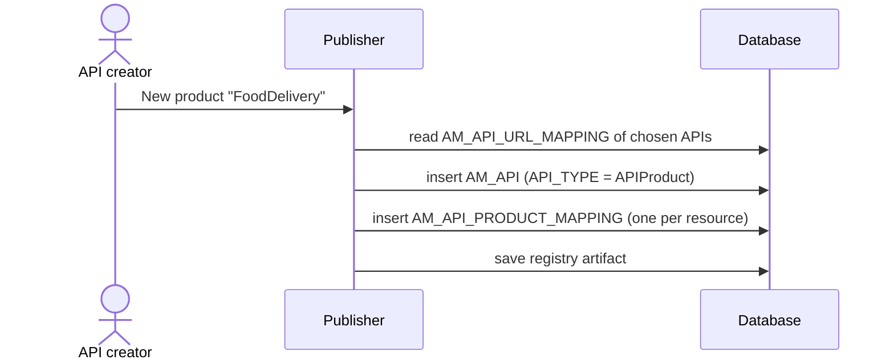

# Create an API product

!!! abstract "What happens"
    An API product bundles resources picked from one or more APIs into a single thing developers can subscribe to. For example, "Food Delivery" might combine `GET /menu` from PizzaShack with `POST /deliveries` from a Delivery API. APIM stores the product as an `AM_API` row of type `APIProduct`, and stores the chosen resources in `AM_API_PRODUCT_MAPPING`.

**Who:** Publisher · **Tables written:** `AM_API`, `AM_API_PRODUCT_MAPPING`, `AM_API_LC_EVENT`, registry `REG_*` · **Tables read:** `AM_API_URL_MAPPING` of the underlying APIs

## The flow at a glance

This diagram shows how a product is built from existing resources rather than new ones.



## Step by step

1. **Product row** → [`AM_API`](../reference/am.md#am_api), the same table as normal APIs.

    | `API_ID` | `API_PROVIDER` | `API_NAME` | `API_VERSION` | `CONTEXT` | `API_TYPE` |
    |---|---|---|---|---|---|
    | 20 | `admin` | `FoodDelivery` | `1.0.0` | `/food` | `APIProduct` |

    - Products have a single version (`1.0.0`) in 3.x.
    - Because a product is an `AM_API` row, subscriptions, lifecycle events, comments and ratings work for products exactly as they do for APIs.

2. **Picked resources** → [`AM_API_PRODUCT_MAPPING`](../reference/am.md#am_api_product_mapping).

    | `API_PRODUCT_MAPPING_ID` | `API_ID` (the product) | `URL_MAPPING_ID` (a resource of another API) |
    |---|---|---|
    | 1 | 20 | 11 *(PizzaShack GET /menu)* |
    | 2 | 20 | 31 *(Delivery POST /deliveries)* |

    - `API_ID` is a real FK to `AM_API` (the product), with `ON DELETE CASCADE`.
    - `URL_MAPPING_ID` is a real FK to `AM_API_URL_MAPPING` (the original resource), with `ON DELETE CASCADE`.
    - The product **reuses** the original `AM_API_URL_MAPPING` rows. It doesn't copy them, so the scopes and resource throttling of those resources apply to the product too.

3. **Registry artifact & lifecycle.** As for APIs: a registry artifact holds the description and visibility, and `AM_API_LC_EVENT` logs the state changes. Publishing a product sends its own artifact to the gateways. See [Publish to the gateway](04-publish-to-gateway.md).

## What gets cleaned up

- Deleting the **product** cascades to its `AM_API_PRODUCT_MAPPING` rows. Its subscriptions and lifecycle events must be removed first (`RESTRICT`).
- Deleting a **resource** from an underlying API (its `AM_API_URL_MAPPING` row) silently cascades and removes it from every product that used it. APIM normally stops you removing a resource that a product uses.

## Try it

This query lists which API resources make up each product.

```sql
SELECT p.API_NAME AS product, src.API_NAME AS from_api, src.API_VERSION,
       u.HTTP_METHOD, u.URL_PATTERN
FROM   AM_API p
JOIN   AM_API_PRODUCT_MAPPING m ON m.API_ID = p.API_ID
JOIN   AM_API_URL_MAPPING u     ON u.URL_MAPPING_ID = m.URL_MAPPING_ID
JOIN   AM_API src               ON src.API_ID = u.API_ID
WHERE  p.API_TYPE = 'APIProduct';
```

Related domains: [API products](../domains/api-products.md) · [API definition](../domains/api-definition.md)

!!! note "Different in 4.x"
    In 4.x, `AM_API_PRODUCT_MAPPING` has a `REVISION_UUID` column, so products can be revisioned and deployed like APIs. See [Create an API product (4.x)](../../apim-4/flows/06-api-product.md).
