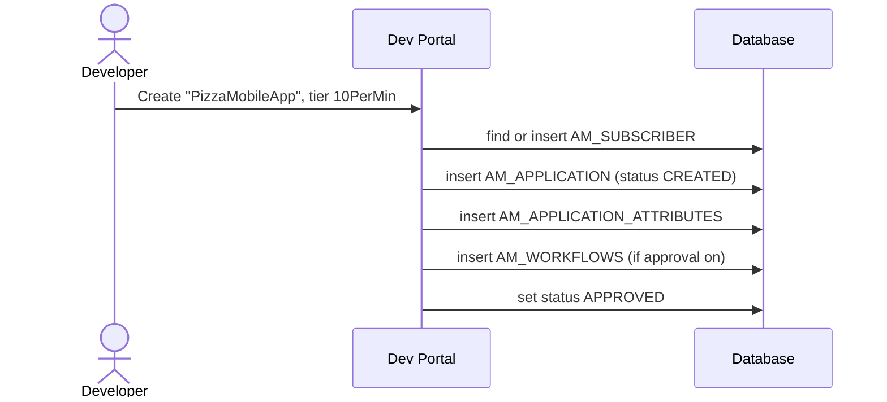

# Create an application

!!! abstract "What happens"
    A developer creates an *application* in the Developer Portal. The application represents their software, such as a mobile app. APIM makes sure the developer has a subscriber row, then stores the application with its rate-limit tier, token type and any custom attributes.

**Who:** Developer Portal (API consumer) · **Tables written:** `AM_SUBSCRIBER` (first time only), `AM_APPLICATION`, `AM_APPLICATION_ATTRIBUTES`, `AM_APPLICATION_GROUP_MAPPING`, `AM_WORKFLOWS` (if approval is on) · **Tables read:** `AM_POLICY_APPLICATION`

## The flow at a glance

This diagram shows the rows created when a developer clicks **Save** on a new application.



## Step by step

1. **Subscriber** → [`AM_SUBSCRIBER`](../reference/am.md#am_subscriber). If this is the user's first action in the portal, APIM inserts a row. APIM also creates the user's **DefaultApplication** automatically at this point. See [Setup & first user](01-bootstrap.md).

2. **Application** → [`AM_APPLICATION`](../reference/am.md#am_application).

    | `APPLICATION_ID` | `NAME` | `SUBSCRIBER_ID` | `APPLICATION_TIER` | `APPLICATION_STATUS` | `TOKEN_TYPE` | `UUID` | `GROUP_ID` |
    |---|---|---|---|---|---|---|---|
    | 1 | `DefaultApplication` | 1 | `Unlimited` | `APPROVED` | `JWT` | `4f1e…` | `NULL` |
    | 2 | `PizzaMobileApp` | 1 | `10PerMin` | `APPROVED` | `JWT` | `9a7c…` | `NULL` |

    - `SUBSCRIBER_ID` is a real FK to `AM_SUBSCRIBER` with `ON DELETE RESTRICT`: the owner can't be deleted while they own apps.
    - `(NAME, SUBSCRIBER_ID)` is unique, so one user can't have two apps with the same name. `UUID` is unique and is the ID used in REST APIs.
    - `APPLICATION_TIER` links to `AM_POLICY_APPLICATION.NAME` for the same tenant *(logical link, no FK)*. It limits the **total** calls from this app across all APIs.
    - `TOKEN_TYPE` is `JWT` (the 3.x default for new apps) or `OAUTH` (opaque tokens, for older apps).
    - `APPLICATION_STATUS` is `CREATED` while waiting for approval, then `APPROVED` (or `REJECTED`).

3. **Custom attributes** → [`AM_APPLICATION_ATTRIBUTES`](../reference/am.md#am_application_attributes). Extra fields defined by the admin, such as "External Reference Id".

    | `APPLICATION_ID` | `NAME` | `VALUE` | `TENANT_ID` |
    |---|---|---|---|
    | 2 | `External Reference Id` | `MOB-001` | -1234 |

    FK to `AM_APPLICATION` with `ON DELETE CASCADE`.

4. **Sharing with a group (optional)** → [`AM_APPLICATION_GROUP_MAPPING`](../reference/am.md#am_application_group_mapping). If application sharing is enabled, for example by organization claim, each group that can see the app is a row (`APPLICATION_ID`, `GROUP_ID`, `TENANT`). FK with `ON DELETE CASCADE`. The older single-value `AM_APPLICATION.GROUP_ID` column is kept for backward compatibility.

5. **Approval (optional)** → [`AM_WORKFLOWS`](../reference/am.md#am_workflows) with `WF_TYPE = 'AM_APPLICATION_CREATION'` and `WF_REFERENCE = '2'` (the `APPLICATION_ID`). The app stays `CREATED` until an admin approves it. See [Approval workflows](13-approval-workflows.md).

## What gets cleaned up

Deleting an application cascades to its attributes and group mappings. But `AM_SUBSCRIPTION`, `AM_APPLICATION_KEY_MAPPING` and `AM_APPLICATION_REGISTRATION` block the delete (`RESTRICT`), so APIM removes subscriptions and keys first. See [Revoke & delete](12-revocation-and-delete.md).

## Try it

This query lists every application with its owner and its application-level tier limits.

```sql
SELECT s.USER_ID AS owner, a.NAME, a.APPLICATION_TIER, a.TOKEN_TYPE,
       a.APPLICATION_STATUS, p.QUOTA, p.UNIT_TIME, p.TIME_UNIT
FROM   AM_APPLICATION a
JOIN   AM_SUBSCRIBER s ON s.SUBSCRIBER_ID = a.SUBSCRIBER_ID
LEFT JOIN AM_POLICY_APPLICATION p
       ON p.NAME = a.APPLICATION_TIER AND p.TENANT_ID = s.TENANT_ID;
```

Related domains: [Applications & subscriptions](../domains/applications-subscriptions.md) · [Throttling policies](../domains/throttling.md)

!!! note "Different in 4.x"
    In 4.x, `AM_APPLICATION` adds an `ORGANIZATION` column (and `SHARED_ORGANIZATION` in newer releases), and the unique key becomes `(NAME, SUBSCRIBER_ID, ORGANIZATION)`. See [Create an application (4.x)](../../apim-4/flows/07-create-application.md).
