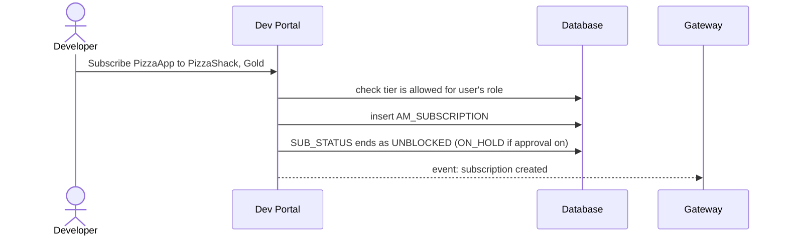

# Subscribe to an API

!!! abstract "What happens"
    A developer subscribes one of their applications to an API and picks a tier, such as *Gold*. APIM writes one `AM_SUBSCRIPTION` row that links the application to the API. The gateway later checks this row on every call to decide whether the app may call the API and how fast.

**Who:** Developer Portal · **Tables written:** `AM_SUBSCRIPTION`, `AM_WORKFLOWS` (if approval is on) · **Tables read:** `AM_API`, `AM_APPLICATION`, `AM_POLICY_SUBSCRIPTION`, `AM_TIER_PERMISSIONS` / `AM_THROTTLE_TIER_PERMISSIONS`

## The flow at a glance

This diagram shows a subscription with the approval workflow turned off.



- The gateway keeps an in-memory copy of subscriptions and updates it from events, so it doesn't query the database on every call.

## Step by step

1. **Tier check.** The Developer Portal only offers tiers the API allows (listed on the API's registry artifact) that the user's role may use. The tiers themselves are rows in [`AM_POLICY_SUBSCRIPTION`](../reference/am.md#am_policy_subscription). Role restrictions on them live in [`AM_THROTTLE_TIER_PERMISSIONS`](../reference/am.md#am_throttle_tier_permissions) and the older [`AM_TIER_PERMISSIONS`](../reference/am.md#am_tier_permissions) (`TIER`, `PERMISSIONS_TYPE` = allow/deny, `ROLES`).

2. **Subscription row** → [`AM_SUBSCRIPTION`](../reference/am.md#am_subscription).

    | `SUBSCRIPTION_ID` | `APPLICATION_ID` | `API_ID` | `TIER_ID` | `TIER_ID_PENDING` | `SUB_STATUS` | `SUBS_CREATE_STATE` | `UUID` |
    |---|---|---|---|---|---|---|---|
    | 1 | 2 *(PizzaApp)* | 1 *(PizzaShack 1.0.0)* | `Gold` | `Gold` | `UNBLOCKED` | `SUBSCRIBE` | `1e5d…` |

    Note that `TIER_ID_PENDING` is also set to `Gold` on a plain subscription, not left `NULL`.

    - `APPLICATION_ID` → `AM_APPLICATION` and `API_ID` → `AM_API` are real FKs, both with **`ON DELETE RESTRICT`** in 3.2.
    - `TIER_ID` links to `AM_POLICY_SUBSCRIPTION.NAME` for the tenant *(logical link, no FK)*. It limits calls **from this app to this API**.
    - `SUB_STATUS` values:

        | Value | Meaning |
        |---|---|
        | `ON_HOLD` | Waiting for approval |
        | `UNBLOCKED` | Active |
        | `BLOCKED` | Blocked for all key types (by the API publisher) |
        | `PROD_ONLY_BLOCKED` | Blocked for production keys only |
        | `REJECTED` | Approval rejected |
        | `TIER_UPDATE_PENDING` | A tier change is waiting for approval |

    - `SUBS_CREATE_STATE` is `SUBSCRIBE` normally, or `UN_SUBSCRIBE` while an unsubscribe is waiting for approval.
    - `LAST_ACCESSED` is a legacy "last used" timestamp. It's rarely populated.

    !!! tip "No unique key on (app, API)"
        The table doesn't enforce "one subscription per app per API". APIM's code checks for an existing subscription before inserting.

3. **Approval (optional)** → [`AM_WORKFLOWS`](../reference/am.md#am_workflows) with `WF_TYPE = 'AM_SUBSCRIPTION_CREATION'` and `WF_REFERENCE` = the `SUBSCRIPTION_ID`. The row stays `ON_HOLD` until it's approved. See [Approval workflows](13-approval-workflows.md).

4. **Changing the tier later.** The developer asks to move from `Gold` to `Silver`. With approval on, the new value waits in `TIER_ID_PENDING` and `SUB_STATUS = 'TIER_UPDATE_PENDING'`. On approval, `TIER_ID` is replaced and the pending value is cleared.

5. **Legacy token link** → [`AM_SUBSCRIPTION_KEY_MAPPING`](../reference/am.md#am_subscription_key_mapping) (`SUBSCRIPTION_ID`, `ACCESS_TOKEN`, `KEY_TYPE`). This is a leftover from very old versions that tied tokens to subscriptions. It's normally empty in 3.2, and it was removed in 4.x.

## What gets cleaned up

Unsubscribing deletes the `AM_SUBSCRIPTION` row, or marks it `UN_SUBSCRIBE` while an approval is pending. Without an approval workflow, unsubscribing simply deletes the row. Because of `RESTRICT`, an API or application **cannot be deleted while a subscription row exists**. For applications, APIM deletes the subscriptions first. For APIs, APIM refuses the delete with **HTTP 409** ("active subscriptions exist"). See [Revoke & delete](12-revocation-and-delete.md).

## Try it

This query answers "which applications are subscribed to PizzaShack, under which tier, and in what status?"

```sql
SELECT app.NAME AS application, s.USER_ID AS owner,
       sub.TIER_ID, sub.SUB_STATUS, sub.CREATED_TIME
FROM   AM_SUBSCRIPTION sub
JOIN   AM_API api         ON api.API_ID = sub.API_ID
JOIN   AM_APPLICATION app ON app.APPLICATION_ID = sub.APPLICATION_ID
JOIN   AM_SUBSCRIBER s    ON s.SUBSCRIBER_ID = app.SUBSCRIBER_ID
WHERE  api.API_NAME = 'PizzaShackAPI' AND api.API_VERSION = '1.0.0';
```

Related domains: [Applications & subscriptions](../domains/applications-subscriptions.md) · [Throttling policies](../domains/throttling.md) · [Workflows](../domains/workflows.md)

!!! note "Different in 4.x"
    In 4.x, the FKs from `AM_SUBSCRIPTION` to `AM_APPLICATION` and `AM_API` are `ON DELETE CASCADE`, so deleting an app or API removes its subscriptions automatically. `AM_SUBSCRIPTION_KEY_MAPPING` no longer exists. See [Subscribe to an API (4.x)](../../apim-4/flows/08-subscribe.md).
