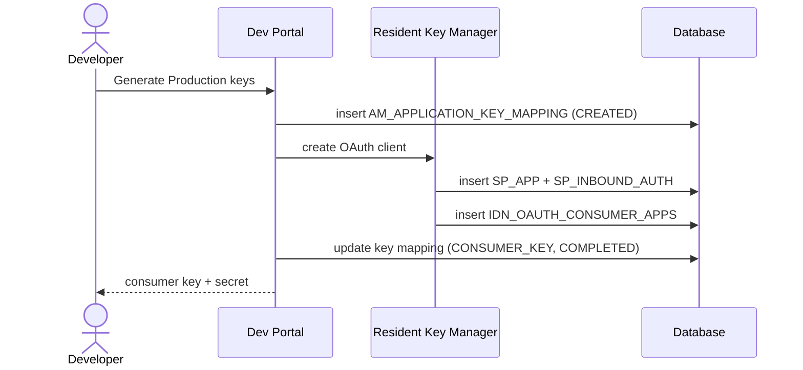

# Generate keys

!!! abstract "What happens"
    A developer clicks **Generate Keys** for an application. APIM asks a Key Manager to create an OAuth client (a consumer key and secret) for that application and key type (*Production* or *Sandbox*). With the built-in Resident Key Manager, the OAuth client is stored in the Identity Server tables. APIM then records the link between the application and the client in `AM_APPLICATION_KEY_MAPPING`.

**Who:** Developer Portal → Key Manager · **Tables written:** `AM_APPLICATION_REGISTRATION` (with approval), `IDN_OAUTH_CONSUMER_APPS`, `SP_APP`, `SP_INBOUND_AUTH`, `AM_APPLICATION_KEY_MAPPING`, `AM_APP_KEY_DOMAIN_MAPPING`, `AM_WORKFLOWS` · **Tables read:** `AM_APPLICATION`, `AM_KEY_MANAGER`

## The flow at a glance

This diagram shows key generation with the Resident Key Manager and no approval step.



- The exact order (mapping row first, then the client) is how the 3.x code works as far as we can tell from the data. What matters is the end state: one mapping row per app, key type and key manager, pointing at one OAuth client.

## Step by step

1. **Pick the Key Manager.** [`AM_KEY_MANAGER`](../reference/am.md#am_key_manager) lists the key managers configured for the tenant. The built-in one is `Resident Key Manager`. Others, such as Keycloak or Okta, are registered in the Admin Portal, with their connection details in `CONFIGURATION`.

2. **Approval (optional)** → [`AM_APPLICATION_REGISTRATION`](../reference/am.md#am_application_registration) + [`AM_WORKFLOWS`](../reference/am.md#am_workflows). If the *Application Registration* workflow is on, APIM stores the request here until it's approved. The stored request includes the grant types, callback URL, token scope and validity.

    | `REG_ID` | `SUBSCRIBER_ID` | `APP_ID` | `TOKEN_TYPE` | `WF_REF` | `KEY_MANAGER` | `VALIDITY_PERIOD` |
    |---|---|---|---|---|---|---|
    | 1 | 1 | 2 | `PRODUCTION` | `e8f0…` | `Resident Key Manager` | 3600 |

    - `TOKEN_TYPE` here means the **key type** (`PRODUCTION` or `SANDBOX`).
    - `WF_REF` matches `AM_WORKFLOWS.WF_REFERENCE` *(logical)*.
    - FKs: to `AM_SUBSCRIBER` and `AM_APPLICATION` (`APP_ID`), both `RESTRICT`.
    - The row is removed once the keys are generated.

3. **OAuth client in the Key Manager.** With the Resident KM, this writes Identity Server tables in the APIM database:
    - [`SP_APP`](../reference/sp.md#sp_app): a *service provider* named like `admin_PizzaMobileApp_PRODUCTION`.
    - [`SP_INBOUND_AUTH`](../reference/sp.md#sp_inbound_auth): says "this service provider uses OAuth2" (`INBOUND_AUTH_TYPE = 'oauth2'`, `INBOUND_AUTH_KEY` = the consumer key, `APP_ID` = `SP_APP.ID`).
    - [`IDN_OAUTH_CONSUMER_APPS`](../reference/idn.md#idn_oauth_consumer_apps): the OAuth client itself.

    | `ID` | `CONSUMER_KEY` | `APP_NAME` | `USERNAME` | `TENANT_ID` | `GRANT_TYPES` | `CALLBACK_URL` |
    |---|---|---|---|---|---|---|
    | 5 | `Xy9Q…` | `admin_PizzaMobileApp_PRODUCTION` | `admin` | -1234 | `client_credentials password refresh_token` | `NULL` |

    The consumer secret is stored in `CONSUMER_SECRET`, encrypted or hashed depending on configuration. With a third-party KM, **none** of these rows exist in APIM. The client lives in the external system.

4. **The link** → [`AM_APPLICATION_KEY_MAPPING`](../reference/am.md#am_application_key_mapping).

    | `APPLICATION_ID` | `KEY_TYPE` | `KEY_MANAGER` | `CONSUMER_KEY` | `STATE` | `CREATE_MODE` | `UUID` |
    |---|---|---|---|---|---|---|
    | 2 | `PRODUCTION` | `Resident Key Manager` | `Xy9Q…` | `COMPLETED` | `CREATED` | `71b2…` |
    | 2 | `SANDBOX` | `Resident Key Manager` | `Lm3P…` | `COMPLETED` | `CREATED` | `a04d…` |

    - The PK is `(APPLICATION_ID, KEY_TYPE, KEY_MANAGER)`: one set of keys per app, per key type, per key manager.
    - `STATE` is `CREATED` while waiting or `COMPLETED` when done.
    - `CREATE_MODE` is `CREATED` (APIM generated the client) or `MAPPED` (the developer mapped an existing client with *Provide Existing OAuth Keys*).
    - `APP_INFO` holds extra client details returned by the Key Manager.
    - FK to `AM_APPLICATION` with `ON DELETE RESTRICT`.

    !!! warning "Logical links (no foreign key)"
        - `CONSUMER_KEY` → `IDN_OAUTH_CONSUMER_APPS.CONSUMER_KEY`. This is **the** bridge between APIM applications and OAuth, and it's matched by value only.
        - `KEY_MANAGER` → `AM_KEY_MANAGER`. In 3.2 this holds the key manager's **name**. 4.x moved to the UUID, so check your data.

5. **Allowed domains (optional)** → [`AM_APP_KEY_DOMAIN_MAPPING`](../reference/am.md#am_app_key_domain_mapping) (`CONSUMER_KEY`, `AUTHZ_DOMAIN`). This is a legacy list of domains allowed to use the key. `ALL` means no restriction.

## What gets cleaned up

- **Removing keys, or deleting the app**: APIM deletes the OAuth client from the Key Manager. That cascades inside the IDN tables: tokens and codes are removed via `IDN_OAUTH2_ACCESS_TOKEN → IDN_OAUTH_CONSUMER_APPS ON DELETE CASCADE`. APIM then deletes the `AM_APPLICATION_KEY_MAPPING` row itself (`RESTRICT` on the application).
- **Regenerating the secret** updates `IDN_OAUTH_CONSUMER_APPS.CONSUMER_SECRET`. The mapping row doesn't change.

## Try it

This query finds the OAuth client behind each application key.

```sql
SELECT app.NAME AS application, km.KEY_TYPE, km.KEY_MANAGER, km.STATE,
       oc.CONSUMER_KEY, oc.APP_NAME AS oauth_app, oc.GRANT_TYPES
FROM   AM_APPLICATION app
JOIN   AM_APPLICATION_KEY_MAPPING km ON km.APPLICATION_ID = app.APPLICATION_ID
LEFT JOIN IDN_OAUTH_CONSUMER_APPS oc ON oc.CONSUMER_KEY = km.CONSUMER_KEY
WHERE  app.NAME = 'PizzaMobileApp';
```

A `NULL` in the `oc.*` columns means the client lives in an external Key Manager.

Related domains: [Keys & tokens](../domains/keys-tokens.md) · [Applications & subscriptions](../domains/applications-subscriptions.md)

!!! note "Different in 4.x"
    In 4.x, `AM_KEY_MANAGER` is scoped by `ORGANIZATION` and gains `TOKEN_TYPE` and `EXTERNAL_REFERENCE_ID`. Key manager permissions get their own table, and client secrets can live in `IDN_OAUTH_CONSUMER_SECRETS` (multiple secrets per client). See [Generate keys (4.x)](../../apim-4/flows/09-generate-keys.md).
