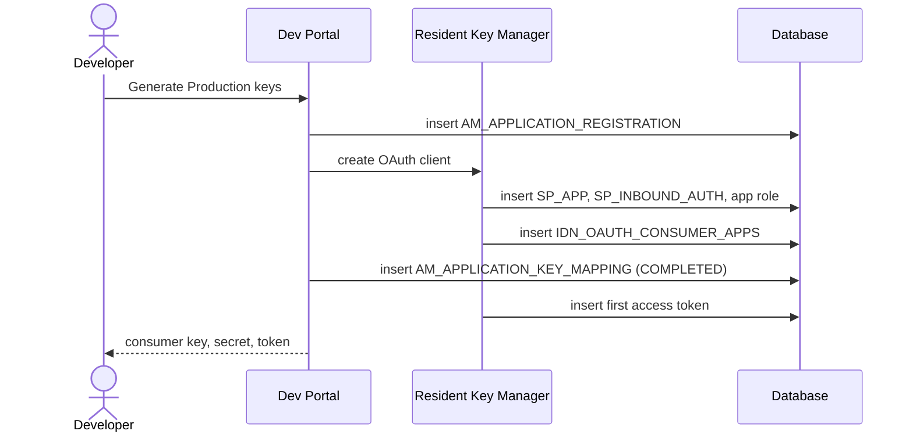

# Generate keys

!!! abstract "What happens"
    A developer clicks **Generate Keys** for an application. APIM asks a Key Manager to create an OAuth client (a consumer key and secret) for that application and key type (*Production* or *Sandbox*). With the built-in Resident Key Manager, the OAuth client is stored in the Identity Server tables. APIM then records the link between the application and the client in `AM_APPLICATION_KEY_MAPPING`.

**Who:** Developer Portal → Key Manager · **Tables written:** `AM_APPLICATION_REGISTRATION`, `AM_APPLICATION_KEY_MAPPING`, `IDN_OAUTH_CONSUMER_APPS`, `IDN_OIDC_PROPERTY`, `SP_APP`, `SP_INBOUND_AUTH`, `SP_METADATA`, `UM_HYBRID_ROLE`, `UM_HYBRID_USER_ROLE`, `IDN_OAUTH2_ACCESS_TOKEN`, `IDN_OAUTH2_ACCESS_TOKEN_SCOPE`, `AM_WORKFLOWS` (only with approval) · **Tables read:** `AM_APPLICATION`, `AM_KEY_MANAGER`

## The flow at a glance

This diagram shows key generation with the Resident Key Manager and no approval step.



- All of these rows are written as part of one request. The end state is one mapping row per app, key type and key manager, pointing at one OAuth client.

## Step by step

1. **Pick the Key Manager.** [`AM_KEY_MANAGER`](../reference/am.md#am_key_manager) lists the key managers configured for the tenant. The built-in one is `Resident Key Manager`. Others, such as Keycloak or Okta, are registered in the Admin Portal, with their connection details in `CONFIGURATION`.

2. **Registration request** → [`AM_APPLICATION_REGISTRATION`](../reference/am.md#am_application_registration). APIM records every key-generation request here, **whether or not** an approval workflow is on. The stored request includes the grant types, callback URL, token scope and validity. With the *Application Registration* workflow on, an [`AM_WORKFLOWS`](../reference/am.md#am_workflows) row is added too, and the keys wait for approval.

    | `REG_ID` | `SUBSCRIBER_ID` | `WF_REF` | `APP_ID` | `TOKEN_TYPE` | `TOKEN_SCOPE` | `ALLOWED_DOMAINS` | `VALIDITY_PERIOD` | `KEY_MANAGER` |
    |---|---|---|---|---|---|---|---|---|
    | 1 | 1 | `b21d…` | 2 | `PRODUCTION` | `default` | `ALL` | 0 | `Resident Key Manager` |

    - `INPUTS` holds `{"tokenScope":"default","validityPeriod":"3600","grant_types":"client_credentials,password","key_type":"PRODUCTION","username":"admin",…}`.
    - `TOKEN_TYPE` here means the **key type** (`PRODUCTION` or `SANDBOX`).
    - `WF_REF` is a UUID that links the request to its `AM_WORKFLOWS` row when a registration workflow is used *(logical)*. It's filled even without a workflow.
    - FKs: to `AM_SUBSCRIBER` and `AM_APPLICATION` (`APP_ID`), both `RESTRICT`.
    - The row **is not removed** once the keys are generated. It stays until the application is deleted.

3. **OAuth client in the Key Manager.** With the Resident KM, this writes Identity Server tables in the APIM database:
    - [`SP_APP`](../reference/sp.md#sp_app): a *service provider* named `admin_PizzaApp_PRODUCTION` (`<owner>_<app>_<keytype>`), plus a few [`SP_METADATA`](../reference/sp.md#sp_metadata) rows.
    - [`SP_INBOUND_AUTH`](../reference/sp.md#sp_inbound_auth): says "this service provider uses OAuth2" (`INBOUND_AUTH_KEY` = the consumer key, `INBOUND_AUTH_TYPE = 'oauth2'`, `APP_ID` = `SP_APP.ID`).
    - [`IDN_OAUTH_CONSUMER_APPS`](../reference/idn.md#idn_oauth_consumer_apps): the OAuth client itself, with about 10 OIDC settings in `IDN_OIDC_PROPERTY` keyed by the consumer key.
    - An application role in [`UM_HYBRID_ROLE`](../reference/um.md#um_hybrid_role) (`Application/admin_PizzaApp_PRODUCTION`), assigned to the owner in [`UM_HYBRID_USER_ROLE`](../reference/um.md#um_hybrid_user_role).

    | `ID` | `CONSUMER_KEY` | `APP_NAME` | `USERNAME` | `TENANT_ID` | `GRANT_TYPES` | `CALLBACK_URL` | `APP_STATE` |
    |---|---|---|---|---|---|---|---|
    | 2 | `1BDH…` | `admin_PizzaApp_PRODUCTION` | `admin` | -1234 | `client_credentials password` | `''` | `ACTIVE` |

    The consumer secret is stored in `CONSUMER_SECRET`. By default it's stored **in plain text**. Encryption or hashing must be switched on explicitly. With a third-party KM, **none** of these rows exist in APIM. The client lives in the external system.

    Row `ID = 1` in the test database was the REST client used to drive the test, not an APIM application. Every OAuth client, including the ones behind the portals, lives in this same table.

4. **The link** → [`AM_APPLICATION_KEY_MAPPING`](../reference/am.md#am_application_key_mapping).

    | `APPLICATION_ID` | `KEY_TYPE` | `KEY_MANAGER` | `CONSUMER_KEY` | `STATE` | `CREATE_MODE` | `UUID` |
    |---|---|---|---|---|---|---|
    | 2 | `PRODUCTION` | `Resident Key Manager` | `1BDH…` | `COMPLETED` | `CREATED` | `2485…` |

    Generating Sandbox keys adds a second row with `KEY_TYPE = 'SANDBOX'`.

    - The PK is `(APPLICATION_ID, KEY_TYPE, KEY_MANAGER)`: one set of keys per app, per key type, per key manager.
    - `STATE` is `CREATED` while waiting or `COMPLETED` when done.
    - `CREATE_MODE` is `CREATED` (APIM generated the client) or `MAPPED` (the developer mapped an existing client with *Provide Existing OAuth Keys*).
    - `APP_INFO` holds extra client details returned by the Key Manager.
    - FK to `AM_APPLICATION` with `ON DELETE RESTRICT`.

    !!! warning "Logical links (no foreign key)"
        - `CONSUMER_KEY` → `IDN_OAUTH_CONSUMER_APPS.CONSUMER_KEY`. This is **the** bridge between APIM applications and OAuth, and it's matched by value only.
        - `KEY_MANAGER` → `AM_KEY_MANAGER`. In 3.2 this holds the key manager's **name**. 4.x moved to the UUID, so check your data.

5. **First access token** → [`IDN_OAUTH2_ACCESS_TOKEN`](../reference/idn.md#idn_oauth2_access_token) + [`IDN_OAUTH2_ACCESS_TOKEN_SCOPE`](../reference/idn.md#idn_oauth2_access_token_scope). In 3.2 the Dev Portal's *Generate Keys* also issues an application token right away (grant type `client_credentials`, `USER_TYPE = 'APPLICATION'`, scopes `am_application_scope` and `default`) and stores it. See [Get a token & call the API](10-token-and-invoke.md).

6. **Allowed domains (optional)** → [`AM_APP_KEY_DOMAIN_MAPPING`](../reference/am.md#am_app_key_domain_mapping) (`CONSUMER_KEY`, `AUTHZ_DOMAIN`). This is a legacy list of domains allowed to use the key, and it wasn't written in the test run. The allowed domains ended up in `AM_APPLICATION_REGISTRATION.ALLOWED_DOMAINS` (`ALL`) instead.

## What gets cleaned up

- **Removing keys, or deleting the app**: APIM deletes the OAuth client from the Key Manager. That cascades inside the IDN tables: tokens and codes are removed via `IDN_OAUTH2_ACCESS_TOKEN → IDN_OAUTH_CONSUMER_APPS ON DELETE CASCADE`. APIM itself deletes the `AM_APPLICATION_KEY_MAPPING` and `AM_APPLICATION_REGISTRATION` rows (`RESTRICT` on the application). Deleting the app also removes the `SP_*` rows, the OIDC properties and the `Application/…` hybrid role.
- **Regenerating the secret** updates `IDN_OAUTH_CONSUMER_APPS.CONSUMER_SECRET`. The mapping row doesn't change.

## Try it

This query finds the OAuth client behind each application key.

```sql
SELECT app.NAME AS application, km.KEY_TYPE, km.KEY_MANAGER, km.STATE,
       oc.CONSUMER_KEY, oc.APP_NAME AS oauth_app, oc.GRANT_TYPES
FROM   AM_APPLICATION app
JOIN   AM_APPLICATION_KEY_MAPPING km ON km.APPLICATION_ID = app.APPLICATION_ID
LEFT JOIN IDN_OAUTH_CONSUMER_APPS oc ON oc.CONSUMER_KEY = km.CONSUMER_KEY
WHERE  app.NAME = 'PizzaApp';
```

A `NULL` in the `oc.*` columns means the client lives in an external Key Manager.

Related domains: [Keys & tokens](../domains/keys-tokens.md) · [Applications & subscriptions](../domains/applications-subscriptions.md)

!!! note "Different in 4.x"
    In 4.x, `AM_KEY_MANAGER` is scoped by `ORGANIZATION` and gains `TOKEN_TYPE` and `EXTERNAL_REFERENCE_ID`. Key manager permissions get their own table, and client secrets can live in `IDN_OAUTH_CONSUMER_SECRETS` (multiple secrets per client). See [Generate keys (4.x)](../../apim-4/flows/09-generate-keys.md).
