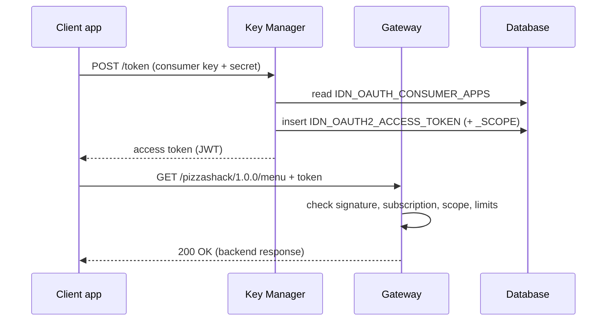

# Get a token & call the API

!!! abstract "What happens"
    The client app uses its consumer key and secret to get an **access token** from the Key Manager. Then it calls the API through the Gateway with that token. The Gateway checks the token, the subscription, the scopes and the rate limits, and forwards the request to the backend.

**Who:** Client app → Key Manager → Gateway · **Tables written:** `IDN_OAUTH2_ACCESS_TOKEN`, `IDN_OAUTH2_ACCESS_TOKEN_SCOPE` · **Tables read:** `IDN_OAUTH_CONSUMER_APPS`, `AM_APPLICATION_KEY_MAPPING`, `AM_SUBSCRIPTION`, `AM_API_URL_MAPPING`, `AM_API_RESOURCE_SCOPE_MAPPING`, `AM_POLICY_*`, `AM_REVOKED_JWT`

## The flow at a glance

This diagram shows the two phases: getting a token, then calling the API.



- The Gateway **doesn't read the database on each call**. It checks JWTs by signature. It gets subscription, application and API data from the Key Manager / Traffic Manager and keeps it in memory, refreshed by events.

## Step by step

1. **Token request.** The Key Manager checks the client against [`IDN_OAUTH_CONSUMER_APPS`](../reference/idn.md#idn_oauth_consumer_apps): the consumer key and secret, the allowed `GRANT_TYPES`, and the token lifetimes (`APP_ACCESS_TOKEN_EXPIRE_TIME`, `USER_ACCESS_TOKEN_EXPIRE_TIME`).

2. **Token stored** → [`IDN_OAUTH2_ACCESS_TOKEN`](../reference/idn.md#idn_oauth2_access_token). Even JWT tokens get a row in 3.x.

    | `TOKEN_ID` | `CONSUMER_KEY_ID` | `AUTHZ_USER` | `GRANT_TYPE` | `TOKEN_STATE` | `VALIDITY_PERIOD` | `TIME_CREATED` |
    |---|---|---|---|---|---|---|
    | `0d7e…` | 5 | `admin` | `client_credentials` | `ACTIVE` | 3600000 | 2020-09-01 10:30 |

    - `CONSUMER_KEY_ID` is a real FK to `IDN_OAUTH_CONSUMER_APPS.ID` (the integer ID, not the key string), with `ON DELETE CASCADE`.
    - `ACCESS_TOKEN` / `ACCESS_TOKEN_HASH` identify the token. For JWTs, a shorter identifier (the JWT ID) or a hash is stored rather than the full token, depending on configuration.
    - `TOKEN_STATE` is `ACTIVE`, `REVOKED`, `EXPIRED` or `INACTIVE`. The table has no FK back to APIM, so reaching the application goes through the consumer key.
    - Old or revoked rows may be moved to [`IDN_OAUTH2_ACCESS_TOKEN_AUDIT`](../reference/idn.md#idn_oauth2_access_token_audit) by the token cleanup job.

3. **Token scopes** → [`IDN_OAUTH2_ACCESS_TOKEN_SCOPE`](../reference/idn.md#idn_oauth2_access_token_scope). One row per granted scope (`TOKEN_ID`, `TOKEN_SCOPE`, `TENANT_ID`), for example `order:write`. It has a FK to the token with `ON DELETE CASCADE`. A scope is only granted if the user holds a role bound to it. See [Scopes](../domains/scopes.md).

4. **API call at the Gateway.** For `GET /pizzashack/1.0.0/menu`, the gateway runs these checks. Each check's source data is shown as a table and link column.

    ```mermaid
    flowchart LR
        T[Token valid?] --> S[Subscribed?]
        S --> R[Scope allowed?]
        R --> L[Within limits?]
        L --> B[Call backend]
    ```

    | Check | Source data (via Key Manager / events) |
    |---|---|
    | Token valid, not revoked | JWT signature and expiry. The revoked list comes from [`AM_REVOKED_JWT`](../reference/am.md#am_revoked_jwt) |
    | Which app is calling | consumer key → [`AM_APPLICATION_KEY_MAPPING`](../reference/am.md#am_application_key_mapping) → `APPLICATION_ID` |
    | Is the app subscribed, and not blocked | [`AM_SUBSCRIPTION`](../reference/am.md#am_subscription) for (`APPLICATION_ID`, `API_ID`), with `SUB_STATUS` = `UNBLOCKED` |
    | Resource exists and needs auth | [`AM_API_URL_MAPPING`](../reference/am.md#am_api_url_mapping) (`HTTP_METHOD`, `URL_PATTERN`, `AUTH_SCHEME`) |
    | Token has the right scope | [`AM_API_RESOURCE_SCOPE_MAPPING`](../reference/am.md#am_api_resource_scope_mapping) vs `IDN_OAUTH2_ACCESS_TOKEN_SCOPE` |
    | Rate limits | subscription tier (`AM_SUBSCRIPTION.TIER_ID`), app tier (`AM_APPLICATION.APPLICATION_TIER`), resource tier (`AM_API_URL_MAPPING.THROTTLING_TIER`) and global policies, all evaluated by the Traffic Manager |

5. **API keys (alternative to OAuth).** In 3.x, an *API key* is a self-contained signed JWT generated in the Developer Portal. It's **not stored** in the database. Only a revoked key leaves a trace, in `AM_REVOKED_JWT`.

## What gets cleaned up

Expired tokens stay in `IDN_OAUTH2_ACCESS_TOKEN` until the token cleanup task removes them or moves them to the audit table. Deleting the OAuth client cascades to all its tokens and token scopes. See [Revoke & delete](12-revocation-and-delete.md).

## Try it

This query traces an access token back to its APIM application.

```sql
SELECT t.TOKEN_ID, t.AUTHZ_USER, t.GRANT_TYPE, t.TOKEN_STATE, t.TIME_CREATED,
       oc.CONSUMER_KEY, app.NAME AS application, km.KEY_TYPE
FROM   IDN_OAUTH2_ACCESS_TOKEN t
JOIN   IDN_OAUTH_CONSUMER_APPS oc   ON oc.ID = t.CONSUMER_KEY_ID
JOIN   AM_APPLICATION_KEY_MAPPING km ON km.CONSUMER_KEY = oc.CONSUMER_KEY
JOIN   AM_APPLICATION app            ON app.APPLICATION_ID = km.APPLICATION_ID
ORDER  BY t.TIME_CREATED DESC;
```

Related domains: [Keys & tokens](../domains/keys-tokens.md) · [Scopes](../domains/scopes.md) · [Throttling policies](../domains/throttling.md)

!!! note "Different in 4.x"
    In 4.x, JWT tokens are largely **not persisted** by default. Revocation is tracked with events and `IDN_INVALID_TOKENS`, and API keys can be stored in the new `AM_API_KEY*` tables. See [Get a token & call the API (4.x)](../../apim-4/flows/10-token-and-invoke.md).
