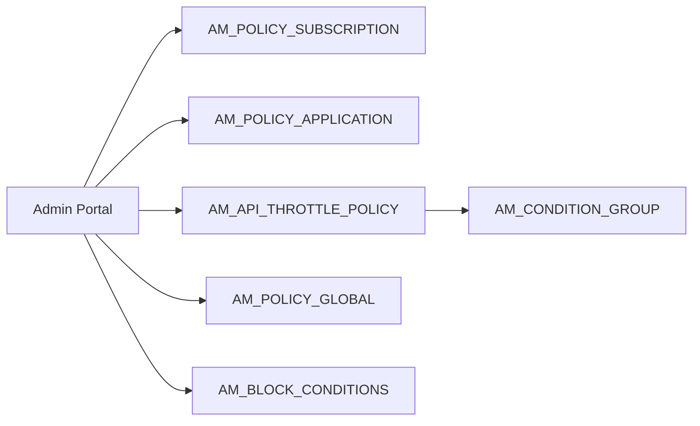

# Manage throttling policies

!!! abstract "What happens"
    An admin creates or edits rate-limit policies in the Admin Portal. There are four levels, and each one has its own table. Advanced (API-level) policies can hold *conditional* limits, such as "IP 10.0.0.0/8 gets 100 req/min". Those are stored as a small tree of condition tables. Once saved, the policy is deployed to the Traffic Manager, which enforces it.

**Who:** Admin Portal · **Tables written:** `AM_POLICY_SUBSCRIPTION`, `AM_POLICY_APPLICATION`, `AM_API_THROTTLE_POLICY`, `AM_CONDITION_GROUP`, `AM_IP_CONDITION`, `AM_HEADER_FIELD_CONDITION`, `AM_QUERY_PARAMETER_CONDITION`, `AM_JWT_CLAIM_CONDITION`, `AM_POLICY_GLOBAL`, `AM_BLOCK_CONDITIONS`, `AM_THROTTLE_TIER_PERMISSIONS` · **Tables read:** none of note

## The flow at a glance

This diagram shows which table each kind of policy lands in.



- From top to bottom: subscription policies, application policies, advanced (API/resource) policies with their condition groups, custom global policies, and deny policies.
- Every policy table has `IS_DEPLOYED`. It flips to true once the Traffic Manager has accepted the policy.

## Step by step

1. **Subscription policy** → [`AM_POLICY_SUBSCRIPTION`](../reference/am.md#am_policy_subscription). This limits one app's calls to one API. `AM_SUBSCRIPTION.TIER_ID` uses it.

    | `NAME` | `QUOTA_TYPE` | `QUOTA` | `UNIT_TIME` | `TIME_UNIT` | `RATE_LIMIT_COUNT` | `STOP_ON_QUOTA_REACH` | `BILLING_PLAN` |
    |---|---|---|---|---|---|---|---|
    | `Gold` | `requestCount` | 5000 | 1 | `min` | 0 | true | `FREE` |

    - `QUOTA_TYPE` decides how `QUOTA` is read: `requestCount` (a number of calls) or `bandwidthVolume` (with `QUOTA_UNIT` in KB or MB).
    - `RATE_LIMIT_COUNT` / `RATE_LIMIT_TIME_UNIT` add a short burst limit.
    - The monetization columns (`MONETIZATION_PLAN`, `FIXED_RATE`, `PRICE_PER_REQUEST`, `CURRENCY`, `BILLING_CYCLE`) are only used for commercial tiers.
    - `MAX_COMPLEXITY` / `MAX_DEPTH` limit GraphQL queries.
    - `(NAME, TENANT_ID)` is unique.

2. **Application policy** → [`AM_POLICY_APPLICATION`](../reference/am.md#am_policy_application). This limits one app's calls across **all** APIs. `AM_APPLICATION.APPLICATION_TIER` uses it. It has the same quota columns, without the burst and billing columns.

3. **Advanced (API / resource) policy** → [`AM_API_THROTTLE_POLICY`](../reference/am.md#am_api_throttle_policy). This limits calls to an API or a single resource from **all** apps together. `AM_API.API_TIER` or `AM_API_URL_MAPPING.THROTTLING_TIER` uses it.
    - The `DEFAULT_*` columns hold the limit that applies when no condition matches.
    - `APPLICABLE_LEVEL` is `apiLevel` or `resourceLevel`.

4. **Conditional limits** → [`AM_CONDITION_GROUP`](../reference/am.md#am_condition_group) plus one table per condition type. This diagram shows the tree for one advanced policy.

    ```mermaid
    erDiagram
        AM_API_THROTTLE_POLICY ||--o{ AM_CONDITION_GROUP : "has"
        AM_CONDITION_GROUP ||--o{ AM_IP_CONDITION : "matches IP"
        AM_CONDITION_GROUP ||--o{ AM_HEADER_FIELD_CONDITION : "matches header"
        AM_CONDITION_GROUP ||--o{ AM_QUERY_PARAMETER_CONDITION : "matches query param"
        AM_CONDITION_GROUP ||--o{ AM_JWT_CLAIM_CONDITION : "matches JWT claim"
    ```

    - Each condition group has its own quota (`QUOTA_TYPE`, `QUOTA`, `UNIT_TIME`, `TIME_UNIT`). It applies when **all** the conditions in that group match.
    - [`AM_IP_CONDITION`](../reference/am.md#am_ip_condition): `SPECIFIC_IP`, or `STARTING_IP` + `ENDING_IP`, plus the `WITHIN_IP_RANGE` flag.
    - [`AM_HEADER_FIELD_CONDITION`](../reference/am.md#am_header_field_condition) and [`AM_QUERY_PARAMETER_CONDITION`](../reference/am.md#am_query_parameter_condition): a name and value, plus an `IS_*_MAPPING` flag.
    - **Careful with the flags.** Despite their names, `IS_HEADER_FIELD_MAPPING` and `WITHIN_IP_RANGE` are both `FALSE` for an ordinary, **non-inverted** condition. Don't read `FALSE` as "inverted" without checking against the Admin Portal.
    - [`AM_JWT_CLAIM_CONDITION`](../reference/am.md#am_jwt_claim_condition): `CLAIM_URI` + `CLAIM_ATTRIB` (a regex).
    - All links are real FKs with `ON DELETE CASCADE`, so deleting the policy removes the whole tree.

    Example: policy `PizzaAdvanced` (`POLICY_ID = 5`, default 10/min) has condition group 1 (`QUOTA = 2`, `TIME_UNIT = 'min'`, `DESCRIPTION = 'mobile'`). That group has one `AM_HEADER_FIELD_CONDITION` (`User-Agent` = `mobile`) and one `AM_IP_CONDITION` (`SPECIFIC_IP = 10.0.0.1`). Both conditions must match for the 2/min limit to apply.

5. **Custom (global) policy** → [`AM_POLICY_GLOBAL`](../reference/am.md#am_policy_global). This is an advanced rule written as a Siddhi query (`SIDDHI_QUERY`), with a `KEY_TEMPLATE` such as `$userId:$apiContext`. It isn't linked to any API. It applies to all traffic that matches the key.

6. **Deny (block) policies** → [`AM_BLOCK_CONDITIONS`](../reference/am.md#am_block_conditions). These block calls outright by `TYPE`: `API` (context), `APPLICATION`, `USER`, `IP` or `IPRANGE`. `VALUE` is what to match, `ENABLED` turns the rule on or off, and `DOMAIN` is the tenant domain.

    | `CONDITION_ID` | `TYPE` | `VALUE` | `ENABLED` | `DOMAIN` | `UUID` |
    |---|---|---|---|---|---|
    | 1 | `IP` | `{"invert":false,"fixedIp":"10.9.9.9"}` | `'true'` | `carbon.super` | `466d…` |

    For IP types, `VALUE` is a small JSON document, and `ENABLED` is the *string* `'true'`.

7. **Who may use a tier** → [`AM_THROTTLE_TIER_PERMISSIONS`](../reference/am.md#am_throttle_tier_permissions) (`TIER`, `PERMISSIONS_TYPE` = `allow` / `deny`, `ROLES`, `TENANT_ID`). This limits which roles can subscribe with a tier. The older [`AM_TIER_PERMISSIONS`](../reference/am.md#am_tier_permissions) has the same shape and is kept for legacy tiers.

8. **Legacy hard limits** → [`AM_POLICY_HARD_THROTTLING`](../reference/am.md#am_policy_hard_throttling). An older table for hard limits per tenant. Backend hard limits in 3.x are normally set on the API's endpoint configuration instead.

## What gets cleaned up

Deleting an advanced policy cascades through its condition groups and conditions. Deleting a subscription or application policy that is still used by `AM_SUBSCRIPTION.TIER_ID` or `AM_APPLICATION.APPLICATION_TIER` is **not** blocked by the database, because those are name-based links. The Admin Portal checks for usage and refuses instead.

## Try it

This query lists advanced policies with their conditional limits and IP conditions.

```sql
SELECT p.NAME, p.DEFAULT_QUOTA, p.DEFAULT_TIME_UNIT,
       g.CONDITION_GROUP_ID, g.QUOTA, g.TIME_UNIT,
       ip.SPECIFIC_IP, ip.STARTING_IP, ip.ENDING_IP, ip.WITHIN_IP_RANGE
FROM   AM_API_THROTTLE_POLICY p
LEFT JOIN AM_CONDITION_GROUP g ON g.POLICY_ID = p.POLICY_ID
LEFT JOIN AM_IP_CONDITION ip   ON ip.CONDITION_GROUP_ID = g.CONDITION_GROUP_ID
WHERE  p.TENANT_ID = -1234;
```

Related domains: [Throttling policies](../domains/throttling.md) · [Applications & subscriptions](../domains/applications-subscriptions.md)

!!! note "Different in 4.x"
    4.x adds more columns, for example event-count quotas for streaming APIs and `ORGANIZATION` scoping on some tables. The four levels and the condition tree stay the same. See [Manage throttling policies (4.x)](../../apim-4/flows/11-throttling-policies.md).
