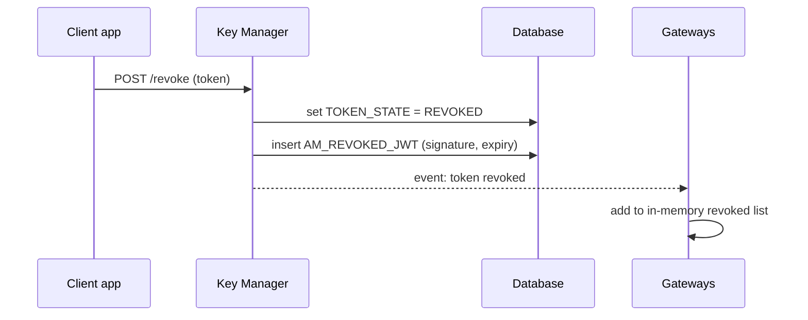
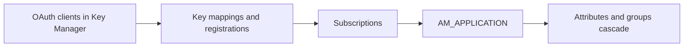

# Revoke & delete

!!! abstract "What happens"
    Revoking a token marks it as unusable. For JWTs, which gateways check without the database, APIM also records the revoked token in `AM_REVOKED_JWT` and tells every gateway. Deleting an API, application or subscription removes rows in a set order. In 3.2 most child tables *block* the delete (`ON DELETE RESTRICT`), so APIM's code must remove the children first.

**Who:** Dev Portal, Publisher, Admin Portal, Key Manager · **Tables written:** `IDN_OAUTH2_ACCESS_TOKEN`, `AM_REVOKED_JWT`, plus deletes across `AM_*` and `IDN_*` · **Tables read:** the same

## The flow at a glance

This diagram shows how revoking a JWT reaches every gateway.



- A gateway that starts up later loads the still-unexpired rows of `AM_REVOKED_JWT`, so it doesn't accept a revoked token it missed the event for.

## Part 1: Revoking tokens

1. **Token state** → [`IDN_OAUTH2_ACCESS_TOKEN`](../reference/idn.md#idn_oauth2_access_token). `TOKEN_STATE` changes from `ACTIVE` to `REVOKED`, and `TOKEN_STATE_ID` gets a unique value so the row doesn't clash with a new active token. Regenerating an app's token, or changing a user's password, has the same effect on the old tokens.

2. **Revoked JWT list** → [`AM_REVOKED_JWT`](../reference/am.md#am_revoked_jwt).

    | `UUID` | `SIGNATURE` | `EXPIRY_TIMESTAMP` | `TENANT_ID` | `TOKEN_TYPE` | `TIME_CREATED` |
    |---|---|---|---|---|---|
    | `5a0c…` | `eyJ…sig` | 1599000000000 | -1234 | `JWT` | 2020-09-01 11:00 |

    - The gateway identifies a revoked JWT by its **signature** part.
    - `EXPIRY_TIMESTAMP` tells the gateway when it can forget the entry, because an expired token is rejected anyway.
    - `TOKEN_TYPE` distinguishes OAuth JWTs from **API keys**. Revoking an API key only ever writes here, because API keys aren't stored anywhere else.

## Part 2: Deleting things

### Delete a subscription

1. Delete the [`AM_SUBSCRIPTION`](../reference/am.md#am_subscription) row. Its only child, the legacy [`AM_SUBSCRIPTION_KEY_MAPPING`](../reference/am.md#am_subscription_key_mapping), has `RESTRICT`, so any rows there must go first.
2. With the *Subscription Deletion* workflow on, the row is first set to `SUBS_CREATE_STATE = 'UN_SUBSCRIBE'` and waits for approval.

### Delete an application

This diagram shows the order APIM follows, because the database would otherwise refuse.



- Deleting the OAuth client ([`IDN_OAUTH_CONSUMER_APPS`](../reference/idn.md#idn_oauth_consumer_apps)) cascades to its tokens, authorization codes and scopes in the `IDN_*` tables. The matching `SP_APP` service provider is removed by the Key Manager too.
- [`AM_APPLICATION_KEY_MAPPING`](../reference/am.md#am_application_key_mapping), [`AM_APPLICATION_REGISTRATION`](../reference/am.md#am_application_registration) and [`AM_SUBSCRIPTION`](../reference/am.md#am_subscription) all use `RESTRICT` on `AM_APPLICATION`, so they're deleted by code first.
- [`AM_APPLICATION_ATTRIBUTES`](../reference/am.md#am_application_attributes) and [`AM_APPLICATION_GROUP_MAPPING`](../reference/am.md#am_application_group_mapping) cascade automatically.
- Any pending [`AM_WORKFLOWS`](../reference/am.md#am_workflows) rows for the app are cleaned up by code, because `WF_REFERENCE` is a logical link.

### Delete an API

| Child table | Link to `AM_API` | What happens |
|---|---|---|
| `AM_SUBSCRIPTION` | FK, `RESTRICT` | Code deletes first (an API with subscriptions can't be deleted from the Publisher) |
| `AM_API_LC_EVENT` | FK, `RESTRICT` | Code deletes first |
| `AM_API_COMMENTS`, `AM_API_RATINGS` | FK, `RESTRICT` | Code deletes first |
| `AM_EXTERNAL_STORES`, `AM_SECURITY_AUDIT_UUID_MAPPING` | FK, `RESTRICT` | Code deletes first |
| `AM_API_URL_MAPPING` | **logical (no FK)** | Code deletes. Then `AM_API_RESOURCE_SCOPE_MAPPING` cascades from it |
| `AM_API_PRODUCT_MAPPING`, `AM_GRAPHQL_COMPLEXITY`, `AM_API_CLIENT_CERTIFICATE` | FK, `CASCADE` | Removed automatically |
| `AM_API_DEFAULT_VERSION` | logical (name + provider) | Code updates or deletes |
| `AM_GW_API_ARTIFACTS` → `AM_GW_PUBLISHED_API_DETAILS` | logical (API UUID) | Code removes the artifacts, then the details |
| Registry artifact (`REG_*`) | logical | Code deletes the artifact, docs and definition |

Local scopes of the API (`AM_SCOPE` / `IDN_OAUTH2_SCOPE`) are deleted by code. Shared scopes (`AM_SHARED_SCOPE`) survive.

## Try it

This query lists the revoked JWTs that gateways still need to remember, because they haven't expired yet.

```sql
SELECT UUID, TOKEN_TYPE, TENANT_ID, TIME_CREATED, EXPIRY_TIMESTAMP
FROM   AM_REVOKED_JWT
WHERE  EXPIRY_TIMESTAMP > UNIX_TIMESTAMP() * 1000
ORDER  BY TIME_CREATED DESC;
```

This query checks what still blocks deleting an application (id 2).

```sql
SELECT 'subscriptions' AS blocker, COUNT(*) FROM AM_SUBSCRIPTION WHERE APPLICATION_ID = 2
UNION ALL
SELECT 'key mappings', COUNT(*) FROM AM_APPLICATION_KEY_MAPPING WHERE APPLICATION_ID = 2
UNION ALL
SELECT 'registrations', COUNT(*) FROM AM_APPLICATION_REGISTRATION WHERE APP_ID = 2;
```

Related domains: [Revocation](../domains/revocation.md) · [Keys & tokens](../domains/keys-tokens.md) · [Applications & subscriptions](../domains/applications-subscriptions.md)

!!! note "Different in 4.x"
    4.x changes several `RESTRICT` rules to `CASCADE`, for example subscriptions and key mappings when an app or API is deleted. It also adds revocation event tables: `AM_APP_REVOKED_EVENT`, `AM_SUBJECT_ENTITY_REVOKED_EVENT`, their `IDN_*` twins, and `IDN_INVALID_TOKENS`. These revoke *all* tokens of an app or user at once. See [Revoke & delete (4.x)](../../apim-4/flows/12-revocation-and-delete.md).
