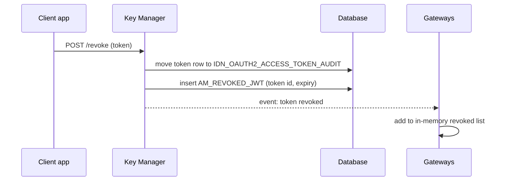
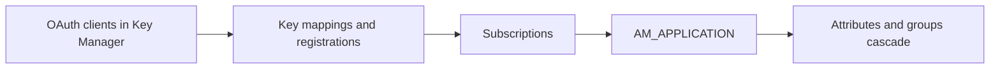

# Revoke & delete

!!! abstract "What happens"
    Revoking a token marks it as unusable. For JWTs, which gateways check without the database, APIM also records the revoked token in `AM_REVOKED_JWT` and tells every gateway. Deleting an API, application or subscription removes rows in a set order. In 3.2 most child tables *block* the delete (`ON DELETE RESTRICT`), so APIM's code must remove the children first.

**Who:** Dev Portal, Publisher, Admin Portal, Key Manager · **Tables written:** `IDN_OAUTH2_ACCESS_TOKEN`, `IDN_OAUTH2_ACCESS_TOKEN_AUDIT`, `AM_REVOKED_JWT`, plus deletes across `AM_*`, `IDN_*`, `SP_*`, `UM_*` and `REG_*` · **Tables read:** the same

!!! success "Verified on a running server"
    Checked on WSO2 APIM 3.2.0 (H2, default config) by revoking a token and deleting a subscription, an application, an API product and an API version, diffing the database after each step.

    - **Revoke:** the token row was **moved** out of `IDN_OAUTH2_ACCESS_TOKEN` into `IDN_OAUTH2_ACCESS_TOKEN_AUDIT`, its two `IDN_OAUTH2_ACCESS_TOKEN_SCOPE` rows were deleted, and one `AM_REVOKED_JWT` row was added.
    - **Delete subscription:** just the `AM_SUBSCRIPTION` row.
    - **Delete application:** `AM_APPLICATION`, `AM_APPLICATION_KEY_MAPPING`, `AM_APPLICATION_REGISTRATION`, the app's remaining token and scopes, `IDN_OAUTH_CONSUMER_APPS`, 10 `IDN_OIDC_PROPERTY` rows, `SP_APP`, `SP_INBOUND_AUTH`, `SP_METADATA`, and the app's `UM_HYBRID_ROLE` + `UM_HYBRID_USER_ROLE`.
    - **Delete product:** its `AM_API` row, its `AM_API_PRODUCT_MAPPING` row and its registry data.
    - **Delete API 2.0.0:** `AM_API`, `AM_API_DEFAULT_VERSION`, `AM_API_LC_EVENT`, `AM_API_URL_MAPPING` (2), `AM_API_RESOURCE_SCOPE_MAPPING`, the registry artifact and permissions. The shared scope row stayed, because 1.0.0 still used it.
    - **Delete API 1.0.0 with a live subscription:** refused by APIM with **HTTP 409** ("Cannot remove the API … as active subscriptions exist"), and nothing changed.

## The flow at a glance

This diagram shows how revoking a JWT reaches every gateway.



- A gateway that starts up later loads the still-unexpired rows of `AM_REVOKED_JWT`, so it doesn't accept a revoked token it missed the event for.

## Part 1: Revoking tokens

1. **Token row** → [`IDN_OAUTH2_ACCESS_TOKEN`](../reference/idn.md#idn_oauth2_access_token) and [`IDN_OAUTH2_ACCESS_TOKEN_AUDIT`](../reference/idn.md#idn_oauth2_access_token_audit). There are two different cases:
    - **Explicit revoke** (`POST /oauth2/revoke`): the row is **deleted** from `IDN_OAUTH2_ACCESS_TOKEN` and a copy is inserted into `IDN_OAUTH2_ACCESS_TOKEN_AUDIT`. Its scope rows in `IDN_OAUTH2_ACCESS_TOKEN_SCOPE` are deleted.
    - **Superseded** (the app gets a new token): the old row stays in place with `TOKEN_STATE = 'REVOKED'` and a unique `TOKEN_STATE_ID`, so it doesn't clash with the new active token. Changing a user's password has the same effect.

2. **Revoked JWT list** → [`AM_REVOKED_JWT`](../reference/am.md#am_revoked_jwt).

    | `UUID` | `SIGNATURE` | `EXPIRY_TIMESTAMP` | `TENANT_ID` | `TOKEN_TYPE` | `TIME_CREATED` |
    |---|---|---|---|---|---|
    | `51d3…` | `3427…` | 1790403942044 | -1234 | `JWT` | 2026-09-26 10:57 |

    - That's the real row from the test run. The `SIGNATURE` column held the same short value as the token's `ACCESS_TOKEN` column (the JWT ID), not a long signature string.
    - `EXPIRY_TIMESTAMP` tells the gateway when it can forget the entry, because an expired token is rejected anyway.
    - `TOKEN_TYPE` distinguishes OAuth JWTs from **API keys**. Revoking an API key only ever writes here, because API keys aren't stored anywhere else.

## Part 2: Deleting things

### Delete a subscription

1. Delete the [`AM_SUBSCRIPTION`](../reference/am.md#am_subscription) row. On the test server, that was the only change. Its only child, the legacy [`AM_SUBSCRIPTION_KEY_MAPPING`](../reference/am.md#am_subscription_key_mapping), has `RESTRICT`, so any rows there would have to go first. It was empty.
2. With the *Subscription Deletion* workflow on, the row is first set to `SUBS_CREATE_STATE = 'UN_SUBSCRIBE'` and waits for approval.

### Delete an application

This diagram shows the order APIM follows, because the database would otherwise refuse.



- Deleting the OAuth client ([`IDN_OAUTH_CONSUMER_APPS`](../reference/idn.md#idn_oauth_consumer_apps)) cascades to its tokens, authorization codes and scopes in the `IDN_*` tables, and removes its `IDN_OIDC_PROPERTY` rows. The Key Manager also removes the matching `SP_APP` service provider (with `SP_INBOUND_AUTH` and `SP_METADATA`) and the `Application/<owner>_<app>_<keytype>` hybrid role.
- [`AM_APPLICATION_KEY_MAPPING`](../reference/am.md#am_application_key_mapping), [`AM_APPLICATION_REGISTRATION`](../reference/am.md#am_application_registration) and [`AM_SUBSCRIPTION`](../reference/am.md#am_subscription) all use `RESTRICT` on `AM_APPLICATION`, so they're deleted by code first.
- [`AM_APPLICATION_ATTRIBUTES`](../reference/am.md#am_application_attributes) and [`AM_APPLICATION_GROUP_MAPPING`](../reference/am.md#am_application_group_mapping) cascade automatically.
- Any pending [`AM_WORKFLOWS`](../reference/am.md#am_workflows) rows for the app are cleaned up by code, because `WF_REFERENCE` is a logical link.

### Delete an API

| Child table | Link to `AM_API` | What happens |
|---|---|---|
| `AM_SUBSCRIPTION` | FK, `RESTRICT` | APIM **refuses** the delete with HTTP 409 while active subscriptions exist. Remove them first |
| `AM_API_LC_EVENT` | FK, `RESTRICT` | Code deletes first |
| `AM_API_COMMENTS`, `AM_API_RATINGS` | FK, `RESTRICT` | Code deletes first |
| `AM_EXTERNAL_STORES`, `AM_SECURITY_AUDIT_UUID_MAPPING` | FK, `RESTRICT` | Code deletes first |
| `AM_API_URL_MAPPING` | **logical (no FK)** | Code deletes. Then `AM_API_RESOURCE_SCOPE_MAPPING` cascades from it |
| `AM_API_PRODUCT_MAPPING`, `AM_GRAPHQL_COMPLEXITY`, `AM_API_CLIENT_CERTIFICATE` | FK, `CASCADE` | Removed automatically |
| `AM_API_DEFAULT_VERSION` | logical (name + provider) | Code updates or deletes |
| `AM_GW_API_ARTIFACTS` → `AM_GW_PUBLISHED_API_DETAILS` | logical (API UUID) | Code removes the artifacts, then the details |
| Registry artifact (`REG_*`) | logical | Code deletes the artifact, docs and definition |

Local scopes of the API live in `IDN_OAUTH2_SCOPE` in 3.2 (not `AM_SCOPE`), and code deletes them when no other version uses them. In the test run, deleting 2.0.0 kept `order:write` because 1.0.0 still used it. Shared scopes (`AM_SHARED_SCOPE`) survive.

## Try it

This query lists the revoked JWTs that gateways still need to remember, because they haven't expired yet.

```sql
SELECT UUID, TOKEN_TYPE, TENANT_ID, TIME_CREATED, EXPIRY_TIMESTAMP
FROM   AM_REVOKED_JWT
WHERE  EXPIRY_TIMESTAMP > UNIX_TIMESTAMP() * 1000
ORDER  BY TIME_CREATED DESC;
```

This query checks what still blocks deleting an application (id 2).

```sql
SELECT 'subscriptions' AS blocker, COUNT(*) FROM AM_SUBSCRIPTION WHERE APPLICATION_ID = 2
UNION ALL
SELECT 'key mappings', COUNT(*) FROM AM_APPLICATION_KEY_MAPPING WHERE APPLICATION_ID = 2
UNION ALL
SELECT 'registrations', COUNT(*) FROM AM_APPLICATION_REGISTRATION WHERE APP_ID = 2;
```

Related domains: [Revocation](../domains/revocation.md) · [Keys & tokens](../domains/keys-tokens.md) · [Applications & subscriptions](../domains/applications-subscriptions.md)

!!! note "Different in 4.x"
    4.x changes several `RESTRICT` rules to `CASCADE`, for example subscriptions and key mappings when an app or API is deleted. It also adds revocation event tables: `AM_APP_REVOKED_EVENT`, `AM_SUBJECT_ENTITY_REVOKED_EVENT`, their `IDN_*` twins, and `IDN_INVALID_TOKENS`. These revoke *all* tokens of an app or user at once. See [Revoke & delete (4.x)](../../apim-4/flows/12-revocation-and-delete.md).
