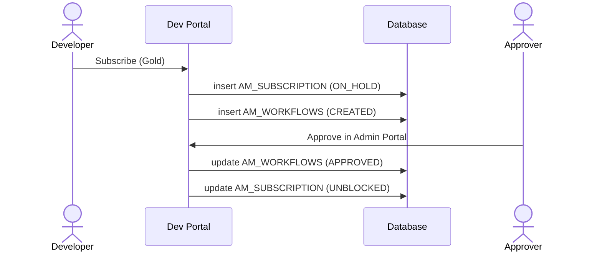

# Approval workflows

!!! abstract "What happens"
    APIM can put an approval step in front of actions such as creating an application or subscribing. When a workflow is on, APIM saves the action in a *pending* state and writes an `AM_WORKFLOWS` row. An approver then accepts or rejects the request in the Admin Portal. On a decision, APIM completes or rolls back the original action.

**Who:** Any portal (requester) + Admin Portal (approver) · **Tables written:** `AM_WORKFLOWS`, plus the pending entity's own table · **Tables read:** `AM_WORKFLOWS`

## The flow at a glance

This diagram uses a subscription as the example. Other workflow types follow the same pattern.



- Which actions need approval is set per tenant in the registry (`/_system/governance/apimgt/applicationdata/workflow-extensions.xml`), not in a table.

## Step by step

1. **Pending entity.** The action is saved in its "waiting" state:

    | Workflow type (`WF_TYPE`) | Pending row | Waiting state |
    |---|---|---|
    | `AM_APPLICATION_CREATION` | `AM_APPLICATION` | `APPLICATION_STATUS = 'CREATED'` |
    | `AM_APPLICATION_DELETION` | `AM_APPLICATION` | kept until approved |
    | `AM_SUBSCRIPTION_CREATION` | `AM_SUBSCRIPTION` | `SUB_STATUS = 'ON_HOLD'` |
    | `AM_SUBSCRIPTION_UPDATE` | `AM_SUBSCRIPTION` | `SUB_STATUS = 'TIER_UPDATE_PENDING'`, `TIER_ID_PENDING` set |
    | `AM_SUBSCRIPTION_DELETION` | `AM_SUBSCRIPTION` | `SUBS_CREATE_STATE = 'UN_SUBSCRIBE'` |
    | `AM_APPLICATION_REGISTRATION_PRODUCTION` / `_SANDBOX` | `AM_APPLICATION_REGISTRATION` | row exists until approved |
    | `AM_API_STATE` | registry lifecycle | state change not applied yet |
    | `AM_USER_SIGNUP` | user store | user added without roles |

2. **Workflow row** → [`AM_WORKFLOWS`](../reference/am.md#am_workflows).

    | `WF_ID` | `WF_REFERENCE` | `WF_TYPE` | `WF_STATUS` | `WF_EXTERNAL_REFERENCE` | `TENANT_DOMAIN` | `WF_CREATED_TIME` |
    |---|---|---|---|---|---|---|
    | 1 | `1` | `AM_SUBSCRIPTION_CREATION` | `CREATED` | `f2a9…` | `carbon.super` | 2020-09-01 12:00 |

    - `WF_TYPE` is the **type discriminator**. It tells you what `WF_REFERENCE` points at.
    - `WF_REFERENCE` is the pending entity's ID: a `SUBSCRIPTION_ID`, an `APPLICATION_ID`, the API ID, or a user name.
    - `WF_EXTERNAL_REFERENCE` is a unique ID used by the approver (or an external BPS/BPMN engine) to call back. `AM_APPLICATION_REGISTRATION.WF_REF` matches it.
    - `WF_STATUS` is `CREATED` (pending), `APPROVED` or `REJECTED`. `WF_STATUS_DESC` holds the approver's note.
    - `WF_METADATA` / `WF_PROPERTIES` hold the details shown to the approver, such as the API name, the app name and the tier.

    !!! warning "Logical link (no foreign key)"
        `WF_REFERENCE` is a polymorphic link. It points at different tables depending on `WF_TYPE`, so no foreign key is possible.

3. **Decision.** The approver approves or rejects the request in the Admin Portal (**Tasks**). APIM updates `WF_STATUS`, then either completes the entity (for example `SUB_STATUS = 'UNBLOCKED'`, `APPLICATION_STATUS = 'APPROVED'`, or generates the keys) or marks it rejected (`REJECTED`) and cleans up.

4. **External engine (optional)** → the `WF_*` tables in the APIM DB: [`WF_BPS_PROFILE`](../reference/wf.md#wf_bps_profile), [`WF_WORKFLOW`](../reference/wf.md#wf_workflow), [`WF_WORKFLOW_ASSOCIATION`](../reference/wf.md#wf_workflow_association), [`WF_REQUEST`](../reference/wf.md#wf_request) and the others. These come from the embedded Identity Server's workflow engine, used when approvals run on an external WSO2 BPS. With the default built-in approval, only `AM_WORKFLOWS` is used.

## What gets cleaned up

Rejected or completed rows stay in `AM_WORKFLOWS` as history. When the pending entity is deleted, for example when an application is removed, APIM's code removes its pending workflow rows.

## Try it

This query lists pending approvals and resolves subscription requests to readable names.

```sql
SELECT w.WF_ID, w.WF_TYPE, w.WF_STATUS, w.WF_CREATED_TIME,
       app.NAME AS application, api.API_NAME, sub.TIER_ID
FROM   AM_WORKFLOWS w
LEFT JOIN AM_SUBSCRIPTION sub
       ON w.WF_TYPE = 'AM_SUBSCRIPTION_CREATION'
      AND sub.SUBSCRIPTION_ID = CAST(w.WF_REFERENCE AS UNSIGNED)
LEFT JOIN AM_APPLICATION app ON app.APPLICATION_ID = sub.APPLICATION_ID
LEFT JOIN AM_API api         ON api.API_ID = sub.API_ID
WHERE  w.WF_STATUS = 'CREATED';
```

Related domains: [Workflows](../domains/workflows.md) · [Applications & subscriptions](../domains/applications-subscriptions.md)

!!! note "Different in 4.x"
    4.x keeps the same `AM_WORKFLOWS` model and adds workflow types, for example for API product state changes and API revision deployment approval. See [Approval workflows (4.x)](../../apim-4/flows/13-approval-workflows.md).
