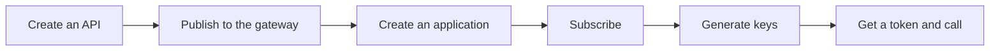

# Core flows (3.x)

!!! abstract "What this section is"
    Each page tells one story, such as "a developer subscribes to an API", and shows exactly which tables APIM 3.2.0 reads and writes along the way.

The domain pages explain *what* each table is. These pages explain *when* each table gets written. If you read the flows in order, you follow an API from its first draft to its first successful call.

## The end-to-end journey

This diagram shows the main path that almost every API takes. Each box links to its flow page.

- The first two steps happen in the **Publisher** (the API creator's side).
- The next three happen in the **Developer Portal** (the API consumer's side).
- The last step happens at the **Gateway** and the **Key Manager**.

## All flows

| # | Flow | Who does it | Main tables written |
|---|---|---|---|
| 1 | [Setup & first user](01-bootstrap.md) | Server startup, first Dev Portal action | `UM_USER`, `AM_POLICY_*`, `AM_KEY_MANAGER`, `IDN_OAUTH2_SCOPE`, `AM_SUBSCRIBER` |
| 2 | [Create an API](02-create-api.md) | Publisher | `AM_API`, `AM_API_URL_MAPPING`, `AM_API_RESOURCE_SCOPE_MAPPING`, `IDN_OAUTH2_SCOPE`, `AM_API_LC_EVENT`, registry `REG_*` |
| 3 | [Create a new version](03-new-version.md) | Publisher | `AM_API`, `AM_API_DEFAULT_VERSION` |
| 4 | [Publish to the gateway](04-publish-to-gateway.md) | Publisher → Gateway | `AM_API_LC_EVENT` (default); `AM_GW_PUBLISHED_API_DETAILS`, `AM_GW_API_ARTIFACTS` only with the synchronizer on |
| 5 | [Change lifecycle state](05-lifecycle.md) | Publisher | `AM_API_LC_EVENT`, registry lifecycle |
| 6 | [Create an API product](06-api-product.md) | Publisher | `AM_API`, `AM_API_PRODUCT_MAPPING` |
| 7 | [Create an application](07-create-application.md) | Developer Portal | `AM_SUBSCRIBER` (first time), `AM_APPLICATION` |
| 8 | [Subscribe to an API](08-subscribe.md) | Developer Portal | `AM_SUBSCRIPTION` |
| 9 | [Generate keys](09-generate-keys.md) | Developer Portal → Key Manager | `AM_APPLICATION_REGISTRATION`, `AM_APPLICATION_KEY_MAPPING`, `IDN_OAUTH_CONSUMER_APPS`, `SP_APP`, first `IDN_OAUTH2_ACCESS_TOKEN` |
| 10 | [Get a token & call the API](10-token-and-invoke.md) | Client app → Key Manager → Gateway | `IDN_OAUTH2_ACCESS_TOKEN`, `IDN_OAUTH2_ACCESS_TOKEN_SCOPE` |
| 11 | [Manage throttling policies](11-throttling-policies.md) | Admin Portal | `AM_POLICY_*`, `AM_API_THROTTLE_POLICY`, `AM_CONDITION_GROUP`, condition tables |
| 12 | [Revoke & delete](12-revocation-and-delete.md) | Any portal | `AM_REVOKED_JWT`, `IDN_OAUTH2_ACCESS_TOKEN_AUDIT`, deletes |
| 13 | [Approval workflows](13-approval-workflows.md) | Any portal + approver | `AM_WORKFLOWS` |

!!! note "Different in 4.x"
    4.x replaces flow 4 with [Deploy a revision](../../apim-4/flows/04-deploy-revision.md), which snapshots the API and deploys the snapshot to gateway environments. 4.x also adds two flows that don't exist in 3.x: [Governance check](../../apim-4/flows/14-governance.md) and [Create an AI API](../../apim-4/flows/15-ai-api.md). See [all 4.x flows](../../apim-4/flows/index.md).

## Three facts that explain most 3.x flows

1. **An API lives in two places.** Its *core* row (name, version, context, resources) is in [`AM_API`](../reference/am.md#am_api) in the APIM database. Its *full description* (docs, tags, visibility, endpoints, lifecycle state) is a registry artifact in the shared database. The API's UUID in 3.x is the registry artifact's ID, because `AM_API` has no UUID column. See [Registry](../domains/registry.md).
2. **Many links are not foreign keys.** For example, `AM_API_URL_MAPPING.API_ID` has no foreign key to `AM_API`, and applications link to OAuth clients only by the consumer key value. APIM's code keeps these links consistent.
3. **Deletes are mostly blocked, not cascaded.** In 3.2, most child tables point at `AM_API`, `AM_APPLICATION` and `AM_SUBSCRIBER` with `ON DELETE RESTRICT`. So APIM's code removes the child rows first. See [Revoke & delete](12-revocation-and-delete.md).
