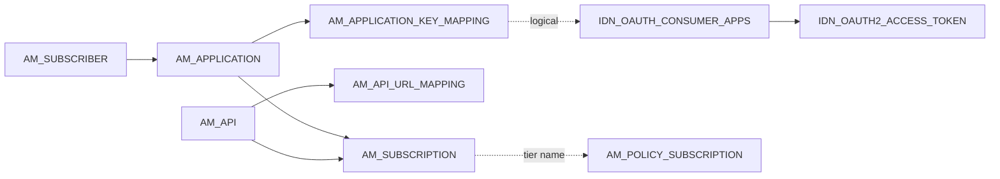

# APIM 3.x: the big picture

!!! info "Source"
    This section describes the database of **WSO2 API Manager 3.2.0**. Other 3.x releases share the same overall design but may differ in a few columns.

## What APIM 3.x keeps in its database

WSO2 API Manager stores two kinds of things:

1. **The API catalogue.** This covers who published which API, its resources (verb + path), its scopes, its rate limits and its lifecycle history.
2. **Who is allowed to call what.** This covers developers (subscribers), their applications, subscriptions to APIs, and the OAuth keys and tokens those applications use.

In 3.x this data is split across **two logical databases** and **two storage styles**:

- The **APIM database** (`WSO2AM_DB`) holds the relational core: every `AM_*` table plus the OAuth and identity tables inherited from WSO2 Identity Server.
- The **shared database** (`WSO2SHARED_DB`) holds the **registry** (`REG_*`) and the **user store** (`UM_*`).
- An API's rich metadata (description, tags, endpoints, visibility, lifecycle state, and even its UUID) lives in the **registry** as an XML "artifact". `AM_API` only keeps the few columns APIM needs for fast joins.

See [The databases](databases.md) for the details.

## Headline numbers (3.2.0)

| | Count |
|---|---|
| Tables in total | **200** |
| APIM DB tables (`AM_*` 57, `IDN_*` 59, `IDP_*` 12, `SP_*` 12, `CM_*` 10, `WF_*` 7, `FIDO*` 2) | 159 |
| Shared DB tables (`REG_*` 18, `UM_*` 23) | 41 |
| Declared foreign keys (APIM DB 95, shared DB 31) | 126 |
| Core tables explained on the domain pages | 90 |

Many of the most important relationships are **not** foreign keys. For example, an application's OAuth client is found by matching `CONSUMER_KEY` values, and policies are found by name. These are marked as *logical links* throughout.

## The hub: the most important tables on one screen

This diagram shows only the core path from a developer to a running API call.

- A **subscriber** owns **applications**. An application **subscribes** to an **API** under a tier.
- The application's **keys** point to an OAuth client, which is the thing that gets **tokens**.
- Dashed arrows are logical links: joins by value that the database doesn't enforce.

## Where to go next

**Domains** (groups of related tables):

- [Tenants & users](domains/tenancy-users.md): tenants, users and roles
- [Registry](domains/registry.md): where API metadata really lives in 3.x
- [API definition](domains/api-definition.md): `AM_API` and its resources
- [Scopes](domains/scopes.md): permissions on resources
- [API products](domains/api-products.md): bundles of resources
- [Gateway publishing](domains/gateway-publishing.md): how APIs reach gateways in 3.x
- [Lifecycle & labels](domains/lifecycle-labels.md)
- [Applications & subscriptions](domains/applications-subscriptions.md)
- [Keys & tokens](domains/keys-tokens.md)
- [Revocation](domains/revocation.md)
- [Throttling policies](domains/throttling.md)
- [Workflows](domains/workflows.md)
- [Developer Portal extras](domains/devportal-extras.md)
- [Everything else](domains/other.md)

**Core flows**: start at [All flows](flows/index.md), or jump to [Create an API](flows/02-create-api.md), [Subscribe](flows/08-subscribe.md) or [Generate keys](flows/09-generate-keys.md).

Also see [Gotchas](gotchas.md), [Identity Server tables](identity-tables.md) and the full [Table reference](reference/index.md).

!!! note "Different in 4.x"
    4.x adds revisions, gateway environments, organizations, operation policies, governance and AI APIs, and gives `AM_API` its own `API_UUID` column. See the [4.x overview](../apim-4/index.md) and [3.x vs 4.x](../comparison.md).
