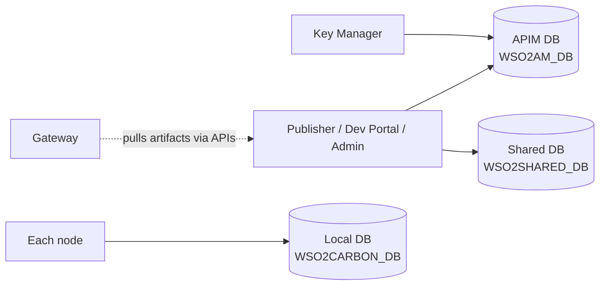

# The databases

!!! abstract "In one sentence"
    APIM 4.x stores its data in two main logical databases. The **APIM database** holds APIs, applications, keys and policies. The **shared database** holds users, roles, tenants and the registry. A few small local databases sit beside them.

## The idea

APIM is built on the WSO2 Carbon platform, and it embeds much of WSO2 Identity Server. So its data lives in more than one place:

- **What API Manager itself manages** (APIs, applications, subscriptions, policies, revisions, OAuth tokens) goes in the **APIM database**.
- **What the whole platform shares** (user accounts, roles, tenants and the *registry*, a generic file-like store) goes in the **shared database**. In a cluster, every node points at the same shared database.

Each logical database is configured in `repository/conf/deployment.toml`. Out of the box they're embedded H2 files in `repository/database/`. In production they normally point at MySQL, PostgreSQL, Oracle, MSSQL or DB2.

## The databases at a glance

This diagram shows which components use which database.

- The portals and the key manager write to both main databases.
- Gateways don't query the database directly. They pull API artifacts and subscription data from the control plane over internal APIs.
- Each node also has its own small local database.

## What lives where

| Logical name (`deployment.toml`) | Default H2 file | Script that creates it | What's inside |
|---|---|---|---|
| `[database.apim_db]` | `WSO2AM_DB` | `dbscripts/apimgt/<vendor>.sql` | All `AM_*` and `GOV_*` tables, plus the Identity Server tables APIM needs: `IDN_*` (OAuth, sessions, consent and more), `SP_*`, `IDP_*`, `CM_*`, `FIDO*` and the `WF_*` workflow engine tables. **247 tables.** |
| `[database.shared_db]` | `WSO2SHARED_DB` | `dbscripts/<vendor>.sql` | `UM_*` (users, roles, permissions, tenants, organizations) and `REG_*` (the registry). **51 tables.** |
| `[database.local]` | `WSO2CARBON_DB` | created automatically | The node's *local* registry, for node-specific settings. It isn't shared and isn't documented here. |
| message broker store | `WSO2MB_DB` | `dbscripts/mb-store/` | Internal message-broker state for event notifications. |
| metrics | `WSO2METRICS_DB` | `dbscripts/metrics/` | JVM and runtime metrics, if metrics are enabled. |

`dbscripts/multi-dc/` has variants for multi-datacentre setups. They define the same logical tables.

!!! tip "One schema, many vendors"
    `mysql.sql`, `postgresql.sql`, `oracle.sql`, `mssql.sql`, `db2.sql` and `h2.sql` all create the same logical tables. This site reads `mysql.sql` because its key syntax is the clearest.

## Registry vs relational tables

An important and often surprising fact: **not everything about an API is in `AM_API`.**

- The **relational tables** (`AM_*`) hold what APIM needs to *query and join quickly*: name, version, context, owner, status, resources, subscriptions and policies.
- The **registry** (`REG_*`, in the shared DB) holds the *full API document*: description, tags, visibility settings, business owner, thumbnail, the OpenAPI/GraphQL/AsyncAPI definition, and documentation pages. It also holds the lifecycle state machine.

The two are tied together by the API UUID: `AM_API.API_UUID` is the same value as the registry artifact's `REG_RESOURCE.REG_UUID`. See the [Registry](domains/registry.md) page.

## The Identity Server tables

APIM's built-in **Resident Key Manager** is WSO2 Identity Server code running inside APIM. It brings about 114 tables with it. APIM relies directly on only a handful of them: the OAuth client, token and scope tables, and the service provider row created for each OAuth app. Those are explained on [Keys & tokens](domains/keys-tokens.md), [Scopes](domains/scopes.md) and [Revocation](domains/revocation.md). The rest (SAML, OpenID, sessions, consent, identity providers, FIDO and so on) get one line each on [Identity Server tables](identity-tables.md).

!!! note "Different in 3.x"
    The split is the same in 3.x. But in 3.x even more lived only in the registry: the API UUID wasn't stored in `AM_API` at all. See [3.x databases](../apim-3/databases.md).
