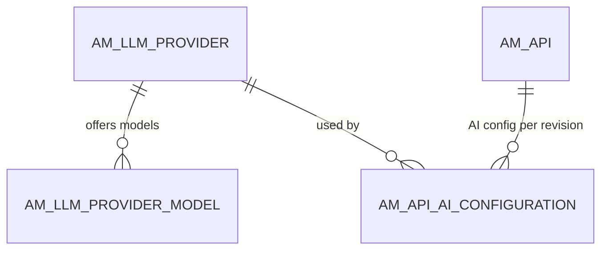
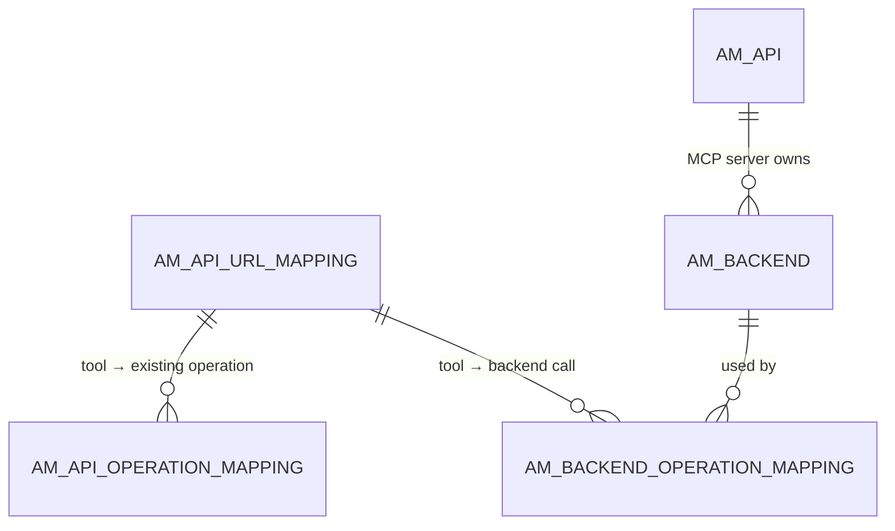

# AI APIs

!!! abstract "In one sentence"
    4.x can put an API in front of a large-language-model service (an *AI API*), and can expose APIs as tools for AI agents (an *MCP server*). These tables store the LLM providers, which provider each AI API uses, and how MCP tools map to real operations.

## The idea

**AI APIs.** An admin registers **LLM providers**, such as OpenAI, Azure OpenAI, Mistral or AWS Bedrock (several are built in). Each provider has models and a connection configuration. An API creator then builds an API whose backend is one of those providers. APIM remembers which provider the API (and each revision of it) uses, so the gateway can handle provider-specific details such as counting prompt and completion tokens. Those token counts feed the AI token quotas on [subscription policies](throttling.md#am_policy_subscription).

**MCP servers.** The *Model Context Protocol* lets AI agents call "tools". In APIM an MCP server is an `AM_API` row of type `MCP`, and each tool is one of its `AM_API_URL_MAPPING` rows. A tool gets its real work done in one of two ways:

- it **reuses an operation of an existing API**, recorded in `AM_API_OPERATION_MAPPING`, or
- it **calls a backend directly**, using a backend defined in `AM_BACKEND` and mapped in `AM_BACKEND_OPERATION_MAPPING`.

## How the tables connect

AI APIs and LLM providers:



MCP server tools:



- `AM_API_OPERATION_MAPPING` has **two** FKs to `AM_API_URL_MAPPING`: one to the tool (`URL_MAPPING_ID`) and one to the reused operation (`REF_URL_MAPPING_ID`).
- None of these FKs declare `ON DELETE`, so the application removes the mappings before deleting the rows they point at.

## The tables

### AM_LLM_PROVIDER

**One row =** one LLM provider, at one API version.

| Column | What it means |
|---|---|
| `UUID` | Primary key. |
| `NAME`, `API_VERSION` | E.g. `OpenAI`, `v1`. Unique per `ORGANIZATION`. |
| `BUILT_IN_SUPPORT` | Whether it ships with APIM or was added by an admin. |
| `CONFIGURATIONS` | How to connect and where to find token counts in responses (JSON). |
| `API_DEFINITION` | The provider's API definition, used to create AI APIs from it. |
| `MODEL_FAMILY_SUPPORTED`, `DESCRIPTION` | Extra information. |

[Full column list](../reference/am.md#am_llm_provider)

### AM_LLM_PROVIDER_MODEL

**One row =** one model offered by a provider, e.g. `gpt-4o`. It has `MODEL_NAME`, `MODEL_FAMILY_NAME` and `LLM_PROVIDER_UUID` (FK). [Full column list](../reference/am.md#am_llm_provider_model)

### AM_API_AI_CONFIGURATION

**One row =** "this AI API (current copy or revision) uses this LLM provider".

| Column | What it means |
|---|---|
| `AI_CONFIGURATION_UUID` | Primary key. |
| `API_UUID` | The API (FK → `AM_API.API_UUID`). |
| `API_REVISION_UUID` | Which copy of the API. It's a logical link to `AM_REVISION`, and **`NULL` for the current copy** (verified). |
| `LLM_PROVIDER_UUID` | The provider (FK → `AM_LLM_PROVIDER`). |

!!! success "Verified on a running server (APIM 4.7.0)"
    Creating `ChatAPI` on the built-in OpenAI 2.0.0 provider wrote:
    - `AM_API` with `API_TYPE = 'HTTP'` and `API_SUBTYPE = 'AIAPI'`,
    - one row here (`API_REVISION_UUID = NULL`, `LLM_PROVIDER_UUID = 4d78…`),
    - an `AM_API_PRIMARY_EP_MAPPING` row pointing at `default_production_endpoint`.

    No `AM_API_ENDPOINTS` row was written. See [Create an AI API](../flows/15-ai-api.md).

[Full column list](../reference/am.md#am_api_ai_configuration)

### AM_API_OPERATION_MAPPING

**One row =** "MCP tool T (`URL_MAPPING_ID`) runs existing API operation O (`REF_URL_MAPPING_ID`)". Both columns are FKs to `AM_API_URL_MAPPING`, and `MAPPING_ID` is the PK.

**Watch out:** the reused operation belongs to *another* API. APIM counts these references to warn you before you change or delete an operation that an MCP server uses.

[Full column list](../reference/am.md#am_api_operation_mapping)

### AM_BACKEND

**One row =** one backend defined inside an MCP server (or another API that owns backends directly).

| Column | What it means |
|---|---|
| `BACKEND_ID` | Primary key. |
| `BACKEND_NAME` | Unique per API revision. |
| `ENDPOINT_CONFIG`, `DEFINITION` | Where to call it, and its API definition. |
| `REFERENCE_API_UUID` | The owning API (FK → `AM_API.API_UUID`). |
| `REFERENCE_API_REVISION_UUID` | `'Current API'` or a revision UUID. |
| `ORGANIZATION` | Owner. |

[Full column list](../reference/am.md#am_backend)

### AM_BACKEND_OPERATION_MAPPING

**One row =** "tool T calls backend B with verb `VERB` on path `TARGET`". It has `URL_MAPPING_ID` (FK) and `BACKEND_ID` (FK). [Full column list](../reference/am.md#am_backend_operation_mapping)

## Example

An MCP server exposing PizzaShack's `GET /menu` as the tool `listMenu`:

| Table | Row |
|---|---|
| `AM_API` | `API_ID = 30`, `API_NAME = PizzaMCP`, `API_TYPE = MCP` |
| `AM_API_URL_MAPPING` | `URL_MAPPING_ID = 300`, `API_ID = 30`, `URL_PATTERN = listMenu` (the tool) |
| `AM_API_OPERATION_MAPPING` | `URL_MAPPING_ID = 300`, `REF_URL_MAPPING_ID = 10` (PizzaShack `GET /menu`) |

## Try it

```sql
-- AI APIs and the provider each revision uses
SELECT a.API_NAME, a.API_VERSION, c.API_REVISION_UUID, p.NAME AS PROVIDER, p.API_VERSION AS PROVIDER_VERSION
FROM AM_API_AI_CONFIGURATION c
JOIN AM_API a ON a.API_UUID = c.API_UUID
JOIN AM_LLM_PROVIDER p ON p.UUID = c.LLM_PROVIDER_UUID;
```

## Related flows

- [Create an AI API](../flows/15-ai-api.md)
- [Create an API](../flows/02-create-api.md)

!!! note "New in 4.x"
    None of these tables exist in 3.x. AI APIs and MCP servers were added in later 4.x releases.
