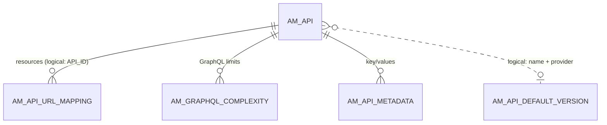
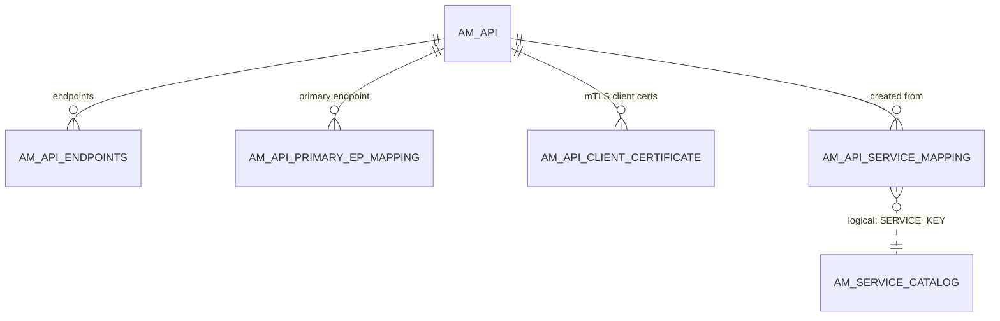

# API definition

!!! abstract "In one sentence"
    These tables describe an API as the Publisher sees it: its name, version and context, its resources (verb + path), its endpoints and certificates, and where it came from (for example the service catalog).

## The idea

When an API creator builds an API such as **PizzaShackAPI 1.0.0** with the context `/pizzashack`, APIM writes:

- **one row in `AM_API`**, the API's identity card, and
- **one row per resource in `AM_API_URL_MAPPING`**: `GET /menu`, `POST /order`, `GET /order/{orderId}` and so on.

Everything else in this domain is optional detail that hangs off those two tables: endpoints, GraphQL complexity limits, mutual-TLS certificates, links to the service catalog, per-environment property overrides.

Every *version* of an API is a separate `AM_API` row. So is every *API product*, because products reuse `AM_API` with `API_TYPE = 'APIProduct'`. See [API products](api-products.md).

!!! info "The 'current API' vs revisions"
    From 4.x, the API you edit in the Publisher is the **current API**. Deploying takes a read-only snapshot called a *revision* (see [Revisions & deployment](revisions-deployment.md)). Many tables here have a revision column that says which copy a row belongs to:

    - `AM_API_URL_MAPPING.REVISION_UUID` is **NULL** for the current API.
    - `AM_API_ENDPOINTS`, `AM_API_PRIMARY_EP_MAPPING`, `AM_API_METADATA` and `AM_API_CLIENT_CERTIFICATE` use the literal text **`'Current API'`** instead.
    - `AM_API_SEQUENCE_BACKEND` uses `'0'`.

## How the tables connect

The API and its resources:



- `AM_API_URL_MAPPING.API_ID` has **no FK** in 4.x, although it always holds an `AM_API.API_ID`.
- The default-version row is matched on API name + provider, not on an ID.

Endpoints, certificates and service catalog:



- All the solid links cascade: delete the API and these rows go with it.
- The service-catalog link is by `SERVICE_KEY` + tenant, with no FK.

## The tables

### AM_API

**One row =** one version of one API (or one API product).

| Column | What it means |
|---|---|
| `API_ID` | Internal number. Most child tables point here. |
| `API_UUID` | Public ID, used in REST APIs and in newer child tables. **Same as the registry artifact's `REG_UUID`.** |
| `API_PROVIDER`, `API_NAME`, `API_VERSION` | Who owns it, its name and its version. Unique per `ORGANIZATION`. |
| `CONTEXT` / `CONTEXT_TEMPLATE` | The URL prefix, e.g. `/pizzashack/1.0.0` with the template `/pizzashack/{version}`. |
| `API_TYPE` / `API_SUBTYPE` | Kind of API, e.g. `HTTP`, `SOAP`, `SOAPTOREST`, `GRAPHQL`, `WS`, `WEBSUB`, `SSE`, `ASYNC`, `APIProduct`, `MCP`. The subtype refines it, e.g. an AI API. |
| `STATUS` | Lifecycle state (`CREATED`, `PUBLISHED`, `DEPRECATED`, and so on). See [Lifecycle](lifecycle-labels.md). |
| `API_TIER` | An optional **API-level** throttling policy. When it's set, it overrides the per-resource tiers. |
| `ORGANIZATION` | Owning organization or tenant domain. |
| `REVISIONS_CREATED` | Counter used to number new revisions. |
| `GATEWAY_VENDOR` | `wso2` for the built-in gateway, or an external/federated gateway vendor. |
| `SUB_VALIDATION` | `ENABLED`, or `DISABLED` for APIs that can be called without a subscription. |
| `INITIATED_FROM_GW`, `IS_EGRESS` | Flags for APIs discovered from a federated gateway, and for egress (outbound) APIs. |
| `LOG_LEVEL`, `API_DISPLAY_NAME`, `VERSION_COMPARABLE` | Per-API logging, the display name, and a sortable version string. |

**Connects to:** almost everything. Older tables point to it by the integer `API_ID` (subscriptions, URL mappings, lifecycle events, comments). Newer 4.x tables point to it by `API_UUID` (revisions, endpoints, operation policies, labels, AI configuration). The FKs usually cascade on delete. A few are RESTRICT, e.g. `AM_EXTERNAL_STORES`.

**Watch out:** the full description, tags, visibility, business owner and the OpenAPI definition are **not** here. They're in the [registry](registry.md).

[Full column list](../reference/am.md#am_api)

### AM_API_URL_MAPPING

**One row =** one resource (HTTP verb + path) of one API, in the current API *or* in one revision.

| Column | What it means |
|---|---|
| `URL_MAPPING_ID` | Primary key. Scopes, policies and product mappings point here. |
| `API_ID` | Owning API. *Logical link* to `AM_API.API_ID` (no FK). |
| `HTTP_METHOD`, `URL_PATTERN` | E.g. `GET` and `/order/{orderId}`. For GraphQL these are operation types and names. For MCP they're tools. |
| `AUTH_SCHEME` | Security for this resource, e.g. `Any` (secured) or `None` (open). |
| `THROTTLING_TIER` | Resource-level rate-limit policy **name**. It's a logical link to `AM_API_THROTTLE_POLICY.NAME`. |
| `REVISION_UUID` | NULL for the current API, otherwise the revision this copy belongs to. |
| `MEDIATION_SCRIPT`, `DESCRIPTION`, `SCHEMA_DEFINITION`, `LOG_LEVEL` | An optional script, a description, a schema (used by MCP tools, for example) and per-resource logging. |

**Connects to:** [`AM_API_RESOURCE_SCOPE_MAPPING`](scopes.md#am_api_resource_scope_mapping), [`AM_API_OPERATION_POLICY_MAPPING`](operation-policies.md#am_api_operation_policy_mapping), [`AM_API_PRODUCT_MAPPING`](api-products.md#am_api_product_mapping) and the MCP tables [`AM_API_OPERATION_MAPPING`](ai-apis.md#am_api_operation_mapping) and [`AM_BACKEND_OPERATION_MAPPING`](ai-apis.md#am_backend_operation_mapping). Most of those FKs cascade when a URL mapping is deleted.

**Watch out:** creating a revision **copies** every resource row, and each copy gets a new `URL_MAPPING_ID`. To get only the editable resources, filter with `REVISION_UUID IS NULL`.

[Full column list](../reference/am.md#am_api_url_mapping)

### AM_API_DEFAULT_VERSION

**One row =** "for API *name* by *provider*, this version is the default". The default version is the one served when a caller leaves the version out of the URL.

| Column | What it means |
|---|---|
| `API_NAME`, `API_PROVIDER`, `ORGANIZATION` | Which API family. |
| `DEFAULT_API_VERSION` | The version marked as default in the Publisher. |
| `PUBLISHED_DEFAULT_API_VERSION` | The default version that's actually published. |

**Connects to:** `AM_API` *logically*, by name + provider + version. There's no FK.

[Full column list](../reference/am.md#am_api_default_version)

### AM_API_CATEGORIES

**One row =** an API category, such as "Finance", that an admin created for grouping APIs in the Developer Portal. It has `UUID`, `NAME` (unique per `ORGANIZATION`) and `DESCRIPTION`.

**Watch out:** there's no mapping table. Which categories an API belongs to is stored in the API's **registry artifact**.

[Full column list](../reference/am.md#am_api_categories)

### AM_GRAPHQL_COMPLEXITY

**One row =** the complexity weight of one field of one type in a GraphQL API's schema, e.g. `Query.orders = 5`. It's used for query-complexity limits. It has `API_ID` (FK → `AM_API`, cascade), `TYPE`, `FIELD`, `COMPLEXITY_VALUE` and `REVISION_UUID`.

[Full column list](../reference/am.md#am_graphql_complexity)

### AM_API_CLIENT_CERTIFICATE

**One row =** a client certificate that is allowed to call an API over **mutual TLS**.

| Column | What it means |
|---|---|
| `ALIAS` | Certificate alias. |
| `API_ID` | API (FK → `AM_API.API_ID`, cascade). |
| `CERTIFICATE` | The certificate itself. |
| `TIER_NAME` | The rate-limit tier applied to callers using this certificate. |
| `KEY_TYPE` | `PRODUCTION` or `SANDBOX`. |
| `REVISION_UUID` | `'Current API'` or a revision UUID. |
| `REMOVED` | Soft-delete flag. |

[Full column list](../reference/am.md#am_api_client_certificate)

### AM_CERTIFICATE_METADATA

**One row =** a **backend endpoint** certificate that a tenant uploaded, so the gateway can trust an HTTPS backend. It has `ALIAS` (PK), `END_POINT`, `CERTIFICATE` and `TENANT_ID`.

**Watch out:** it's linked to the endpoint by URL text, not to an API ID. Don't confuse it with the *client* certificates above.

[Full column list](../reference/am.md#am_certificate_metadata)

### AM_API_ENDPOINTS

**One row =** one named backend endpoint of an API (4.x supports several endpoints per API).

| Column | What it means |
|---|---|
| `API_UUID` | API (FK → `AM_API.API_UUID`, cascade). |
| `ENDPOINT_UUID`, `ENDPOINT_NAME` | Endpoint identity. |
| `KEY_TYPE` | Whether it serves `PRODUCTION` or `SANDBOX` traffic. |
| `ENDPOINT_CONFIG` | The endpoint configuration JSON (URLs, timeouts, security). |
| `REVISION_UUID` | `'Current API'` or a revision UUID. |

[Full column list](../reference/am.md#am_api_endpoints)

### AM_API_PRIMARY_EP_MAPPING

**One row =** "for this API (and revision), this endpoint is the primary one". It has `API_UUID` (FK, cascade), `ENDPOINT_UUID` (a *logical link* to `AM_API_ENDPOINTS`) and `REVISION_UUID`.

[Full column list](../reference/am.md#am_api_primary_ep_mapping)

### AM_API_METADATA

**One row =** one custom key/value attached to an API revision (`METADATA_KEY` / `METADATA_VALUE`). `API_UUID` → `AM_API` (FK), and `REVISION_UUID` defaults to `'Current API'`.

[Full column list](../reference/am.md#am_api_metadata)

### AM_API_SEQUENCE_BACKEND

**One row =** a mediation *sequence* used as the API's backend, instead of a real HTTP endpoint (the "sequence as backend" option).

| Column | What it means |
|---|---|
| `API_UUID` | API (FK, cascade). |
| `REVISION_UUID` | `'0'` for the current API, otherwise the revision UUID. |
| `SEQUENCE`, `NAME` | The sequence content and its name. |
| `TYPE` | Which traffic it serves, e.g. production or sandbox. |

[Full column list](../reference/am.md#am_api_sequence_backend)

### AM_API_ENVIRONMENT_KEYS

**One row =** property values for one API *in one gateway environment*. For example, a different backend URL in the "Staging" environment. It has `API_UUID` (FK, cascade), `ENVIRONMENT_ID` (a *logical link* to a gateway environment) and `PROPERTY_CONFIG` (JSON). (`ENVIRONMENT_ID`, `API_UUID`) is unique.

[Full column list](../reference/am.md#am_api_environment_keys)

### AM_API_SERVICE_MAPPING

**One row =** "this API was created from this service catalog entry".

| Column | What it means |
|---|---|
| `API_ID` | API (FK → `AM_API.API_ID`, cascade). |
| `SERVICE_KEY` | Service (logical link to `AM_SERVICE_CATALOG.SERVICE_KEY` + `TENANT_ID`). |
| `MD5` | Hash of the service definition when the API was created. It's used to warn that "the service has changed". |

[Full column list](../reference/am.md#am_api_service_mapping)

### AM_SERVICE_CATALOG

**One row =** one backend service registered in the **service catalog**, usually pushed there by a CI pipeline or an integration server.

| Column | What it means |
|---|---|
| `UUID` | Primary key. |
| `SERVICE_KEY` | Stable key, unique per tenant. APIs link to it through `AM_API_SERVICE_MAPPING`. |
| `SERVICE_NAME`, `SERVICE_VERSION` | Unique per tenant. |
| `SERVICE_URL`, `DEFINITION_TYPE`, `SERVICE_DEFINITION` | Where the service runs and its OpenAPI/AsyncAPI/WSDL. |
| `SECURITY_TYPE`, `MUTUAL_SSL_ENABLED` | How the backend is secured. |
| `MD5` | Hash of the definition. |

[Full column list](../reference/am.md#am_service_catalog)

### AM_SECURITY_AUDIT_UUID_MAPPING

**One row =** the ID of the external security-audit report for an API. APIM integrates with an API security-audit service for OpenAPI definitions. It has `API_ID` (FK, cascade) and `AUDIT_UUID`.

[Full column list](../reference/am.md#am_security_audit_uuid_mapping)

## Example

| Table | Row |
|---|---|
| `AM_API` | `API_ID = 1`, `API_UUID = 5f1c…`, `API_NAME = PizzaShackAPI`, `API_VERSION = 1.0.0`, `CONTEXT = /pizzashack/1.0.0`, `API_TYPE = HTTP` |
| `AM_API_URL_MAPPING` | `URL_MAPPING_ID = 10`, `API_ID = 1`, `GET /menu`, `THROTTLING_TIER = Unlimited`, `REVISION_UUID = NULL` |
| `AM_API_URL_MAPPING` | `URL_MAPPING_ID = 11`, `API_ID = 1`, `POST /order`, `THROTTLING_TIER = 10KPerMin`, `REVISION_UUID = NULL` |
| `AM_API_ENDPOINTS` | `API_UUID = 5f1c…`, `ENDPOINT_NAME = default`, `KEY_TYPE = PRODUCTION`, `REVISION_UUID = Current API` |

## Try it

```sql
-- Resources of every API's editable (current) copy
SELECT a.API_NAME, a.API_VERSION, u.HTTP_METHOD, u.URL_PATTERN, u.THROTTLING_TIER
FROM AM_API a
JOIN AM_API_URL_MAPPING u ON u.API_ID = a.API_ID
WHERE u.REVISION_UUID IS NULL
ORDER BY a.API_NAME, a.API_VERSION, u.URL_PATTERN;
```

## Related flows

- [Create an API](../flows/02-create-api.md)
- [Create a new version](../flows/03-new-version.md)
- [Deploy a revision](../flows/04-deploy-revision.md)

!!! note "Different in 3.x"
    3.x `AM_API` has **no `API_UUID`**, `ORGANIZATION` or `STATUS` column, and none of the endpoint, metadata, service-catalog or environment-keys tables exist. URL mappings have no revision column. See [3.x API definition](../../apim-3/domains/api-definition.md).
