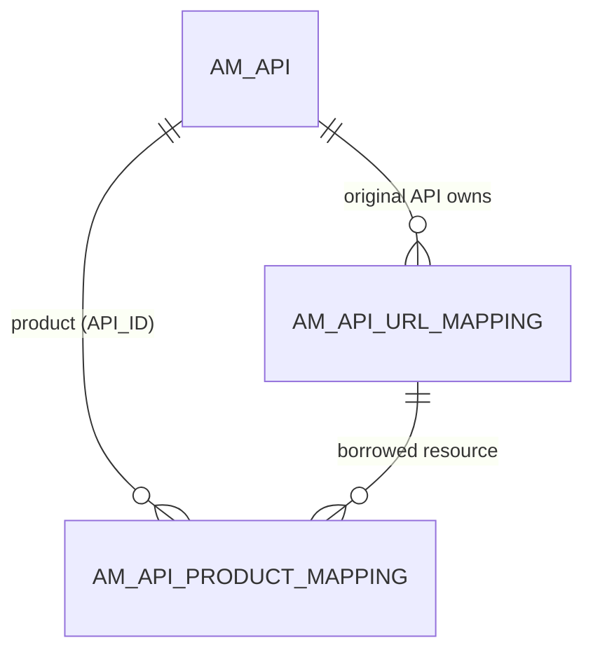

# API products

!!! abstract "In one sentence"
    An API product bundles resources taken from one or more APIs into a single package that consumers subscribe to. It's stored as a normal `AM_API` row, plus one mapping row for each resource it borrows.

## The idea

Say you have a *Menu API* and an *Order API*, and you want to sell a "Pizza Starter Pack" that contains `GET /menu` from the first and `POST /order` from the second. You create an **API product**:

- APIM writes **one `AM_API` row** for the product, with `API_TYPE = 'APIProduct'`. The product has its own name, context, version, lifecycle, subscriptions and revisions, exactly like an API.
- The product doesn't get new resources of its own. Instead, APIM writes **one `AM_API_PRODUCT_MAPPING` row per borrowed resource**, pointing at the *original API's* `AM_API_URL_MAPPING` row.

So consumers subscribe to the product (`AM_SUBSCRIPTION.API_ID` = the product's `API_ID`), and the gateway routes each call to the underlying API's backend.

## How the tables connect

This diagram shows a product borrowing resources from an API.



- The top `AM_API` row is the *product*. The `AM_API` row on the right owns the resource.
- Both FKs cascade. Deleting the product removes its mappings, and deleting an underlying resource removes it from every product.

## The tables

### AM_API_PRODUCT_MAPPING

**One row =** "API product P includes resource R", for the current product or one of its revisions.

| Column | What it means |
|---|---|
| `API_PRODUCT_MAPPING_ID` | Primary key. |
| `API_ID` | The **product's** `AM_API.API_ID` (FK, cascade). |
| `URL_MAPPING_ID` | The **original API's** resource in `AM_API_URL_MAPPING` (FK, cascade). |
| `REVISION_UUID` | Which copy of the product this row belongs to. It's NULL or empty for the current product and a revision UUID for snapshots. This is a *logical link* to `AM_REVISION`. |

**Watch out:**

- The column is named `API_ID`, but it holds the *product's* ID, not the underlying API's ID. To find the underlying API, go through `URL_MAPPING_ID` → `AM_API_URL_MAPPING.API_ID`.
- A product's revision points at the underlying API's resource rows, so the underlying API has to stay deployed and published for the product to work.

[Full column list](../reference/am.md#am_api_product_mapping)

## Example

| Table | Row |
|---|---|
| `AM_API` | `API_ID = 7`, `API_NAME = PizzaStarterPack`, `API_TYPE = APIProduct`, `CONTEXT = /starter/1.0.0` |
| `AM_API_URL_MAPPING` | `URL_MAPPING_ID = 10`, `API_ID = 1` (MenuAPI), `GET /menu` |
| `AM_API_URL_MAPPING` | `URL_MAPPING_ID = 21`, `API_ID = 2` (OrderAPI), `POST /order` |
| `AM_API_PRODUCT_MAPPING` | `API_ID = 7`, `URL_MAPPING_ID = 10` |
| `AM_API_PRODUCT_MAPPING` | `API_ID = 7`, `URL_MAPPING_ID = 21` |

## Try it

```sql
-- Which resources, from which APIs, make up each API product?
SELECT prod.API_NAME AS PRODUCT, src.API_NAME AS FROM_API, src.API_VERSION,
       u.HTTP_METHOD, u.URL_PATTERN
FROM AM_API_PRODUCT_MAPPING pm
JOIN AM_API prod ON prod.API_ID = pm.API_ID
JOIN AM_API_URL_MAPPING u ON u.URL_MAPPING_ID = pm.URL_MAPPING_ID
JOIN AM_API src ON src.API_ID = u.API_ID
WHERE prod.API_TYPE = 'APIProduct';
```

## Related flows

- [Create an API product](../flows/06-api-product.md)
- [Subscribe to an API](../flows/08-subscribe.md): subscribing to a product works the same way

!!! note "Different in 3.x"
    The idea is the same in 3.x, but `AM_API_PRODUCT_MAPPING` has no `REVISION_UUID`, because products weren't revisioned. See [3.x API products](../../apim-3/domains/api-products.md).
