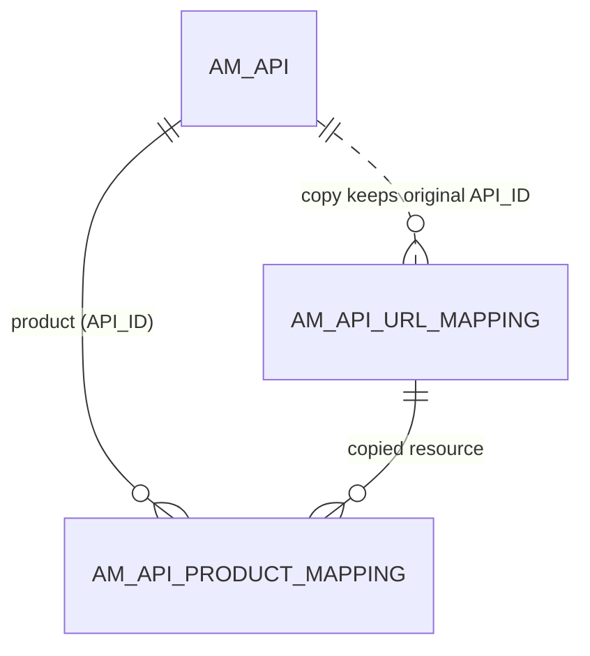

# API products

!!! abstract "In one sentence"
    An API product bundles resources taken from one or more APIs into a single package that consumers subscribe to. It's stored as a normal `AM_API` row, plus a copied resource row and a mapping row for each resource it borrows.

## The idea

Say you have a *Menu API* and an *Order API*, and you want to sell a "Pizza Starter Pack" that contains `GET /menu` from the first and `POST /order` from the second. You create an **API product**:

- APIM writes **one `AM_API` row** for the product, with `API_TYPE = 'APIProduct'`. The product has its own name, context, version, lifecycle, subscriptions and revisions, exactly like an API.
- For each borrowed resource, APIM **copies** the original API's `AM_API_URL_MAPPING` row. The copy keeps `API_ID` = the original API, and stores the product's `API_ID` (as text) in `REVISION_UUID`. APIM then writes **one `AM_API_PRODUCT_MAPPING` row** pointing at that copy.

!!! success "Verified on a running server (APIM 4.7.0)"
    Creating a product with `GET /menu` from PizzaShackAPI wrote a new `AM_API_URL_MAPPING` row (`URL_MAPPING_ID = 7`, `API_ID = 1`, `REVISION_UUID = '3'`) and `AM_API_PRODUCT_MAPPING` (`API_ID = 3`, `URL_MAPPING_ID = 7`, `REVISION_UUID = 'Current API'`). Deleting the product removed both. See [Create an API product](../flows/06-api-product.md).

So consumers subscribe to the product (`AM_SUBSCRIPTION.API_ID` = the product's `API_ID`), and the gateway routes each call to the underlying API's backend.

## How the tables connect

This diagram shows a product borrowing resources from an API.



- The top `AM_API` row is the *product*. The copied resource row still names the *original* API in `API_ID`, which isn't an FK.
- Both FKs on the mapping cascade. Deleting the product removed its mapping and its copied resource rows (verified).

## The tables

### AM_API_PRODUCT_MAPPING

**One row =** "API product P includes resource R", for the current product or one of its revisions.

| Column | What it means |
|---|---|
| `API_PRODUCT_MAPPING_ID` | Primary key. |
| `API_ID` | The **product's** `AM_API.API_ID` (FK, cascade). |
| `URL_MAPPING_ID` | The **copied** resource row in `AM_API_URL_MAPPING` (FK, cascade). That row carries the original API's `API_ID`. |
| `REVISION_UUID` | Which copy of the product this row belongs to: `'Current API'` for the current product (verified), or a revision UUID for snapshots. This is a *logical link* to `AM_REVISION`. |

**Watch out:**

- The column is named `API_ID`, but it holds the *product's* ID, not the underlying API's ID. To find the underlying API, go through `URL_MAPPING_ID` → `AM_API_URL_MAPPING.API_ID`.
- A product's revision points at the underlying API's resource rows, so the underlying API has to stay deployed and published for the product to work.

[Full column list](../reference/am.md#am_api_product_mapping)

## Example

These are real rows from a 4.7.0 test server:

| Table | Row |
|---|---|
| `AM_API` | `API_ID = 3`, `API_NAME = FoodDelivery`, `API_TYPE = APIProduct`, `CONTEXT = /food/1.0.0` |
| `AM_API_URL_MAPPING` | `URL_MAPPING_ID = 1`, `API_ID = 1` (PizzaShackAPI), `GET /menu`, `REVISION_UUID = NULL` *(the API's own row)* |
| `AM_API_URL_MAPPING` | `URL_MAPPING_ID = 7`, `API_ID = 1`, `GET /menu`, `REVISION_UUID = '3'` *(the product's copy)* |
| `AM_API_PRODUCT_MAPPING` | `API_ID = 3`, `URL_MAPPING_ID = 7`, `REVISION_UUID = Current API` |
| `AM_API_DEFAULT_VERSION` | `API_NAME = FoodDelivery`, `DEFAULT_API_VERSION = 1.0.0` |

## Try it

```sql
-- Which resources, from which APIs, make up each API product?
SELECT prod.API_NAME AS PRODUCT, src.API_NAME AS FROM_API, src.API_VERSION,
       u.HTTP_METHOD, u.URL_PATTERN
FROM AM_API_PRODUCT_MAPPING pm
JOIN AM_API prod ON prod.API_ID = pm.API_ID
JOIN AM_API_URL_MAPPING u ON u.URL_MAPPING_ID = pm.URL_MAPPING_ID
JOIN AM_API src ON src.API_ID = u.API_ID
WHERE prod.API_TYPE = 'APIProduct';
```

## Related flows

- [Create an API product](../flows/06-api-product.md)
- [Subscribe to an API](../flows/08-subscribe.md): subscribing to a product works the same way

!!! note "Different in 3.x"
    In 3.x, `AM_API_PRODUCT_MAPPING` points **directly** at the original API's resource row, with no copy, and has no `REVISION_UUID`, because products weren't revisioned. See [3.x API products](../../apim-3/domains/api-products.md).
