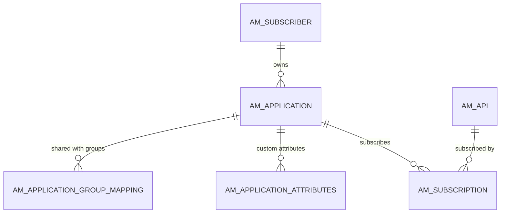

# Applications & subscriptions

!!! abstract "In one sentence"
    This is the consumer side of APIM: *subscribers* (Developer Portal users) own *applications*, and applications *subscribe* to APIs under a chosen tier.

## The idea

A developer wants their mobile app to call the PizzaShack API. In the Developer Portal they:

1. **Log in.** The first time they do anything, APIM creates an `AM_SUBSCRIBER` row for them.
2. **Create an application**, e.g. "PizzaMobile", with an application tier such as `Unlimited`. That's an `AM_APPLICATION` row.
3. **Subscribe** the application to PizzaShackAPI with the subscription tier `Gold`. That's an `AM_SUBSCRIPTION` row.
4. Then they generate keys. That's covered on [Keys & tokens](keys-tokens.md).

Think of the application as a **membership card** for the developer's software, and each subscription as **a pass for one API** printed on that card, with a rate limit attached.

## How the tables connect



- `AM_SUBSCRIPTION` is the many-to-many bridge between applications and APIs.
- Deleting an application or an API **cascades** to its subscriptions. You **can't** delete a subscriber that still owns applications (the FK is RESTRICT).
- The tiers are matched **by name**: `AM_APPLICATION.APPLICATION_TIER` → `AM_POLICY_APPLICATION.NAME` and `AM_SUBSCRIPTION.TIER_ID` → `AM_POLICY_SUBSCRIPTION.NAME`. See [Throttling](throttling.md).

## The tables

### AM_SUBSCRIBER

**One row =** one Developer Portal user, in one tenant.

| Column | What it means |
|---|---|
| `SUBSCRIBER_ID` | Primary key. |
| `USER_ID` | The user's **name**, e.g. `admin` or `alice@wso2.com`. It's a logical link to the user store. |
| `TENANT_ID` | Tenant. (`TENANT_ID`, `USER_ID`) is unique. |
| `EMAIL_ADDRESS`, `DATE_SUBSCRIBED` | Contact details, and when the row was created. |

**Connects to:** `AM_APPLICATION` (FK, restrict), `AM_APPLICATION_REGISTRATION` (FK, restrict) and `AM_API_RATINGS` (FK, restrict).

**Watch out:** it's created lazily on the user's first Developer Portal action, not when the user account is created. `USER_ID` is text, not a numeric ID.

[Full column list](../reference/am.md#am_subscriber)

### AM_APPLICATION

**One row =** one application owned by a subscriber.

| Column | What it means |
|---|---|
| `APPLICATION_ID` | Internal number. Most child tables use it. |
| `UUID` | Public ID, used in REST APIs and some 4.x tables (API keys, for example). |
| `NAME` | Unique per (`SUBSCRIBER_ID`, `ORGANIZATION`). |
| `SUBSCRIBER_ID` | Owner (FK → `AM_SUBSCRIBER`, restrict). |
| `APPLICATION_TIER` | Application-level rate-limit policy **name** (logical link to `AM_POLICY_APPLICATION.NAME`). |
| `APPLICATION_STATUS` | `APPROVED`, or `CREATED` while waiting for an approval workflow, or `REJECTED`. |
| `TOKEN_TYPE` | The kind of tokens its keys issue (e.g. `JWT`). |
| `GROUP_ID` | Legacy group-sharing value. Newer sharing uses `AM_APPLICATION_GROUP_MAPPING`. |
| `CALLBACK_URL`, `DESCRIPTION` | OAuth callback and description. |
| `ORGANIZATION`, `SHARED_ORGANIZATION` | Owning organization, and an organization the app is shared with. |

**Connects to:** subscriptions, key mappings, registrations, attributes and group mappings. All of these are FKs that cascade when the application is deleted.

**Watch out:** every subscriber gets a `DefaultApplication` automatically.

[Full column list](../reference/am.md#am_application)

### AM_APPLICATION_ATTRIBUTES

**One row =** one custom attribute of an application, e.g. `Business Unit = Retail`. The attributes available are configured by the admin. The primary key is (`APPLICATION_ID`, `NAME`), and `APP_ATTRIBUTE` holds the value. FK → `AM_APPLICATION`, cascade.

[Full column list](../reference/am.md#am_application_attributes)

### AM_APPLICATION_GROUP_MAPPING

**One row =** "application A is shared with group G in tenant T". Everyone in that group can see and use the application. The primary key is (`APPLICATION_ID`, `GROUP_ID`, `TENANT`). FK → `AM_APPLICATION`, cascade.

[Full column list](../reference/am.md#am_application_group_mapping)

### AM_SUBSCRIPTION

**One row =** "application X may call API Y (or API product Y) under tier Z".

| Column | What it means |
|---|---|
| `SUBSCRIPTION_ID`, `UUID` | Internal and public IDs. |
| `APPLICATION_ID` | Application (FK, cascade). |
| `API_ID` | API or API product (FK → `AM_API.API_ID`, cascade). |
| `TIER_ID` | Subscription tier **name**, e.g. `Gold` (logical link to `AM_POLICY_SUBSCRIPTION.NAME`). |
| `TIER_ID_PENDING` | The new tier requested while a tier-change approval is pending. |
| `SUB_STATUS` | E.g. `UNBLOCKED` (active), `BLOCKED`, `PROD_ONLY_BLOCKED`, `ON_HOLD` (waiting for approval), `REJECTED`. |
| `SUBS_CREATE_STATE` | `SUBSCRIBE`, or `UNSUBSCRIBE` while an unsubscribe is being processed. |
| `LAST_ACCESSED` | Last time the subscription was used, if tracked. |

**Watch out:**

- There's no UNIQUE constraint on (`APPLICATION_ID`, `API_ID`). The code prevents duplicates.
- A subscription is to one API **version**. Subscribing to 1.0.0 doesn't grant 2.0.0.

[Full column list](../reference/am.md#am_subscription)

## Example

| Table | Row |
|---|---|
| `AM_SUBSCRIBER` | `SUBSCRIBER_ID = 1`, `USER_ID = alice`, `TENANT_ID = -1234` |
| `AM_APPLICATION` | `APPLICATION_ID = 5`, `NAME = PizzaMobile`, `SUBSCRIBER_ID = 1`, `APPLICATION_TIER = 10PerMin`, `APPLICATION_STATUS = APPROVED` |
| `AM_SUBSCRIPTION` | `SUBSCRIPTION_ID = 9`, `APPLICATION_ID = 5`, `API_ID = 1`, `TIER_ID = Gold`, `SUB_STATUS = UNBLOCKED` |

## Try it

```sql
-- Who is subscribed to what, under which tier?
SELECT s.USER_ID AS SUBSCRIBER, app.NAME AS APPLICATION,
       a.API_NAME, a.API_VERSION, sub.TIER_ID, sub.SUB_STATUS
FROM AM_SUBSCRIPTION sub
JOIN AM_APPLICATION app ON app.APPLICATION_ID = sub.APPLICATION_ID
JOIN AM_SUBSCRIBER s ON s.SUBSCRIBER_ID = app.SUBSCRIBER_ID
JOIN AM_API a ON a.API_ID = sub.API_ID
ORDER BY a.API_NAME, app.NAME;
```

## Related flows

- [Create an application](../flows/07-create-application.md)
- [Subscribe to an API](../flows/08-subscribe.md)
- [Revoke & delete](../flows/12-revocation-and-delete.md)

!!! note "Different in 3.x"
    These tables look almost the same in 3.x. The main differences: `AM_APPLICATION` has no `ORGANIZATION` or `SHARED_ORGANIZATION`, and the application-name uniqueness doesn't include the organization. See [3.x Applications & subscriptions](../../apim-3/domains/applications-subscriptions.md).
