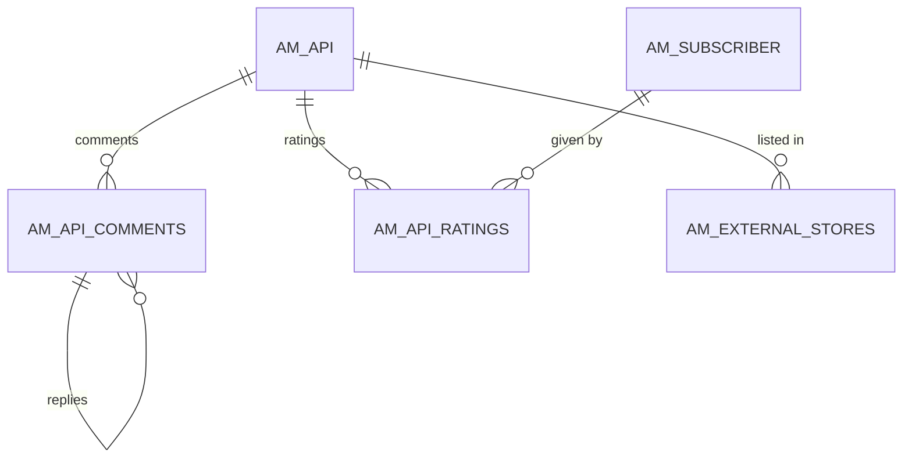
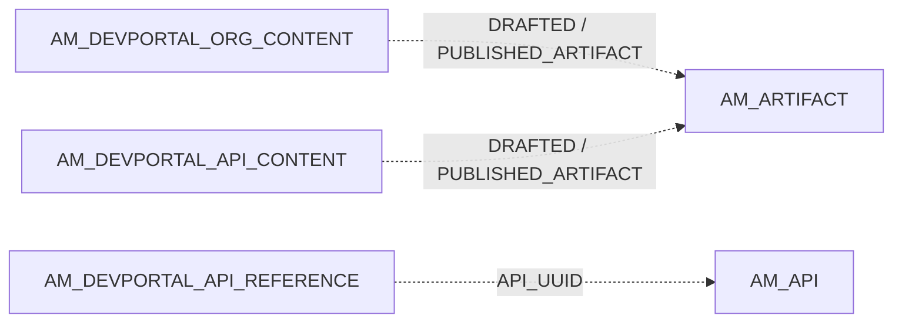

# Developer Portal extras

!!! abstract "In one sentence"
    These tables hold the social and content side of the Developer Portal (comments, ratings, customized portal content), webhook subscriptions for WebSub APIs, and links to external API stores.

## The idea

Besides subscriptions and keys, the Developer Portal lets people:

- **comment on** and **rate** APIs,
- see **customized content**: an organization can upload its own landing-page content, and per-API content, as *draft* and *published* versions,
- register **webhook callbacks** for WebSub/webhook APIs, so the gateway delivers events to them,
- and (from the Publisher side) **advertise an API in an external store**, i.e. another APIM Developer Portal.

## How the tables connect

Comments, ratings and external stores hang off the API:



Portal content points to stored files:



- The content tables have **no foreign keys**. The artifact columns hold `AM_ARTIFACT.UUID` values.

## The tables

### AM_API_COMMENTS

**One row =** one comment (or reply) on an API.

| Column | What it means |
|---|---|
| `COMMENT_ID` | Primary key. |
| `API_ID` | API (FK → `AM_API.API_ID`, cascade). |
| `PARENT_COMMENT_ID` | The comment this replies to (FK → `AM_API_COMMENTS`). NULL for top-level comments. |
| `COMMENT_TEXT`, `CATEGORY` | The text, and a category such as general. |
| `ENTRY_POINT` | Where it was posted: the Publisher or the Developer Portal. |
| `CREATED_BY`, `CREATED_TIME`, `UPDATED_TIME` | Author and times. |

[Full column list](../reference/am.md#am_api_comments)

### AM_API_RATINGS

**One row =** one subscriber's star rating (`RATING`) of one API. `API_ID` → `AM_API` (FK, cascade). `SUBSCRIBER_ID` → `AM_SUBSCRIBER` (FK, restrict). [Full column list](../reference/am.md#am_api_ratings)

### AM_DEVPORTAL_ORG_CONTENT

**One row =** the custom Developer Portal content of one organization. `DRAFTED_ARTIFACT` and `PUBLISHED_ARTIFACT` hold `AM_ARTIFACT.UUID` values (logical links), so you can edit a draft while the published version stays live. [Full column list](../reference/am.md#am_devportal_org_content)

### AM_DEVPORTAL_API_CONTENT

**One row =** the custom portal content for one API in one organization. It has the same draft/published pattern: (`API_UUID`, `ORGANIZATION`) → `AM_ARTIFACT` UUIDs. `API_UUID` is a logical link to `AM_API`. [Full column list](../reference/am.md#am_devportal_api_content)

### AM_DEVPORTAL_API_REFERENCE

**One row =** maps an API (`API_UUID`, `ORGANIZATION`) to its ID in the Developer Portal content store (`REFERENCE_APIID`). No FKs. [Full column list](../reference/am.md#am_devportal_api_reference)

### AM_ARTIFACT

**One row =** one stored file or blob. It has `UUID` (PK), `ARTIFACT` (the content) and `TYPE` (what kind of content). It's used for the portal-content drafts and published versions above. [Full column list](../reference/am.md#am_artifact)

### AM_WEBHOOKS_SUBSCRIPTION

**One row =** one callback registered by an application for a WebSub/webhook API topic.

| Column | What it means |
|---|---|
| `WH_SUBSCRIPTION_ID` | Primary key. |
| `API_UUID`, `APPLICATION_ID` | Which API and which application. Logical links, no FK. |
| `HUB_TOPIC`, `HUB_CALLBACK_URL`, `HUB_SECRET` | Topic, where to deliver, and the secret used to sign deliveries. |
| `HUB_LEASE_SECONDS`, `EXPIRY_AT` | How long the subscription lasts. |
| `DELIVERY_STATE`, `DELIVERED_AT` | The last delivery attempt. |
| `TENANT_DOMAIN`, `UPDATED_AT` | Scope and last change. |

[Full column list](../reference/am.md#am_webhooks_subscription)

### AM_WEBHOOKS_UNSUBSCRIPTION

**One row =** a record of a removed webhook subscription, with the same hub fields plus `ADDED_AT`. Gateways use it to drop the callback. There's no primary key and no FKs. [Full column list](../reference/am.md#am_webhooks_unsubscription)

### AM_EXTERNAL_STORES

**One row =** "API A is also published to external store S". It has `STORE_ID`, `STORE_DISPLAY_NAME`, `STORE_ENDPOINT`, `STORE_TYPE` and `LAST_UPDATED_TIME`. `API_ID` → `AM_API` (FK, **restrict**).

**Watch out:** because the FK is RESTRICT, an API that's listed in an external store can't be deleted until the listing is removed.

[Full column list](../reference/am.md#am_external_stores)

## Example

| Table | Row |
|---|---|
| `AM_API_COMMENTS` | `COMMENT_ID = c1`, `API_ID = 1`, `COMMENT_TEXT = "Is there a sandbox?"`, `ENTRY_POINT = devPortal` |
| `AM_API_COMMENTS` | `COMMENT_ID = c2`, `API_ID = 1`, `PARENT_COMMENT_ID = c1`, `COMMENT_TEXT = "Yes, use sandbox keys"` |
| `AM_API_RATINGS` | `API_ID = 1`, `SUBSCRIBER_ID = 1`, `RATING = 5` |

## Try it

```sql
-- Average rating and comment count per API
SELECT a.API_NAME, a.API_VERSION,
       (SELECT AVG(r.RATING) FROM AM_API_RATINGS r WHERE r.API_ID = a.API_ID) AS AVG_RATING,
       (SELECT COUNT(*) FROM AM_API_COMMENTS c WHERE c.API_ID = a.API_ID) AS COMMENTS
FROM AM_API a;
```

## Related flows

- [Subscribe to an API](../flows/08-subscribe.md)
- [Revoke & delete](../flows/12-revocation-and-delete.md)

!!! note "Different in 3.x"
    3.x has comments (without replies or categories), ratings and external stores. The portal-content tables, `AM_ARTIFACT` and the webhook tables are new in 4.x. See [3.x Developer Portal extras](../../apim-3/domains/devportal-extras.md).
