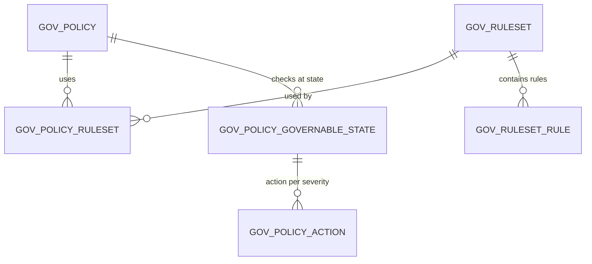
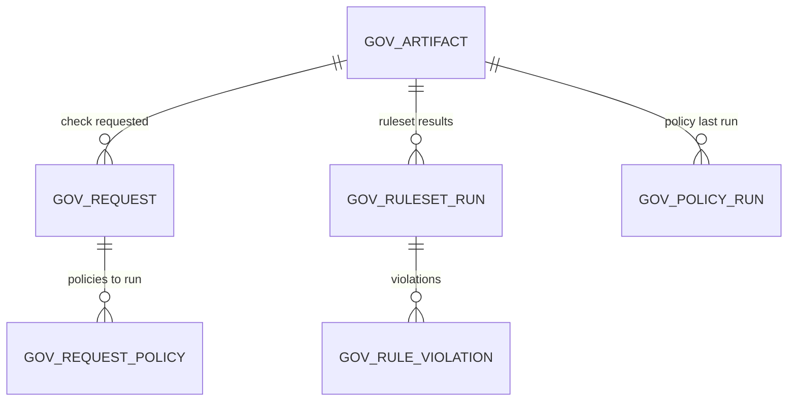

# Governance

!!! abstract "In one sentence"
    API governance checks APIs against rules, such as "every operation must have a description" or "use kebab-case paths". These tables store the rules, the policies that group them, and the results of each check.

## The idea

Governance is built from four ideas:

1. **Ruleset.** A file of rules written in the Spectral linting format. It targets one kind of artifact (e.g. an OpenAPI definition). Example: the "OWASP API Top 10" ruleset.
2. **Policy.** A group of rulesets, together with *when* to check (the **governable states**, e.g. on create, update, deploy or publish) and *what to do* when a rule fails (the **actions**, e.g. block the publish on an ERROR-severity violation, or just notify). A policy applies to APIs that carry certain **labels**, or globally.
3. **Artifact.** The thing being checked. Usually it's an API, identified by its UUID.
4. **Run results.** Each time a ruleset is run against an artifact, the result and every violated rule are stored.

Checks happen asynchronously: a change raises a **request**, and a background worker picks it up and runs the policies.

## How the tables connect

How policies are defined:



How checks run and what they record:



- `GOV_ARTIFACT.ARTIFACT_REF_ID` is the API's UUID. That's a *logical link* to `AM_API.API_UUID`.
- None of the `GOV_*` FKs declare `ON DELETE` behaviour, so deletes must remove children first. The application handles this.
- `GOV_REQUEST.ARTIFACT_KEY` has no declared FK, although it holds a `GOV_ARTIFACT` key.

## The tables

### GOV_RULESET

**One row =** one ruleset.

| Column | What it means |
|---|---|
| `RULESET_ID` | Primary key. |
| `NAME`, `DESCRIPTION` | `NAME` is unique per `ORGANIZATION`. |
| `ARTIFACT_TYPE` | What it checks, e.g. a REST API definition or an async API. |
| `RULE_CATEGORY`, `RULE_TYPE` | E.g. `SPECTRAL`, and what it checks: `API_DEFINITION`, `API_METADATA` or `API_DOCUMENTATION`. |
| `PROVIDER`, `DOCUMENTATION_LINK` | Where it came from. |
| created / updated by and time | Audit fields. |

[Full column list](../reference/gov.md#gov_ruleset)

### GOV_RULESET_CONTENT

**One row =** the raw ruleset file (`CONTENT`, `CONTENT_TYPE`, `FILE_NAME`), one per ruleset. `RULESET_ID` is both the PK and an FK. [Full column list](../reference/gov.md#gov_ruleset_content)

### GOV_RULESET_RULE

**One row =** one rule extracted from a ruleset: `RULE_NAME` (unique within the ruleset), `RULE_DESCRIPTION`, `SEVERITY` (e.g. `ERROR`, `WARN`, `INFO`) and `RULE_CONTENT`. FK → `GOV_RULESET`. [Full column list](../reference/gov.md#gov_ruleset_rule)

### GOV_POLICY

**One row =** one governance policy. It has `POLICY_ID`, `NAME` (unique per `ORGANIZATION`), `DESCRIPTION`, `IS_GLOBAL` (applies to every API) and audit columns. [Full column list](../reference/gov.md#gov_policy)

### GOV_POLICY_RULESET

**One row =** "policy P includes ruleset R". FKs to both. [Full column list](../reference/gov.md#gov_policy_ruleset)

### GOV_POLICY_LABEL

**One row =** "policy P applies to APIs with label L". `LABEL` holds the label (a logical link to the API [labels](lifecycle-labels.md)). FK → `GOV_POLICY`. [Full column list](../reference/gov.md#gov_policy_label)

### GOV_POLICY_GOVERNABLE_STATE

**One row =** "policy P is checked when an artifact reaches state S", e.g. `API_CREATE`, `API_UPDATE`, `API_DEPLOY` or `API_PUBLISH`. The primary key is (`POLICY_ID`, `STATE`). FK → `GOV_POLICY`. [Full column list](../reference/gov.md#gov_policy_governable_state)

### GOV_POLICY_ACTION

**One row =** "at state S, when a rule of severity V fails, do action T" (e.g. `BLOCK` or `NOTIFY`). FK (`POLICY_ID`, `STATE`) → `GOV_POLICY_GOVERNABLE_STATE`. [Full column list](../reference/gov.md#gov_policy_action)

### GOV_ARTIFACT

**One row =** one artifact that governance tracks.

| Column | What it means |
|---|---|
| `ARTIFACT_KEY` | Governance's own ID (PK). |
| `ARTIFACT_REF_ID` | The artifact's real ID. For APIs that's `AM_API.API_UUID` (logical link). |
| `ARTIFACT_TYPE` | Kind of artifact. |
| `ORGANIZATION` | Owner. (`ARTIFACT_REF_ID`, `ARTIFACT_TYPE`, `ORGANIZATION`) is unique. |

[Full column list](../reference/gov.md#gov_artifact)

### GOV_REQUEST

**One row =** a queued "please check this artifact" request. It has `REQ_ID`, `ARTIFACT_KEY` (logical), `STATUS` (e.g. pending or processing), `REQ_TIMESTAMP` and `PROCESSING_TIMESTAMP`. (`STATUS`, `ARTIFACT_KEY`) is unique, so an artifact is queued at most once per status. APIM inserts a `PENDING` request when an API is created or updated, and **deletes** it once the background governance engine has processed it. [Full column list](../reference/gov.md#gov_request)

### GOV_REQUEST_POLICY

**One row =** "request R should run policy P". FKs to both. [Full column list](../reference/gov.md#gov_request_policy)

### GOV_POLICY_RUN

**One row =** "policy P was last run on artifact A at `RUN_TIMESTAMP`". FKs to both. [Full column list](../reference/gov.md#gov_policy_run)

### GOV_RULESET_RUN

**One row =** the latest result of running ruleset R on artifact A. It has `RESULT` (pass or fail) and `RUN_TIMESTAMP`. (`ARTIFACT_KEY`, `RULESET_ID`) is unique, so only the latest run is kept. Each new run deletes the old row (and its violations) and inserts a new one with a new `RULESET_RUN_ID`. `RESULT` was `0` for a failed run. [Full column list](../reference/gov.md#gov_ruleset_run)

### GOV_RULE_VIOLATION

**One row =** one broken rule found in one ruleset run. It has `RULESET_RUN_ID` (FK), (`RULESET_ID`, `RULE_NAME`) (FK → `GOV_RULESET_RULE`), `MESSAGE` and `VIOLATED_PATH` (where in the definition the problem is). [Full column list](../reference/gov.md#gov_rule_violation)

## Example

| Table | Row |
|---|---|
Example: the seeded default policy and a check of PizzaShackAPI:

| Table | Row |
|---|---|
| `GOV_RULESET` | 4 seeded: *WSO2 REST API Design Guidelines*, *WSO2 API Management Guidelines*, *WSO2 MCP Server Management Guidelines*, *OWASP Top 10* (89 rules in total) |
| `GOV_POLICY` | `POLICY_ID = 8675…`, `NAME = WSO2 API Management Best Practices`, `IS_GLOBAL = 1` |
| `GOV_POLICY_RULESET` | the policy → 3 rulesets (OWASP isn't linked by default) |
| `GOV_POLICY_GOVERNABLE_STATE` / `GOV_POLICY_ACTION` | `API_CREATE` and `API_UPDATE`, severity `ERROR` / `WARN` / `INFO` → all `NOTIFY` (nothing blocks by default) |
| `GOV_ARTIFACT` | `ARTIFACT_KEY = 7c05…`, `ARTIFACT_REF_ID = b41b…` (PizzaShackAPI), `ARTIFACT_TYPE = API` |
| `GOV_RULESET_RUN` | one row per linked ruleset, `RESULT = 0` |
| `GOV_RULE_VIOLATION` | `RULE_NAME = api-technical-owner-email`, `VIOLATED_PATH = [data][businessInformation][technicalOwnerEmail]` (one of 16) |

## Try it

```sql
-- Latest violations per API
SELECT ga.ARTIFACT_REF_ID AS API_UUID, rs.NAME AS RULESET, v.RULE_NAME, v.MESSAGE, v.VIOLATED_PATH
FROM GOV_RULE_VIOLATION v
JOIN GOV_RULESET_RUN rr ON rr.RULESET_RUN_ID = v.RULESET_RUN_ID
JOIN GOV_ARTIFACT ga ON ga.ARTIFACT_KEY = rr.ARTIFACT_KEY
JOIN GOV_RULESET rs ON rs.RULESET_ID = rr.RULESET_ID;
```

## Related flows

- [Governance check](../flows/14-governance.md)
- [Change lifecycle state](../flows/05-lifecycle.md)

!!! note "New in 4.x"
    Governance doesn't exist in 3.x. None of the `GOV_*` tables are there.
