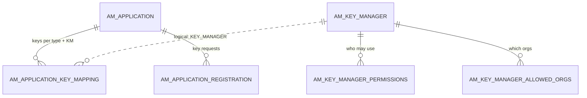
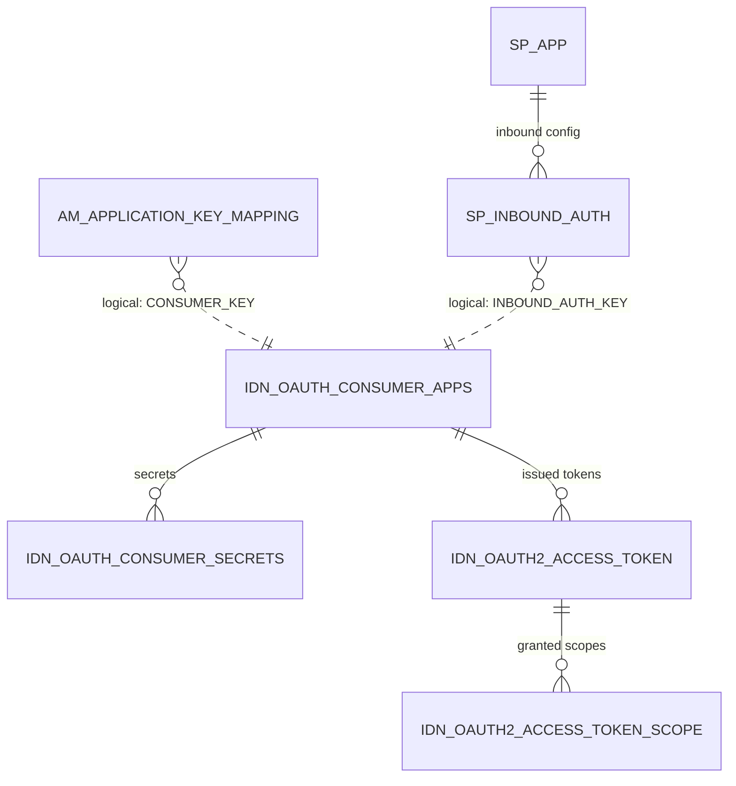
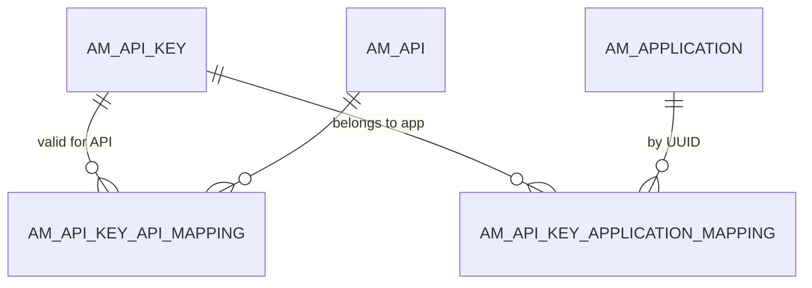

# Keys & tokens

!!! abstract "In one sentence"
    These tables connect an APIM application to an OAuth client in a *key manager*. They also store what the key manager issues from that client (access tokens and authorization codes) and 4.x's hashed API keys.

## The idea

After subscribing, a developer clicks **Generate Keys** for their application. Behind the scenes:

1. APIM asks a **key manager** (KM) to create an **OAuth client**. That's a consumer key and consumer secret. The KM is either the built-in *Resident Key Manager* or an external one such as Keycloak, Okta or Azure AD.
2. APIM records "application 5's **PRODUCTION** keys live in key manager *Resident Key Manager* under consumer key `abc123`" in `AM_APPLICATION_KEY_MAPPING`. The app can also have separate **SANDBOX** keys, and keys in several key managers.
3. The app uses the consumer key and secret to get **access tokens** from the KM. It sends a token with every API call, and the gateway checks it.

With the **Resident Key Manager**, the OAuth client is stored in this same database (`IDN_OAUTH_CONSUMER_APPS` and friends). **Opaque** tokens are stored too (`IDN_OAUTH2_ACCESS_TOKEN`), but in 4.7.0's default setup the **JWT** access tokens issued to JWT-type applications are **not stored at all**. This was verified on a running server. Identity Server also creates a matching *service provider* (`SP_APP`) for each client. With an **external key manager**, only APIM's mapping row is stored locally. The client and its tokens live in the external system.

!!! warning "Logical link (no foreign key)"
    The bridge between APIM and the key manager is **`AM_APPLICATION_KEY_MAPPING.CONSUMER_KEY` = `IDN_OAUTH_CONSUMER_APPS.CONSUMER_KEY`**. It isn't a foreign key, because the key manager may be external.

## How the tables connect

APIM's side (applications, keys and key managers):



The Resident Key Manager's side (OAuth client, service provider and tokens):



- Deleting an OAuth client cascades to its tokens, codes and secrets.
- Tokens point at the client through the **numeric** `CONSUMER_KEY_ID` (= `IDN_OAUTH_CONSUMER_APPS.ID`), not through the key text.

4.x API keys:



## The tables

### AM_KEY_MANAGER

**One row =** one key manager registered in the Admin Portal. The Resident Key Manager is created automatically for each tenant.

| Column | What it means |
|---|---|
| `UUID` | Primary key. |
| `NAME`, `DISPLAY_NAME`, `DESCRIPTION` | `NAME` is unique per `ORGANIZATION`, e.g. `Resident Key Manager`. |
| `TYPE` | The connector type, e.g. `default` (Resident), `KeyCloak`, `Okta`, `AzureAD`. |
| `CONFIGURATION` | Endpoints, grant types, claim mappings and so on (JSON). |
| `ENABLED` | On or off. |
| `TOKEN_TYPE` | Whether it issues tokens directly, or exchanges or accepts tokens from elsewhere. |
| `ORGANIZATION`, `EXTERNAL_REFERENCE_ID` | Owner, and an ID in an external system. |

**Connects to:** `AM_KEY_MANAGER_PERMISSIONS` and `AM_KEY_MANAGER_ALLOWED_ORGS` (FKs, cascade). It's referenced *logically* by `AM_APPLICATION_KEY_MAPPING.KEY_MANAGER` and `AM_APPLICATION_REGISTRATION.KEY_MANAGER`.

[Full column list](../reference/am.md#am_key_manager)

### AM_KEY_MANAGER_PERMISSIONS

**One row =** a role that is allowed or denied (`PERMISSIONS_TYPE`) to use a key manager in the Developer Portal. It has `KEY_MANAGER_UUID` (FK, cascade) and `ROLE`.

[Full column list](../reference/am.md#am_key_manager_permissions)

### AM_KEY_MANAGER_ALLOWED_ORGS

**One row =** an organization allowed to use a key manager. It has `KEY_MANAGER_UUID` (FK, cascade) and `ALLOWED_ORGANIZATIONS`.

[Full column list](../reference/am.md#am_key_manager_allowed_orgs)

### AM_APPLICATION_KEY_MAPPING

**One row =** one set of keys: application × key type × key manager.

| Column | What it means |
|---|---|
| `APPLICATION_ID` | Application (FK, cascade). |
| `KEY_TYPE` | `PRODUCTION` or `SANDBOX`. |
| `KEY_MANAGER` | Which key manager. In 4.x this normally holds the key manager's **UUID**. Data migrated from older versions may hold the **name**. |
| `CONSUMER_KEY` | The OAuth client ID in that key manager (logical link). |
| `STATE` | E.g. `CREATED` (waiting for an approval workflow), `COMPLETED`, `REJECTED`. |
| `CREATE_MODE` | `CREATED` (APIM made the client) or `MAPPED` (the developer mapped an existing client). |
| `UUID` | Public ID of this key mapping. |
| `APP_INFO` | A cached copy of the OAuth client details (JSON). |

The primary key is (`APPLICATION_ID`, `KEY_TYPE`, `KEY_MANAGER`).

[Full column list](../reference/am.md#am_application_key_mapping)

### AM_APPLICATION_REGISTRATION

**One row =** one key-generation request for an application, key type and key manager. It's used by the approval workflow, but 4.7.0 writes it **even when no workflow is configured**, and keeps it until the application is deleted (verified on a running server).

| Column | What it means |
|---|---|
| `REG_ID` | Primary key. |
| `SUBSCRIBER_ID` | FK → `AM_SUBSCRIBER`, restrict. |
| `APP_ID` | FK → `AM_APPLICATION`, cascade. |
| `TOKEN_TYPE` | The key type requested (production or sandbox). |
| `KEY_MANAGER` | Which key manager. |
| `WF_REF` | Links to `AM_WORKFLOWS.WF_REFERENCE`. |
| `INPUTS`, `TOKEN_SCOPE`, `VALIDITY_PERIOD`, `ALLOWED_DOMAINS` | What the developer asked for. |

[Full column list](../reference/am.md#am_application_registration)

### AM_APP_KEY_DOMAIN_MAPPING

**One row =** a domain that is allowed to use a consumer key, for browser-based clients (`CONSUMER_KEY`, `AUTHZ_DOMAIN`). It's a logical link to the OAuth client. This is a legacy feature.

[Full column list](../reference/am.md#am_app_key_domain_mapping)

### AM_SYSTEM_APPS

**One row =** an OAuth client that **APIM created for itself**. The Publisher, Developer Portal and Admin Portal web apps log in with these. It has `NAME`, `CONSUMER_KEY` (unique), `CONSUMER_SECRET` and `TENANT_DOMAIN`.

**Watch out:** these clients also exist in `IDN_OAUTH_CONSUMER_APPS`, but they belong to no `AM_APPLICATION`. They're registered the first time someone logs into each portal's **web UI**. On a test server driven only through the REST APIs, this table stayed empty.

[Full column list](../reference/am.md#am_system_apps)

### AM_API_KEY

**One row =** one **API key**. An API key is a simple secret string that can call APIs instead of an OAuth token. Only a hash of the key is stored.

| Column | What it means |
|---|---|
| `API_KEY_UUID` | Primary key. |
| `NAME` | Name given when the key was created. |
| `API_KEY_HASH` | Hash of the key (unique), e.g. `$sha256$a858…`. The key itself isn't stored (verified). |
| `KEY_TYPE` | `PRODUCTION` or `SANDBOX`. |
| `AUTHZ_USER` | The user who created it. |
| `VALIDITY_PERIOD`, `TIME_CREATED`, `LAST_USED` | Lifetime and usage. |
| `STATUS` | E.g. `ACTIVE`. |
| `API_KEY_PROPERTIES` | Restrictions such as IP or referrer (JSON). |

[Full column list](../reference/am.md#am_api_key)

### AM_API_KEY_API_MAPPING

**One row =** "API key K may be used for API A". FKs → `AM_API_KEY` and `AM_API.API_UUID`. [Full column list](../reference/am.md#am_api_key_api_mapping)

### AM_API_KEY_APPLICATION_MAPPING

**One row =** "API key K belongs to application A". FKs → `AM_API_KEY` and `AM_APPLICATION.UUID` (note: the *UUID*, not `APPLICATION_ID`). [Full column list](../reference/am.md#am_api_key_application_mapping)

### IDN_OAUTH_CONSUMER_APPS

**One row =** one OAuth client in the Resident Key Manager.

| Column | What it means |
|---|---|
| `ID` | Internal number. Tokens and codes point here. |
| `CONSUMER_KEY` | Client ID (unique). This is the value stored in `AM_APPLICATION_KEY_MAPPING.CONSUMER_KEY`. |
| `CONSUMER_SECRET` | Client secret. It may be hashed or encrypted, depending on configuration. |
| `APP_NAME` | Generated name: `<owner>_<application UUID>_PRODUCTION` or `…_SANDBOX` (verified on 4.7.0). |
| `USERNAME`, `TENANT_ID`, `USER_DOMAIN` | Owner of the client. |
| `GRANT_TYPES`, `CALLBACK_URL` | Allowed OAuth grant types (space-separated) and the redirect URL. |
| `APP_STATE` | `ACTIVE` or `REVOKED`. |
| `USER_ACCESS_TOKEN_EXPIRE_TIME`, `APP_ACCESS_TOKEN_EXPIRE_TIME`, `REFRESH_TOKEN_EXPIRE_TIME`, `ID_TOKEN_EXPIRE_TIME` | Token lifetimes. |
| `PKCE_MANDATORY`, `PKCE_SUPPORT_PLAIN`, `OAUTH_VERSION` | Protocol settings. |

[Full column list](../reference/idn.md#idn_oauth_consumer_apps)

### IDN_OAUTH_CONSUMER_SECRETS

**One row =** one client secret. 4.x allows several secrets per client, each with its own expiry. It has `CONSUMER_KEY` (FK → `IDN_OAUTH_CONSUMER_APPS.CONSUMER_KEY`, cascade), `SECRET_ID` (unique), `SECRET_VALUE` / `SECRET_HASH`, `DESCRIPTION` and `EXPIRY_TIME`.

[Full column list](../reference/idn.md#idn_oauth_consumer_secrets)

### IDN_OAUTH2_ACCESS_TOKEN

**One row =** one access token (and its refresh token) issued by the Resident Key Manager.

| Column | What it means |
|---|---|
| `TOKEN_ID` | Primary key. |
| `CONSUMER_KEY_ID` | Client (FK → `IDN_OAUTH_CONSUMER_APPS.ID`, cascade). |
| `ACCESS_TOKEN`, `REFRESH_TOKEN` (+ `_HASH`) | The token values. For an opaque token, `ACCESS_TOKEN` is the token itself (a UUID). |
| `AUTHZ_USER`, `TENANT_ID`, `USER_DOMAIN`, `SUBJECT_IDENTIFIER` | Who the token was issued for. |
| `GRANT_TYPE` | E.g. `client_credentials`, `password`, `authorization_code`. |
| `TIME_CREATED`, `VALIDITY_PERIOD`, and the refresh-token equivalents | Lifetime. |
| `TOKEN_STATE` | `ACTIVE`, `EXPIRED`, `REVOKED` or `INACTIVE`. |
| `TOKEN_SCOPE_HASH`, `TOKEN_BINDING_REF`, `IDP_ID`, `CONSENTED_TOKEN` | Supporting data. |

**Watch out:** in 4.x, gateways validate JWT tokens **by signature**, without reading this table. On a 4.7.0 server with default settings, a `client_credentials` JWT for a JWT-type application left **no row here**. Only the opaque token of a `DEFAULT`-type client was stored. Revoking a JWT goes to `AM_REVOKED_JWT` + `IDN_INVALID_TOKENS` instead (see [Revocation](revocation.md)).

[Full column list](../reference/idn.md#idn_oauth2_access_token)

### IDN_OAUTH2_ACCESS_TOKEN_SCOPE

**One row =** one scope granted to one token. It has `TOKEN_ID` (FK, cascade) and `TOKEN_SCOPE`. The scope names match `AM_SCOPE.NAME` / `IDN_OAUTH2_SCOPE.NAME`. [Full column list](../reference/idn.md#idn_oauth2_access_token_scope)

### IDN_OAUTH2_ACCESS_TOKEN_AUDIT

**One row =** an old token moved out of `IDN_OAUTH2_ACCESS_TOKEN` when it was replaced or cleaned up. It has the same columns, plus `INVALIDATED_TIME`. It's only written if token-cleanup auditing is enabled. There are no FKs. [Full column list](../reference/idn.md#idn_oauth2_access_token_audit)

### IDN_OAUTH2_AUTHORIZATION_CODE

**One row =** one authorization code from the OAuth *authorization code* grant. The user logs in and the app gets a code, which it swaps for a token.

- It has `CONSUMER_KEY_ID` (FK, cascade), `AUTHORIZATION_CODE` (+ hash), `CALLBACK_URL`, `AUTHZ_USER`, `STATE` (e.g. `ACTIVE` or `INACTIVE`) and the PKCE fields.
- Once the code is used, `TOKEN_ID` holds the token it was exchanged for. That's a logical link.

[Full column list](../reference/idn.md#idn_oauth2_authorization_code)

### IDN_OAUTH2_AUTHZ_CODE_SCOPE

**One row =** one scope requested with an authorization code. It has `CODE_ID` (FK, cascade) and `SCOPE`. [Full column list](../reference/idn.md#idn_oauth2_authz_code_scope)

### SP_APP

**One row =** one *service provider* in the embedded Identity Server. When the Resident Key Manager creates an OAuth client for an APIM application, it also creates a service provider **with the same name** as `IDN_OAUTH_CONSUMER_APPS.APP_NAME`.

It has `ID`, `APP_NAME`, `USERNAME`, `TENANT_ID`, `UUID` and many login-behaviour flags.

[Full column list](../reference/sp.md#sp_app)

### SP_INBOUND_AUTH

**One row =** one inbound protocol setting of a service provider. For OAuth, `INBOUND_AUTH_TYPE = 'oauth2'` and **`INBOUND_AUTH_KEY` = the consumer key**. That's how a service provider is tied to its OAuth client. `APP_ID` → `SP_APP.ID` (FK, cascade; it's declared with `ALTER TABLE`).

[Full column list](../reference/sp.md#sp_inbound_auth)

## Example

Production keys for the application `PizzaApp` (UUID `4023…`), owned by admin. These are real rows from a 4.7.0 test server:

| Table | Row |
|---|---|
| `AM_APPLICATION_REGISTRATION` | `REG_ID = 1`, `APP_ID = 2`, `TOKEN_TYPE = PRODUCTION`, `TOKEN_SCOPE = default` |
| `AM_APPLICATION_KEY_MAPPING` | `APPLICATION_ID = 2`, `KEY_TYPE = PRODUCTION`, `KEY_MANAGER = b446…` *(Resident KM UUID)*, `CONSUMER_KEY = rfjt…`, `STATE = COMPLETED`, `CREATE_MODE = CREATED` |
| `IDN_OAUTH_CONSUMER_APPS` | `ID = 2`, `CONSUMER_KEY = rfjt…`, `APP_NAME = admin_4023…_PRODUCTION`, `GRANT_TYPES = client_credentials password` |
| `IDN_OAUTH_CONSUMER_SECRETS` | `CONSUMER_KEY = rfjt…`, `SECRET_HASH = {"hash":"20e9…","algorithm":"SHA-256"}` |
| `SP_APP` | `APP_NAME = admin_4023…_PRODUCTION` |
| `SP_INBOUND_AUTH` | `INBOUND_AUTH_KEY = rfjt…`, `INBOUND_AUTH_TYPE = oauth2` |
| `IDN_OAUTH2_ACCESS_TOKEN` | *(no row: the app's JWT access tokens aren't stored)* |

Note that the OAuth client name uses the application's **UUID**, not its display name.

## Try it

```sql
-- Application → keys → OAuth client (Resident Key Manager only)
SELECT app.NAME AS APPLICATION, km.NAME AS KEY_MANAGER, akm.KEY_TYPE,
       akm.CONSUMER_KEY, oc.APP_NAME AS OAUTH_CLIENT, oc.GRANT_TYPES
FROM AM_APPLICATION_KEY_MAPPING akm
JOIN AM_APPLICATION app ON app.APPLICATION_ID = akm.APPLICATION_ID
LEFT JOIN AM_KEY_MANAGER km ON km.UUID = akm.KEY_MANAGER
LEFT JOIN IDN_OAUTH_CONSUMER_APPS oc ON oc.CONSUMER_KEY = akm.CONSUMER_KEY;
```

A NULL `OAUTH_CLIENT` means the keys live in an **external** key manager.

## Related flows

- [Generate keys](../flows/09-generate-keys.md)
- [Get a token & call the API](../flows/10-token-and-invoke.md)
- [Revoke & delete](../flows/12-revocation-and-delete.md)

!!! note "Different in 3.x"
    3.x has no API-key tables. API keys were stateless JWTs, and 3.x instead had `AM_SUBSCRIPTION_KEY_MAPPING`. 3.x has no key-manager permission or organization tables, and no `IDN_OAUTH_CONSUMER_SECRETS`. `AM_KEY_MANAGER` there is scoped by `TENANT_DOMAIN`, and key mappings often stored the key manager **name**. See [3.x Keys & tokens](../../apim-3/domains/keys-tokens.md).
