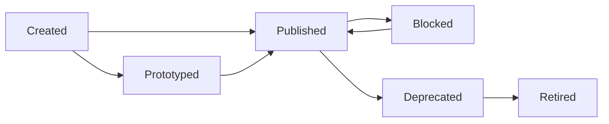
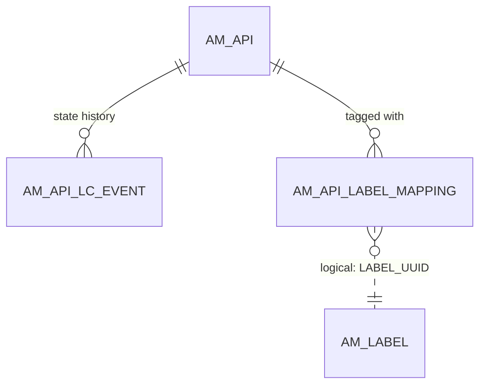

# Lifecycle & labels

!!! abstract "In one sentence"
    These tables keep the history of an API's lifecycle (Created → Published → Deprecated → Retired) and the *labels* admins use to tag and group APIs.

## The idea

**Lifecycle.** Every API moves through states:



- Only **Published** (and **Prototyped**) APIs appear in the Developer Portal. Only Published APIs can take new subscriptions.
- The *current* state is stored in `AM_API.STATUS` and in the registry lifecycle property. **Each change** adds a history row to `AM_API_LC_EVENT`.
- A state change can be put behind an approval [workflow](workflows.md).

**Labels (4.x).** An admin creates labels such as "Internal" or "Beta" and attaches them to APIs. That's what `AM_LABEL` and `AM_API_LABEL_MAPPING` store.

## How the tables connect



- Deleting an API cascades to both its history and its label mappings.
- `AM_API_LABEL_MAPPING.LABEL_UUID` has **no FK** to `AM_LABEL`.

## The tables

### AM_API_LC_EVENT

**One row =** one lifecycle state change of one API.

| Column | What it means |
|---|---|
| `EVENT_ID` | Primary key. |
| `API_ID` | API (FK → `AM_API.API_ID`, cascade). |
| `PREVIOUS_STATE`, `NEW_STATE` | E.g. `CREATED` → `PUBLISHED`. `PREVIOUS_STATE` is NULL for the very first event, written when the API is created. |
| `USER_ID` | Who made the change (user name). |
| `TENANT_ID`, `EVENT_DATE` | Tenant, and when it happened. |

[Full column list](../reference/am.md#am_api_lc_event)

### AM_API_LC_PUBLISH_EVENTS

**One row =** a record that an API was published (`TENANT_DOMAIN`, `API_ID`, `EVENT_TIME`).

**Watch out:** `API_ID` has no FK. APIM 4.7.0 doesn't read or write this table, so treat it as legacy. Use `AM_API_LC_EVENT` for lifecycle history.

[Full column list](../reference/am.md#am_api_lc_publish_events)

### AM_LABEL

**One row =** one label defined by an admin: `UUID` (PK), `NAME` (unique per `TENANT_DOMAIN`) and `DESCRIPTION`.

[Full column list](../reference/am.md#am_label)

### AM_API_LABEL_MAPPING

**One row =** "API A has label L". The primary key is (`API_UUID`, `LABEL_UUID`). `API_UUID` → `AM_API.API_UUID` (FK, cascade), and `LABEL_UUID` is a *logical link* to `AM_LABEL.UUID`.

**Watch out:** deleting a label doesn't cascade here, because there's no FK. The application removes the mappings itself.

[Full column list](../reference/am.md#am_api_label_mapping)

## Example

| Table | Row |
|---|---|
| `AM_API_LC_EVENT` | `API_ID = 1`, `PREVIOUS_STATE = NULL`, `NEW_STATE = CREATED`, `USER_ID = admin` |
| `AM_API_LC_EVENT` | `API_ID = 1`, `PREVIOUS_STATE = CREATED`, `NEW_STATE = PUBLISHED`, `USER_ID = admin` |
| `AM_API` | `API_ID = 1`, `STATUS = PUBLISHED` |
| `AM_LABEL` | `UUID = l-1`, `NAME = Beta` |
| `AM_API_LABEL_MAPPING` | `API_UUID = 5f1c…`, `LABEL_UUID = l-1` |

## Try it

```sql
-- Lifecycle history of every API, newest first
SELECT a.API_NAME, a.API_VERSION, e.PREVIOUS_STATE, e.NEW_STATE, e.USER_ID, e.EVENT_DATE
FROM AM_API_LC_EVENT e
JOIN AM_API a ON a.API_ID = e.API_ID
ORDER BY e.EVENT_DATE DESC;
```

## Related flows

- [Change lifecycle state](../flows/05-lifecycle.md)
- [Approval workflows](../flows/13-approval-workflows.md)

!!! note "Different in 3.x"
    3.x has `AM_API_LC_EVENT` too, but `AM_API` has no `STATUS` column, so the current state was *only* in the registry. The 3.x **labels** (`AM_LABELS`, `AM_LABEL_URLS`) mean something else: they're *microgateway labels* that decide which gateways get an API. See [3.x Lifecycle & labels](../../apim-3/domains/lifecycle-labels.md).
