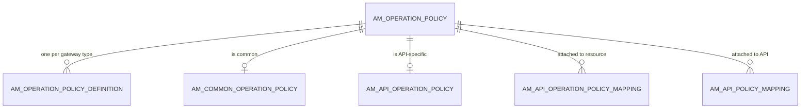
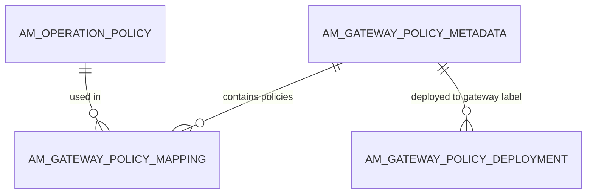

# Operation policies

!!! abstract "In one sentence"
    Operation policies are reusable pieces of gateway logic, such as "add a header", "rewrite the path" or "validate JSON schema". These tables store the policies and where they're attached: to one resource, to a whole API, or globally to a gateway.

## The idea

Think of an operation policy as a **plug-in step** in the gateway pipeline. Each policy has:

- a **definition**: the actual template the gateway runs (Synapse for the WSO2 gateway, or a definition for another gateway type), and
- **parameters**: values the API creator fills in when attaching it, e.g. header name `X-Tenant`.

A policy can be attached at three levels, in one of three **directions**: `request`, `response` or `fault`.

| Level | Table that records the attachment |
|---|---|
| One resource (`GET /menu`) | `AM_API_OPERATION_POLICY_MAPPING` |
| A whole API | `AM_API_POLICY_MAPPING` |
| A whole gateway (global policy) | `AM_GATEWAY_POLICY_MAPPING` + `AM_GATEWAY_POLICY_DEPLOYMENT` |

Policies are either **common** (in the shared library, reusable by every API) or **API-specific** (owned by one API). When a common policy is attached to an API, APIM **clones** it into an API-specific copy. That's why `AM_API_OPERATION_POLICY` has a `CLONED_POLICY_UUID` column.

## How the tables connect

The policy library and how an API uses it:



- Every policy is one `AM_OPERATION_POLICY` row. Whether it's common or API-specific depends on which of the two marker tables it appears in.
- All the FKs here cascade: deleting a policy removes its definitions and attachments.

Global (gateway-level) policies:



## The tables

### AM_OPERATION_POLICY

**One row =** one policy, either in the common library or owned by one API.

| Column | What it means |
|---|---|
| `POLICY_UUID` | Primary key. |
| `POLICY_NAME`, `POLICY_VERSION`, `DISPLAY_NAME`, `POLICY_DESCRIPTION` | Identity. |
| `APPLICABLE_FLOWS` | Where it may be used: request, response and/or fault. |
| `GATEWAY_TYPES`, `API_TYPES` | Which gateways and API types support it. |
| `POLICY_PARAMETERS` | The parameter schema (JSON). |
| `POLICY_CATEGORY` | E.g. a mediation or a security policy. |
| `ORGANIZATION`, `POLICY_MD5` | Owner, and a hash used to detect changes. |

**Connects to:** everything else on this page.

[Full column list](../reference/am.md#am_operation_policy)

### AM_OPERATION_POLICY_DEFINITION

**One row =** the runnable definition of one policy for one gateway type. (`POLICY_UUID`, `GATEWAY_TYPE`) is unique, `POLICY_DEFINITION` holds the template and `DEFINITION_MD5` its hash. FK → `AM_OPERATION_POLICY`, cascade.

[Full column list](../reference/am.md#am_operation_policy_definition)

### AM_COMMON_OPERATION_POLICY

**One row =** marks a policy as part of the **common library** available to every API. It has `COMMON_POLICY_ID` and `POLICY_UUID` (FK, cascade).

[Full column list](../reference/am.md#am_common_operation_policy)

### AM_API_OPERATION_POLICY

**One row =** marks a policy as **owned by one API** (and revision).

| Column | What it means |
|---|---|
| `POLICY_UUID` | The policy (FK, cascade). |
| `API_UUID` | Owning API. *Logical link* to `AM_API.API_UUID` (no FK). |
| `REVISION_UUID` | Which copy of the API it belongs to. |
| `CLONED_POLICY_UUID` | If it was cloned from a common policy, the original's UUID. |

[Full column list](../reference/am.md#am_api_operation_policy)

### AM_API_OPERATION_POLICY_MAPPING

**One row =** "on this resource, run this policy, in this direction, at this position, with these parameters".

| Column | What it means |
|---|---|
| `URL_MAPPING_ID` | The resource (FK → `AM_API_URL_MAPPING`, cascade). |
| `POLICY_UUID` | The policy (FK, cascade). |
| `DIRECTION` | `request`, `response` or `fault`. |
| `POLICY_ORDER` | Position in the chain. |
| `PARAMETERS` | The values filled in (JSON). |

[Full column list](../reference/am.md#am_api_operation_policy_mapping)

### AM_API_POLICY_MAPPING

**One row =** the same as above, but attached to the **whole API** instead of one resource. It has `API_UUID` (FK → `AM_API`, cascade), `REVISION_UUID`, `POLICY_UUID` (FK, cascade), `DIRECTION`, `POLICY_ORDER` and `PARAMETERS`.

[Full column list](../reference/am.md#am_api_policy_mapping)

### AM_GATEWAY_POLICY_METADATA

**One row =** one named **global policy set**: a group of policies that runs for *every* API on the gateways it's deployed to. It has `GLOBAL_POLICY_MAPPING_UUID`, `DISPLAY_NAME`, `DESCRIPTION` and `ORGANIZATION`.

[Full column list](../reference/am.md#am_gateway_policy_metadata)

### AM_GATEWAY_POLICY_MAPPING

**One row =** one policy inside a global policy set, with its `DIRECTION`, `POLICY_ORDER` and `PARAMETERS`.

- FK → `AM_GATEWAY_POLICY_METADATA`, cascade.
- FK → `AM_OPERATION_POLICY`, **restrict**: you can't delete a policy while a global set uses it.

[Full column list](../reference/am.md#am_gateway_policy_mapping)

### AM_GATEWAY_POLICY_DEPLOYMENT

**One row =** "global policy set X is deployed to gateway label Y". The primary key is (`ORGANIZATION`, `GATEWAY_LABEL`), so **each gateway gets at most one global set**. FK → `AM_GATEWAY_POLICY_METADATA`, **restrict**: you must undeploy a set before you can delete it.

[Full column list](../reference/am.md#am_gateway_policy_deployment)

## Example

The creator adds an "Add Header" policy to `GET /menu`:

| Table | Row |
|---|---|
| `AM_OPERATION_POLICY` | `POLICY_UUID = p-common`, `POLICY_NAME = addHeader` (common) |
| `AM_COMMON_OPERATION_POLICY` | `POLICY_UUID = p-common` |
| `AM_OPERATION_POLICY` | `POLICY_UUID = p-api`, `POLICY_NAME = addHeader` (API-specific clone) |
| `AM_API_OPERATION_POLICY` | `POLICY_UUID = p-api`, `API_UUID = 5f1c…`, `CLONED_POLICY_UUID = p-common` |
| `AM_API_OPERATION_POLICY_MAPPING` | `URL_MAPPING_ID = 10`, `POLICY_UUID = p-api`, `DIRECTION = request`, `PARAMETERS = {"headerName":"X-Tenant",…}` |

## Try it

```sql
-- Policies attached to each resource of the current API
SELECT a.API_NAME, u.HTTP_METHOD, u.URL_PATTERN, m.DIRECTION, m.POLICY_ORDER, p.POLICY_NAME
FROM AM_API_OPERATION_POLICY_MAPPING m
JOIN AM_OPERATION_POLICY p ON p.POLICY_UUID = m.POLICY_UUID
JOIN AM_API_URL_MAPPING u ON u.URL_MAPPING_ID = m.URL_MAPPING_ID
JOIN AM_API a ON a.API_ID = u.API_ID
WHERE u.REVISION_UUID IS NULL
ORDER BY a.API_NAME, u.URL_PATTERN, m.DIRECTION, m.POLICY_ORDER;
```

## Related flows

- [Create an API](../flows/02-create-api.md)
- [Deploy a revision](../flows/04-deploy-revision.md): creating a revision copies the policy attachments

!!! note "New in 4.x"
    None of these tables exist in 3.x. There, mediation was done with *mediation sequences* stored as files in the registry. See [3.x API definition](../../apim-3/domains/api-definition.md).
