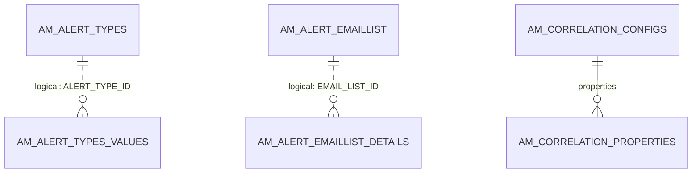

# Everything else

!!! abstract "In one sentence"
    Smaller features that don't fit the other domains: monetization usage publishing, analytics file uploads, alert subscriptions, notification subscribers, log-correlation settings and cluster housekeeping.

## The idea

None of these tables sit on the main API → application → subscription path. Each one supports a feature that stands on its own:

| Feature | Tables |
|---|---|
| **Monetization**: publishing API usage to a billing system such as Stripe | `AM_MONETIZATION_USAGE` |
| **Analytics uploads** (on-premise usage files) | `AM_USAGE_UPLOADED_FILES` |
| **Alerts**: who wants which analytics alerts, by email | `AM_ALERT_TYPES`, `AM_ALERT_TYPES_VALUES`, `AM_ALERT_EMAILLIST`, `AM_ALERT_EMAILLIST_DETAILS` |
| **Notifications**: e.g. notify subscribers when a new API version appears | `AM_NOTIFICATION_SUBSCRIBER` |
| **Correlation logs**: per-component request tracing switches | `AM_CORRELATION_CONFIGS`, `AM_CORRELATION_PROPERTIES` |
| **Housekeeping**: cluster task locks and transaction counting | `AM_TASK_LOCK`, `AM_TRANSACTION_RECORDS` |

## How the tables connect

Alerts are the only group here with internal relationships, and even those are logical:



- Only the correlation link is a real FK (cascade). The alert tables are linked by matching IDs.

## The tables

### AM_MONETIZATION_USAGE

**One row =** one run of the job that publishes usage data to the billing provider. It has `ID`, `STATE`, `STATUS`, `STARTED_TIME` and `PUBLISHED_TIME`. The monetization plan itself lives on [`AM_POLICY_SUBSCRIPTION`](throttling.md#am_policy_subscription). [Full column list](../reference/am.md#am_monetization_usage)

### AM_USAGE_UPLOADED_FILES

**One row =** one uploaded usage-data file waiting to be processed. It has `TENANT_DOMAIN`, `FILE_NAME`, `FILE_TIMESTAMP` (together the PK), `FILE_PROCESSED` and `FILE_CONTENT`. [Full column list](../reference/am.md#am_usage_uploaded_files)

### AM_ALERT_TYPES

**One row =** one kind of analytics alert (`ALERT_TYPE_NAME`, e.g. abnormal response time), for one `STAKE_HOLDER` (publisher, subscriber or admin). [Full column list](../reference/am.md#am_alert_types)

### AM_ALERT_TYPES_VALUES

**One row =** "user `USER_NAME`, as `STAKE_HOLDER`, subscribed to alert type `ALERT_TYPE_ID`". `ALERT_TYPE_ID` is a logical link to `AM_ALERT_TYPES`. [Full column list](../reference/am.md#am_alert_types_values)

### AM_ALERT_EMAILLIST

**One row =** a user's alert email list (`EMAIL_LIST_ID`, `USER_NAME`, `STAKE_HOLDER`). [Full column list](../reference/am.md#am_alert_emaillist)

### AM_ALERT_EMAILLIST_DETAILS

**One row =** one email address (`EMAIL`) in an alert email list (`EMAIL_LIST_ID`, a logical link). [Full column list](../reference/am.md#am_alert_emaillist_details)

### AM_NOTIFICATION_SUBSCRIBER

**One row =** someone who should be notified about a category of events. It has `UUID`, `CATEGORY`, `NOTIFICATION_METHOD` (e.g. email) and `SUBSCRIBER_ADDRESS`. [Full column list](../reference/am.md#am_notification_subscriber)

### AM_CORRELATION_CONFIGS

**One row =** one component whose correlation (request-tracing) logs can be switched on or off (`COMPONENT_NAME`, `ENABLED`), e.g. HTTP, JDBC or LDAP logging. Admins change it at runtime through the DevOps REST API. [Full column list](../reference/am.md#am_correlation_configs)

### AM_CORRELATION_PROPERTIES

**One row =** one extra setting for a correlation component (`PROPERTY_NAME`, `PROPERTY_VALUE`). `COMPONENT_NAME` → `AM_CORRELATION_CONFIGS` (FK, cascade). [Full column list](../reference/am.md#am_correlation_properties)

### AM_TASK_LOCK

**One row =** a lock that stops the same scheduled task from running on two cluster nodes at once. It has `TASK_ID` (PK), `NODE_ID` (who holds it) and `LOCK_TIME` (a heartbeat in epoch milliseconds). [Full column list](../reference/am.md#am_task_lock)

### AM_TRANSACTION_RECORDS

**One row =** a count of transactions (API calls) recorded by one server (`HOST`, `SERVER_ID`, `SERVER_TYPE`) at `RECORDED_TIME`. It's used for subscription and usage reporting. [Full column list](../reference/am.md#am_transaction_records)

## Try it

```sql
-- Which components have correlation logging switched on?
SELECT c.COMPONENT_NAME, c.ENABLED, p.PROPERTY_NAME, p.PROPERTY_VALUE
FROM AM_CORRELATION_CONFIGS c
LEFT JOIN AM_CORRELATION_PROPERTIES p ON p.COMPONENT_NAME = c.COMPONENT_NAME;
```

## Related flows

- [All flows](../flows/index.md)

!!! note "Different in 3.x"
    3.x has the alert, monetization-usage, analytics-upload and notification-subscriber tables. The correlation, task-lock and transaction-record tables are new in 4.x. See [3.x Everything else](../../apim-3/domains/other.md).
