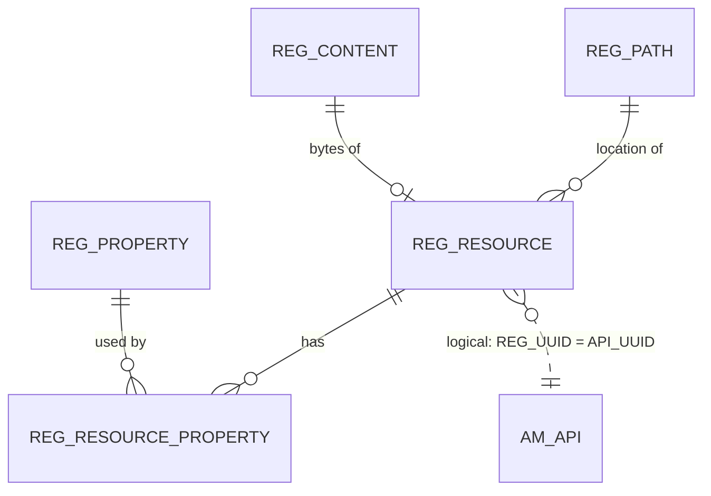

# Registry

!!! abstract "In one sentence"
    The registry is a generic, folder-like store in the shared database. APIM keeps each API's *full* metadata there, along with its definition file, documentation and lifecycle state.

## The idea

Think of the registry as **a file system inside the database**. It has paths such as `/_system/governance/apimgt/applicationdata/provider/admin/PizzaShackAPI/1.0.0/api`, and each path points to a *resource* (the file content) with a set of *properties* (key/value pairs) attached.

APIM uses it to store things that are documents rather than neat rows:

- the **API artifact**: a document with the description, tags, visibility, business owner, endpoint settings, thumbnail path and many more fields,
- the **API definition** (OpenAPI / GraphQL SDL / AsyncAPI / WSDL),
- **documentation** pages and files,
- the **lifecycle** state, stored as properties on the API artifact.

The `AM_*` tables hold a *summary* of the API that's easy to join (`AM_API`). The registry holds the *whole* thing. The two are tied together by one value: **`AM_API.API_UUID` = `REG_RESOURCE.REG_UUID`** of the API artifact.

## How the tables connect

A registry resource is a (path, content) pair with properties attached through a bridge table.



- The solid links are real FKs. Every registry FK also includes `REG_TENANT_ID`, because registry data is split per tenant.
- The dashed link is how you get from an API row to its registry document.

## The tables

### REG_PATH

**One row =** one folder or path in the registry tree.

| Column | What it means |
|---|---|
| `REG_PATH_ID` + `REG_TENANT_ID` | Primary key. |
| `REG_PATH_VALUE` | The full path text, e.g. `/_system/governance/apimgt/applicationdata/provider/admin/PizzaShackAPI/1.0.0`. |
| `REG_PATH_PARENT_ID` | The parent folder. This is a *logical link* to `REG_PATH`. |

**Connects to:** `REG_RESOURCE` and `REG_RESOURCE_PROPERTY` (FKs), and to comments, ratings, tags and snapshots (see [Identity Server tables](../identity-tables.md#registry-other-tables)).

[Full column list](../reference/reg.md#reg_path)

### REG_RESOURCE

**One row =** one version of one resource (a "file") at a path.

| Column | What it means |
|---|---|
| `REG_VERSION` + `REG_TENANT_ID` | Primary key. |
| `REG_PATH_ID` | Folder (FK → `REG_PATH`). |
| `REG_NAME` | File name within the folder, e.g. `api`. A folder itself has a NULL name. |
| `REG_MEDIA_TYPE` | Content type. For example `application/vnd.wso2-api+xml` for an API artifact. |
| `REG_CONTENT_ID` | Content (FK → `REG_CONTENT`). |
| `REG_UUID` | Stable ID. **For an API artifact this equals `AM_API.API_UUID`.** |
| `REG_CREATOR`, `REG_LAST_UPDATOR`, times | Audit fields. |

**Connects to:** `REG_PATH`, `REG_CONTENT` and `REG_RESOURCE_PROPERTY`, plus `AM_API` *logically*.

[Full column list](../reference/reg.md#reg_resource)

### REG_CONTENT

**One row =** the bytes of one resource: the XML/JSON API artifact, a definition file or a document. The primary key is `REG_CONTENT_ID` + `REG_TENANT_ID`, and `REG_CONTENT_DATA` holds the blob. [Full column list](../reference/reg.md#reg_content)

### REG_PROPERTY

**One row =** one key/value property, e.g. the lifecycle state `registry.lifecycle.APILifeCycle.state = Published`. It has `REG_NAME`, `REG_VALUE` and the tenant. [Full column list](../reference/reg.md#reg_property)

### REG_RESOURCE_PROPERTY

**One row =** "this property belongs to this resource (at this path and version)". It has FKs to `REG_PROPERTY` and `REG_PATH`, and matches the resource by `REG_VERSION` / `REG_RESOURCE_NAME`. [Full column list](../reference/reg.md#reg_resource_property)

### REG_ASSOCIATION

**One row =** a typed link between two registry paths, for example from an API to its documentation (`REG_SOURCEPATH` → `REG_TARGETPATH`, with `REG_ASSOCIATION_TYPE`). The paths are stored as text, so there are **no FKs**. [Full column list](../reference/reg.md#reg_association)

## Example

The PizzaShack API in both stores:

| Store | What you'd find |
|---|---|
| `AM_API` | `API_UUID = 5f1c…`, `API_NAME = PizzaShackAPI`, `API_VERSION = 1.0.0`, `STATUS = PUBLISHED` |
| `REG_PATH` | `…/provider/admin/PizzaShackAPI/1.0.0` |
| `REG_RESOURCE` | `REG_NAME = api`, `REG_UUID = 5f1c…`, `REG_MEDIA_TYPE = application/vnd.wso2-api+xml` |
| `REG_PROPERTY` | `registry.lifecycle.APILifeCycle.state = Published` |

## Try it

```sql
-- Find the registry artifact for every API (run against the SHARED database;
-- then match REG_UUID with AM_API.API_UUID in the APIM database)
SELECT r.REG_UUID, p.REG_PATH_VALUE, r.REG_NAME, r.REG_MEDIA_TYPE
FROM REG_RESOURCE r
JOIN REG_PATH p ON p.REG_PATH_ID = r.REG_PATH_ID AND p.REG_TENANT_ID = r.REG_TENANT_ID
WHERE r.REG_MEDIA_TYPE = 'application/vnd.wso2-api+xml';
```

!!! warning "Two databases"
    `AM_API` and `REG_*` are in *different* databases (APIM DB and shared DB), so you can't join them in one SQL query unless both point at the same physical schema.

## Related flows

- [Create an API](../flows/02-create-api.md)
- [Change lifecycle state](../flows/05-lifecycle.md)

!!! note "Different in 3.x"
    In 3.x the registry mattered even more: `AM_API` had **no UUID column**, so the registry's `REG_UUID` was the *only* place an API's UUID lived. See [3.x Registry](../../apim-3/domains/registry.md).
