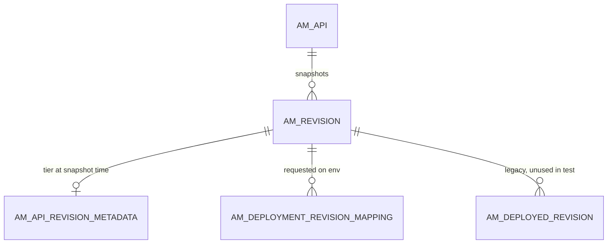
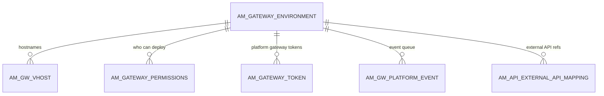
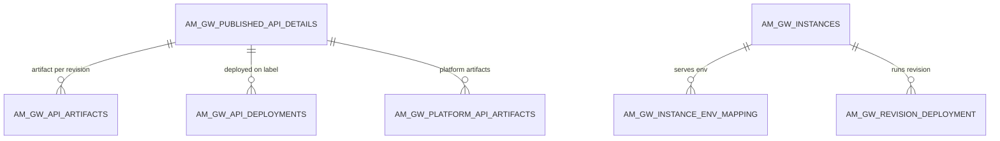

# Revisions & deployment

!!! abstract "In one sentence"
    A revision is a frozen snapshot of an API. These tables store the revisions, the gateway environments they can be deployed to, which revision is deployed where, and the artifacts the gateways download.

## The idea

In 4.x you never deploy "the API". You deploy **a revision of it**:

1. **Create a revision.** APIM copies the current API: its resources, scopes, policies, endpoints and more. The copies are tagged with a new `REVISION_UUID`, and one row goes into `AM_REVISION`. **At the same moment** APIM builds the gateway artifact and stores it in `AM_GW_API_ARTIFACTS` (with a summary row in `AM_GW_PUBLISHED_API_DETAILS`). An API can have up to five revisions at a time. The Publisher asks you to delete old ones.
2. **Deploy it** to one or more **gateway environments**, such as "Default" or "Production Gateways", and pick a **VHost** (hostname) in each. APIM records the *request* in `AM_DEPLOYMENT_REVISION_MAPPING` and the target label in `AM_GW_API_DEPLOYMENTS`, then notifies the gateways.
3. **The gateway syncs.** Each gateway fetches the artifact and reports back. APIM records the result per gateway instance in `AM_GW_REVISION_DEPLOYMENT` (e.g. `SUCCESS` / `DEPLOY`).

!!! success "Verified on a running server (APIM 4.7.0)"
    - The artifact rows appeared at *revision creation*, not at deploy time.
    - `AM_DEPLOYED_REVISION` was **never written**, not even after the gateway confirmed.
    - The gateway's confirmation appeared in `AM_GW_REVISION_DEPLOYMENT`.
    - For the built-in `Default` environment, `AM_DEPLOYMENT_REVISION_MAPPING.VHOST` was stored as `NULL`.

    See [Deploy a revision](../flows/04-deploy-revision.md).

This means you can keep editing the current API without touching live traffic. Only deploying a new revision changes what the gateways run.

Environments come from two places: `deployment.toml` (read-only, not stored in the database) and the Admin Portal (stored in `AM_GATEWAY_ENVIRONMENT`). Newer 4.x releases also track **individual gateway instances** and **"platform" (federated or external) gateways** in dedicated tables.

## How the tables connect

Revisions and where they're deployed:



- All the FKs cascade. Deleting an API deletes its revisions, and deleting a revision deletes its deployment rows.
- The environment appears as a **name** (`NAME`) in the deployment tables, not as an FK.

Gateway environments:



What the gateways download, and which gateway instance runs what:



- In every `AM_GW_*` table, `API_ID` holds the **API UUID string**, not the integer `AM_API.API_ID`.

## The tables

### AM_REVISION

**One row =** one revision (snapshot) of one API or API product.

| Column | What it means |
|---|---|
| `ID` | Revision **number** within the API (1, 2, 3 …). The primary key is (`ID`, `API_UUID`). |
| `API_UUID` | API (FK → `AM_API.API_UUID`, cascade). |
| `REVISION_UUID` | Globally unique revision ID. **Every `REVISION_UUID` column in the schema points here** (usually logically). |
| `DESCRIPTION`, `CREATED_BY`, `CREATED_TIME` | Who made it, when and why. |

**Connects to:** the deployment tables (FK), and logically to every revision-tagged copy: URL mappings, endpoints, policies, certificates, GraphQL complexity, metadata and product mappings.

[Full column list](../reference/am.md#am_revision)

### AM_API_REVISION_METADATA

**One row =** extra data captured when the revision was made. Today that's the API-level tier (`API_TIER`), copied from `AM_API`. It has `API_UUID` + `REVISION_UUID` (unique). FK → `AM_REVISION`, cascade.

[Full column list](../reference/am.md#am_api_revision_metadata)

### AM_DEPLOYMENT_REVISION_MAPPING

**One row =** "the Publisher asked to deploy revision R to environment E, on VHost V".

| Column | What it means |
|---|---|
| `NAME` | Gateway environment **name**, e.g. `Default`. |
| `VHOST` | Hostname chosen in that environment. `NULL` for the config-file `Default` environment (verified). |
| `REVISION_UUID` | Revision (FK → `AM_REVISION`, cascade). |
| `REVISION_STATUS` | E.g. approved, or waiting for a deployment-approval [workflow](workflows.md). |
| `DISPLAY_ON_DEVPORTAL` | Whether this environment's URL is shown in the Developer Portal. |
| `DEPLOYED_TIME` | When it was requested. |

The primary key is (`NAME`, `REVISION_UUID`).

[Full column list](../reference/am.md#am_deployment_revision_mapping)

### AM_DEPLOYED_REVISION

**One row =** by design, "revision R is running on environment E". It has the same shape as above (`NAME`, `VHOST`, `REVISION_UUID`, `DEPLOYED_TIME`), with an FK → `AM_REVISION`, cascade.

**Watch out:** on a real 4.7.0 server with the built-in gateway, this table stayed **empty** after a successful deployment. Don't use it to decide whether a revision is live. Use [`AM_GW_REVISION_DEPLOYMENT`](#am_gw_revision_deployment) for per-gateway confirmations, and `AM_DEPLOYMENT_REVISION_MAPPING` for what was requested.

[Full column list](../reference/am.md#am_deployed_revision)

### AM_GATEWAY_ENVIRONMENT

**One row =** one gateway environment created from the Admin Portal (or registered by a platform gateway).

| Column | What it means |
|---|---|
| `ID` (PK), `UUID` | Internal number and public ID. Child tables use one or the other: `AM_GW_VHOST` uses `ID`, the rest use `UUID`. |
| `NAME`, `DISPLAY_NAME`, `DESCRIPTION` | `NAME` is unique per `ORGANIZATION`. It's the value stored in the deployment tables. |
| `TYPE` | Traffic type, e.g. `hybrid`, `production` or `sandbox`. |
| `GATEWAY_TYPE` | Which gateway technology, e.g. the regular WSO2 gateway, APK, or a federated/platform gateway. |
| `PROVIDER` | Who manages it: WSO2, or an external provider. |
| `ENV_MODE`, `SCHEDULED_TIME` | For federated gateways, how and when APIs are synced. The default mode is `WRITE_ONLY`. |
| `CONFIGURATION` | Connection settings (JSON) for external gateways. |

**Watch out:** environments defined in `deployment.toml` **don't have rows here**. They're still valid names in `AM_DEPLOYMENT_REVISION_MAPPING.NAME`.

[Full column list](../reference/am.md#am_gateway_environment)

### AM_GW_VHOST

**One row =** one virtual host in an environment: `HOST`, `HTTP_CONTEXT` and the `HTTP_PORT` / `HTTPS_PORT` / `WS_PORT` / `WSS_PORT` values. The primary key is (`GATEWAY_ENV_ID`, `HOST`). FK → `AM_GATEWAY_ENVIRONMENT.ID`, cascade.

[Full column list](../reference/am.md#am_gw_vhost)

### AM_GATEWAY_PERMISSIONS

**One row =** a role that is allowed (or denied, per `PERMISSIONS_TYPE`) to deploy to an environment. `GATEWAY_UUID` → `AM_GATEWAY_ENVIRONMENT.UUID` (FK, cascade). `ROLE` is a role name.

[Full column list](../reference/am.md#am_gateway_permissions)

### AM_GW_PUBLISHED_API_DETAILS

**One row =** a summary of an API that has gateway artifacts: `API_ID` (the **API UUID**), `API_NAME`, `API_VERSION`, `API_PROVIDER`, `API_TYPE` and `TENANT_DOMAIN`. Gateways read it to know what to load. It's written when the first revision is **created**. In the test, `API_PROVIDER` was `NULL` and `API_TYPE` was `http`.

**Watch out:** there's no FK to `AM_API`. `API_ID` = `AM_API.API_UUID` is a *logical link*.

[Full column list](../reference/am.md#am_gw_published_api_details)

### AM_GW_API_ARTIFACTS

**One row =** the built **gateway artifact** for one revision of one API. That's the bundle (a zip file) a gateway downloads and deploys. It's written when the revision is **created**, before any deployment.

| Column | What it means |
|---|---|
| `API_ID` | API UUID (FK → `AM_GW_PUBLISHED_API_DETAILS`). |
| `REVISION_ID` | The revision UUID (a logical link to `AM_REVISION`). |
| `ARTIFACT` | The artifact itself (blob). |
| `TIME_STAMP` | Last update. |

[Full column list](../reference/am.md#am_gw_api_artifacts)

### AM_GW_API_DEPLOYMENTS

**One row =** "the artifact for API A, revision R should be on gateway label L, VHost V". Gateways use it to find *their* APIs. `API_ID` → `AM_GW_PUBLISHED_API_DETAILS` (FK, cascade), and `LABEL` = environment name.

[Full column list](../reference/am.md#am_gw_api_deployments)

### AM_GW_INSTANCES

**One row =** one running gateway node that has registered itself with the control plane. It has `GATEWAY_ID` (PK), `GATEWAY_UUID` + `ORGANIZATION` (unique), `LAST_UPDATED` (a heartbeat) and `GW_PROPERTIES`.

[Full column list](../reference/am.md#am_gw_instances)

### AM_GW_INSTANCE_ENV_MAPPING

**One row =** "gateway instance G serves environment label E". `GATEWAY_ID` → `AM_GW_INSTANCES` (FK, cascade).

[Full column list](../reference/am.md#am_gw_instance_env_mapping)

### AM_GW_REVISION_DEPLOYMENT

**One row =** the status of one API on one gateway instance.

| Column | What it means |
|---|---|
| `GATEWAY_ID` | Instance (FK → `AM_GW_INSTANCES`, cascade). |
| `API_ID` | API **UUID** (FK → `AM_API.API_UUID`, cascade). |
| `REVISION_UUID` | Which revision the instance has. |
| `ACTION`, `STATUS` | E.g. `DEPLOY`/undeploy, and `SUCCESS`/failure. This is where a gateway's **confirmation** lands (verified). |
| `LAST_UPDATED` | Epoch time. |

[Full column list](../reference/am.md#am_gw_revision_deployment)

### AM_GATEWAY_TOKEN

**One row =** an access token that a **platform gateway** uses to authenticate to the control plane. It has `GATEWAY_ID` (→ `AM_GATEWAY_ENVIRONMENT.UUID`, FK, cascade), `TOKEN_HASH` (only a hash is stored), `STATUS`, `CREATED_AT` and `REVOKED_AT`.

[Full column list](../reference/am.md#am_gateway_token)

### AM_GW_PLATFORM_API_ARTIFACTS

**One row =** a gateway artifact built for a **platform gateway** environment. That's the same idea as `AM_GW_API_ARTIFACTS`, but it's per environment and has its own `DEPLOYMENT_ID`. (`GATEWAY_ENV_UUID`, `API_ID`, `REVISION_ID`) is unique. `API_ID` → `AM_GW_PUBLISHED_API_DETAILS` (FK).

[Full column list](../reference/am.md#am_gw_platform_api_artifacts)

### AM_GW_PLATFORM_EVENT

**One row =** one queued event (e.g. "deploy this API") waiting to be delivered to a platform gateway. It has `EVENT_TYPE`, `PAYLOAD`, `CREATED_AT`, `CLAIMED_AT` / `CLAIMED_BY` (which control-plane node is delivering it) and `DELIVERED_AT`. `GATEWAY_ID` → `AM_GATEWAY_ENVIRONMENT.UUID` (FK, cascade).

[Full column list](../reference/am.md#am_gw_platform_event)

### AM_API_EXTERNAL_API_MAPPING

**One row =** "API A is represented in external (federated) gateway environment E by this reference". For example, the ID of the API inside AWS API Gateway, stored in `REFERENCE_ARTIFACT`.

- `API_ID` → `AM_API.API_UUID` (FK, cascade). The column is named `API_ID`, but it holds the UUID.
- `GATEWAY_ENV_ID` → `AM_GATEWAY_ENVIRONMENT.UUID` (FK).

[Full column list](../reference/am.md#am_api_external_api_mapping)

## Example

PizzaShackAPI revision 1 deployed to the `Default` environment:

| Table | Row |
|---|---|
| `AM_REVISION` | `ID = 1`, `API_UUID = b41b…`, `REVISION_UUID = 4b45…` |
| `AM_API_URL_MAPPING` | copies of every resource with `REVISION_UUID = 4b45…` |
| `AM_GW_PUBLISHED_API_DETAILS` | `API_ID = b41b…`, `API_NAME = PizzaShackAPI`, `API_TYPE = http` *(at revision creation)* |
| `AM_GW_API_ARTIFACTS` | `API_ID = b41b…`, `REVISION_ID = 4b45…`, `ARTIFACT = <zip>` *(at revision creation)* |
| `AM_DEPLOYMENT_REVISION_MAPPING` | `NAME = Default`, `VHOST = NULL`, `REVISION_UUID = 4b45…`, `REVISION_STATUS = APPROVED`, `DISPLAY_ON_DEVPORTAL = true` |
| `AM_GW_API_DEPLOYMENTS` | `API_ID = b41b…`, `REVISION_ID = 4b45…`, `LABEL = Default`, `VHOST = NULL` |
| `AM_GW_REVISION_DEPLOYMENT` | `GATEWAY_ID = 1`, `API_ID = b41b…`, `STATUS = SUCCESS`, `ACTION = DEPLOY` (after the gateway confirms) |

These are real values from a 4.7.0 test server.

## Try it

```sql
-- Which revision of each API is requested on each environment, and what did gateways report?
SELECT a.API_NAME, a.API_VERSION, r.ID AS REVISION_NO, drm.NAME AS ENVIRONMENT,
       drm.REVISION_STATUS, g.GATEWAY_ID, g.STATUS AS GATEWAY_STATUS, g.ACTION
FROM AM_DEPLOYMENT_REVISION_MAPPING drm
JOIN AM_REVISION r ON r.REVISION_UUID = drm.REVISION_UUID
JOIN AM_API a ON a.API_UUID = r.API_UUID
LEFT JOIN AM_GW_REVISION_DEPLOYMENT g
  ON g.REVISION_UUID = drm.REVISION_UUID AND g.API_ID = a.API_UUID;
```

## Related flows

- [Deploy a revision](../flows/04-deploy-revision.md)
- [Change lifecycle state](../flows/05-lifecycle.md)

!!! note "Different in 3.x"
    3.x has no revisions or environment tables. Publishing wrote the artifact straight into `AM_GW_API_ARTIFACTS`, keyed by a **gateway label**, with a `Publish`/`Remove` instruction (and only when the optional DB sync is enabled). See [3.x Gateway publishing](../../apim-3/domains/gateway-publishing.md).
