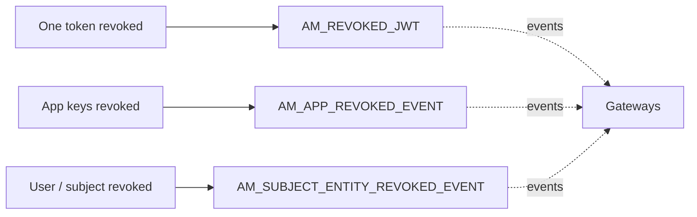

# Revocation

!!! abstract "In one sentence"
    Most APIM tokens are self-contained JWTs that gateways check without calling the database. So when a token, an app or a user is revoked, APIM has to *remember* that and tell the gateways. These tables are that memory.

## The idea

A JWT access token is like a **signed concert ticket**: the gateway can check that it's genuine just by looking at it. The catch is that you can't "un-sign" a ticket. If a token is revoked before it expires, gateways must be told to **reject it anyway**.

APIM handles that in three ways:

| What was revoked | What APIM records | Gateway rule |
|---|---|---|
| **One token** | Its ID (`jti`) in `AM_REVOKED_JWT` | Reject this exact token until it would have expired. |
| **All tokens of an app** (e.g. the consumer secret was regenerated) | The consumer key and time in `AM_APP_REVOKED_EVENT` / `IDN_APP_REVOKED_EVENT` | Reject any token for this consumer key issued *before* this time. |
| **All tokens of a user or other subject** (e.g. the user was locked or deleted) | The subject and time in `AM_SUBJECT_ENTITY_REVOKED_EVENT` / `IDN_SUBJECT_ENTITY_REVOKED_EVENT` | Reject any token for this subject issued *before* this time. |

The records are also broadcast to the gateways as events. When a gateway starts, it loads them from the control plane, so it doesn't miss any revocations. Rows in `AM_REVOKED_JWT` are cleaned up once the token's expiry time passes.

There are two sets of tables because there are two sides: the `AM_*` tables are APIM's copy (what gateways are told), and the `IDN_*` tables are the Resident Key Manager's copy.

## How the tables connect

None of these tables have foreign keys. They point at tokens, clients and users by *value*.



- The Resident Key Manager keeps a parallel copy of the app and subject events in `IDN_APP_REVOKED_EVENT` and `IDN_SUBJECT_ENTITY_REVOKED_EVENT`.
- The consumer-key columns are *logical links* to `IDN_OAUTH_CONSUMER_APPS.CONSUMER_KEY` / `AM_APPLICATION_KEY_MAPPING.CONSUMER_KEY`.
- The entity IDs are user IDs (or other subject IDs), not foreign keys.

## The tables

### AM_REVOKED_JWT

**One row =** one revoked JWT token.

| Column | What it means |
|---|---|
| `UUID` | Primary key: a new random UUID for the revocation entry. |
| `SIGNATURE` | Despite the name, it held the token's identifier (`jti`) on a 4.7.0 test server, the same value as `IDN_INVALID_TOKENS.TOKEN_IDENTIFIER` (verified). |
| `EXPIRY_TIMESTAMP` | When the token would have expired. After that, the row can be deleted. |
| `TENANT_ID` | Tenant. |
| `TOKEN_TYPE` | E.g. an OAuth access token or an API key. |
| `TIME_CREATED` | When it was revoked. |

[Full column list](../reference/am.md#am_revoked_jwt)

### AM_APP_REVOKED_EVENT

**One row =** "every token for consumer key K issued before `TIME_REVOKED` is invalid". The primary key is (`CONSUMER_KEY`, `ORGANIZATION`), so a newer revocation *updates* the time instead of adding a row.

[Full column list](../reference/am.md#am_app_revoked_event)

### AM_SUBJECT_ENTITY_REVOKED_EVENT

**One row =** "every token for subject `ENTITY_ID` (of type `ENTITY_TYPE`, e.g. a user) issued before `TIME_REVOKED` is invalid". The primary key is (`ENTITY_ID`, `ENTITY_TYPE`, `ORGANIZATION`).

[Full column list](../reference/am.md#am_subject_entity_revoked_event)

### IDN_APP_REVOKED_EVENT

**One row =** the Resident Key Manager's own record of an app-level revocation. It has `EVENT_ID` (PK), `CONSUMER_KEY`, `TIME_REVOKED` and `ORGANIZATION`. (`CONSUMER_KEY`, `ORGANIZATION`) is unique.

[Full column list](../reference/idn.md#idn_app_revoked_event)

### IDN_SUBJECT_ENTITY_REVOKED_EVENT

**One row =** the Resident Key Manager's own record of a subject-level revocation. It has `EVENT_ID` (PK), `ENTITY_ID`, `ENTITY_TYPE`, `TIME_REVOKED` and `ORGANIZATION`. (`ENTITY_ID`, `ENTITY_TYPE`, `ORGANIZATION`) is unique.

[Full column list](../reference/idn.md#idn_subject_entity_revoked_event)

### IDN_INVALID_TOKENS

**One row =** a token that the Resident Key Manager treats as invalid. It's used when tokens aren't persisted in `IDN_OAUTH2_ACCESS_TOKEN`, so revocation still needs somewhere to live.

It has `UUID` (PK), `TOKEN_IDENTIFIER`, `CONSUMER_KEY` (a logical link to the client), `TIME_CREATED` and `EXPIRY_TIMESTAMP`.

**Verified:** on a 4.7.0 server with default settings, JWTs aren't stored, and revoking one through `/oauth2/revoke` wrote **one row here plus one row in `AM_REVOKED_JWT`**, both carrying the same token identifier.

[Full column list](../reference/idn.md#idn_invalid_tokens)

## Example

Real rows from a 4.7.0 test server: first a single JWT was revoked, then the application `PizzaApp` (consumer key `rfjt…`) was deleted.

| Table | Row |
|---|---|
| `AM_REVOKED_JWT` | `UUID = c26f…`, `SIGNATURE = 2d4d…` *(jti)*, `TENANT_ID = -1234`, `TOKEN_TYPE = JWT` |
| `IDN_INVALID_TOKENS` | `TOKEN_IDENTIFIER = 2d4d…`, `CONSUMER_KEY = rfjt…` |
| `IDN_APP_REVOKED_EVENT` | `CONSUMER_KEY = rfjt…`, `TIME_REVOKED = 05:22:04`, `ORGANIZATION = carbon.super` *(written at delete)* |
| `AM_APP_REVOKED_EVENT` | `CONSUMER_KEY = rfjt…`, `TIME_REVOKED = 05:22:04`, `ORGANIZATION = carbon.super` *(appeared seconds later, asynchronously)* |

Any token for `rfjt…` issued before that time is rejected. The revoked-event rows **stay** even though the application and its OAuth client are gone.

## Try it

```sql
-- Revoked JWTs that are still relevant (not yet expired)
SELECT UUID, TOKEN_TYPE, TENANT_ID, TIME_CREATED
FROM AM_REVOKED_JWT
WHERE EXPIRY_TIMESTAMP > (UNIX_TIMESTAMP() * 1000);  -- MySQL; expiry is in epoch millis
```

## Related flows

- [Revoke & delete](../flows/12-revocation-and-delete.md)
- [Get a token & call the API](../flows/10-token-and-invoke.md)

!!! note "Different in 3.x"
    3.x has only `AM_REVOKED_JWT`. The app- and subject-level revocation tables and `IDN_INVALID_TOKENS` are new in 4.x. See [3.x Revocation](../../apim-3/domains/revocation.md).
