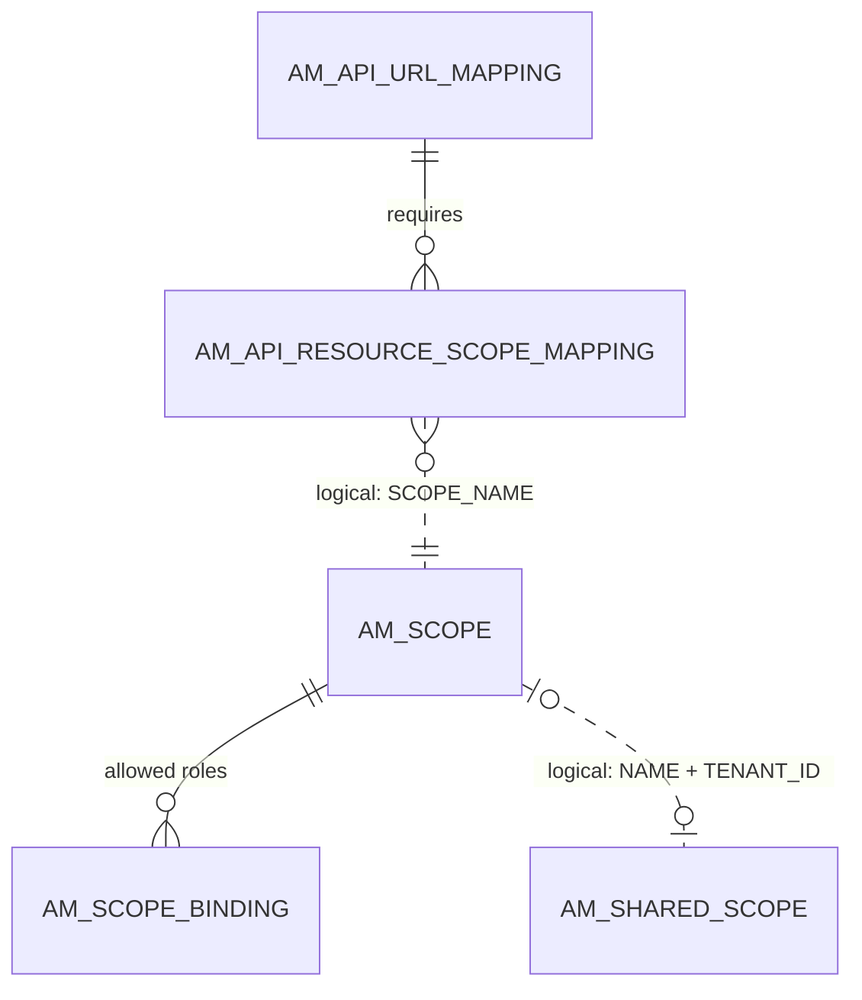
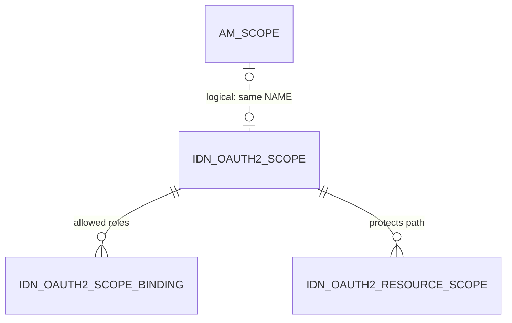

# Scopes

!!! abstract "In one sentence"
    A scope is a named permission, such as `order:write`, that an API creator attaches to resources. A caller's token must carry that scope to call them. These tables store the scopes, which roles may get them, and which resources need them.

## The idea

Imagine the PizzaShack API wants only staff to be able to delete orders. The creator:

1. defines a scope `order:delete` and **binds** it to the role `staff`,
2. attaches the scope to the resource `DELETE /order/{orderId}`.

When a user asks for a token with `scope=order:delete`, the key manager grants it only if the user has the `staff` role. The gateway then refuses any call to `DELETE /order/{orderId}` whose token doesn't include the scope.

The scope data is stored **twice**, because two components need it:

- **APIM's copy** (`AM_SCOPE`, `AM_SCOPE_BINDING`, `AM_SHARED_SCOPE`, `AM_API_RESOURCE_SCOPE_MAPPING`) drives the Publisher and the gateway.
- **The key manager's copy** (`IDN_OAUTH2_SCOPE`, `IDN_OAUTH2_SCOPE_BINDING`, `IDN_OAUTH2_RESOURCE_SCOPE`) is what the built-in *Resident* Key Manager checks when it issues tokens. With a third-party key manager such as Keycloak, the scopes are registered there instead, and the `IDN_*` copy isn't used.

The two copies are kept in sync **by name**. No foreign key connects them.

## How the tables connect

APIM's side:



- A resource needs a scope *by name*, and the name matches `AM_SCOPE.NAME` in the same tenant.
- A *shared* scope is an `AM_SCOPE` row that is also listed in `AM_SHARED_SCOPE`, so it can be reused across APIs.

The key manager's side:



## The tables

### AM_SCOPE

**One row =** one scope, as APIM knows it.

| Column | What it means |
|---|---|
| `SCOPE_ID` | Primary key. |
| `NAME` | The scope key used in tokens, e.g. `order:delete`. |
| `DISPLAY_NAME`, `DESCRIPTION` | Shown in the portals. |
| `TENANT_ID` | Owning tenant. Code looks scopes up by `NAME` + `TENANT_ID`. |
| `SCOPE_TYPE` | Kind of scope, e.g. a role-based one. |

**Connects to:** `AM_SCOPE_BINDING` (FK, cascade). It's referenced *by name* from `AM_API_RESOURCE_SCOPE_MAPPING.SCOPE_NAME` and `AM_SHARED_SCOPE.NAME`.

**Watch out:** the DDL has no UNIQUE constraint on (`NAME`, `TENANT_ID`), but the code treats that pair as unique.

[Full column list](../reference/am.md#am_scope)

### AM_SCOPE_BINDING

**One row =** "scope X may be granted to role Y". It has `SCOPE_ID` (FK → `AM_SCOPE`, cascade), `SCOPE_BINDING` (usually a role name) and `BINDING_TYPE` (e.g. `DEFAULT` for role bindings). There's no primary key.

[Full column list](../reference/am.md#am_scope_binding)

### AM_SHARED_SCOPE

**One row =** a scope that is **shared**, meaning it's defined once and reused across many APIs.

| Column | What it means |
|---|---|
| `UUID` | Primary key. This is the shared scope's public ID. |
| `NAME` | The scope name. It matches `AM_SCOPE.NAME` (logical link). |
| `TENANT_ID` | Owning tenant. |

**Watch out:** the scope's details (display name, bindings) are in `AM_SCOPE`. This table only marks the scope as shared.

[Full column list](../reference/am.md#am_shared_scope)

### AM_API_RESOURCE_SCOPE_MAPPING

**One row =** "this resource needs this scope".

| Column | What it means |
|---|---|
| `URL_MAPPING_ID` | Resource (FK → `AM_API_URL_MAPPING`, cascade). |
| `SCOPE_NAME` | Scope *name* (logical link to `AM_SCOPE.NAME`). |
| `TENANT_ID` | Tenant used to resolve the name. |

**Watch out:** each revision has its own copy of the URL mappings, and so its own copy of these rows.

[Full column list](../reference/am.md#am_api_resource_scope_mapping)

### IDN_OAUTH2_SCOPE

**One row =** one scope registered in the Resident Key Manager.

| Column | What it means |
|---|---|
| `SCOPE_ID` | Primary key. |
| `NAME` | Scope name, unique per tenant. It matches `AM_SCOPE.NAME`. |
| `DISPLAY_NAME`, `DESCRIPTION`, `TENANT_ID` | As in `AM_SCOPE`. |
| `SCOPE_TYPE` | Separates API scopes (OAuth2) from OpenID Connect scopes (OIDC). |

[Full column list](../reference/idn.md#idn_oauth2_scope)

### IDN_OAUTH2_SCOPE_BINDING

**One row =** "the key manager may grant scope X to role Y". It has `SCOPE_ID` (FK → `IDN_OAUTH2_SCOPE`, cascade), `SCOPE_BINDING` and `BINDING_TYPE`. [Full column list](../reference/idn.md#idn_oauth2_scope_binding)

### IDN_OAUTH2_RESOURCE_SCOPE

**One row =** "the resource path `RESOURCE_PATH` is protected by scope `SCOPE_ID`" (FK → `IDN_OAUTH2_SCOPE`, cascade). This is Identity Server's own resource protection. APIM's gateways use `AM_API_RESOURCE_SCOPE_MAPPING` instead. [Full column list](../reference/idn.md#idn_oauth2_resource_scope)

## Example

| Table | Row |
|---|---|
| `AM_SCOPE` | `SCOPE_ID = 3`, `NAME = order:delete`, `TENANT_ID = -1234` |
| `AM_SCOPE_BINDING` | `SCOPE_ID = 3`, `SCOPE_BINDING = staff`, `BINDING_TYPE = DEFAULT` |
| `AM_API_RESOURCE_SCOPE_MAPPING` | `URL_MAPPING_ID = 12` (`DELETE /order/{orderId}`), `SCOPE_NAME = order:delete` |
| `IDN_OAUTH2_SCOPE` | `NAME = order:delete`, `TENANT_ID = -1234` |

## Try it

```sql
-- Which scopes protect which resources of which API (current copies only)?
SELECT a.API_NAME, a.API_VERSION, u.HTTP_METHOD, u.URL_PATTERN, m.SCOPE_NAME
FROM AM_API_RESOURCE_SCOPE_MAPPING m
JOIN AM_API_URL_MAPPING u ON u.URL_MAPPING_ID = m.URL_MAPPING_ID
JOIN AM_API a ON a.API_ID = u.API_ID
WHERE u.REVISION_UUID IS NULL;
```

## Related flows

- [Create an API](../flows/02-create-api.md)
- [Get a token & call the API](../flows/10-token-and-invoke.md)

!!! note "Different in 3.x"
    3.x has the same tables. Scopes were keyed by tenant ID only, and there were no revision copies of the resource mappings. See [3.x Scopes](../../apim-3/domains/scopes.md).
