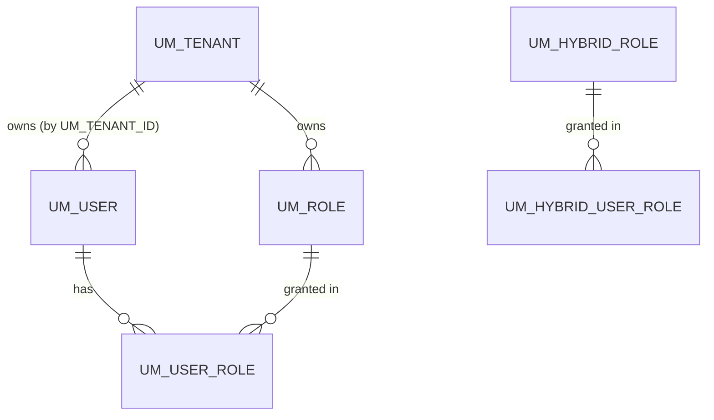
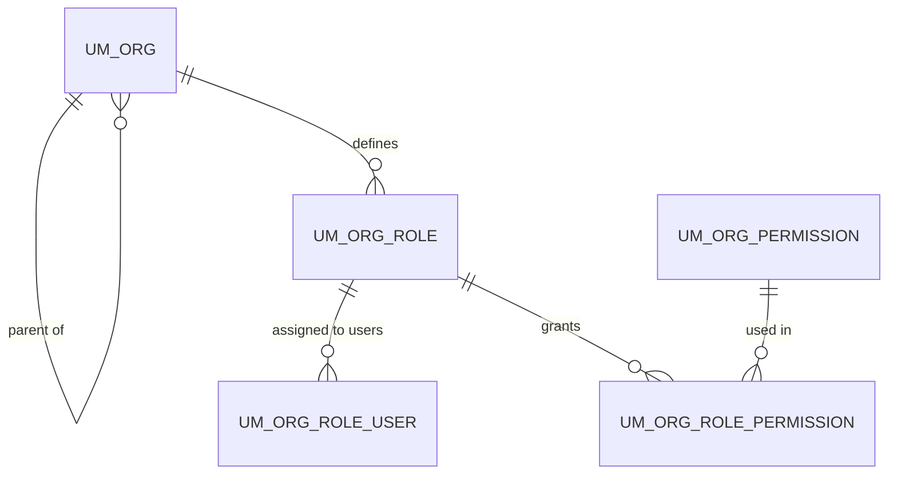

# Tenants & users

!!! abstract "In one sentence"
    These tables record *who* exists: tenants (isolated slices of the deployment), organizations, user accounts and roles. They also hold per-organization settings such as the portal theme.

## The idea

A single APIM deployment can serve several **tenants**. Each tenant is a fully separate space with its own users, APIs and applications. The default tenant is called `carbon.super` and has the ID `-1234`. Most APIM tables carry either a `TENANT_ID` (a number such as `-1234`) or, in 4.x, an `ORGANIZATION` column (usually the tenant domain, such as `carbon.super`). That column says which tenant a row belongs to.

User accounts and roles live in the **user store**. By default that's the `UM_*` tables in the shared database, but it can be LDAP or Active Directory instead. In that case the `UM_USER` table stays nearly empty. **APIM tables never have a foreign key to a user.** They store the *user name* as text, for example `AM_SUBSCRIBER.USER_ID` or `AM_API.API_PROVIDER`.

4.x adds **organizations**: a hierarchy that sits above or inside tenants and can scope APIs and applications. It lives in the `UM_ORG*` tables and in APIM's own `AM_ORGANIZATION_MAPPING`.

## How the tables connect

The user-store core: tenants contain users and roles, and a join table assigns roles to users.



- *Hybrid* roles are "internal" roles such as `Internal/subscriber` and `Internal/publisher`. They're stored separately from the user-store roles.
- The tenant link is by `UM_TENANT_ID` value. There's no declared FK to `UM_TENANT`.

The 4.x organization model is a tree of organizations, each with its own roles.



## The tables

### UM_TENANT

**One row =** one tenant.

| Column | What it means |
|---|---|
| `UM_ID` | Tenant ID. This is the number stored in every `TENANT_ID` column. The super tenant `-1234` isn't stored as a row. |
| `UM_DOMAIN_NAME` | Tenant domain, e.g. `wso2.com`. It's the value most `ORGANIZATION` columns carry. |
| `UM_TENANT_UUID`, `UM_ORG_UUID` | UUIDs for the tenant and its matching organization. |
| `UM_ACTIVE` | Whether the tenant is enabled. |
| `UM_USER_CONFIG` | The tenant's user-store configuration (blob). |

**Connects to:** every `TENANT_ID` / `UM_TENANT_ID` column in both databases. These are *logical links (no FK)*. The one exception is `UM_ACCOUNT_MAPPING`, which has a real FK to `UM_TENANT`.

**Watch out:** the super tenant (`carbon.super`, `-1234`) has **no row** here, so joins to `UM_TENANT` drop super-tenant data unless you use an outer join.

[Full column list](../reference/um.md#um_tenant)

### UM_USER

**One row =** one user account in the default JDBC user store.

| Column | What it means |
|---|---|
| `UM_ID` + `UM_TENANT_ID` | Composite primary key. |
| `UM_USER_ID` | A globally unique user ID (UUID). |
| `UM_USER_NAME` | Login name. APIM tables store this text, not the ID. |
| `UM_USER_PASSWORD`, `UM_SALT_VALUE` | Hashed password and its salt. |

**Connects to:** `UM_USER_ROLE` (one user → many role assignments, FK). It's linked *logically* from `AM_SUBSCRIBER.USER_ID`, `AM_API.API_PROVIDER` and the other user-name columns.

**Watch out:** if the deployment uses LDAP or AD as the primary user store, users aren't in this table.

[Full column list](../reference/um.md#um_user)

### UM_ROLE

**One row =** one role in the JDBC user store, e.g. `admin` or `publisher-team`.

| Column | What it means |
|---|---|
| `UM_ID` + `UM_TENANT_ID` | Primary key. |
| `UM_ROLE_NAME` | Role name, unique per tenant. |
| `UM_SHARED_ROLE` | Whether the role is shared across tenants. |

**Connects to:** `UM_USER_ROLE` (FK). APIM refers to roles *by name* in places like `AM_KEY_MANAGER_PERMISSIONS.ROLE`, `AM_GATEWAY_PERMISSIONS.ROLE` and `AM_TIER_PERMISSIONS.ROLES`.

[Full column list](../reference/um.md#um_role)

### UM_USER_ROLE

**One row =** "user X has role Y".

| Column | What it means |
|---|---|
| `UM_USER_ID` | → `UM_USER.UM_ID` (FK, together with the tenant). |
| `UM_ROLE_ID` | → `UM_ROLE.UM_ID` (FK, together with the tenant). |

**Connects to:** `UM_USER` and `UM_ROLE`. It's a many-to-many bridge.

[Full column list](../reference/um.md#um_user_role)

### UM_HYBRID_ROLE

**One row =** one internal role, such as `Internal/subscriber`, `Internal/creator`, `Internal/publisher` or `Internal/everyone`. APIM's own permissions are mostly checked against these roles.

| Column | What it means |
|---|---|
| `UM_ID` + `UM_TENANT_ID` | Primary key. |
| `UM_ROLE_NAME` | Role name without the `Internal/` prefix. |

**Connects to:** `UM_HYBRID_USER_ROLE` (FK, on delete cascade).

[Full column list](../reference/um.md#um_hybrid_role)

### UM_HYBRID_USER_ROLE

**One row =** "user (by name) has internal role Y".

| Column | What it means |
|---|---|
| `UM_USER_NAME` | User name as text, so it works for any user store, including LDAP. |
| `UM_ROLE_ID` | → `UM_HYBRID_ROLE` (FK, cascade). |
| `UM_DOMAIN_ID` | → `UM_DOMAIN`, the user-store domain such as `PRIMARY` (FK, cascade). |

[Full column list](../reference/um.md#um_hybrid_user_role)

### UM_ORG

**One row =** one organization in the 4.x organization hierarchy.

| Column | What it means |
|---|---|
| `UM_ID` | Organization ID (a UUID string). |
| `UM_ORG_NAME`, `UM_ORG_DESCRIPTION` | Name and description. |
| `UM_PARENT_ID` | Parent organization (FK to `UM_ORG`, cascade). |
| `UM_STATUS`, `UM_ORG_TYPE` | State and kind (e.g. tenant or sub-organization). |

**Connects to:** itself (parent/child), `UM_ORG_ATTRIBUTE`, `UM_ORG_ROLE` and `UM_ORG_HIERARCHY`. All are FKs with cascade, so deleting an organization removes its whole subtree.

[Full column list](../reference/um.md#um_org)

### UM_ORG_ATTRIBUTE

**One row =** one key/value setting on an organization. `UM_ORG_ID` → `UM_ORG` (FK, cascade), and (`UM_ORG_ID`, `UM_ATTRIBUTE_KEY`) is unique. [Full column list](../reference/um.md#um_org_attribute)

### UM_ORG_HIERARCHY

**One row =** "organization `UM_ID` is under `UM_PARENT_ID`, `DEPTH` levels down". This is a pre-computed ancestor table, so "all sub-organizations of X" is a single query. Both columns are FKs to `UM_ORG` with cascade. [Full column list](../reference/um.md#um_org_hierarchy)

### UM_ORG_ROLE

**One row =** a role defined inside an organization. `UM_ORG_ID` → `UM_ORG` (FK, cascade). [Full column list](../reference/um.md#um_org_role)

### UM_ORG_ROLE_USER

**One row =** "user `UM_USER_ID` has organization role `UM_ROLE_ID`". `UM_ROLE_ID` → `UM_ORG_ROLE` (FK, cascade). The user ID is a *logical link* to the user store. [Full column list](../reference/um.md#um_org_role_user)

### UM_ORG_ROLE_GROUP

**One row =** "group `UM_GROUP_ID` has organization role `UM_ROLE_ID`". `UM_ROLE_ID` → `UM_ORG_ROLE` (FK, cascade). [Full column list](../reference/um.md#um_org_role_group)

### UM_ORG_PERMISSION

**One row =** a permission (a resource path plus an action) that organization roles can grant. It has `UM_RESOURCE_ID`, `UM_ACTION` and `UM_TENANT_ID`. [Full column list](../reference/um.md#um_org_permission)

### UM_ORG_ROLE_PERMISSION

**One row =** "organization role grants permission". It has FKs to both `UM_ORG_ROLE` and `UM_ORG_PERMISSION`, with cascade. [Full column list](../reference/um.md#um_org_role_permission)

### AM_ORGANIZATION_MAPPING

**One row =** APIM's record of an organization. APIM uses it to map an *external* organization ID, for example from an external identity provider, to its own organization UUID.

| Column | What it means |
|---|---|
| `ORG_UUID` | APIM's organization ID. This value can appear in `ORGANIZATION` columns. |
| `EXT_ORG_ID` | The organization's ID in the external system. |
| `PARENT_ORG_UUID` | Parent organization. It's a *logical link* back to this table. |
| `ORG_HANDLE`, `DISPLAY_NAME`, `DESCRIPTION` | Readable identifiers. |
| `ROOT_ORGANIZATION` | The root (tenant) organization this one belongs to. |

**Connects to:** `ORGANIZATION` columns across the `AM_*` tables. These are *logical links (no FK)*.

[Full column list](../reference/am.md#am_organization_mapping)

### AM_USER

**One row =** a mapping from a user name to a generated user ID, which APIM uses where it needs a stable ID for a user.

| Column | What it means |
|---|---|
| `USER_ID` | Generated ID (primary key). |
| `USER_NAME` | The user name. |

**Watch out:** this is *not* the user store. Users are in `UM_USER` or LDAP. Rows appear here only when APIM needs an ID for a user.

[Full column list](../reference/am.md#am_user)

### AM_SYSTEM_CONFIGS

**One row =** one configuration document for one organization. It's the storage behind the Admin Portal's *Advanced* settings (tenant configuration) and similar per-organization JSON settings.

| Column | What it means |
|---|---|
| `ORGANIZATION` | Which organization or tenant. |
| `CONFIG_TYPE` | Which document, e.g. the tenant configuration. |
| `CONFIGURATION` | The JSON document (blob). |

The primary key is (`ORGANIZATION`, `CONFIG_TYPE`), so there's one document of each type per organization.

[Full column list](../reference/am.md#am_system_configs)

### AM_TENANT_THEMES

**One row =** the uploaded Developer Portal theme (a zip file) for one tenant. `TENANT_ID` is the primary key and `THEME` holds the blob. [Full column list](../reference/am.md#am_tenant_themes)

## Example

Here's the super tenant's admin, who is also the provider of the PizzaShack API.

| Table | Row |
|---|---|
| `UM_USER` | `UM_USER_NAME = admin`, `UM_TENANT_ID = -1234` |
| `UM_HYBRID_USER_ROLE` | `UM_USER_NAME = admin` → role `publisher` |
| `AM_API` | `API_PROVIDER = admin`, `ORGANIZATION = carbon.super` |
| `AM_SUBSCRIBER` | `USER_ID = admin`, `TENANT_ID = -1234` |

The link between these rows is the **text** `admin` plus the tenant. No foreign key connects them.

## Try it

```sql
-- Which internal roles does each user have?
SELECT hur.UM_USER_NAME, hr.UM_ROLE_NAME, hur.UM_TENANT_ID
FROM UM_HYBRID_USER_ROLE hur
JOIN UM_HYBRID_ROLE hr
  ON hr.UM_ID = hur.UM_ROLE_ID AND hr.UM_TENANT_ID = hur.UM_TENANT_ID
ORDER BY hur.UM_USER_NAME;
```

Run this against the **shared** database.

## Related flows

- [Setup & first user](../flows/01-bootstrap.md)
- [Create an application](../flows/07-create-application.md): this is where `AM_SUBSCRIBER` is created lazily

!!! note "Different in 3.x"
    3.x has no `UM_ORG*` tables, no `AM_ORGANIZATION_MAPPING` and no `AM_SYSTEM_CONFIGS`. Tenant configuration lived in the registry (`tenant-conf.json`), and data was scoped only by `TENANT_ID`. See [3.x Tenants & users](../../apim-3/domains/tenancy-users.md).
