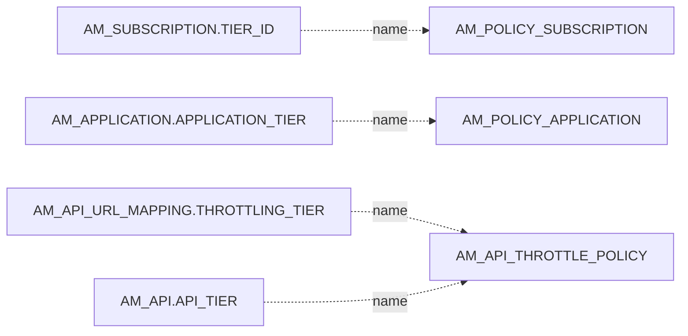
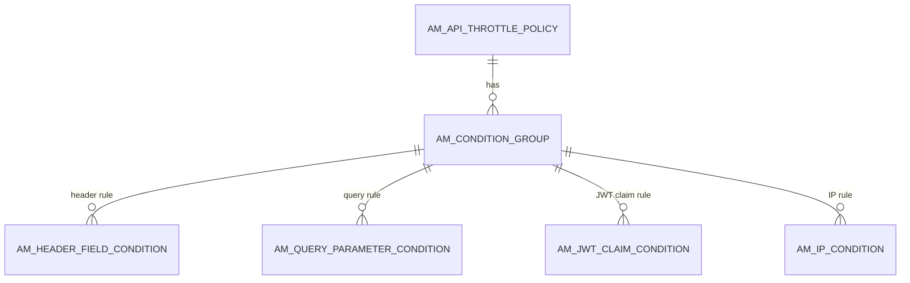

# Throttling policies

!!! abstract "In one sentence"
    Throttling policies (also called *tiers* or *rate-limiting policies*) say how many requests or how much bandwidth are allowed per time window. These tables store policies at every level, plus blocking rules and who may use which tier.

## The idea

APIM applies rate limits at several levels at once. A call has to pass **all** of them:

| Level | Question it answers | Table | Chosen where |
|---|---|---|---|
| **Subscription** | "How much may *this app* call *this API*?" | `AM_POLICY_SUBSCRIPTION` | Developer Portal, when subscribing (`AM_SUBSCRIPTION.TIER_ID`) |
| **Application** | "How much may *this app* call *anything*, per user?" | `AM_POLICY_APPLICATION` | When creating the app (`AM_APPLICATION.APPLICATION_TIER`) |
| **Resource / API** (advanced) | "How much may *anyone* call *this resource* (or API)?" | `AM_API_THROTTLE_POLICY` + conditions | Publisher (`AM_API_URL_MAPPING.THROTTLING_TIER` or `AM_API.API_TIER`) |
| **Custom (global)** | Any rule you can write as a query, across all APIs | `AM_POLICY_GLOBAL` | Admin Portal |
| **Hard limit** | A backend's absolute maximum | `AM_POLICY_HARD_THROTTLING` | Legacy. In 4.x it's set in the API's endpoint configuration. |
| **Deny** | Block an IP, user, app or API outright | `AM_BLOCK_CONDITIONS` | Admin Portal |

Each quota-style policy has a **quota type**: a *request count* (`requestCount`), *bandwidth* (`bandwidthVolume`), and in 4.x also AI **token counts** or GraphQL/event limits. The table stores the number, the unit and the time window, e.g. `5000 requests per 1 min`.

!!! warning "Logical link (no foreign key)"
    Policies are always attached **by name** (plus tenant), never by `POLICY_ID`. For example, `AM_SUBSCRIPTION.TIER_ID = 'Gold'` matches `AM_POLICY_SUBSCRIPTION.NAME = 'Gold'` in the same tenant.

## How the tables connect

Which policy attaches to what:



An advanced (resource-level) policy can hold **condition groups**. Each group says "if the request matches these conditions, use this different limit".



- All these FKs cascade: deleting the policy removes its whole condition tree.

## The tables

### AM_POLICY_SUBSCRIPTION

**One row =** one subscription tier, e.g. `Gold`, `Silver`, `Bronze`, `Unlimited`, or a custom one.

| Column | What it means |
|---|---|
| `POLICY_ID`, `UUID` | Internal and public IDs. |
| `NAME`, `DISPLAY_NAME`, `DESCRIPTION` | `NAME` is unique per `TENANT_ID`. It's the value subscriptions store. |
| `QUOTA_TYPE`, `QUOTA`, `QUOTA_UNIT`, `UNIT_TIME`, `TIME_UNIT` | The main limit, e.g. `requestCount 5000 per 1 min`. |
| `RATE_LIMIT_COUNT`, `RATE_LIMIT_TIME_UNIT` | An optional burst (spike) limit, e.g. 100 per second. |
| `STOP_ON_QUOTA_REACH` | Whether to block once the quota is used, or just log it. |
| `BILLING_PLAN`, `MONETIZATION_PLAN`, `FIXED_RATE`, `BILLING_CYCLE`, `PRICE_PER_REQUEST`, `CURRENCY` | [Monetization](other.md#am_monetization_usage) settings: `FREE`, `COMMERCIAL`, and so on. |
| `MAX_COMPLEXITY`, `MAX_DEPTH` | GraphQL query limits. |
| `CONNECTIONS_COUNT` | Limit for WebSocket/event APIs. |
| `TOTAL_TOKEN_COUNT`, `PROMPT_TOKEN_COUNT`, `COMPLETION_TOKEN_COUNT` | AI API token quotas. |
| `CUSTOM_ATTRIBUTES`, `IS_DEPLOYED` | Extra attributes, and a "pushed to the traffic manager" flag. On 4.7.0 it stayed `0` for policies created through the Admin API, even while they were in use (verified), so don't rely on it. |

[Full column list](../reference/am.md#am_policy_subscription)

### AM_POLICY_APPLICATION

**One row =** one application tier, e.g. `Unlimited`, `10PerMin`, `20PerMin` or `50PerMin`. It has the same quota columns as above (`NAME` unique per tenant, `QUOTA_TYPE`, `QUOTA`, `UNIT_TIME`, `TIME_UNIT`, burst limit, `CUSTOM_ATTRIBUTES`, `IS_DEPLOYED`, `UUID`). The limit applies **per user of the app**.

[Full column list](../reference/am.md#am_policy_application)

### AM_API_THROTTLE_POLICY

**One row =** one *advanced* policy, applied to a resource or a whole API, e.g. `10KPerMin`.

| Column | What it means |
|---|---|
| `POLICY_ID`, `UUID` | IDs. `POLICY_ID` is what condition groups point to. |
| `NAME`, `DISPLAY_NAME`, `DESCRIPTION` | `NAME` is unique per tenant. It's the value resources store. |
| `DEFAULT_QUOTA_TYPE`, `DEFAULT_QUOTA`, `DEFAULT_QUOTA_UNIT`, `DEFAULT_UNIT_TIME`, `DEFAULT_TIME_UNIT` | The limit used when no condition group matches. |
| `APPLICABLE_LEVEL` | `apiLevel` or `resourceLevel`. |
| `IS_DEPLOYED` | Meant to say whether the policy is pushed to the traffic manager. It stayed `0` in a 4.7.0 test (verified). |

[Full column list](../reference/am.md#am_api_throttle_policy)

### AM_CONDITION_GROUP

**One row =** one "if … then limit = …" group inside an advanced policy. It has `POLICY_ID` (FK → `AM_API_THROTTLE_POLICY`, cascade), its own quota columns (`QUOTA_TYPE`, `QUOTA`, `QUOTA_UNIT`, `UNIT_TIME`, `TIME_UNIT`) and `DESCRIPTION`. A request matches a group when **all** of the group's conditions match.

[Full column list](../reference/am.md#am_condition_group)

### AM_HEADER_FIELD_CONDITION

**One row =** "header `HEADER_FIELD_NAME` equals `HEADER_FIELD_VALUE`". `IS_HEADER_FIELD_MAPPING = false` inverts the rule to *not equals*. FK → `AM_CONDITION_GROUP`, cascade. [Full column list](../reference/am.md#am_header_field_condition)

### AM_QUERY_PARAMETER_CONDITION

**One row =** "query parameter `PARAMETER_NAME` equals `PARAMETER_VALUE`". `IS_PARAM_MAPPING` inverts it. FK → `AM_CONDITION_GROUP`, cascade. [Full column list](../reference/am.md#am_query_parameter_condition)

### AM_JWT_CLAIM_CONDITION

**One row =** "the JWT claim `CLAIM_URI` matches `CLAIM_ATTRIB`". `IS_CLAIM_MAPPING` inverts it. FK → `AM_CONDITION_GROUP`, cascade. [Full column list](../reference/am.md#am_jwt_claim_condition)

### AM_IP_CONDITION

**One row =** "the caller's IP is `SPECIFIC_IP`", or "is between `STARTING_IP` and `ENDING_IP`". `WITHIN_IP_RANGE = false` inverts it. FK → `AM_CONDITION_GROUP`, cascade. [Full column list](../reference/am.md#am_ip_condition)

### AM_POLICY_GLOBAL

**One row =** one *custom* policy, written as a Siddhi streaming query (`SIDDHI_QUERY`). `KEY_TEMPLATE` says what to count by, e.g. `$userId:$apiContext`. It also has `NAME`, `DESCRIPTION`, `TENANT_ID`, `IS_DEPLOYED` and `UUID`.

[Full column list](../reference/am.md#am_policy_global)

### AM_POLICY_HARD_THROTTLING

**One row =** a hard (backend-protection) limit, with `NAME` unique per tenant and quota columns.

**Watch out:** 4.x stores an API's backend limits in its endpoint configuration, so this table is usually empty. It's kept for compatibility.

[Full column list](../reference/am.md#am_policy_hard_throttling)

### AM_BLOCK_CONDITIONS

**One row =** one deny rule.

| Column | What it means |
|---|---|
| `TYPE` | What is blocked: `API` (context), `APPLICATION`, `USER`, `IP` or `IPRANGE`. |
| `BLOCK_CONDITION` | The value, e.g. `/pizzashack/1.0.0`, `alice`, or an IP range (JSON). |
| `ENABLED` | On or off. |
| `DOMAIN` | Tenant domain. |
| `CONDITION_ID`, `UUID` | IDs. |

[Full column list](../reference/am.md#am_block_conditions)

### AM_THROTTLE_TIER_PERMISSIONS

**One row =** "subscription tier `TIER` is allowed / denied (`PERMISSIONS_TYPE`) for these `ROLES`". It controls which consumers can pick which tier. It's scoped by `TENANT_ID`, and matched to the policy by name. [Full column list](../reference/am.md#am_throttle_tier_permissions)

### AM_TIER_PERMISSIONS

**One row =** the same idea as above (`TIER`, `PERMISSIONS_TYPE`, `ROLES`, `TENANT_ID`). It's an older table from when tiers were defined in the registry. Current code uses `AM_THROTTLE_TIER_PERMISSIONS`. [Full column list](../reference/am.md#am_tier_permissions)

## Example

An advanced policy that allows 1000 requests/min by default, but only 10/min for callers whose `X-Plan` header is `free`:

| Table | Row |
|---|---|
| `AM_API_THROTTLE_POLICY` | `POLICY_ID = 4`, `NAME = FreeLimited`, `DEFAULT_QUOTA = 1000`, `DEFAULT_TIME_UNIT = min` |
| `AM_CONDITION_GROUP` | `CONDITION_GROUP_ID = 8`, `POLICY_ID = 4`, `QUOTA = 10`, `TIME_UNIT = min` |
| `AM_HEADER_FIELD_CONDITION` | `CONDITION_GROUP_ID = 8`, `HEADER_FIELD_NAME = X-Plan`, `HEADER_FIELD_VALUE = free` |
| `AM_API_URL_MAPPING` | `POST /order`, `THROTTLING_TIER = FreeLimited` |

## Try it

```sql
-- Every subscription with the limits of its tier
SELECT app.NAME AS APPLICATION, a.API_NAME, sub.TIER_ID,
       p.QUOTA_TYPE, p.QUOTA, p.UNIT_TIME, p.TIME_UNIT
FROM AM_SUBSCRIPTION sub
JOIN AM_APPLICATION app ON app.APPLICATION_ID = sub.APPLICATION_ID
JOIN AM_API a ON a.API_ID = sub.API_ID
LEFT JOIN AM_POLICY_SUBSCRIPTION p ON p.NAME = sub.TIER_ID;
-- In a multi-tenant setup, also match p.TENANT_ID to the API's tenant.
```

## Related flows

- [Manage throttling policies](../flows/11-throttling-policies.md)
- [Subscribe to an API](../flows/08-subscribe.md)
- [Get a token & call the API](../flows/10-token-and-invoke.md)

!!! note "Different in 3.x"
    The same tables exist in 3.x, but `AM_POLICY_SUBSCRIPTION` has no AI token-count or connection columns. Monetization and GraphQL columns are there. See [3.x Throttling policies](../../apim-3/domains/throttling.md).
